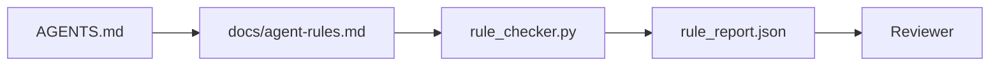

# Instrukcje agenta jako wykonywalne ograniczenia

> Instrukcje napisane jako proza to życzenia. Instrukcje napisane jako ograniczenia to testy. Warsztat zamienia każdą regułę w coś, co agent może sprawdzić w czasie wykonywania, a recenzent może zweryfikować po fakcie.

**Type:** Build
**Languages:** Python (stdlib)
**Prerequisites:** Phase 14 · 32 (Minimal Workbench)
**Time:** ~50 minutes

## Learning Objectives

- Oddziel prozę routingu od reguł operacyjnych.
- Wyraź reguły startowe, zabronione akcje, definicję ukończenia, obsługę niepewności i granice zatwierdzeń jako sprawdzalne maszynowo ograniczenia.
- Zaimplementuj sprawdzacz reguł, który ocenia uruchomienie względem zestawu reguł.
- Spraw, aby zestaw reguł był przyjazny dla różnic, aby przegląd mógł zobaczyć, co się zmieniło.

## Problem

Typowy `AGENTS.md` czyta się jak dokumentację wdrożeniową. Mówi agentowi, aby "był ostrożny" i "testował dokładnie" i "pytał, jeśli nie jest pewien." Trzy dni później agent wysyła zmianę bez testów, pisze do zabronionego katalogu i nigdy nie pyta, bo nigdy nie wiedział, gdzie była granica.

Instrukcje są potężne, gdy są operacyjne, i słabe, gdy są aspiracyjne. Naprawą jest pisanie reguł, które warsztat może interpretować, a recenzent oceniać.

## Koncepcja

Reguły należą do `docs/agent-rules.md`, z dala od krótkiego głównego routera. Każda reguła ma nazwę, kategorię i sprawdzenie.



### Pięć kategorii, które pokrywają większość reguł

| Kategoria | Pytanie, na które odpowiada reguła | Przykład |
|----------|---------------------------|---------|
| Startup | Co musi być prawdą przed rozpoczęciem pracy? | "plik stanu istnieje i jest świeży" |
| Forbidden | Co nigdy nie może się wydarzyć? | "nie edytuj `scripts/release.sh`" |
| Definition of done | Co dowodzi, że zadanie jest ukończone? | "pytest kończy z 0 i linia akceptacji przechodzi" |
| Uncertainty | Co robi agent, gdy nie jest pewien? | "otwórz notatkę z pytaniem zamiast zgadywać" |
| Approval | Co wymaga zatwierdzenia przez człowieka? | "każda nowa zależność, każdy zapis produkcyjny" |

Reguła, która nie pasuje do jednej z tych pięciu, zwykle chce być dwiema regułami. Wymuś podział.

### Reguły są maszynowo czytelne

Każda reguła ma skrót, kategorię, jednoliniowy opis i pole `check`, które nazywa funkcję w `rule_checker.py`. Dodanie reguły oznacza dodanie sprawdzenia; sprawdzacz rośnie wraz z warsztatem.

### Reguły są przyjazne dla różnic

Reguły żyją po jednej na nagłówek w pojedynczym pliku Markdown. Zmiany nazw są widoczne w różnicach. Nowe reguły siedzą na górze swojej kategorii. Nieaktualne reguły są usuwane, nie zakomentowywane, ponieważ warsztat jest źródłem prawdy, a nie dziennikiem czatu tego, jak zespół czuł się w zeszłym kwartale.

### Reguły versus zabezpieczenia frameworka

Zabezpieczenia frameworka (OpenAI Agents SDK guardrails, LangGraph interrupts) egzekwują reguły na poziomie środowiska uruchomieniowego. Zestaw reguł w tej lekcji to czytelny dla człowieka, podlegający przeglądowi kontrakt, który te zabezpieczenia implementują. Potrzebujesz obu: środowisko łapie naruszenia podczas tury, zestaw reguł dowodzi, że środowisko robi właściwą rzecz.

### Progresywne ujawnianie: mapa, nie encyklopedia

Powodem, dla którego `AGENTS.md` ciągle rośnie, jest to, że każdy incydent dodaje regułę, a żaden jej nie usuwa. Po roku plik ma dwa tysiące linii, a agent czyta pierwszy ekran, kończy mu się budżet uwagi i działa na ułamku tego, co mu powiedziano. Ogromny plik instrukcji zawodzi z tego samego powodu, dla którego czterdziestostronicowy dokument wdrożeniowy zawodzi: czytelnik przegląda go raz i nigdy nie wraca do części, która miała znaczenie.

Naprawą nie jest krótszy plik. To warstwowy. Główny router pozostaje wystarczająco mały, aby czytać go w każdej sesji i nie zawiera niczego poza wskaźnikami. Głębia żyje w plikach tematycznych, które agent ładuje tylko wtedy, gdy zadanie ich dotyczy. Daj agentowi mapę, nie całą encyklopedię, i pozwól mu przejść do strony, której potrzebuje.

```
AGENTS.md                  # router, < 50 linii: czym jest to repozytorium, gdzie szukać, 5 twardych reguł
docs/
  agent-rules.md           # pełny zestaw reguł (ta lekcja)
  architecture.md          # ładowany, gdy zadanie dotyka granic modułów
  testing.md               # ładowany, gdy zadanie pisze lub uruchamia testy
  deploy.md                # ładowany tylko dla pracy wydaniowej, bramkowany regułą zatwierdzenia
feature_list.json          # backlog (Faza 14 · 36)
```

| Poziom | Mieszka w | Czytany, gdy | Budżet rozmiaru |
|------|----------|-----------|-------------|
| Router | `AGENTS.md` | Każda sesja, zawsze | Poniżej ~50 linii |
| Reguły | `docs/agent-rules.md` | Każda sesja, przy starcie | Jeden ekran na kategorię |
| Dokumenty tematyczne | `docs/<temat>.md` | Tylko gdy zadanie dotyka tego tematu | Tak głęboko, jak potrzebne |

Dwa testy utrzymują warstwowanie w ryzach. Test osiągalności: agent powinien dotrzeć do dowolnej reguły w co najwyżej dwóch skokach od routera, więc router musi linkować każdy dokument tematyczny ścieżką, nie opisywać go prozą. Test świeżości: router jest wystarczająco krótki, aby recenzent czytał go ponownie przy każdym PR, co jest jedyną rzeczą, która powstrzymuje go przed cichym odrastaniem w encyklopedię, którą zastąpił. Wskaźnik, który już nie rozwiązuje, jest gorszą awarią niż brakująca reguła, więc uszkodzony link w routerze jest sam w sobie naruszeniem sprawdzenia startowego.

## Build It

`code/main.py` dostarcza:

- Parser `agent-rules.md`, który ładuje reguły do dataclass.
- Funkcje sprawdzacza w stylu `rule_checker.py`, jedna na referencję `check`.
- Demo uruchomienia agenta, które narusza dwie reguły i przejście sprawdzenia, które je łapie.

Uruchom:

```
python3 code/main.py
```

Wynik: przeanalizowany zestaw reguł, ślad uruchomienia, zaliczenie/porażka na regułę i `rule_report.json` zapisany obok skryptu.

## Wzorce produkcyjne w dziczy

Trzy wzorce oddzielają zestaw reguł, który trwa kwartał, od takiego, który gnije w tydzień.

**Oznaczanie ważności w czasie pisania.** Każda reguła niesie `severity`: `block`, `warn` lub `info`. Sprawdzacz raportuje wszystkie trzy; środowisko odmawia tylko na `block`. Większość zespołów przeszacowuje ważność na początku, a potem po cichu osłabia pod presją terminu; oznaczanie w czasie pisania wymusza kalibrację z góry. Połącz z bramką weryfikacji (Faza 14 · 38), która podpisuje każde nadpisanie reguły `block` do dziennika audytu `overrides.jsonl`.

**Wygaśnięcie reguły jako funkcja wymuszająca.** Każda reguła niesie datę `expires_at` (domyślnie 90 dni od autorstwa). Sprawdzacz emituje ostrzeżenie, gdy niewygasła reguła miała zero naruszeń przez 60 kolejnych dni; następny przegląd kwartalny albo uzasadnia jej utrzymanie, osłabia do `info`, albo usuwa. Dane produkcyjne Cloudflare AI Code Review (kwiecień 2026, 131 246 uruchomień przeglądu w 5 169 repozytoriach w 30 dni) pokazały, że zestawy reguł z jawnym wygaśnięciem pozostały poniżej 30 reguł na repozytorium; zestawy bez rosły do 80+, a większość nigdy nie odpalała.

**Markdown-jako-źródło, JSON-jako-pamięć podręczna.** `agent-rules.md` to plik autorski; `agent-rules.lock.json` to pamięć podręczna, którą sprawdzacz czyta na gorącej ścieżce. Blokada jest regenerowana przez hook pre-commit. Różnice Markdown są recenzowalne; parsowanie JSON pozostaje poza każdą turą. Ten sam kształt co `package.json` / `package-lock.json` i `Cargo.toml` / `Cargo.lock`.

## Use It

W produkcji:

- Claude Code, Codex, Cursor czytają reguły na początku sesji i cytują je, odmawiając akcji. Sprawdzacz uruchamia je ponownie w CI, aby złapać cichy dryf.
- Zabezpieczenia OpenAI Agents SDK rejestrują te same sprawdzenia jako zabezpieczenia wejścia i wyjścia. Markdown to powierzchnia dokumentacji; SDK to powierzchnia środowiska.
- Przerwania LangGraph odpalają, gdy węzeł w locie narusza regułę. Handler przerwania czyta regułę, pyta człowieka i wznawia.

Zestaw reguł jest przenośny między wszystkimi trzema, ponieważ to tylko Markdown plus nazwy funkcji.

## Ship It

`outputs/skill-rule-set-builder.md` przeprowadza wywiad z właścicielem projektu, klasyfikuje jego istniejące instrukcje prozą do pięciu kategorii i emituje wersjonowany `agent-rules.md` plus szkielet sprawdzacza.

## Exercises

1. Dodaj szóstą kategorię, jeśli twój produkt naprawdę jej potrzebuje. Uzasadnij, dlaczego nie zapada się w jedną z pięciu.
2. Rozszerz sprawdzacz, aby reguła mogła nieść ważność (`block`, `warn`, `info`), a raport agregował odpowiednio.
3. Podłącz sprawdzacz do CI: odrzuć kompilację, jeśli reguła o ważności block zawiedzie na najnowszym uruchomieniu agenta.
4. Dodaj pole "expiry" na regułę. Po 90 dniach bez nieudanego sprawdzenia reguła jest do przeglądu.
5. Znajdź prawdziwy `AGENTS.md` i przepisz go jako reguły pięciu kategorii. Ile jego linii było operacyjnych? Ile było aspiracyjnych?

## Key Terms

| Termin | Co ludzie mówią | Co naprawdę znaczy |
|------|----------------|------------------------|
| Operational rule | "Prawdziwa instrukcja" | Reguła, którą warsztat może sprawdzić w czasie wykonywania |
| Aspirational rule | "Bądź ostrożny" | Reguła bez sprawdzenia; usuń lub ulepsz |
| Definition of done | "Akceptacja" | Obiektywny, oparty na plikach dowód, że zadanie jest ukończone |
| Block severity | "Twarda reguła" | Naruszenie zatrzymuje uruchomienie; nie może być wyciszone bez operatora |
| Rule expiry | "Czyszczenie nieaktualnych reguł" | Reguła bez nieudanych sprawdzeń przez N dni jest do wycofania |

## Further Reading

- [OpenAI Agents SDK guardrails](https://platform.openai.com/docs/guides/agents-sdk/guardrails)
- [LangGraph interrupts](https://langchain-ai.github.io/langgraph/how-tos/human_in_the_loop/breakpoints/)
- [Anthropic, Building Effective Agents](https://www.anthropic.com/research/building-effective-agents)
- [Rick Hightower, Agent RuleZ: A Deterministic Policy Engine](https://medium.com/@richardhightower/agent-rulez-a-deterministic-policy-engine-for-ai-coding-agents-9489e0561edf) — ważność block/warn/info w produkcji
- [Cloudflare, Orchestrating AI Code Review at Scale](https://blog.cloudflare.com/ai-code-review/) — 131k uruchomień przeglądu, lekcje kompozycji reguł
- [microservices.io, GenAI development platform — part 1: guardrails](https://microservices.io/post/architecture/2026/03/09/genai-development-platform-part-1-development-guardrails.html) — obrona w głąb między regułami a CI
- [Type-Checked Compliance: Deterministic Guardrails (arXiv 2604.01483)](https://arxiv.org/pdf/2604.01483) — Lean 4 jako górna granica reguły-jako-sprawdzenia
- [logi-cmd/agent-guardrails](https://github.com/logi-cmd/agent-guardrails) — implementacja bramki scalania: zakres, testowanie mutacji, budżety naruszeń
- Phase 14 · 32 — minimalny warsztat, w który ten zestaw reguł trafia
- Phase 14 · 38 — bramka weryfikacji, która konsumuje raport reguł
- Phase 14 · 39 — agent recenzent, który ocenia zgodność z regułami