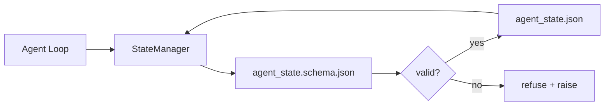

# Pamięć repozytorium i trwały stan

> Historia czatu jest ulotna. Repozytorium jest trwałe. Warsztat przechowuje stan agenta w wersjonowanych plikach, aby następna sesja, następny agent i następny recenzent wszyscy czytali z tego samego źródła prawdy.

**Type:** Build
**Languages:** Python (stdlib + `jsonschema` optional)
**Prerequisites:** Phase 14 · 32 (Minimal Workbench)
**Time:** ~60 minutes

## Learning Objectives

- Zdefiniować, co należy do pamięci repozytorium, a co do historii czatu.
- Stworzyć schematy JSON dla `agent_state.json` i `task_board.json`.
- Zbudować menedżer stanu, który atomowo ładuje, waliduje, mutuje i utrwala stan.
- Użyć schematu, aby odrzucić błędne zapisy, zanim uszkodzą warsztat.

## The Problem

Agent kończy sesję. Czat się zamyka. Następna sesja otwiera się i pyta, od czego zacząć. Model mówi "pozwól mi sprawdzić pliki", czyta nieaktualne notatki i powtarza pracę, która była już ukończona. Albo, co gorsza, nadpisuje ukończony plik, ponieważ nikt mu nie powiedział, że plik jest gotowy.

Rozwiązaniem warsztatu jest pamięć repozytorium: stan żyje w plikach JSON w repozytorium, zapisany zgodnie ze schematem, utrwalany atomowo, przyjazny dla diffów w code review. Czat jest strumieniem przejściowym; repozytorium jest systemem rejestracji.

## The Concept



### Co należy do pamięci repozytorium

| Należy | Nie należy |
|---------|-----------------|
| Identyfikator aktywnego zadania | Surowe transkrypty czatu |
| Pliki dotknięte w tej sesji | Ślady rozumowania na poziomie tokenów |
| Założenia poczynione przez agenta | "Użytkownik wydawał się sfrustrowany" |
| Otwarte blokery | Próbkowane uzupełnienia |
| Następna akcja | Identyfikatory modeli specyficzne dla dostawcy |

Testem jest trwałość: czy to będzie przydatne za trzy miesiące w ponownym uruchomieniu CI? Jeśli tak, repozytorium. Jeśli nie, telemetria.

### Stan zgodny ze schematem

JSON Schema jest kontraktem. Bez niego każdy agent wymyśla nowe pola, każdy recenzent uczy się nowego kształtu, a każdy skrypt CI musi obsługiwać poprzednie wersje. Dzięki niemu zły zapis to odrzucony zapis.

Schemat obejmuje:

- Wymagane klucze.
- Dozwolone wartości `status`.
- Zabronione wartości (np. `null` dla tablic).
- Ograniczenia wzorców (identyfikatory zadań pasują do `T-\d{3,}`).
- Pole wersji do migracji.

### Zapis atomowy

Zapisy stanu muszą przetrwać częściowe awarie: zapisz do pliku tymczasowego, fsync, zmień nazwę na docelową. Plik stanu jest źródłem prawdy; pół-zapisany jest gorszy niż brak pliku.

### Migracje

Gdy schemat się zmienia, dostarcz skrypt migracji obok zmiany wersji schematu. Plik stanu zawiera pole `schema_version`; menedżer odmawia załadowania pliku z wersji, której nie może zmigrować.

## Build It

`code/main.py` implementuje:

- `agent_state.schema.json` i `task_board.schema.json`.
- Walidator oparty tylko na stdlib (podzbiór JSON Schema: required, type, enum, pattern, items).
- `StateManager.load`, `StateManager.update`, `StateManager.commit` z atomowym zapisem temp-and-rename.
- Demonstrację, która mutuje stan, utrwala, ładuje ponownie i dowodzi poprawnego round-trip.

Uruchom:

```
python3 code/main.py
```

Skrypt zapisuje `workdir/agent_state.json` i `workdir/task_board.json`, mutuje je w dwóch turach i wypisuje zweryfikowany stan na każdym kroku.

## Production patterns in the wild

Cztery wzorce przekształcają minimum z tej lekcji w coś, co przetrwa w wieloagentowym monorepo.

**Atomowy temp-and-rename nie jest opcjonalny.** Raport o błędzie z projektu Hive z marca 2026 roku dokumentuje sposób awarii: `state.json` był zapisywany przez `write_text()`, a wyjątki były wyłapywane i wyciszane. Częściowe zapisy pozostawiały sesje wznawiające pracę na uszkodzonym stanie bez żadnego sygnału. Poprawka to zawsze: `tempfile.mkstemp` w tym samym katalogu co cel, zapisz, `fsync`, `os.replace` (atomowa zmiana nazwy na POSIX i Windows). `atomic_write` w tej lekcji robi dokładnie to.

**Klucze idempotentności dla każdego nieidempotentnego wywołania narzędzia.** Jeśli agent ulegnie awarii po wywołaniu narzędzia, ale przed utrwaleniem wyniku, odtwarzanie ponawia wywołanie narzędzia. Bezpieczne dla odczytów; niebezpieczne dla e-maili, wstawień do bazy danych, przesyłania plików. Wzorzec: zaloguj każdy identyfikator wywołania narzędzia przed wykonaniem do `pending_calls.jsonl`. Przy ponowieniu sprawdź identyfikator; jeśli istnieje, pomiń wywołanie i użyj buforowanego wyniku. Anthropic i LangChain oba to podkreślają w wytycznych na 2026; checkpointer LangGraph utrwala oczekujące zapisy z tego samego powodu.

**Oddziel duże artefakty od stanu.** Nie przechowuj plików CSV, długich transkryptów ani wygenerowanych plików w `agent_state.json`. Zapisz artefakt jako osobny plik (lub prześlij do magazynu obiektów) i przechowuj tylko ścieżkę w stanie. Punkty kontrolne pozostają małe i szybkie; artefakty rosną niezależnie.

**Event sourcing do audytu, snapshoty do wznawiania.** Dołączaj do dziennika zdarzeń (`state.events.jsonl`) przy każdej mutacji; okresowo rób snapshot do `state.json`. Wznawianie ładuje snapshot, a następnie odtwarza zdarzenia po znaczniku czasu snapshotu. Kosztuje więcej miejsca na dysku, ale pozwala odtworzyć decyzje agenta dosłownie — niezbędne przy debugowaniu długich sesji. Ten sam kształt, którego Postgres używa wewnętrznie dla WAL.

**Migracje schematu lub odmowa załadowania.** Liczba całkowita `schema_version` jest kontraktem. Gdy menedżer ładuje plik o nieznanej wersji, odmawia odczytu. Dostarcz skrypt migracji obok zmiany wersji schematu; `tools/migrate_state.py` działa idempotentnie przy każdym uruchomieniu.

## Use It

W produkcji:

- **LangGraph checkpointers.** Ten sam pomysł, inny magazyn. Checkpointer utrwala stan grafu do SQLite, Postgres lub niestandardowego backendu. Schemat, którego uczy ta lekcja, jest tym, po co sięgasz, gdy checkpointer umiera i musisz ręcznie odczytać stan.
- **Letta memory blocks.** Trwałe bloki z ustrukturyzowanymi schematami (Phase 14 · 08). Ta sama dyscyplina, ograniczona do długo działających person.
- **OpenAI Agents SDK session store.** Wymienne backendy, świadome schematu. Plik stanu w tej lekcji to backend lokalnego pliku.

## Ship It

`outputs/skill-state-schema.md` generuje parę schematów JSON specyficznych dla projektu (stan + board), `StateManager` w Pythonie podłączony do atomowych zapisów oraz szkielet migracji, aby następna zmiana schematu nie zepsuła warsztatu.

## Exercises

1. Dodaj znacznik czasu `last_human_touch`. Odrzuć każdy zapis agenta w ciągu pięciu sekund od edycji człowieka.
2. Rozszerz walidator o obsługę `oneOf`, aby zadanie mogło być albo zadaniem budowy, albo zadaniem przeglądu z różnymi wymaganymi polami.
3. Dodaj pole `schema_version` i napisz migrację z v1 do v2 (zmień nazwę `blockers` na `risks`).
4. Przenieś backend pamięci z pliku lokalnego do SQLite. Zachowaj identyczne API `StateManager`.
5. Uruchom dwóch agentów na tym samym pliku stanu z wyścigiem zapisu 50 ms. Co idzie nie tak i jak atomowa zmiana nazwy cię ratuje?

## Key Terms

| Term | What people say | What it actually means |
|------|----------------|------------------------|
| Pamięć repozytorium | "Plik notatek" | Stan przechowywany w śledzonych plikach w repozytorium, pod schematem |
| Schema-first | "Waliduj dane wejściowe" | Zdefiniuj kontrakt przed zapisującym, odrzuć dryf |
| Zapis atomowy | "Po prostu zmień nazwę" | Zapisz do temp, fsync, zmień nazwę, aby częściowe awarie nie mogły uszkodzić |
| Migracja | "Zmiana schematu" | Skrypt, który przekształca stan vN w stan v(N+1) |
| System rejestracji | "Źródło prawdy" | Artefakt, który warsztat traktuje jako autorytatywny |

## Further Reading

- [JSON Schema specification](https://json-schema.org/specification.html)
- [LangGraph checkpointers](https://langchain-ai.github.io/langgraph/concepts/persistence/)
- [Letta memory blocks](https://docs.letta.com/concepts/memory)
- [Fast.io, AI Agent State Checkpointing: A Practical Guide](https://fast.io/resources/ai-agent-state-checkpointing/) — schema-first checkpointing with idempotency
- [Fast.io, AI Agent Workflow State Persistence: Best Practices 2026](https://fast.io/resources/ai-agent-workflow-state-persistence/) — concurrency control, TTL, event sourcing
- [Hive Issue #6263 — non-atomic state.json writes silently ignored](https://github.com/aden-hive/hive/issues/6263) — the failure mode in a real project
- [eunomia, Checkpoint/Restore Systems: Evolution, Techniques, Applications](https://eunomia.dev/blog/2025/05/11/checkpointrestore-systems-evolution-techniques-and-applications-in-ai-agents/) — CR primitives from OS history applied to agents
- [Indium, 7 State Persistence Strategies for Long-Running AI Agents in 2026](https://www.indium.tech/blog/7-state-persistence-strategies-ai-agents-2026/)
- [Microsoft Agent Framework, Compaction](https://learn.microsoft.com/en-us/agent-framework/agents/conversations/compaction) — vendor checkpoint manager
- Phase 14 · 08 — memory blocks and sleep-time compute
- Phase 14 · 32 — the three-file minimum this lesson schematizes
- Phase 14 · 40 — handoff packets read from the same schema
