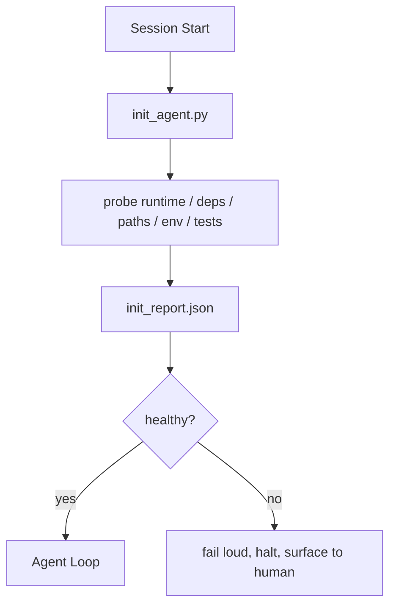

# Skrypty inicjalizacyjne dla agentów

> Każda sesja, która zaczyna się od zera, płaci podatek. Agent czyta te same pliki, ponawia te same sondy i odkrywa na nowo te same ścieżki. Skrypt inicjalizacyjny płaci podatek raz i zapisuje odpowiedzi w stanie.

**Type:** Build
**Languages:** Python (stdlib)
**Prerequisites:** Phase 14 · 32 (Minimal Workbench), Phase 14 · 34 (Repo Memory)
**Time:** ~45 minutes

## Learning Objectives

- Zidentyfikować pracę, której agent nigdy nie powinien musieć powtarzać w każdej sesji.
- Zbudować deterministyczny skrypt inicjalizacyjny, który bada środowisko uruchomieniowe, zależności i kondycję repozytorium.
- Utrwalić wynik sondy, aby agent go czytał zamiast ponownie uruchamiać kontrole.
- Zawieść głośno, szybko i w jednym miejscu, gdy inicjalizacja się nie powiedzie.

## The Problem

Otwórz sesję. Agent zgaduje wersję Pythona. Zgaduje polecenie testowe. Pięć razy wyświetla listę katalogu głównego repozytorium, aby znaleźć punkt wejścia. Próbuje zaimportować pakiet, który nie jest zainstalowany. Pyta użytkownika, gdzie znajduje się plik konfiguracyjny. Zanim dokona rzeczywistej edycji, dziesięć tysięcy tokenów poszło na pracę konfiguracyjną, która powinna być pojedynczym skryptem.

Rozwiązaniem jest jeden skrypt inicjalizacyjny, który uruchamia się, zanim agent zrobi cokolwiek innego, i zapisuje `init_report.json`, który agent czyta przy starcie.

## The Concept



### Co bada skrypt inicjalizacyjny

| Sonda | Dlaczego to ważne |
|-------|----------------|
| Wersje środowiska uruchomieniowego | Niewłaściwa wersja Pythona lub Node oznacza ciche błędy związane z wersją |
| Dostępność zależności | Brakujący pakiet później kosztuje dziesięciokrotność kosztu złapania go teraz |
| Polecenie testowe | Agent musi wiedzieć, jak weryfikować; jeśli polecenie brakuje, warsztat jest zepsuty |
| Ścieżki repozytorium | Zakodowane na stałe ścieżki dryfują; rozwiąż je raz i przypnij |
| Zmienne środowiskowe | Brak `OPENAI_API_KEY` to powierzchnia awarii, a nie tajemnica środowiska uruchomieniowego |
| Świeżość stanu i boardu | Nieaktualny stan po awarii sesji to pułapka |
| Ostatni znany dobry commit | Punkt zaczepienia dla diffa przy przekazaniu na końcu sesji |

### Zawieść głośno, zawieść szybko, zawieść w jednym miejscu

Niepowodzenie sondy oznacza zatrzymanie i przekazanie człowiekowi. Żadnego "agent sobie poradzi". Cały sens inicjalizacji polega na odmowie startu, gdy warsztat jest zepsuty.

### Idempotentność

Uruchom go dwa razy z rzędu. Drugie uruchomienie powinno być no-op poza świeżym znacznikiem czasu. Idempotentność pozwala podłączyć skrypt do CI, hooków lub polecenia pre-task.

### Inicjalizacja a reguły startowe

Reguły (Phase 14 · 33) opisują, co musi być prawdą, aby działać. Inicjalizacja to skrypt, który zapewnia, że te reguły mogą być sprawdzone. Reguły bez inicjalizacji stają się "bądź ostrożny". Inicjalizacja bez reguł staje się dopracowaną porażką.

## Build It

`code/main.py` implementuje `init_agent.py`:

- Pięć sond: wersja Pythona, wymienione zależności przez `importlib.util.find_spec`, rozpoznawalność polecenia testowego, wymagane zmienne env, świeżość pliku stanu.
- Każda sonda zwraca `(name, status, detail)`.
- Skrypt zapisuje `init_report.json` z pełnym zestawem sond i kończy z kodem niezerowym, jeśli jakakolwiek sonda o znaczeniu blokującym zawiedzie.

Uruchom:

```
python3 code/main.py
```

Skrypt wypisuje tabelę sond, zapisuje `init_report.json` i kończy z kodem zero na ścieżce sukcesu lub niezerowym z listą nieudanych sond.

## Production patterns in the wild

Trzy wzorce odróżniają użyteczny skrypt inicjalizacyjny od ceremonii.

**Kotwiczenie ostatniego znanego dobrego commitu.** Zbadaj bieżący commit względem pliku `LKG` zapisanego przy ostatnim udanym scaleniu. Jeśli diff przekracza budżet (domyślnie 50 plików), odmów startu i wymagaj od człowieka zatwierdzenia nowej linii bazowej. To właśnie Cloudflare's AI Code Review używa do zakresu agentów recenzujących: każda sesja przeglądu kotwiczy się względem tego samego ostatniego dobrego i nigdy nie kumuluje dryfu między sesjami.

**Pliki blokady z TTL.** Zapisz `prereqs.lock` po pierwszym udanym przejściu sond. Kolejne uruchomienia ufają blokadzie przez N godzin (domyślnie 24h) i pomijają kosztowne sondy. Skrypt inicjalizacyjny najpierw czyta blokadę; jeśli jest świeża i hash manifestu zależności się zgadza, wykonuje skrót. To ten sam wzorzec, którego Docker używa dla cache'ów warstw: idempotentna sonda + hash treści = pomiń.

**Brak sieci, brak LLM, brak niespodzianek na ścieżce krytycznej.** Sondy inicjalizacyjne to deterministyczna infrastruktura. Sonda, która wywołuje LLM do klasyfikacji błędu lub która uderza w zewnętrzną usługę w celu sprawdzenia licencji, nie jest sondą; jest przepływem pracy. Jeśli sonda trwa dłużej niż trzy sekundy w suchym uruchomieniu, traktuj to jako zapach warsztatu i albo przenieś ją poza inicjalizację, albo zapisz w cache jej wynik.

## Use It

W produkcji:

- **Claude Code hooks.** Hook `pre-task` wywołuje skrypt inicjalizacyjny i odmawia uruchomienia agenta, jeśli się nie powiedzie.
- **GitHub Actions.** Zadanie `setup-agent` uruchamia skrypt inicjalizacyjny; zadanie agenta zależy od niego.
- **Docker entrypoint.** Kontener agenta uruchamia skrypt inicjalizacyjny przed wykonaniem środowiska agenta; logi są wyświetlane przy awarii.

Skrypt inicjalizacyjny jest przenośny, ponieważ nie wykonuje wywołań do konkretnego frameworka. Bash, Make lub plik tasks mogą go opakować.

## Ship It

`outputs/skill-init-script.md` przeprowadza wywiad z projektem, klasyfikuje jego prace konfiguracyjne na sondy i emituje projektowy `init_agent.py` oraz przepływ CI, który uruchamia go przed każdym krokiem agenta.

## Exercises

1. Dodaj sondę, która porównuje bieżący commit z ostatnim znanym dobrym commit i odmawia startu, jeśli zmieniło się więcej niż 50 plików.
2. Podłącz skrypt do zapisu pliku `prereqs.lock` i odmów startu, jeśli blokada jest starsza niż siedem dni.
3. Dodaj flagę `--fix`, która automatycznie instaluje brakujące zależności deweloperskie, ale nigdy nie modyfikuje zależności wykonawczych bez zgody.
4. Przenieś sondy z zakodowanych na stałe funkcji do rejestru YAML. Uzasadnij kompromis.
5. Dodaj budżet czasowy na sondę. Sonda, która działa dłużej niż trzy sekundy, jest zapachem warsztatu.

## Key Terms

| Term | What people say | What it actually means |
|------|----------------|------------------------|
| Sonda | "Sprawdzenie" | Deterministyczna funkcja zwracająca `(name, status, detail)` |
| Raport inicjalizacyjny | "Wynik konfiguracji" | JSON zapisany obok stanu z wynikami sond |
| Idempotentny | "Bezpieczny do ponownego uruchomienia" | Dwa uruchomienia z rzędu dają identyczne raporty poza znacznikiem czasu |
| Zawieść głośno | "Nie połykaj" | Zatrzymaj się i przekaż człowiekowi; żadne ciche rozwiązanie awaryjne |
| Podatek konfiguracyjny | "Koszt uruchomienia" | Tokeny, które agent wydaje na sesję na ponowne odkrywanie oczywistości |

## Further Reading

- [Anthropic, Effective harnesses for long-running agents](https://www.anthropic.com/engineering/effective-harnesses-for-long-running-agents)
- [GitHub Actions, composite actions for setup](https://docs.github.com/en/actions/sharing-automations/creating-actions/creating-a-composite-action)
- [microservices.io, GenAI dev platform: guardrails](https://microservices.io/post/architecture/2026/03/09/genai-development-platform-part-1-development-guardrails.html) — pre-commit + CI checks as init
- [Augment Code, How to Build Your AGENTS.md (2026)](https://www.augmentcode.com/guides/how-to-build-agents-md) — init expectations
- [Codex Blog, Codex CLI Context Compaction](https://codex.danielvaughan.com/2026/03/31/codex-cli-context-compaction-architecture/) — session start as compaction-aware init
- Phase 14 · 33 — the rule set this script enables
- Phase 14 · 34 — the state file this script seeds
- Phase 14 · 38 — the verification gate the init script feeds
- Phase 14 · 40 — the handoff that consumes the init report's last-known-good
