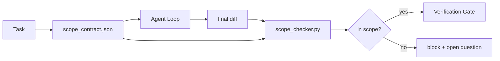

# Kontrakty zakresu i granice zadań

> Model nie wie, gdzie kończy się praca. Kontrakt zakresu to plik per-zadanie, który określa, gdzie praca się zaczyna, gdzie się kończy i jak ją wycofać, jeśli wykracza poza zakres. Kontrakt zmienia "trzymaj się zakresu" z życzenia w kontrolę.

**Type:** Build
**Languages:** Python (stdlib)
**Prerequisites:** Phase 14 · 32 (Minimal Workbench), Phase 14 · 33 (Rules as Constraints)
**Time:** ~50 minutes

## Learning Objectives

- Napisać kontrakt zakresu, który agent czyta na początku zadania, a weryfikator czyta na końcu zadania.
- Określić dozwolone pliki, zabronione pliki, kryteria akceptacji, plan wycofania i granice zatwierdzania.
- Zaimplementować sprawdzacz zakresu, który porównuje diff z kontraktem i zgłasza naruszenia.
- Sprawić, by rozszerzanie zakresu było widoczne, automatyczne i podlegało przeglądowi.

## The Problem

Agenci rozszerzają zakres. Zadanie brzmi "napraw błąd logowania." Diff dotyka ścieżki logowania, pomocnika e-mail, sterownika bazy danych, README i skryptu wydania. Każde dotknięcie miało w danym momencie wiarygodny powód. Razem stanowią inną zmianę niż ta, która była recenzowana.

Rozszerzanie zakresu jest najbardziej niedocenianym trybem awarii w pracy agentów, ponieważ agent opisuje każdy krok w dobrej wierze. Rozwiązaniem nie jest ostrzejszy prompt. Rozwiązaniem jest kontrakt na dysku, który mówi, co zostało obiecane, i kontrola, która porównuje wynik z obietnicą.

## The Concept



### Co znajduje się w kontrakcie zakresu

| Pole | Cel |
|-------|---------|
| `task_id` | Łączy z zadaniem na tablicy |
| `goal` | Jedno zdanie, które recenzent może zweryfikować |
| `allowed_files` | Globy, które agent może zapisywać |
| `forbidden_files` | Globy, których agent nie może dotknąć nawet przypadkiem |
| `acceptance_criteria` | Polecenia testowe lub wiersze asercji potwierdzające gotowość |
| `rollback_plan` | Jeden akapit, który operator może wykonać, jeśli wymagane jest zatrzymanie |
| `approvals_required` | Działania poza zakresem wymagające wyraźnej zgody człowieka |

Kontrakt bez `forbidden_files` jest niekompletny. Przestrzeń negatywna to połowa kontraktu.

### Globy, a nie surowe ścieżki

Prawdziwe repozytoria przenoszą pliki. Przypinaj kontrakty do globów (`app/**/*.py`, `tests/test_signup*.py`), aby refaktoryzacja między sesjami nie unieważniała kontraktu.

### Wycofanie jest częścią zakresu

Wymienienie sposobu wycofania zmusza autora kontraktu do myślenia o tym, co może pójść nie tak. Kontrakt, z którego nie można się wycofać, to kontrakt, który nie powinien być zatwierdzony.

### Sprawdzanie zakresu to sprawdzanie diffa

Agent zapisuje diff. Sprawdzacz czyta diff, dozwolone globy, zabronione globy i listę poleceń akceptacyjnych, które zostały uruchomione. Każde naruszenie to oznaczone znalezisko, które brama weryfikacyjna może odrzucić.

### Dwie wysokości zakresu: lista funkcji i kontrakt zadania

Kontrakt zakresu ogranicza jedno zadanie. Nie ogranicza projektu. Agent może idealnie trzymać się kontraktu dla naprawy logowania i nadal, w następnej turze, zdecydować, że projekt potrzebuje również strony ustawień, przełącznika trybu ciemnego i przepisania routera. Kontrakt nigdy nie został zapytany, która praca jest w zakresie projektu, tylko które pliki są w zakresie zadania.

Ta druga wysokość potrzebuje własnego prymitywu: `feature_list.json`, który agent czyta na początku sesji. Jest to backlog projektu jako maszynowo czytelny, uporządkowany plik. Agent wybiera dokładnie jedną funkcję, której `status` to `todo`, zapisuje jej `id` w aktywnym kontrakcie zakresu i nie może rozpocząć drugiej funkcji w tej samej sesji. "Jedna funkcja na raz" przestaje być linią w prompcie, którą agent może racjonalizować, i staje się wartością odczytaną z dysku i kontrolą egzekwowaną przez bramę.

```json
{
  "project": "knowledge-base",
  "active": "import-pdf",
  "features": [
    { "id": "import-pdf",   "status": "in_progress", "goal": "import a PDF into the library",        "done_when": "pytest tests/test_import.py && a sample PDF appears in the library view" },
    { "id": "full-text-search", "status": "todo",     "goal": "search document text and rank hits",   "done_when": "query returns ranked results with snippets" },
    { "id": "cite-answers", "status": "todo",         "goal": "answers carry source citations",        "done_when": "every answer renders at least one clickable citation" }
  ]
}
```

| Pole | Cel |
|-------|---------|
| `active` | Pojedyncza funkcja, której bieżąca sesja może dotykać; puste oznacza wybierz jedną i ustaw |
| `features[].id` | Stabilny slug, na który wskazuje `task_id` kontraktu zakresu |
| `features[].status` | `todo`, `in_progress`, `done`, `blocked`; tylko jeden `in_progress` na raz |
| `features[].goal` | Jedno zdanie, które recenzent może zweryfikować |
| `features[].done_when` | Linia akceptacyjna, która zmienia `in_progress` na `done` |

Dwie reguły sprawiają, że lista jest nośna, a nie dekoracyjna. Po pierwsze, niezmiennik "co najwyżej jeden `in_progress`" jest sam w sobie kontrolą startową (Phase 14 · 33): jeśli lista pokazuje dwa, sesja odmawia startu, dopóki człowiek tego nie rozwiąże. Po drugie, lista funkcji jest plikiem, a nie wiadomością na czacie, ponieważ czat wypada z kontekstu, a plik utrzymuje się między sesjami i między agentami. Przekazanie (Phase 14 · 40) zapisuje status ukończonej funkcji z powrotem jako `done`, aby następna sesja otworzyła się na dokładną tablicę zamiast ponownie wyprowadzać, co zostało.

Kontrakt i lista komponują się przez najmniejszy przywilej, to samo scalanie opisane poniżej: `allowed_files` kontraktu zadania musi znajdować się wewnątrz tego, czego dotyka aktywna funkcja, nigdy poza nią.

## Build It

`code/main.py` implementuje:

- Schemat `scope_contract.json` (podzbiór JSON Schema, tablice globów).
- Parser diffa, który przekształca listę dotkniętych plików plus listę uruchomionych poleceń w `RunSummary`.
- `scope_check`, który zwraca `(violations, in_scope, off_scope)` względem kontraktu.
- Dwa przebiegi demonstracyjne: jeden, który trzyma się zakresu, jeden, który rozszerza. Sprawdzacz oznacza rozszerzenie z dokładnym plikiem i powodem.

Uruchom:

```
python3 code/main.py
```

Wynik: kontrakt, dwa przebiegi, werdykty dla każdego przebiegu i zapisany `scope_report.json`.

## Production patterns in the wild

Praktyk stosujący "specsmaxxing" (kontrakty zakresu w YAML przed wywołaniem agenta) raportuje spadek wskaźnika wchodzenia w królicze nory z 52% do 21% w ciągu trzech tygodni bez zmiany agenta. Kontrakt wykonał pracę, nie model. Trzy wzorce sprawiają, że zysk się utrzymuje.

**Budżety naruszeń, a nie binarne porażki.** `agent-guardrails` (brama scalania OSS używana przez Claude Code, Cursor, Windsurf, Codex przez MCP) dostarcza `violationBudget` na zadanie: małe przekroczenia zakresu w ramach budżetu są wyświetlane jako ostrzeżenia; dopiero gdy budżet zostanie przekroczony, brama scalania odmawia. Połącz z `violationSeverity: "error" | "warning"`. Budżet to różnica między bramą, która jest wdrażana, a bramą, która jest wyłączana przez zespół, który ją znienawidził.

**Asymetria dotkliwości według rodziny ścieżek.** Zapis poza zakresem w `docs/**` to zazwyczaj `warn`; zapis poza zakresem w `scripts/**`, `migrations/**`, `config/prod/**` to zawsze `block`. Ta asymetria musi żyć w kontrakcie, a nie w środowisku wykonawczym, ponieważ jest specyficzna dla projektu i zmienia się w zależności od zadania.

**Budżety czasu i sieci obok budżetów plików.** Pole `time_budget_minutes` ogranicza czas rzeczywisty; środowisko wykonawcze odmawia kontynuacji po jego przekroczeniu bez ponownego zatwierdzenia. Lista dozwolonych `network_egress` na nazwy hostów zapobiega cichemu uderzaniu agenta w zewnętrzne API, które nie było częścią zadania. To również są wymiary zakresu; globy plików są konieczne, ale niewystarczające.

**Semantyka scalania wielu kontraktów (najmniejszy przywilej).** Gdy stosuje się dwa kontrakty zakresu (np. kontrakt ogólnoprojektowy plus kontrakt specyficzny dla zadania), scalanie to: **przecięcie** `allowed_files` (oba kontrakty muszą zezwalać na ścieżkę), **suma** `forbidden_files` (każdy może zabronić), `time_budget_minutes` jest najbardziej restrykcyjnym (min), `approvals_required` kumuluje się. `network_egress` to `None` dla braku egzekwowania, `[]` dla odmowy-wszystkiego, `[...]` jako lista dozwolonych; przy scalaniu `None` odracza do drugiej strony, dwie listy tworzą przecięcie, a odmowa-wszystkiego pozostaje odmową-wszystkiego. Określ to w schemacie kontraktu, aby scalanie było mechaniczne i podlegało przeglądowi.

## Use It

Wzorce produkcyjne:

- **Claude Code slash commands.** Polecenie `/scope` zapisuje kontrakt i przypina go jako kontekst sesji. Podagenci czytają kontrakt przed działaniem.
- **GitHub PRs.** Prześlij kontrakt jako plik JSON w treści PR lub jako artefakt w repozytorium. CI uruchamia sprawdzacz zakresu względem diffa scalania.
- **LangGraph interrupts.** Naruszenie zakresu wyzwala przerwanie; handler pyta człowieka, czy kontrakt musi się rozszerzyć, czy agent musi się wycofać.

Kontrakt podróżuje z zadaniem. Gdy zadanie się zamyka, kontrakt jest archiwizowany w `outputs/scope/closed/`.

## Ship It

`outputs/skill-scope-contract.md` generuje kontrakt zakresu dla opisu zadania i sprawdzacz obsługujący globy, który działa w CI na każdym diffie agenta.

## Exercises

1. Dodaj pole `network_egress` wymieniające dozwolone zewnętrzne hosty. Odrzucaj przebiegi, które dotykają innych hostów.
2. Rozszerz sprawdzacz, aby kończył miękko na `docs/**` i twardo na `scripts/**`. Uzasadnij asymetrię.
3. Spraw, aby kontrakt wyprowadzał `allowed_files` z pola `goal` przy użyciu statycznego zestawu reguł (bez LLM). Co idzie nie tak przy pierwszym przypadku brzegowym?
4. Dodaj `time_budget_minutes` i odmów kontynuacji, gdy czas rzeczywisty go przekroczy.
5. Uruchom dwa kontrakty na tym samym diffie. Jaka jest prawidłowa semantyka scalania, gdy oba mają zastosowanie?

## Key Terms

| Term | What people say | What it actually means |
|------|----------------|------------------------|
| Kontrakt zakresu | "Brief zadania" | JSON per-zadanie wymieniający dozwolone/zabronione pliki, akceptację, wycofanie |
| Rozszerzanie zakresu | "Dotknęło też..." | Pliki poza kontraktem zmienione w tym samym zadaniu |
| Plan wycofania | "Możemy przywrócić" | Jednoakapitowy podręcznik operatora do zatrzymania |
| Granica zatwierdzania | "Wymaga zgody" | Działanie wymienione w kontrakcie jako wymagające wyraźnej zgody człowieka |
| Sprawdzanie diffa | "Audyt ścieżek" | Porównanie dotkniętych plików z globami kontraktu |

## Further Reading

- [LangGraph human-in-the-loop interrupts](https://langchain-ai.github.io/langgraph/concepts/human_in_the_loop/)
- [OpenAI Agents SDK tool approval policies](https://platform.openai.com/docs/guides/agents-sdk)
- [logi-cmd/agent-guardrails — merge gates and scope validation](https://github.com/logi-cmd/agent-guardrails) — violation budgets, severity tiers
- [Dev|Journal, Preventing AI Agent Configuration Drift with Agent Contract Testing](https://earezki.com/ai-news/2026-05-05-i-built-a-tiny-ci-tool-to-keep-ai-agent-configs-from-drifting-in-my-repo/) — `--strict` mode without external deps
- [Agentic Coding Is Not a Trap (production logs)](https://dev.to/jtorchia/agentic-coding-is-not-a-trap-i-answered-the-viral-hn-post-with-my-own-production-logs-33d9) — specsmaxxing receipts: 52% → 21%
- [OpenCode permission globs](https://opencode.ai/docs/agents/) — fine-grained per-permission scope
- [Knostic, AI Coding Agent Security: Threat Models and Protection Strategies](https://www.knostic.ai/blog/ai-coding-agent-security) — scope as part of least privilege
- [Augment Code, AI Spec Template](https://www.augmentcode.com/guides/ai-spec-template) — three-tier boundary system (must/ask/never)
- Phase 14 · 27 — prompt injection defenses that pair with scope locks
- Phase 14 · 33 — the rule set this contract specializes per task
- Phase 14 · 38 — the verification gate the checker reports into
