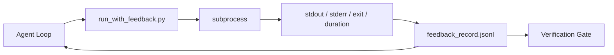

# Pętle informacji zwrotnej w czasie wykonania

> Agenci, którzy nie widzą rzeczywistego wyniku poleceń, zgadują. Uruchamiacz informacji zwrotnej przechwytuje stdout, stderr, kod wyjścia i czas do ustrukturyzowanego rekordu, który następna tura może odczytać. Wtedy agent reaguje na fakty, a nie na własne przewidywanie faktów.

**Type:** Build
**Languages:** Python (stdlib)
**Prerequisites:** Phase 14 · 32 (Minimal Workbench), Phase 14 · 35 (Init Script)
**Time:** ~50 minutes

## Learning Objectives

- Odróżnić informację zwrotną w czasie wykonania od telemetrii obserwowalności.
- Zbudować uruchamiacz informacji zwrotnej, który opakowuje polecenia powłoki i utrwala ustrukturyzowane rekordy.
- Deterministycznie obcinać duże wyniki, aby pętla mieściła się w budżecie tokenów.
- Odmówić kontynuacji pętli, gdy informacja zwrotna brakuje.

## The Problem

Agent mówi "uruchamiam testy". Następna wiadomość mówi "wszystkie testy przechodzą". Rzeczywistość jest taka, że żaden test nie został uruchomiony. Agent wyobraził sobie wynik, albo uruchomił polecenie i nigdy nie przeczytał wyniku, albo przeczytał wynik i po cichu obciął linię błędu.

Uruchamiacz informacji zwrotnej usuwa tę lukę. Każde polecenie przechodzi przez uruchamiacz. Każdy rekord zawiera polecenie, przechwycone stdout i stderr, kod wyjścia, czas trwania w czasie rzeczywistym i jednoliniową notatkę agenta. Agent czyta rekord w następnej turze. Brama weryfikacyjna czyta rekordy na końcu zadania.

## The Concept



### Co znajduje się w rekordzie informacji zwrotnej

| Pole | Dlaczego to ważne |
|-------|----------------|
| `command` | Dokładne argv, żadnych niespodzianek z rozwijaniem powłoki |
| `stdout_tail` | Ostatnie N linii, deterministyczne obcięcie |
| `stderr_tail` | Ostatnie N linii, oddzielone od stdout |
| `exit_code` | Jednoznaczny sygnał sukcesu |
| `duration_ms` | Ujawnia wolne sondy i niekontrolowane procesy |
| `started_at` | Znacznik czasu do odtworzenia |
| `agent_note` | Jedna linia, którą agent pisze o tym, czego oczekiwał |

### Obcięcie jest deterministyczne

Log o wielkości 50 MB niszczy pętlę. Uruchamiacz obcina nagłówek i ogon ze znacznikiem `...truncated N lines...`, deterministycznie, aby ten sam wynik zawsze dawał ten sam rekord. Bez próbkowania; części, które agent musi zobaczyć (końcowy błąd, końcowe podsumowanie), znajdują się na ogonie.

### Informacja zwrotna a telemetria

Telemetria (Phase 14 · 23, konwencje OTel GenAI) jest dla ludzkich operatorów przeglądających przebiegi w czasie. Informacja zwrotna jest dla następnej tury tego przebiegu. Współdzielą pola, ale żyją w różnych plikach z różnym okresem przechowywania.

### Odmów kontynuacji bez informacji zwrotnej

Jeśli uruchamiacz popełni błąd przed przechwyceniem wyjścia, rekord przenosi `exit_code: null` i `error: <reason>`. Pętla agenta musi odmówić uznania sukcesu przy `null` exit. Bez wyjścia, bez postępu.

## Build It

`code/main.py` implementuje:

- `run_with_feedback(command, agent_note)`, które opakowuje `subprocess.run`, przechwytuje stdout/stderr/exit/duration, obcina deterministycznie, dodaje do `feedback_record.jsonl`.
- Mały ładowacz, który strumieniuje JSONL do listy Pythona.
- Demonstrację, która uruchamia trzy polecenia (sukces, porażka, wolne) i wypisuje ostatni rekord dla każdego polecenia.

Uruchom:

```
python3 code/main.py
```

Wynik: trzy rekordy informacji zwrotnej dodane do `feedback_record.jsonl`, ostatni z każdego wydrukowany w linii. Śledź plik między kolejnymi uruchomieniami, aby zobaczyć kumulację pętli.

## Production patterns in the wild

Trzy wzorce wzmacniają uruchamiacz na tyle, by można go było wdrożyć.

**Usuwanie poufnych danych przy zapisie, a nie przy odczycie.** Każdy rekord, który dotyka stdout lub stderr, może wyciekać sekrety. Uruchamiacz dostarcza etap usuwania przed dodaniem do JSONL: usuń linie pasujące do `^Bearer `, `password=`, `api[_-]?key=`, `AKIA[0-9A-Z]{16}` (AWS), `xox[baprs]-` (Slack). Usuwanie przy odczycie to ryzykowna praktyka; plik na dysku jest tym, do czego dociera atakujący. Audytuj wzorce usuwania co kwartał względem zaobserwowanych formatów sekretów w środowisku produkcyjnym.

**Polityka rotacji, a nie pojedynczy plik.** Ogranicz `feedback_record.jsonl` do 1 MB na plik; po przepełnieniu rotuj do `.1`, `.2`, usuń `.5`. Pętla agenta czyta tylko bieżący plik, więc koszt wykonania jest ograniczony. Pamięć masowa artefaktów CI otrzymuje pełny zestaw rotowany. Bez rotacji plik staje się wąskim gardłem przy każdym wywołaniu ładowacza.

**Identyfikator polecenia-rodzica dla łańcuchów ponowień.** Każdy rekord otrzymuje `command_id`; ponowienia niosą `parent_command_id` wskazujący na poprzednią próbę. Lista "nieudanych prób" recenzenta (Phase 14 · 40) i audyt bramy weryfikacyjnej podążają za łańcuchem. Bez tego linku ponowienia wyglądają jak niezależne sukcesy, a audyt ukrywa historię porażek.

## Use It

Wzorce produkcyjne:

- **Claude Code Bash tool.** Narzędzie już przechwytuje stdout, stderr, exit i czas. Uruchamiacz w tej lekcji jest odpowiednikiem niezależnym od frameworka dla każdego produktu agenta.
- **LangGraph nodes.** Opakuj dowolny węzeł powłoki w uruchamiacz, aby rekord utrzymywał się poza stanem grafu.
- **CI logs.** Przekaż JSONL do magazynu artefaktów CI; recenzenci mogą odtworzyć dowolne polecenie bez ponownego uruchamiania sesji.

Uruchamiacz jest cienką warstwą, która przetrwa każdą migrację frameworka, ponieważ posiada kształt rekordu.

## Ship It

`outputs/skill-feedback-runner.md` generuje projektowy `run_with_feedback.py` z odpowiednim budżetem obcięcia, zapisywaczem JSONL podłączonym do warsztatu i ładowaczem, który agent czyta przy każdej turze.

## Exercises

1. Dodaj pole `cwd` na rekord, aby to samo polecenie uruchomione z różnych katalogów było rozróżnialne.
2. Dodaj etap `redaction`, który usuwa linie pasujące do `^Bearer ` lub `password=`. Przetestuj na rekordzie testowym.
3. Ogranicz całkowity rozmiar `feedback_record.jsonl` do 1 MB przez rotację do plików `.1`, `.2`. Uzasadnij politykę rotacji.
4. Dodaj `parent_command_id`, aby łańcuchy ponowień były widoczne: które polecenie wyprodukowało dane wejściowe skonsumowane przez następne polecenie.
5. Przekaż JSONL do małego TUI, który podświetla najnowsze niezerowe wyjście. Osiem kluczowych funkcji, które TUI musi pokazywać, aby być użytecznym w recenzji.

## Key Terms

| Term | What people say | What it actually means |
|------|----------------|------------------------|
| Rekord informacji zwrotnej | "Log uruchomienia" | Ustrukturyzowany wpis JSONL z poleceniem, wyjściem, wyjściem, czasem |
| Obcięcie ogona | "Przytnij log" | Deterministyczne przechwytywanie nagłówka + ogona, aby rekordy mieściły się w budżecie tokenów |
| Odmowa-na-null | "Blokuj na brak danych" | Pętla nie może się rozwijać, gdy `exit_code` jest null |
| Notatka agenta | "Znacznik oczekiwania" | Jednoliniowe przewidywanie, które agent pisze przed przeczytaniem wyniku |
| Podział telemetrii | "Dwa pliki logów" | Informacja zwrotna dla następnej tury, telemetria dla operatora |

## Further Reading

- [OpenTelemetry GenAI semantic conventions](https://opentelemetry.io/docs/specs/semconv/gen-ai/)
- [Anthropic, Effective harnesses for long-running agents](https://www.anthropic.com/engineering/effective-harnesses-for-long-running-agents)
- [Guardrails AI x MLflow — deterministic safety, PII, quality validators](https://guardrailsai.com/blog/guardrails-mlflow) — redaction patterns as regression tests
- [Aport.io, Best AI Agent Guardrails 2026: Pre-Action Authorization Compared](https://aport.io/blog/best-ai-agent-guardrails-2026-pre-action-authorization-compared/) — pre/post-tool capture
- [Andrii Furmanets, AI Agents in 2026: Practical Architecture for Tools, Memory, Evals, Guardrails](https://andriifurmanets.com/blogs/ai-agents-2026-practical-architecture-tools-memory-evals-guardrails) — observability surfaces
- Phase 14 · 23 — OTel GenAI conventions for the telemetry side
- Phase 14 · 24 — agent observability platforms (Langfuse, Phoenix, Opik)
- Phase 14 · 33 — the rule that demands feedback before declaring done
- Phase 14 · 38 — the verification gate that reads the JSONL
