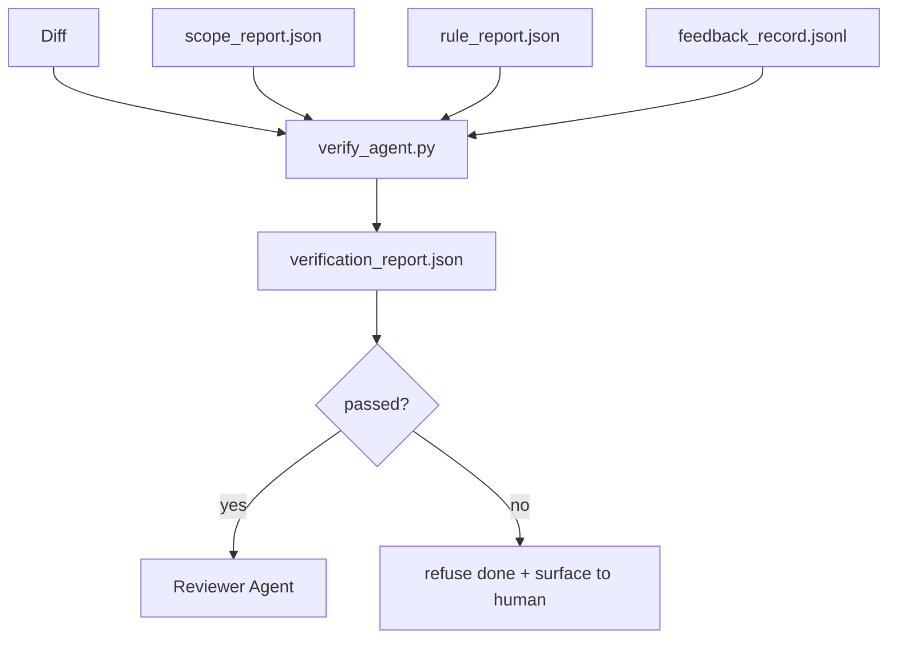

# Bramy weryfikacyjne

> Agent nie może sam oznaczać swojej pracy jako ukończonej. Brama weryfikacyjna czyta kontrakt zakresu, dziennik informacji zwrotnej, raport reguł i diff, i odpowiada na jedno pytanie: czy to zadanie jest rzeczywiście ukończone? Jeśli brama mówi nie, zadanie nie jest ukończone, bez względu na to, co mówi czat.

**Type:** Build
**Languages:** Python (stdlib)
**Prerequisites:** Phase 14 · 33 (Rules), Phase 14 · 36 (Scope), Phase 14 · 37 (Feedback)
**Time:** ~55 minutes

## Learning Objectives

- Zdefiniować bramę weryfikacyjną jako deterministyczną funkcję nad artefaktami warsztatu.
- Połączyć raport reguł, raport zakresu, rekordy informacji zwrotnej i diff w jeden werdykt.
- Wyemitować `verification_report.json`, który agent recenzujący i CI mogą odczytać.
- Odmówić kontynuacji zadania przy każdym błędzie o znaczeniu blokującym, bez wyjątku.

## The Problem

Agenci zbyt łatwo deklarują sukces. Dominują trzy formy porażki:

- "Wygląda dobrze." Model przeczytał swój własny diff i uznał, że jest poprawny.
- "Testy przeszły." Powiedziane z przekonaniem. Brak rejestru faktycznego uruchomienia testu.
- "Kryteria akceptacji spełnione." Kryteria akceptacji interpretowane na tyle luźno, by oznaczać "cokolwiek przypominającego gotowe."

Rozwiązaniem warsztatu jest pojedyncza brama weryfikacyjna, która czyta artefakty, które agent już wyprodukował, i podejmuje decyzję. Brama jest deterministyczna. Brama jest w kontroli wersji. Brama jest podłączona do CI. Agent nie może jej przekupić.

## The Concept



### Co sprawdza brama

| Kontrola | Artefakt źródłowy | Znaczenie |
|-------|-----------------|----------|
| Wszystkie polecenia akceptacyjne zostały uruchomione | `feedback_record.jsonl` | block |
| Wszystkie polecenia akceptacyjne zakończyły się zerem | `feedback_record.jsonl` | block |
| Sprawdzanie zakresu nie ma zabronionych zapisów | `scope_report.json` | block |
| Sprawdzanie zakresu nie ma zapisów poza zakresem | `scope_report.json` | block lub warn |
| Wszystkie reguły o znaczeniu blokującym przechodzą | `rule_report.json` | block |
| Brak kodów wyjścia `null` w informacji zwrotnej | `feedback_record.jsonl` | block |
| Dotknięte pliki pasują do `scope.allowed_files` | oba | warn |

Znajduj `warn` adnotuje werdykt; znajduj `block` uniemożliwia `passed: true`.

### Deterministyczna, a nie probabilistyczna

Brama musi dawać ten sam werdykt dla tego samego zestawu artefaktów za każdym razem. Żadnych sędziów LLM. Sędziowie LLM należą do strony recenzenta (Phase 14 · 39), gdzie celem jest ocena jakościowa, a nie status.

### Jeden raport, jedna ścieżka

Brama emituje jeden `verification_report.json` na zamknięcie zadania, zapisany w `outputs/verification/<task_id>.json`. CI konsumuje tę samą ścieżkę. Wiele bram z różnymi ścieżkami rozwidla źródło prawdy.

### Odmów bez wyjątku

Znajdy o znaczeniu blokującym nie mogą być nadpisywane przez agenta. Mogą być nadpisywane tylko przez człowieka, z zarejestrowanym `override_reason` i identyfikatorem użytkownika `overridden_by`. Nadpisanie to podpisana zmiana, a nie decyzja agenta.

## Build It

`code/main.py` implementuje:

- Ładowacz dla każdego artefaktu wejściowego, wszystkie zastubione lokalnie, aby lekcja była samodzielna.
- Czystą funkcję `verify(task_id, artifacts) -> VerdictReport`.
- Drukarkę pokazującą wyniki per-kontrola i końcowe pass/fail.
- Demonstrację z trzema scenariuszami zadań: czyste przejście, rozszerzenie zakresu, brak akceptacji.

Uruchom:

```
python3 code/main.py
```

Wynik: trzy raporty werdyktów, każdy zapisany obok skryptu.

## Production patterns in the wild

Cztery wzorce podnoszą bramę z "kolejnego zadania linta" do "decydującej krawędzi."

**Obrona w głąb, a nie pojedyncza brama.** Hook pre-commit → kontrola statusu CI → hook autoryzacji pre-tool → brama pre-merge. Każda warstwa jest deterministyczna, więc awaria w jednej warstwie jest wychwycona przez następną. Playbook microservices.io z marca 2026 jest wyraźny: hook pre-commit jest nie do ominięcia, ponieważ, w przeciwieństwie do umiejętności po stronie modelu, nie zależy od agenta przestrzegającego instrukcji. Brama weryfikacyjna znajduje się na warstwie CI / pre-merge.

**Obrona przez deterministyczną kontrolę, sędzia-model tylko dla niuansów.** Norma hybrydowa Anthropic z 2026: weryfikowalne nagrody (testy jednostkowe, kontrole schematów, kody wyjścia) odpowiadają na "czy kod rozwiązał problem?" — rubryki LLM odpowiadają na "czy kod jest czytelny, bezpieczny, w stylu?" Brama uruchamia pierwszą klasę; recenzent (Phase 14 · 39) uruchamia drugą. Mieszanie ich załamuje sygnał.

**Podpisany dziennik nadpisań, a nie wątki Slack.** Każde nadpisanie emituje wiersz w `outputs/verification/overrides.jsonl` z: znacznik czasu, kod znajduj, powód, podpisujący użytkownik, bieżący HEAD commit. Środowisko wykonawcze odmawia każdego nadpisania, któremu brakuje podpisu; ślad audytu jest śledzony w git. To jest granica między polityką nadpisań a teatrem nadpisań.

**Próg pokrycia jako kontrola pierwszej klasy.** `coverage_report.json` zasila kontrolę `coverage_floor` (domyślnie 80%). Brama kończy się niepowodzeniem, jeśli zmierzone pokrycie spadnie poniżej progu lub poniżej progu poprzedniego scalenia o więcej niż 1 punkt procentowy. Bez tej kontroli agenci po cichu usuwają testy, które nie przechodzą, a raporty weryfikacyjne pozostają zielone.

**Tryb `--strict` promuje ostrzeżenia do blokad.** Dla gałęzi wydania, PR-ów blokujących wdrożenie lub triażu po incydencie, `--strict` sprawia, że każde ostrzeżenie jest twardym błędem. Flaga jest opcjonalna na gałąź; nie jest globalną domyślną, ponieważ ścisłość we wszystkim psuje codzienny przepływ pracy.

## Use It

Wzorce produkcyjne:

- **Krok CI.** Zadanie `verify_agent` uruchamia bramę na końcowych artefaktach agenta. Ochrona scalania odmawia bez `passed: true`.
- **Hook pre-handoff.** Środowisko wykonawcze agenta wywołuje bramę przed wygenerowaniem dokumentu przekazania. Brak zielonego werdyktu, brak przekazania.
- **Ręczny triaż.** Operatorzy czytają raport, gdy agent twierdzi, że osiągnął sukces, a człowiek podejrzewa, że tak nie jest.

Brama jest decydującą krawędzią w przepływie warsztatu. Każda inna powierzchnia jest przed nią.

## Ship It

`outputs/skill-verification-gate.md` podłącza bramę do konkretnego projektu: które polecenia akceptacyjne ją zasilają, które reguły są o znaczeniu blokującym, które zapisy poza zakresem są tolerowane, jak przechowywany jest dziennik audytu nadpisań.

## Exercises

1. Dodaj kontrolę `coverage_floor`: polecenie testowe musi wyprodukować raport pokrycia z co najmniej 80%. Zdecyduj, który artefakt przenosi próg.
2. Obsłuż tryb `--strict`, który promuje każde `warn` na `block`. Udokumentuj przypadki, w których tryb ścisły jest właściwym domyślnym.
3. Spraw, aby brama produkowała podsumowanie w Markdown oprócz JSON. Uzasadnij, które pola należą do podsumowania.
4. Dodaj kontrolę `time_since_last_human_touch`: każdy plik edytowany w ciągu 60 sekund od naciśnięcia klawisza przez człowieka jest zwolniony z flag poza zakresem.
5. Uruchom bramę na rzeczywistym diffie agenta z twojego produktu. Ile znalezisk jest prawdziwych, a ile to szum? Gdzie brama musi się rozrosnąć?

## Key Terms

| Term | What people say | What it actually means |
|------|----------------|------------------------|
| Brama weryfikacyjna | "Kontrola, która zatrzymuje" | Deterministyczna funkcja nad artefaktami warsztatu produkująca werdykt pass/fail |
| Znaczenie blokujące | "Twardy błąd" | Znajduj, który uniemożliwia `passed: true` i wymaga podpisanego nadpisania |
| Dziennik nadpisań | "Dlaczego przepuściliśmy" | Podpisane wpisy z powodem i id użytkownika, audytowane przez przegląd |
| Polecenie akceptacyjne | "Dowód" | Polecenie powłoki, którego zerowe wyjście oznacza `done` |
| Jedna ścieżka raportu | "Źródło prawdy" | `outputs/verification/<task_id>.json`, konsumowane zarówno przez CI, jak i ludzi |

## Further Reading

- [Anthropic, Harness design for long-running application development](https://www.anthropic.com/engineering/harness-design-long-running-apps)
- [OpenAI Agents SDK guardrails](https://platform.openai.com/docs/guides/agents-sdk/guardrails)
- [microservices.io, GenAI dev platform: guardrails](https://microservices.io/post/architecture/2026/03/09/genai-development-platform-part-1-development-guardrails.html) — defense in depth between pre-commit and CI
- [ICMD, The 2026 Playbook for Agentic AI Ops](https://icmd.app/article/the-2026-playbook-for-agentic-ai-ops-guardrails-costs-and-reliability-at-scale-1776661990431) — approval-gate ladder (draft → approval → auto under thresholds)
- [Type-Checked Compliance: Deterministic Guardrails (arXiv 2604.01483)](https://arxiv.org/pdf/2604.01483) — Lean 4 as the upper bound of deterministic gating
- [logi-cmd/agent-guardrails — merge gate spec](https://github.com/logi-cmd/agent-guardrails) — scope + mutation-testing gates
- [Guardrails AI x MLflow](https://guardrailsai.com/blog/guardrails-mlflow) — deterministic validators as CI scorers
- [Akira, Real-Time Guardrails for Agentic Systems](https://www.akira.ai/blog/real-time-guardrails-agentic-systems) — pre/post-tool gates
- Phase 14 · 27 — prompt injection defenses (the gate's adversarial pair)
- Phase 14 · 36 — the scope contract this gate enforces
- Phase 14 · 37 — the feedback log this gate scores
- Phase 14 · 39 — the reviewer agent the gate hands off to
