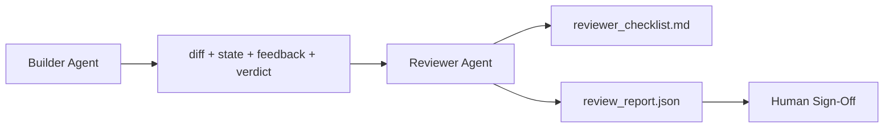

# Agent recenzujący: oddziel budowniczego od oceniającego

> Agent, który napisał kod, nie może go oceniać. Recenzent to druga pętla z innym promptem systemowym, innym celem i dostępem tylko do odczytu do wszystkiego, co wyprodukował budowniczy. Luka między budowniczym a recenzentem to miejsce, w którym mieszka większość niezawodności.

**Type:** Build
**Languages:** Python (stdlib)
**Prerequisites:** Phase 14 · 38 (Verification Gate)
**Time:** ~55 minutes

## Learning Objectives

- Wyjaśnić, dlaczego ten sam agent nie może wiarygodnie recenzować własnej pracy.
- Zbudować pętlę agenta recenzującego, która konsumuje artefakty budowniczego i emituje ustrukturyzowany raport recenzji.
- Stworzyć rubrykę recenzenta, która ocenia konkretne wymiary, a nie ogólne wrażenie.
- Podłączyć recenzenta do warsztatu, aby krok recenzji ludzkiej zaczynał się od prawdziwego artefaktu.

## The Problem

Prosisz agenta o naprawienie błędu. Edytuje cztery pliki, uruchamia testy i raportuje gotowość. Brama weryfikacyjna (Phase 14 · 38) potwierdza, że akceptacja została uruchomiona, a zakres utrzymany. Brama mówi `passed: true`. Scalasz. Dwa dni później odkrywasz, że naprawa rozwiązała złą połowę błędu.

Akceptacja jest konieczna, ale niewystarczająca. Recenzent zadaje pytania, których akceptacja nie może zadać: czy to rozwiązało właściwy problem? Czy rozszerzyło zakres bez oznaczania go? Czy udokumentowało założenia, które powinny zostać zakwestionowane? Czy pozostawiło warsztat w stanie, który następna sesja może podjąć?

## The Concept



### Rubryka recenzenta

Pięć wymiarów, każdy oceniany 0 do 2.

| Wymiar | Pytanie |
|-----------|----------|
| Dopasowanie problemu | Czy zmiana rozwiązała zadanie tak, jak zostało sformułowane, a nie podobne zadanie? |
| Dyscyplina zakresu | Czy edycje były ograniczone do kontraktu, czy kontrakt został celowo rozszerzony? |
| Założenia | Czy wszystkie ukryte założenia są gdzieś zapisane w sposób nadający się do przeglądu? |
| Jakość weryfikacji | Czy polecenie akceptacyjne rzeczywiście dowodzi celu, czy dowodzi słabszej wersji? |
| Gotowość do przekazania | Czy następna sesja może czysto podjąć pracę z bieżącego stanu? |

Suma z 10. Wynik poniżej 7 to miękka porażka; wynik poniżej 5 to twarda porażka.

### Recenzent to osobna rola, a nie osobny model

Możesz uruchomić recenzenta z tym samym modelem co budowniczego. Dyscypliną jest separacja ról: inny prompt systemowy, inne dane wejściowe, brak dostępu do zapisu do diffa. Zmiana postawy to zmiana sygnału.

### Recenzent nie może edytować diffa

Recenzent czyta diff, stan, informację zwrotną, werdykt. Pisze raport. Nie poprawia diffa. Jeśli raport mówi "napraw to," następna tura budowniczego wykonuje naprawę; recenzent wraca do recenzowania. Mieszanie ról pokonuje lukę.

### Rubryka recenzenta a brama weryfikacyjna

Brama (Phase 14 · 38) sprawdza deterministyczne fakty: czy akceptacja została uruchomiona, czy reguły przeszły, czy zakres został utrzymany. Recenzent dokonuje ocen jakościowych: czy to była właściwa praca, czy jest udokumentowana, czy przekazanie jest użyteczne. Oba są wymagane.

## Build It

`code/main.py` implementuje:

- Dataclass `ReviewerInputs` łączący artefakty, które recenzent czyta.
- Oceniacz rubryki z jedną funkcją na wymiar. Każda funkcja jest deterministyczna i na poziomie zastubki dla lekcji; rzeczywiste implementacje wywoływałyby LLM.
- Zapisywacz `review_report.json` z pięcioma ocenami, sumą i werdyktem (`pass`, `soft_fail`, `hard_fail`).
- Dwa przypadki demonstracyjne: czystą zmianę i zmianę "dobre testy, zły problem."

Uruchom:

```
python3 code/main.py
```

Wynik: dwa raporty recenzji zapisane na dysku i konsolowa tabela ocen wymiarowych.

## Production patterns in the wild

Dowody: System AI Code Review Cloudflare z kwietnia 2026 roku uruchomił 131 246 przebiegów recenzji w 48 095 żądaniach scalenia w 5 169 repozytoriach w ciągu 30 dni. Mediana recenzji ukończona w 3 minuty 39 sekund. Do siedmiu wyspecjalizowanych recenzentów (bezpieczeństwo, wydajność, jakość kodu, dokumentacja, zarządzanie wydaniami, zgodność, Engineering Codex) działało równolegle pod koordynatorem recenzji, który deduplikował znaleziska i oceniał znaczenie. Najlepszy model zarezerwowany wyłącznie dla koordynatora; specjaliści działali na tańszych warstwach.

Cztery wzorce sprawiają, że działa to na skalę.

**Pula specjalistów, a nie jeden duży recenzent.** Jeden recenzent z rubryką 5-wymiarową działa dla pojedynczych repozytoriów. Gdy baza kodu ma powierzchnie krytyczne dla bezpieczeństwa, krytyczne dla wydajności i dokumentacji, podziel na specjalistów z mniejszymi promptami. Koordynator robi deduplikację; specjaliści nigdy nie uruchamiają pełnej rubryki. Separacja warstw modeli wynika z tego: tani specjaliści, drogi koordynator.

**Łagodzenie biasu jako wymóg projektowy, a nie optymalizacja.** Sędziowie LLM wykazują cztery wiarygodne błędy systematyczne (Adnan Masood, kwiecień 2026): bias pozycji (GPT-4 ~40% niespójności przy (A,B) vs (B,A)), bias rozwlekłości (~15% zawyżanie oceny dla dłuższych wyników), preferencja własna (sędziowie wolą wyniki z tej samej rodziny modeli), autorytet (sędziowie przeceniają odniesienia do znanych autorów). Łagodzenia: oceniaj obie kolejności i licz tylko spójne zwycięstwa; używaj skal 1-4, które wyraźnie nagradzają zwięzłość; rotuj sędziów między rodzinami modeli; usuwaj nazwiska autorów przed oceną.

**Zestaw kalibracyjny, a nie ogólne wrażenie.** Historyczny zestaw 10-20 zadań ze znanymi poprawnymi werdyktami. Uruchom recenzenta na nim przy każdej zmianie prompta. Jeśli zgodność z historycznym zapisem spadnie poniżej 80%, rubryka wymaga rewizji przed wdrożeniem recenzenta. To jest to, co każdy zespół ostatecznie odkrywa na nowo; lepiej zacząć z tym.

**Norma hybrydowa z bramą.** Brama weryfikacyjna (Phase 14 · 38) obsługuje kontrole deterministyczne (czy akceptacja została uruchomiona, czy testy przeszły, czy zakres został utrzymany). Recenzent obsługuje kontrole semantyczne (czy to była właściwa praca, czy założenia są udokumentowane, czy przekazanie jest użyteczne). Wytyczne Anthropic z 2026 są wyraźne co do tego podziału: nie proś recenzenta o powtarzanie tego, co brama już udowodniła.

## Use It

Wzorce produkcyjne:

- **Claude Code subagents.** Podagent recenzenta uruchamia się po zamknięciu zadania przez budowniczego. Publikuje komentarz w PR z ocenami rubryki.
- **OpenAI Agents SDK handoffs.** Budowniczy przekazuje do recenzenta po zakończeniu zadania. Recenzent może przekazać z powrotem z listą znalezisk lub do człowieka.
- **Parowanie dwóch modeli.** Budowniczy działa na szybszym, tańszym modelu. Recenzent działa na silniejszym modelu z mniejszym kontekstem, skoncentrowanym na ocenie.

Recenzent jest drugą parą oczu, którą warsztat rozwija, gdy ludzie nie mogą wykonać każdej recenzji sami.

## Ship It

`outputs/skill-reviewer-agent.md` generuje rubrykę recenzenta specyficzną dla projektu, zastubkę agenta recenzującego podłączoną do artefaktów budowniczego i integrację z bramą weryfikacyjną, aby recenzja ludzka zaczynała się od pisemnego raportu zamiast od pustej strony.

## Exercises

1. Dodaj szósty wymiar specyficzny dla twojej domeny produktu. Uzasadnij, dlaczego nie jest wchłonięty przez istniejące pięć.
2. Uruchom recenzenta z dwoma różnymi promptami systemowymi (zwięzły, rozwlekły). Który produkuje raport, który człowiek jest bardziej skłonny przeczytać?
3. Dodaj pole `confidence` na wymiar. Odmów wysłania raportu, gdy pewność w najniższym wymiarze jest poniżej 0.6.
4. Zbuduj zestaw kalibracyjny: 10 historycznych zamknięć zadań ze znanymi poprawnymi werdyktami. Uruchom recenzenta na nich. Gdzie nie zgadza się z historycznym zapisem?
5. Dodaj możliwość "poproś o więcej dowodów": recenzent może poprosić budowniczego o konkretne uruchomienie testu przed oceną. Jaki jest właściwy mechanizm wycofania, aby to nie zapętliło?

## Key Terms

| Term | What people say | What it actually means |
|------|----------------|------------------------|
| Rubryka recenzenta | "Lista kontrolna" | Ocena pięciowymiarowa 0-2 z zapisanym pytaniem na wymiar |
| Miękka porażka | "Wymaga poprawek" | Suma poniżej 7; budowniczy otrzymuje znaleziska do rozwiązania |
| Twarda porażka | "Odrzuć" | Suma poniżej 5 lub dowolny wymiar na 0; zatrzymaj i przekaż człowiekowi |
| Separacja ról | "Inny prompt" | Ten sam model może pełnić obie role; dyscypliną są dane wejściowe i postawa |
| Próg pewności | "Nie wysyłaj raportów o niskim sygnale" | Odmów emisji werdyktu, gdy rubryka jest niepewna |

## Further Reading

- [OpenAI Agents SDK handoffs](https://platform.openai.com/docs/guides/agents-sdk/handoffs)
- [Anthropic Claude Code subagents](https://docs.anthropic.com/en/docs/agents-and-tools/claude-code/sub-agents)
- [Cloudflare, Orchestrating AI Code Review at Scale](https://blog.cloudflare.com/ai-code-review/) — 7-specialist + coordinator architecture, 131k runs / 30 days
- [Agent-as-a-Judge: Evaluating Agents with Agents (OpenReview / ICLR)](https://openreview.net/forum?id=DeVm3YUnpj) — DevAI benchmark, 366 hierarchical solution requirements
- [Adnan Masood, Rubric-Based Evaluations and LLM-as-a-Judge: Methodologies, Biases, Empirical Validation](https://medium.com/@adnanmasood/rubric-based-evals-llm-as-a-judge-methodologies-and-empirical-validation-in-domain-context-71936b989e80) — the 4 biases and mitigations
- [MLflow, LLM-as-a-Judge Evaluation](https://mlflow.org/llm-as-a-judge) — production tooling for separated builder/evaluator
- [LangChain, How to Calibrate LLM-as-a-Judge with Human Corrections](https://www.langchain.com/articles/llm-as-a-judge) — calibration-set workflow
- [Evidently AI, LLM-as-a-judge: a complete guide](https://www.evidentlyai.com/llm-guide/llm-as-a-judge)
- [Arize, LLM as a Judge — Primer and Pre-Built Evaluators](https://arize.com/llm-as-a-judge/)
- Phase 14 · 05 — Self-Refine and CRITIC (single-agent self-review baseline)
- Phase 14 · 30 — Eval-driven agent development (calibration set generator)
- Phase 14 · 38 — the verification gate the reviewer reads
- Phase 14 · 40 — the handoff packet the reviewer report feeds
