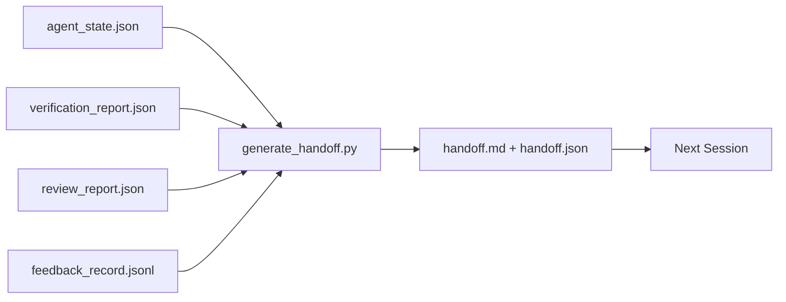

# Przekazanie między sesjami

> Sesja się skończy. Praca nie. Pakiet przekazania to artefakt, który zmienia "agent pracował przez godzinę" w "następna sesja jest produktywna w pierwszej minucie." Zbuduj go celowo, a nie po namyśle.

**Type:** Build
**Languages:** Python (stdlib)
**Prerequisites:** Phase 14 · 34 (Repo Memory), Phase 14 · 38 (Verification), Phase 14 · 39 (Reviewer)
**Time:** ~50 minutes

## Learning Objectives

- Zidentyfikować siedem pól, których potrzebuje każdy pakiet przekazania.
- Wygenerować przekazanie z artefaktów warsztatu bez ręcznego pisania prozy.
- Przyciąć duże dzienniki informacji zwrotnej do podsumowania wielkości przekazania.
- Sprawić, by pierwsza akcja następnej sesji była deterministyczna.

## The Problem

Sesja się kończy. Agent mówi "świetnie, zrobiliśmy postęp." Następna sesja otwiera się. Następny agent pyta "gdzie skończyliśmy?" Odpowiedź pierwszego agenta zniknęła. Następny agent odkrywa na nowo, ponownie uruchamia te same polecenia, ponownie zadaje człowiekowi te same pytania i spala trzydzieści minut na odzyskanie ostatnich trzydziestu sekund poprzedniej sesji.

Koszt złego przekazania jest płacony w każdej sesji przez cały czas trwania zadania. Rozwiązaniem jest pakiet generowany automatycznie na koniec sesji: co się zmieniło, dlaczego, co było próbowane, co się nie udało, co zostało, co zrobić najpierw następnym razem.

## The Concept



### Siedem pól, które niesie każde przekazanie

| Pole | Pytanie, na które odpowiada |
|-------|---------------------|
| `summary` | Jeden akapit tego, co zostało zrobione |
| `changed_files` | Diff w skrócie |
| `commands_run` | Co zostało faktycznie wykonane |
| `failed_attempts` | Co było próbowane i dlaczego nie zadziałało |
| `open_risks` | Co może ugryźć następną sesję, z wagą |
| `next_action` | Pierwszy konkretny krok, który podejmuje następna sesja |
| `verdict_pointer` | Ścieżka do raportów weryfikacji i recenzji |

Pole `next_action` jest tym nośnym. Przekazanie ze wszystkim oprócz `next_action` jest raportem statusu, a nie przekazaniem.

### Przekazania są generowane, a nie pisane

Ręcznie napisane przekazanie to przekazanie, które zostanie pominięte w ciężkim dniu. Generator czyta artefakty warsztatu i emituje pakiet. Zadaniem agenta jest pozostawienie warsztatu w stanie, który generator może podsumować, a nie napisanie podsumowania.

### Dwie formy: czytelna dla człowieka i czytelna dla maszyny

`handoff.md` jest tym, co czyta człowiek. `handoff.json` jest tym, co ładuje następny agent. Oba pochodzą z tych samych źródłowych artefaktów. Jeśli się różnią, JSON wygrywa.

### Przycinanie dziennika informacji zwrotnej

Pełny `feedback_record.jsonl` może zawierać setki wpisów. Przekazanie niesie tylko ostatnie K plus każdy wpis z niezerowym wyjściem. Następna sesja ładuje pełny dziennik, jeśli potrzebuje, ale pakiet pozostaje mały.

### Pozostaw czysty stan

Przekazanie opisuje pracę. Czysty stan sprawia, że praca jest możliwa do wznowienia. To nie to samo. Doskonały `handoff.md` jest bezwartościowy, jeśli następna sesja otwiera się na połowicznie zastosowany diff, plik tymczasowy, o którym agent zapomniał, zabłąkaną gałąź i testy, które błędnie kończą się, zanim w ogóle zostaną uruchomione. Następny agent spędza wtedy pierwsze dziesięć minut na sprzątaniu po poprzednim zamiast budować, a koszt kumuluje się w każdej sesji przez cały czas trwania zadania.

Sesja nie kończy się więc, gdy funkcja działa. Kończy się, gdy warsztat jest w stanie, który generator może podsumować, a następna sesja może zaufać. Sprzątanie to osobna faza, uruchomiona przed przekazaniem, i to kontrola, a nie nawyk, ponieważ nawyk to rzecz, która jest pomijana w ciężkim dniu.

| Kontrola | Czyste oznacza | Brudne blokuje, ponieważ |
|-------|-------------|----------------------|
| Drzewo robocze | Każda zmiana zatwierdzona lub jawnie odłożona z notatką | Częściowo zastosowany diff wygląda jak celowa praca dla następnego agenta |
| Artefakty tymczasowe | Żadnych `*.tmp`, katalogów roboczych, printów debugowania lub zakomentowanych bloków pozostawionych | Zabłąkane pliki zanieczyszczają diff i model mentalny następnego agenta |
| Testy | Zielone, lub czerwone z nazwaną porażką w `open_risks` | Cichy czerwony test to pułapka, w którą następna sesja wchodzi |
| Tablica funkcji | `feature_list.json` status odzwierciedla rzeczywistość (Phase 14 · 36) | Nieaktualna tablica wysyła następną sesję do pracy, która jest już ukończona |
| Gałąź | Na oczekiwanej gałęzi, brak detached HEAD, brak osieroconych gałęzi | Zła gałąź oznacza, że pierwszy commit następnej sesji ląduje w złym miejscu |

Faza sprzątania emituje `clean_state.json` z blokującymi problemami; pusta lista jest warunkiem wstępnym, który generator przekazania potwierdza, zanim napisze pakiet. Przekazanie zbudowane na brudnym drzewie to nie przekazanie, to przekazany bałagan. Dwa artefakty łączą się: sprzątanie dowodzi, że warsztat jest bezpieczny do opuszczenia, przekazanie dowodzi, że następna sesja wie, od czego zacząć.

## Build It

`code/main.py` implementuje:

- Ładowacz, który gromadzi stan, werdykt, recenzję i informację zwrotną w jeden `WorkbenchSnapshot`.
- Funkcję `generate_handoff(snapshot) -> (markdown, payload)`.
- Filtr, który wybiera ostatnie K wpisów informacji zwrotnej plus wszystkie niezerowe wyjścia.
- Przebieg demonstracyjny, który zapisuje `handoff.md` i `handoff.json` obok skryptu.

Uruchom:

```
python3 code/main.py
```

Wynik: wydrukowane ciało przekazania, plus oba pliki na dysku.

## Production patterns in the wild

Codex CLI, Claude Code i OpenCode każdy dostarcza inną historię kompakcji; ustrukturyzowany pakiet przekazania siedzi na wszystkich trzech.

**Strategie kompakcji są różne; schemat pakietu nie.** Codex CLI's POST /v1/responses/compact to serwerowy nieprzezroczysty blob AES (szybka ścieżka dla modeli OpenAI); rozwiązanie awaryjne to lokalne "podsumowanie przekazania" dołączone jako wiadomość roli `_summary` użytkownika. Claude Code wykonuje pięcioetapową progresywną kompakcję przy 95% kontekstu. OpenCode robi ukrywanie wiadomości oparte na znaczniku czasu plus podsumowanie LLM w 5 nagłówkach. Trzy różne mechanizmy, ta sama potrzeba: serializuj to, co przetrwa kompresję, do przenośnego artefaktu. Pakiet jest tym artefaktem.

**Przekazanie świeżej sesji to nie kompakcja.** Kompakcja przedłuża sesję; przekazanie zamyka ją czysto i zaczyna następną. Ramowanie Hermes Issue #20372 (kwiecień 2026) jest słuszne: gdy kompresja w miejscu zaczyna się pogarszać, agent powinien napisać zwięzłe przekazanie, zakończyć sesję i wznowić w świeżym kontekście. Pakiet jest tym, co sprawia, że to przejście jest tanie. Błędem jest kontynuowanie kompresji, aż jakość się załamie; poprawką jest zaplanowanie wczesnego, czystego przekazania.

**Jedno aktywne przekazanie na gałąź i temat.** Koordynacja wieloagentowa załamuje się na nieaktualnych przekazaniach bardziej niż na złym wyniku modelu. Zawsze dołączaj `branch`, `last_known_good_commit` i `status` z wartościami `active | superseded | archived`. Nieaktualne przekazania są archiwizowane; tylko aktywne napędza następną sesję. To jest różnica między przekazaniem-jako-notatkami a przekazaniem-jako-stanem.

**Zakończ przed 50-75% kontekstu, a nie przy ścianie.** Podręcznik wzorca ręcznie pisanego (CLAUDE.md + HANDOVER.md) raportuje najlepsze wyniki, gdy sesja kończy się przy 50-75% budżecie kontekstu zamiast 95%. Generator pakietu działa czysto, zanim artefakty kompresji zanieczyszczą stan źródłowy. Tanio pisać, gdy kontekst jest nienaruszony; drogo, gdy model już traci swoją pozycję.

## Use It

Wzorce produkcyjne:

- **Hook końca sesji.** Środowisko wykonawcze uruchamia generator, gdy użytkownik zamyka czat. Pakiet trafia do `outputs/handoff/<session_id>/`.
- **Szablon PR.** Markdown generatora jest również treścią PR. Recenzenci czytają go bez otwierania pięciu innych plików.
- **Przekazanie między agentami.** Buduj z jednym produktem (Claude Code), kontynuuj z innym (Codex). Pakiet jest lingua franca.

Pakiet jest mały, regularny i tani w produkcji. Oszczędność kosztów kumuluje się z każdą sesją.

## Ship It

`outputs/skill-handoff-generator.md` produkuje generator dostrojony do ścieżek artefaktów projektu, hook końca sesji, który go uruchamia, i schemat `handoff.json`, który następny agent czyta przy starcie.

## Exercises

1. Dodaj pole `assumptions_to_validate`, które wyświetla każde założenie, które budowniczy zalogował, ale recenzent nie ocenił powyżej 1.
2. Przytnij podsumowanie informacji zwrotnej inaczej dla nieudanych przebiegów niż dla udanych. Uzasadnij asymetrię.
3. Dołącz listę "pytań dla człowieka." Jaki jest próg, aby pytanie trafiło do pakietu zamiast do wiadomości czatu?
4. Spraw, aby generator był idempotentny: uruchomienie go dwa razy daje ten sam pakiet. Co musi być stabilne, aby to zachować?
5. Dodaj sekcję "wymagania wstępne następnej sesji" wymieniającą dokładnie artefakty, które następna sesja musi załadować przed działaniem.

## Key Terms

| Term | What people say | What it actually means |
|------|----------------|------------------------|
| Pakiet przekazania | "Podsumowanie sesji" | Wygenerowany artefakt niosący siedem pól, zarówno markdown, jak i JSON |
| Następna akcja | "Co zrobić najpierw" | Jeden konkretny krok, który rozpoczyna następną sesję |
| Przycięcie informacji zwrotnej | "Podsumowanie logu" | Ostatnie K rekordów plus każde niezerowe wyjście |
| Raport statusu | "Co zrobiliśmy" | Dokument bez `next_action`; użyteczny, ale nie przekazanie |
| Wskaźnik werdyktu | "Paragon" | Ścieżka do raportów weryfikacji i recenzji dla identyfikowalności |

## Further Reading

- [Anthropic, Effective harnesses for long-running agents](https://www.anthropic.com/engineering/effective-harnesses-for-long-running-agents)
- [OpenAI Agents SDK handoffs](https://platform.openai.com/docs/guides/agents-sdk/handoffs)
- [Codex Blog, Codex CLI Context Compaction: Architecture, Configuration, Managing Long Sessions](https://codex.danielvaughan.com/2026/03/31/codex-cli-context-compaction-architecture/) — POST /v1/responses/compact and local fallback
- [Justin3go, Shedding Heavy Memories: Context Compaction in Codex, Claude Code, OpenCode](https://justin3go.com/en/posts/2026/04/09-context-compaction-in-codex-claude-code-and-opencode) — three-vendor compaction comparison
- [JD Hodges, Claude Handoff Prompt: How to Keep Context Across Sessions (2026)](https://www.jdhodges.com/blog/ai-session-handoffs-keep-context-across-conversations/) — CLAUDE.md + HANDOVER.md, 50-75% context budget
- [Mervin Praison, Managing Handoffs in Multi-Agent Coding Sessions: Fresh Context Without Losing Continuity](https://mer.vin/2026/04/managing-handoffs-in-multi-agent-coding-sessions-fresh-context-without-losing-continuity/) — distributed-systems framing
- [Hermes Issue #20372 — automatic fresh-session handoff when compression becomes risky](https://github.com/NousResearch/hermes-agent/issues/20372)
- [Hermes Issue #499 — Context Compaction Quality Overhaul](https://github.com/NousResearch/hermes-agent/issues/499) — handoff-oriented prompts in Codex CLI
- [Microsoft Agent Framework, Compaction](https://learn.microsoft.com/en-us/agent-framework/agents/conversations/compaction)
- [OpenCode, Context Management and Compaction](https://deepwiki.com/sst/opencode/2.4-context-management-and-compaction)
- [LangChain, Context Engineering for Agents](https://www.langchain.com/blog/context-engineering-for-agents)
- Phase 14 · 34 — the state file the generator reads
- Phase 14 · 38 — the verification verdict the packet points at
- Phase 14 · 39 — the reviewer report bundled into the packet
