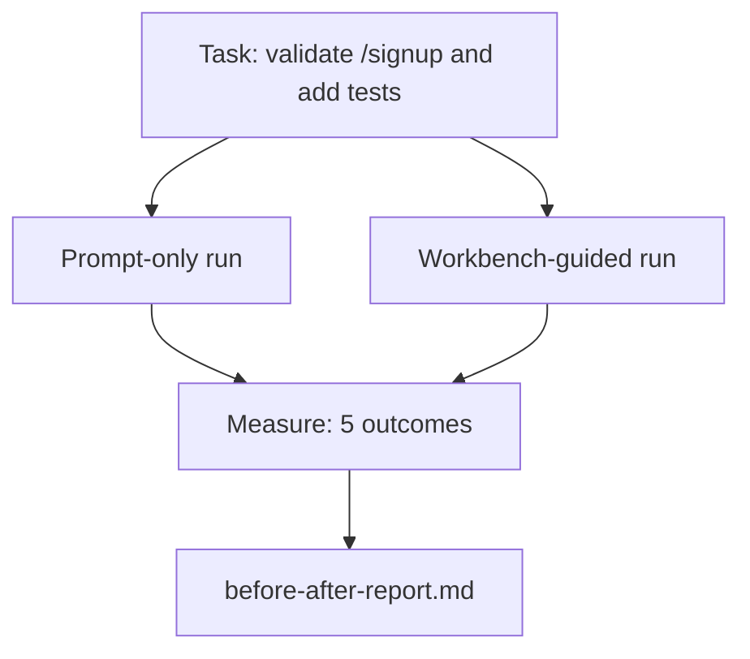

# Warsztat na prawdziwym repozytorium

> Jedenaście lekcji powierzchni jest nic niewartych, jeśli nie przetrwają kontaktu z prawdziwą bazą kodu. Ta lekcja uruchamia to samo zadanie dwa razy na małej przykładowej aplikacji: tylko prompt versus z warsztatem. Liczby robią robotę.

**Type:** Build
**Languages:** Python (stdlib)
**Prerequisites:** Phases 14 · 32 to 14 · 40
**Time:** ~60 minutes

## Learning Objectives

- Połączyć siedem powierzchni warsztatu na małej aplikacji.
- Uruchomić to samo zadanie dwa razy (tylko prompt i z warsztatem) i zmierzyć pięć wyników.
- Przeczytać raport przed/po i zdecydować, które powierzchnie dały największą dźwignię.
- Obronić warsztat przed zarzutem "ale mój model jest wystarczająco dobry."

## The Problem

Demonstracja na prostym zadaniu nie przekonuje nikogo. Argument za warsztatem jest budowany, gdy realistyczne zadanie na realistycznym repozytorium ląduje w produkcji z mniejszą liczbą awarii, mniejszą liczbą wycofań i pakietem, którego następna sesja może użyć.

Ta lekcja dostarcza to realistyczne repozytorium i uruchamia to samo zadanie przez oba pipeline'y. Wynikiem jest raport przed/po, który możesz podać sceptykowi.

## The Concept



### Przykładowa aplikacja

Minimalny handler w stylu FastAPI w `sample_app/`:

- `app.py` z `/signup` (brak walidacji na razie).
- `test_app.py` z jednym testem ścieżki szczęśliwej.
- `README.md` i `scripts/release.sh` jako przynęta na strefę zakazaną.

### Zadanie

> Dodaj walidację wejścia do `/signup`: odrzucaj hasła krótsze niż 8 znaków, zwracaj 422 z typową otoczką błędu. Dodaj test, który dowodzi nowego zachowania.

### Dwa pipeline'y

Tylko prompt:

1. Przeczytaj README.
2. Przeczytaj `app.py`.
3. Edytuj pliki.
4. Ogłoś gotowość.

Z warsztatem:

1. Uruchom skrypt inicjalizacyjny (Lesson 35).
2. Przeczytaj kontrakt zakresu (Lesson 36).
3. Przeczytaj stan (Lesson 34).
4. Edytuj tylko dozwolone pliki.
5. Uruchom polecenie akceptacyjne przez uruchamiacz informacji zwrotnej (Lesson 37).
6. Uruchom bramę weryfikacyjną (Lesson 38).
7. Uruchom recenzenta (Lesson 39).
8. Wygeneruj przekazanie (Lesson 40).

### Pięć mierzonych wyników

| Wynik | Dlaczego to ważne |
|---------|----------------|
| `tests_actually_run` | Większość twierdzeń "testy przeszły" jest niemożliwa do zweryfikowania |
| `acceptance_met` | Test, który dowodzi celu, musi być testem, który został uruchomiony |
| `files_outside_scope` | Rozszerzanie zakresu jest dominującą cichą awarią |
| `handoff_quality` | Następna sesja płaci za to lub korzysta z tego |
| `reviewer_total` | Jakościowa ocena na szczycie bramy |

## Build It

`code/main.py` orkiestruje dwa pipeline'y na tym samym przykładzie aplikacji testowej. Oba pipeline'y są skryptowane (bez LLM w pętli), aby pomiar był powtarzalny. Skrypt zapisuje porównanie do `before-after-report.md` i `comparison.json`.

Uruchom:

```
python3 code/main.py
```

Wynik: konsolowa tabela wyników na pipeline, raport markdown zapisany obok skryptu i JSON dla tych, którzy chcą go wykreślić.

## Production patterns in the wild

Pytanie sceptyka brzmi "o ile właściwie pomaga warsztat?" Liczby z 2026 mówią znacznie więcej niż wyjaśnienie.

**Terminal Bench Top-30 do Top-5 na tym samym modelu.** *Anatomy of an Agent Harness* LangChain (kwiecień 2026): agent kodowania skoczył z poza pierwszej 30 na piąte miejsce w Terminal Bench 2.0 zmieniając tylko uprząż. Ten sam model. Inne powierzchnie. Delta o dwadzieścia pięć pozycji.

**Vercel 80% do 100% przez usunięcie narzędzi.** Vercel poinformował, że usunięcie 80% narzędzi agenta podniosło wskaźnik sukcesu z 80% do 100%. Mniejsza powierzchnia narzędzi, ostrzejszy zakres, mniej sposobów na porażkę. Przestrzeń negatywna wygrywa.

**Harvey 2x dokładność przez samą uprząż.** Agenci prawni ponad podwoili swoją dokładność przez optymalizację uprzęży, bez zmiany modelu.

**88% projektów agentów AI w przedsiębiorstwach nie trafia do produkcji.** Artykuł *Harness Engineering for Language Agents* na preprints.org (marzec 2026) śledzi awarie do środowiska wykonawczego, a nie rozumowania: nieaktualny stan, kruche ponowienia, przerośnięty kontekst, słabe odzyskiwanie po pośrednich błędach.

**Zapadanie się długiego kontekstu.** Wyjściowy wskaźnik sukcesu WebAgent 40-50% spada poniżej 10% w warunkach długiego kontekstu, głównie z powodu nieskończonych pętli i utraty celu. Pętla Ralph i pakiet przekazania istnieją, aby to absorbować.

**Fałszywe negatywy wciąż istnieją.** Jednoetapowe zadania faktyczne, jednoliniowe linty, uruchomienia formatowania, cokolwiek model zapamiętał dosłownie — te działają szybciej z samym promptem. Benchmark powinien je uczciwie wymienić, aby warsztat nie był przedstawiany jako przesada.

Wniosek nie brzmi "uprząż wygrywa na zawsze." Modele z czasem przyswajają sztuczki uprzęży. Wniosek jest taki, że dziś obciążenie inżynieryjne leży w siedmiu powierzchniach, a liczby to potwierdzają.

## Use It

Ta lekcja jest teczką przypadku, którą cytujesz, gdy:

- Ktoś pyta, dlaczego każdy PR niesie `agent-rules.md` i kontrakt zakresu.
- Zespół chce porzucić bramę weryfikacyjną "tylko na ten sprint."
- Nowy produkt agenta startuje i potrzebujesz przenośnego benchmarku, czy faktycznie oszczędza czas.

Liczby podróżują dalej niż wyjaśnienie.

## Ship It

`outputs/skill-workbench-benchmark.md` to przenośna uprząż ewaluacyjna, która uruchamia dowolny produkt agenta przez oba pipeline'y na przykładowej aplikacji projektu i raportuje pięć wyników.

## Exercises

1. Dodaj szósty wynik: czas do pierwszej znaczącej edycji. Jak go czysto zmierzyć?
2. Uruchom porównanie na prawdziwym zadaniu drugiego dnia w twojej bazie kodu. Gdzie liczby warsztatu się ślizgają?
3. Dodaj przebieg "fałszywy negatyw": zadania, w których sam prompt byłby szybszy, a narzut warsztatu jest realnym kosztem. Uzasadnij utrzymanie warsztatu mimo to.
4. Zastąp skryptowanego "agenta" prawdziwym wywołaniem LLM. Które wyniki stają się bardziej zaszumione?
5. Stwórz jednostronicowe podsumowanie skierowane do nie-inżyniera. Co przetrwa cięcie?

## Key Terms

| Term | What people say | What it actually means |
|------|----------------|------------------------|
| Przykładowa aplikacja | "Zabawkowe repo" | Mała, ale wystarczająco realistyczna, aby ćwiczyć wszystkie siedem powierzchni |
| Pipeline | "Przepływ pracy" | Uporządkowana sekwencja odczytów/zapisów powierzchni, którą agent podąża |
| Raport przed/po | "Dowody" | Artefakt, który wręczasz sceptykowi |
| Fałszywy negatyw | "Przesada warsztatu" | Zadania, w których sam prompt jest szybszy; warto uczciwie wymienić |
| Benchmark warsztatu | "Wynik niezawodności" | Przenośna uprząż, która uruchamia porównanie na twojej bazie kodu |

## Further Reading

- [LangChain, The Anatomy of an Agent Harness](https://blog.langchain.com/the-anatomy-of-an-agent-harness/) — Terminal Bench Top-30 to Top-5 receipt
- [MongoDB, The Agent Harness: Why the LLM Is the Smallest Part of Your Agent System](https://www.mongodb.com/company/blog/technical/agent-harness-why-llm-is-smallest-part-of-your-agent-system) — Vercel + Harvey numbers
- [preprints.org, Harness Engineering for Language Agents](https://www.preprints.org/manuscript/202603.1756) — 88% enterprise failure rate, runtime root causes
- [HN: Improving 15 LLMs at Coding in One Afternoon. Only the Harness Changed](https://news.ycombinator.com/item?id=46988596) — replicated across 15 models
- [Cloudflare, Orchestrating AI Code Review at Scale](https://blog.cloudflare.com/ai-code-review/) — 131k review runs / 30 days in production
- [Anthropic, Building Effective Agents](https://www.anthropic.com/research/building-effective-agents)
- Phases 14 · 32 to 14 · 40 — the surfaces this lesson exercises end-to-end
- Phase 14 · 19 — SWE-bench, GAIA, AgentBench as the macro benchmarks this lesson complements
- Phase 14 · 30 — eval-driven agent development the same harness plugs into
