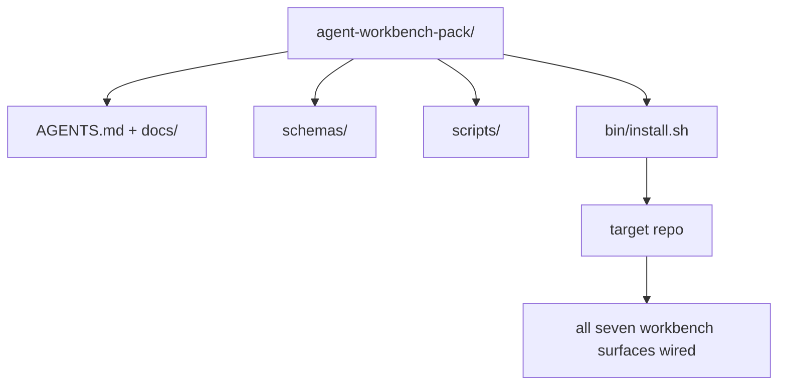

# Capstone: Dostarcz wielokrotnego użytku pakiet warsztatu agenta

> Mini-ścieżka kończy się pakietem, który wrzucasz do dowolnego repozytorium. Jedenaście lekcji powierzchni skompresowanych w katalog, który możesz `cp -r` i mieć agenta pracującego niezawodnie następnego ranka. Capstone to artefakt, na którym opiera się ten program nauczania.

**Type:** Build
**Languages:** Python (stdlib)
**Prerequisites:** Phases 14 · 31 to 14 · 41
**Time:** ~75 minutes

## Learning Objectives

- Zapakować siedem powierzchni warsztatu w jeden katalog typu drop-in.
- Przypiąć schematy, skrypty i szablony, aby nowe repozytorium dostało znaną-dobrą linię bazową.
- Dodać pojedynczy skrypt instalatora, który idempotentnie rozkłada pakiet.
- Zdecydować, co zostaje w pakiecie, a co pozostaje poza, broniąc cięcia dla każdego.

## The Problem

Warsztat, który żyje w Google Doc, historii czatu i trzech pół-zapamiętanych skryptach, to warsztat, który jest odbudowywany co kwartał. Lekarstwem jest wersjonowany pakiet: repozytorium lub katalog z powierzchniami, schematami, skryptami i instalatorem jednowierszowym.

Skończysz tę lekcję z `outputs/agent-workbench-pack/` dostarczonym na dysku i `bin/install.sh`, który wrzuca go do dowolnego docelowego repozytorium.

## The Concept



### Struktura pakietu

```
outputs/agent-workbench-pack/
├── AGENTS.md
├── docs/
│   ├── agent-rules.md
│   ├── reliability-policy.md
│   ├── handoff-protocol.md
│   └── reviewer-rubric.md
├── schemas/
│   ├── agent_state.schema.json
│   ├── task_board.schema.json
│   └── scope_contract.schema.json
├── scripts/
│   ├── init_agent.py
│   ├── run_with_feedback.py
│   ├── verify_agent.py
│   └── generate_handoff.py
├── bin/
│   └── install.sh
└── README.md
```

### Co zostaje w środku, co zostaje na zewnątrz

W środku:

- Schematy powierzchni. Są kontraktem.
- Cztery powyższe skrypty. Są środowiskiem wykonawczym.
- Cztery dokumenty. Są regułami i rubryką.

Na zewnątrz:

- Zadania specyficzne dla projektu. Zadania należą do tablicy docelowego repozytorium, nie do pakietu.
- Wywołania SDK dostawcy. Pakiet jest niezależny od frameworka.
- Proza wprowadzająca. Pakiet żyje obok istniejącego procesu wdrożeniowego zespołu, a nie wewnątrz niego.

### Instalator

Krótki `bin/install.sh` (lub `bin/install.py`):

1. Odmawia instalacji na istniejącym pakiecie bez `--force`.
2. Kopiuje pakiet do docelowego repozytorium.
3. Podłącza CI, jeśli istnieje `.github/workflows/`.
4. Wypisuje następne kroki: wypełnij tablicę, ustaw polecenia akceptacyjne, uruchom skrypt inicjalizacyjny.

### Wersjonowanie

Pakiet niesie plik `VERSION`. Zmiany schematów i zmiany skryptów wymagające migracji podbijają major. Zmiany tylko w dokumentacji podbijają patch. `agent_state.json` docelowego repozytorium rejestruje, z którą wersją pakietu został zainicjalizowany.

## Build It

`code/main.py` składa pakiet do `outputs/agent-workbench-pack/` obok lekcji, wypełniony schematami i skryptami z poprzednich lekcji w tej mini-ścieżce oraz dokumentami, które już napisałeś.

Uruchom:

```
python3 code/main.py
```

Skrypt kopiuje i przypina powierzchnie, zapisuje README, wypisuje drzewo pakietu i kończy z zerem. Ponowne uruchomienie jest idempotentne.

## Production patterns in the wild

Pakiet jest wartościowy tylko wtedy, gdy przetrwa forki, aktualizacje i nieprzyjazne źródło nadrzędne. Cztery wzorce sprawiają, że to działa.

**`VERSION` jest kontraktem, a nie marketingiem.** Majorowe podbicia wymagają migracji stanu. Minorowe podbicia wymagają ponownego uruchomienia sprawdzacza. Patchowe podbicia są tylko dokumentacją. Instalator zapisuje `.workbench-version` w docelowym repozytorium przy każdej instalacji; `lint_pack.py` odmawia wysyłki, jeśli blokada celu nie zgadza się z `VERSION` pakietu. To jak `npm`, `Cargo` i `pyproject.toml` przetrwają 10 lat zmian; nic w agentach nie zmienia zasad.

**Pojedyncze źródło do dystrybucji między narzędziami.** Nx dostarcza jedno `nx ai-setup`, które rozkłada `AGENTS.md`, `CLAUDE.md`, `.cursor/rules/`, `.github/copilot-instructions.md` i serwer MCP z pojedynczej konfiguracji. Pakiet powinien robić to samo; instalator emituje dowiązania symboliczne (`ln -s AGENTS.md CLAUDE.md`), aby pojedyncze źródło prawdy rozchodziło się do każdego agenta kodowania. Forkowanie pakietu do obsługi jednego narzędzia nad innym to tryb awarii.

**`uninstall.sh`, który odmawia na nietywialnym stanie.** Odinstalowanie pakietu nie może usunąć `agent_state.json`, `task_board.json` ani `outputs/` użytkownika. Dezinstalator usuwa schematy, skrypty, dokumenty i `AGENTS.md` (z opcją `--keep-agents-md`) i odmawia kontynuacji, jeśli pliki stanu mają jakiekolwiek niezatwierdzone zmiany. Stan należy do użytkownika; pakiet go nie posiada.

**Umiejętność jako publikowalna. Dystrybucja w stylu SkillKit.** Pakiet jest dostarczany jako umiejętność SkillKit: `skillkit install agent-workbench-pack` rozkłada go na 32 agentów AI z pojedynczego źródła. Repozytorium pakietu jest źródłem prawdy; SkillKit jest kanałem dystrybucji. Blokada dostawcy załamuje się; siedem powierzchni pozostaje takich samych.

## Use It

Trzy miejsca, w których pakiet trafia:

- **Jako katalog, który wrzucasz do repozytorium.** `cp -r outputs/agent-workbench-pack /path/to/repo`.
- **Jako publiczne repozytorium szablonu.** Forkuj i dostosuj, z `VERSION` kontrolującym dryf.
- **Jako umiejętność SkillKit.** Podłączona do twojego produktu agenta, aby pojedyncze polecenie ją rozkładało.

Pakiet jest przepisem. Każda instalacja jest porcją.

## Ship It

`outputs/skill-workbench-pack.md` generuje pakiet dostrojony do projektu: reguły wyostrzone do historii zespołu, globy zakresu dopasowane do repozytorium, wymiary rubryki rozszerzone o jeden wpis specyficzny dla domeny.

## Exercises

1. Zdecyduj, który opcjonalny piąty dokument zasługuje na promocję do kanonicznego pakietu. Uzasadnij cięcie.
2. Przepisz instalator jako Python z flagą `--dry-run`. Porównaj ergonomię z bashem.
3. Dodaj `bin/uninstall.sh`, który bezpiecznie usuwa pakiet i odmawia, jeśli pliki stanu mają nietywialną historię. Co liczy się jako nietywialna?
4. Dodaj `lint_pack.py`, który kończy się niepowodzeniem, gdy pakiet dryfuje od `VERSION`. Podłącz go do CI dla własnego repozytorium pakietu.
5. Stwórz podręcznik migracji z ręcznie utworzonego warsztatu do tego pakietu. Jaka jest kolejność operacji, która minimalizuje przestoje?

## Key Terms

| Term | What people say | What it actually means |
|------|----------------|------------------------|
| Pakiet warsztatu | "Zestaw startowy" | Wersjonowany katalog niosący wszystkie siedem powierzchni |
| Instalator | "Skrypt konfiguracyjny" | `bin/install.sh`, który idempotentnie rozkłada pakiet |
| Wersja pakietu | "VERSION" | Major dla zmian schematu/skryptu, patch dla dokumentacji |
| Pakiet drop-in | "cp -r i gotowe" | Pakiet działa bez dostosowywania per-repozytorium pierwszego dnia |
| Forkowalny szablon | "Szablon GitHub" | Publiczne repozytorium, które "Use this template" GitHub może sklonować |

## Further Reading

- Phases 14 · 31 to 14 · 41 — every surface this pack bundles
- [SkillKit](https://github.com/rohitg00/skillkit) — install this skill across 32 AI agents
- [Nx Blog, Teach Your AI Agent How to Work in a Monorepo](https://nx.dev/blog/nx-ai-agent-skills) — single-source generator across six tools
- [agents.md — the open spec](https://agents.md/) — what your pack's router must implement
- [HKUDS/OpenHarness](https://github.com/HKUDS/OpenHarness) — reference implementation of a pack-equivalent
- [andrewgarst/agentic_harness](https://github.com/andrewgarst/agentic_harness) — Redis-backed reference with eval suite
- [Augment Code, A good AGENTS.md is a model upgrade](https://www.augmentcode.com/blog/how-to-write-good-agents-dot-md-files) — pack docs quality bar
- [Anthropic, Effective harnesses for long-running agents](https://www.anthropic.com/engineering/effective-harnesses-for-long-running-agents)
- [Anthropic, Harness design for long-running application development](https://www.anthropic.com/engineering/harness-design-long-running-apps)
- Phase 14 · 30 — eval-driven agent development that consumes the pack's verification gate
- Phase 14 · 41 — the before/after benchmark this pack improves on
