# Protokoły Komunikacyjne

> Agenci, którzy nie mówią tym samym językiem, nie są zespołem. Są obcymi krzyczącymi w próżnię.

**Type:** Build
**Languages:** TypeScript
**Prerequisites:** Phase 14 (Agent Engineering), Lesson 16.01 (Why Multi-Agent)
**Time:** ~120 minutes

## Learning Objectives

- Zaimplementuj odkrywanie i wywoływanie narzędzi MCP, aby agenci mogli używać narzędzi udostępnianych przez zewnętrzne serwery
- Zbuduj kartę agenta A2A i endpoint zadań, który pozwala jednemu agentowi delegować pracę do innego przez HTTP
- Porównaj MCP (dostęp do narzędzi), A2A (agent-do-agenta), ACP (audyt korporacyjny) i ANP (zdecentralizowane zaufanie) i wyjaśnij, który protokół rozwiązuje który problem
- Połącz wiele protokołów w jeden system, w którym agenci odkrywają narzędzia przez MCP i delegują zadania przez A2A

## The Problem

Podzieliłeś swój system na wielu agentów. Badacza, programistę, recenzenta. Są świetni w swoich indywidualnych zadaniach. Ale teraz potrzebujesz, żeby faktycznie ze sobą rozmawiali.

Twoja pierwsza próba jest oczywista: przekazuj napisy. Badacz zwraca blok tekstu, programista parsuje go jak umie. Działa, dopóki programista nie zinterpretuje błędnie podsumowania badań, albo dwóch agentów nie zablokuje się czekając na siebie, albo potrzebujesz agentów zbudowanych przez różne zespoły do współpracy. Nagle „po prostu przekazuj napisy" się załamuje.

To jest problem protokołów komunikacyjnych. Bez wspólnego kontraktu na wymianę informacji między agentami, systemy wieloagentowe są kruche, nieaudytowalne i niemożliwe do skalowania poza garstkę agentów, których sam napisałeś.

Ekologia AI odpowiedziała czterema protokołami, każdy rozwiązujący inny wycinek problemu:

- **MCP** dla dostępu do narzędzi
- **A2A** dla współpracy agent-do-agenta
- **ACP** dla audytowalności korporacyjnej
- **ANP** dla zdecentralizowanej tożsamości i zaufania

Ta lekcja idzie w głąb. Przeczytasz prawdziwe formaty przewodowe z każdej specyfikacji, zbudujesz działające implementacje i połączysz wszystkie cztery w jeden system.

## The Concept

### Krajobraz Protokołów

Myśl o tych czterech protokołach jak o warstwach, z których każda odpowiada na inne pytanie:

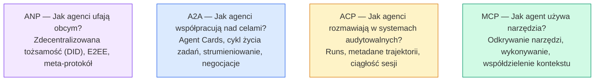

Nie są konkurentami. Rozwiązują różne problemy na różnych poziomach.

### MCP (Przypomnienie)

MCP jest szczegółowo omówiony w Fazie 13. Szybkie przypomnienie: MCP standaryzuje sposób, w jaki LLM łączy się z zewnętrznymi narzędziami i źródłami danych. To protokół **klient-serwer**, w którym agent (klient) odkrywa i wywołuje narzędzia udostępniane przez serwer.

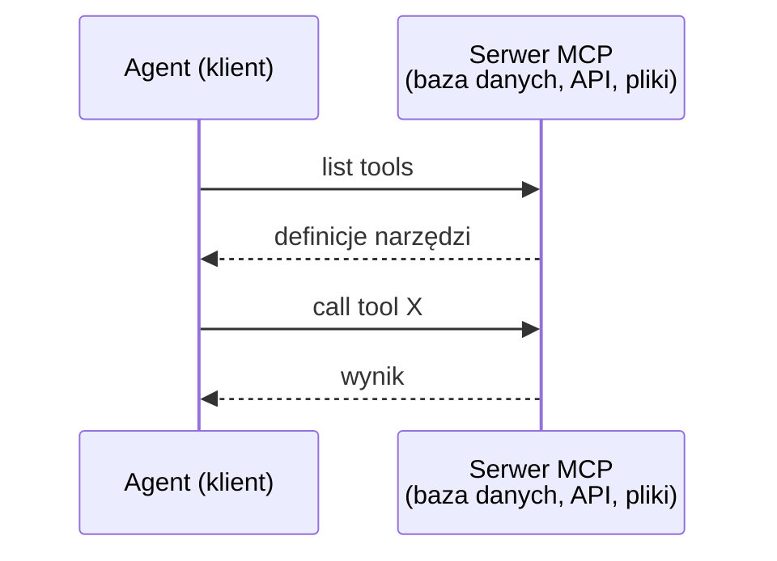

MCP to komunikacja **agent-do-narzędzia**. Nie pomaga agentom rozmawiać ze sobą.

### A2A (Agent2Agent Protocol)

**Stworzony przez:** Google (obecnie pod Linux Foundation jako `lf.a2a.v1`)
**Wersja specyfikacji:** 1.0.0
**Problem:** Jak autonomiczni agenci współpracują, negocjują i delegują zadania między sobą?

A2A to protokół dla **współpracy równorzędnej agentów**. Podczas gdy MCP łączy agenta z narzędziami, A2A łączy agenta z innymi agentami. Każdy agent publikuje **Agent Card** pod znanym adresem URL, a inni agenci odkrywają, negocjują z nim i delegują do niego zadania.

#### Jak Działa A2A

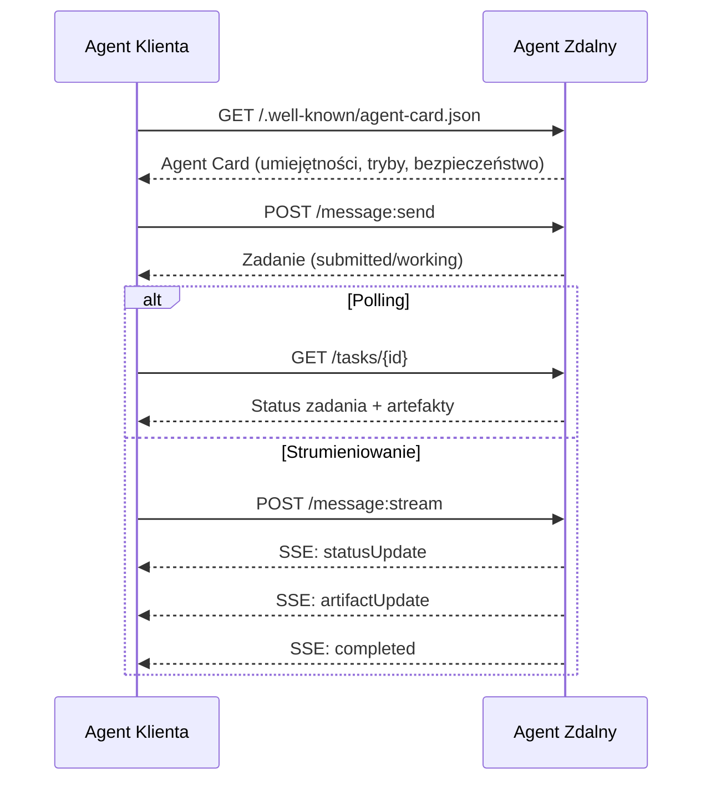

#### Prawdziwa Agent Card

Oto jak rzeczywiście wygląda Agent Card A2A. Serwowana pod `GET /.well-known/agent-card.json`:

```json
{
  "name": "Research Agent",
  "description": "Searches documentation and summarizes findings",
  "version": "1.0.0",
  "supportedInterfaces": [
    {
      "url": "https://research-agent.example.com/a2a/v1",
      "protocolBinding": "JSONRPC",
      "protocolVersion": "1.0"
    },
    {
      "url": "https://research-agent.example.com/a2a/rest",
      "protocolBinding": "HTTP+JSON",
      "protocolVersion": "1.0"
    }
  ],
  "provider": {
    "organization": "Your Company",
    "url": "https://example.com"
  },
  "capabilities": {
    "streaming": true,
    "pushNotifications": false
  },
  "defaultInputModes": ["text/plain", "application/json"],
  "defaultOutputModes": ["text/plain", "application/json"],
  "skills": [
    {
      "id": "web-research",
      "name": "Web Research",
      "description": "Searches the web and synthesizes findings",
      "tags": ["research", "search", "summarization"],
      "examples": ["Research the latest changes in React 19"]
    },
    {
      "id": "doc-analysis",
      "name": "Documentation Analysis",
      "description": "Reads and analyzes technical documentation",
      "tags": ["docs", "analysis"],
      "inputModes": ["text/plain", "application/pdf"],
      "outputModes": ["application/json"]
    }
  ],
  "securitySchemes": {
    "bearer": {
      "httpAuthSecurityScheme": {
        "scheme": "Bearer",
        "bearerFormat": "JWT"
      }
    }
  },
  "security": [{ "bearer": [] }]
}
```

Kluczowe rzeczy do zauważenia:
- **Skills** to to, co agent potrafi zrobić. Każda ma ID, tagi i obsługiwane typy MIME wejścia/wyjścia. W ten sposób agent klienta decyduje, czy ten zdalny agent może obsłużyć jego żądanie.
- **supportedInterfaces** wymienia wiele wiązań protokołów. Pojedynczy agent może jednocześnie mówić JSON-RPC, REST i gRPC.
- **Security** jest wbudowane w kartę. Klient wie, jakie uwierzytelnienie jest potrzebne, zanim złoży pierwsze żądanie.

#### Cykl Życia Zadań

Zadania są podstawową jednostką pracy w A2A. Przechodzą przez zdefiniowane stany:

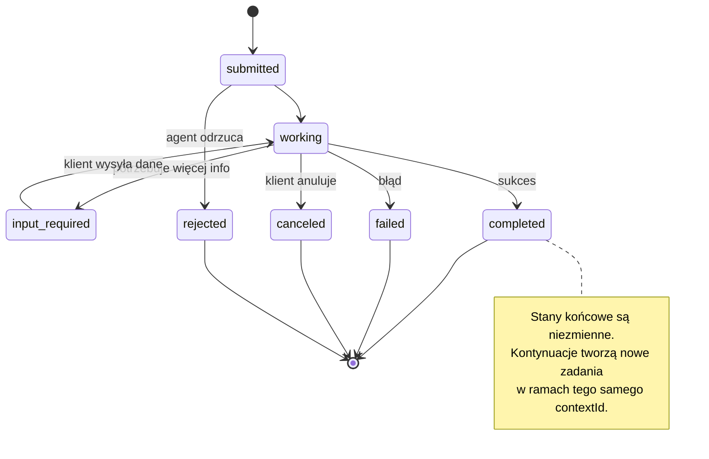

Wszystkie 8 stanów (specyfikacja definiuje również `UNSPECIFIED` jako wartownik, pominięty tutaj):

| Stan | Końcowy? | Znaczenie |
|---|---|---|
| `TASK_STATE_SUBMITTED` | Nie | Potwierdzone, jeszcze nie przetwarzane |
| `TASK_STATE_WORKING` | Nie | Aktywnie przetwarzane |
| `TASK_STATE_INPUT_REQUIRED` | Nie | Agent potrzebuje więcej informacji od klienta |
| `TASK_STATE_AUTH_REQUIRED` | Nie | Wymagane uwierzytelnienie |
| `TASK_STATE_COMPLETED` | Tak | Zakończone pomyślnie |
| `TASK_STATE_FAILED` | Tak | Zakończone błędem |
| `TASK_STATE_CANCELED` | Tak | Anulowane przed zakończeniem |
| `TASK_STATE_REJECTED` | Tak | Agent odrzucił zadanie |

Gdy zadanie osiągnie stan końcowy, jest niezmienne. Żadnych dalszych wiadomości. Kontynuacje tworzą nowe zadanie w ramach tego samego `contextId`.

#### Format Przewodowy

A2A używa JSON-RPC 2.0. Oto jak wygląda prawdziwa wymiana wiadomości:

**Klient wysyła zadanie:**
```json
{
  "jsonrpc": "2.0",
  "id": 1,
  "method": "SendMessage",
  "params": {
    "message": {
      "messageId": "msg-001",
      "role": "ROLE_USER",
      "parts": [{ "text": "Research React 19 compiler features" }]
    },
    "configuration": {
      "acceptedOutputModes": ["text/plain", "application/json"],
      "historyLength": 10
    }
  }
}
```

**Agent odpowiada zadaniem:**
```json
{
  "jsonrpc": "2.0",
  "id": 1,
  "result": {
    "task": {
      "id": "task-abc-123",
      "contextId": "ctx-xyz-789",
      "status": {
        "state": "TASK_STATE_COMPLETED",
        "timestamp": "2026-03-27T10:30:00Z"
      },
      "artifacts": [
        {
          "artifactId": "art-001",
          "name": "research-results",
          "parts": [{
            "data": {
              "findings": [
                "React 19 compiler auto-memoizes components",
                "No more manual useMemo/useCallback needed",
                "Compiler runs at build time, not runtime"
              ]
            },
            "mediaType": "application/json"
          }]
        }
      ]
    }
  }
}
```

**Strumieniowanie przez SSE:**
```text
POST /message:stream HTTP/1.1
Content-Type: application/json
A2A-Version: 1.0

data: {"task":{"id":"task-123","status":{"state":"TASK_STATE_WORKING"}}}

data: {"statusUpdate":{"taskId":"task-123","status":{"state":"TASK_STATE_WORKING","message":{"role":"ROLE_AGENT","parts":[{"text":"Searching documentation..."}]}}}}

data: {"artifactUpdate":{"taskId":"task-123","artifact":{"artifactId":"art-1","parts":[{"text":"partial findings..."}]},"append":true,"lastChunk":false}}

data: {"statusUpdate":{"taskId":"task-123","status":{"state":"TASK_STATE_COMPLETED"}}}
```

### ACP (Agent Communication Protocol)

**Stworzony przez:** IBM / BeeAI
**Wersja specyfikacji:** 0.2.0 (OpenAPI 3.1.1)
**Status:** Łączy się z A2A pod Linux Foundation
**Problem:** Jak agenci komunikują się z pełną audytowalnością, ciągłością sesji i śledzeniem trajektorii?

ACP to **protokół korporacyjny**. W przeciwieństwie do tego, co mówią liczne podsumowania, ACP **nie** używa JSON-LD. To prosty interfejs REST/JSON API zdefiniowany przez OpenAPI. Tym, co czyni go wyjątkowym, jest **TrajectoryMetadata**: każda odpowiedź agenta może nieść szczegółowy dziennik kroków rozumowania i wywołań narzędzi, które ją wyprodukowały.

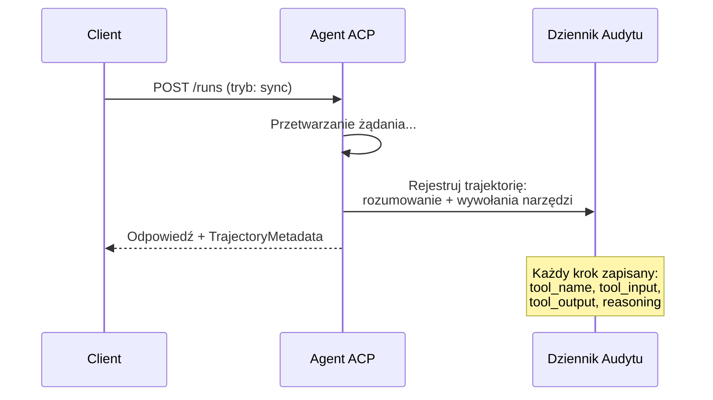

#### Odkrywanie Agentów w ACP

ACP definiuje cztery metody odkrywania:

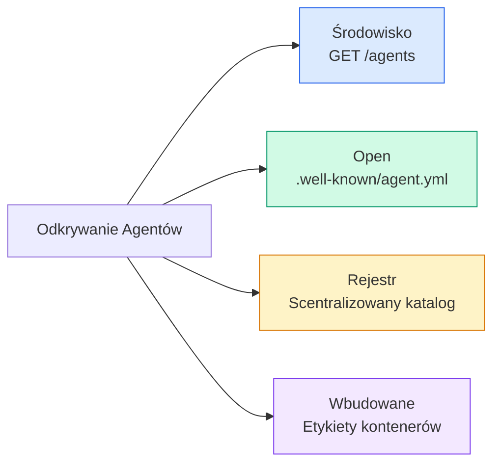

**AgentManifest** jest prostszy niż Agent Card A2A:

```json
{
  "name": "summarizer",
  "description": "Summarizes documents with source citations",
  "input_content_types": ["text/plain", "application/pdf"],
  "output_content_types": ["text/plain", "application/json"],
  "metadata": {
    "tags": ["summarization", "RAG"],
    "framework": "BeeAI",
    "capabilities": [
      {
        "name": "Document Summarization",
        "description": "Condenses long documents into key points"
      }
    ],
    "recommended_models": ["llama3.3:70b-instruct-fp16"],
    "license": "Apache-2.0",
    "programming_language": "Python"
  }
}
```

#### Cykl Życia Uruchomienia

ACP używa „Runs" zamiast „Tasks". Uruchomienie to wykonanie agenta z trzema trybami:

| Tryb | Zachowanie |
|---|---|
| `sync` | Blokujący. Odpowiedź zawiera kompletny wynik. |
| `async` | Zwraca 202 natychmiast. Polling `GET /runs/{id}` po status. |
| `stream` | SSE strumień. Zdarzenia są wysyłane w miarę pracy agenta. |

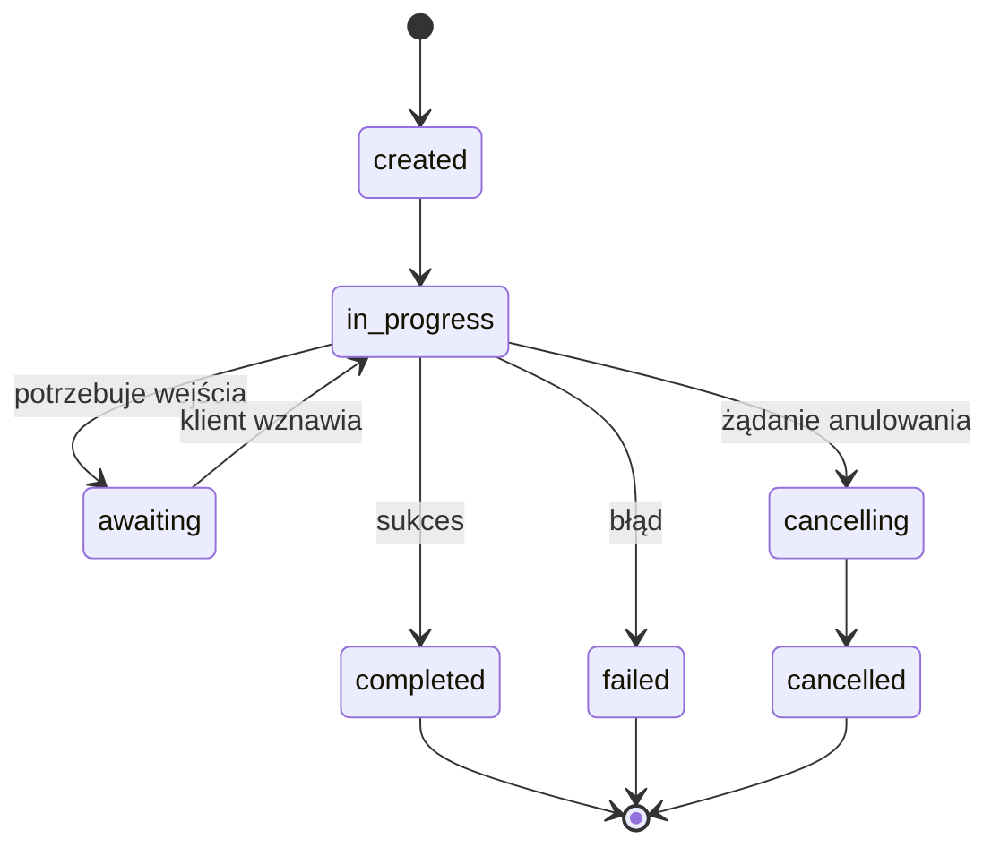

#### TrajectoryMetadata (Ślad Audytu)

To jest kluczowy wyróżnik ACP. Każda część wiadomości może zawierać metadane pokazujące dokładnie, co agent zrobił:

```json
{
  "role": "agent/researcher",
  "parts": [
    {
      "content_type": "text/plain",
      "content": "The weather in San Francisco is 72F and sunny.",
      "metadata": {
        "kind": "trajectory",
        "message": "I need to check the weather for this location",
        "tool_name": "weather_api",
        "tool_input": { "location": "San Francisco, CA" },
        "tool_output": { "temperature": 72, "condition": "sunny" }
      }
    }
  ]
}
```

Dla regulowanych branż to złoto. Każda odpowiedź ma udowodnialny łańcuch rozumowania: które narzędzia zostały wywołane, jakie dane wejściowe były użyte, jakie wyniki zostały odebrane. Żadnej czarnej skrzynki.

ACP obsługuje również **CitationMetadata** do przypisywania źródeł:

```json
{
  "kind": "citation",
  "start_index": 0,
  "end_index": 47,
  "url": "https://weather.gov/sf",
  "title": "NWS San Francisco Forecast"
}
```

### ANP (Agent Network Protocol)

**Stworzony przez:** Społeczność open-source (założona przez GaoWei Chang)
**Repo:** [github.com/agent-network-protocol/AgentNetworkProtocol](https://github.com/agent-network-protocol/AgentNetworkProtocol)
**Problem:** Jak agenci z różnych organizacji ufają sobie bez centralnego autorytetu?

ANP to **protokół zdecentralizowanej tożsamości**. Buduje zaufanie przy użyciu Zdecentralizowanych Identyfikatorów W3C (DID) i szyfrowania end-to-end. W przeciwieństwie do A2A, gdzie odkrywasz agentów poprzez znane endpointy, ANP pozwala agentom kryptograficznie udowodnić swoją tożsamość.

ANP ma trzy warstwy:

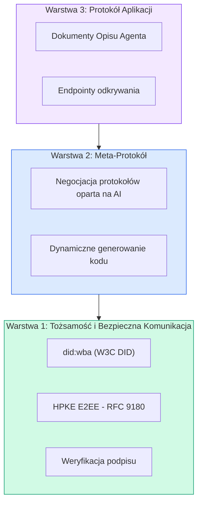

#### Dokumenty DID (Prawdziwa Struktura)

ANP używa własnej metody DID o nazwie `did:wba` (Web-Based Agent). DID `did:wba:example.com:user:alice` rozwiązuje się do `https://example.com/user/alice/did.json`:

```json
{
  "@context": [
    "https://www.w3.org/ns/did/v1",
    "https://w3id.org/security/suites/jws-2020/v1",
    "https://w3id.org/security/suites/secp256k1-2019/v1"
  ],
  "id": "did:wba:example.com:user:alice",
  "verificationMethod": [
    {
      "id": "did:wba:example.com:user:alice#key-1",
      "type": "EcdsaSecp256k1VerificationKey2019",
      "controller": "did:wba:example.com:user:alice",
      "publicKeyJwk": {
        "crv": "secp256k1",
        "x": "NtngWpJUr-rlNNbs0u-Aa8e16OwSJu6UiFf0Rdo1oJ4",
        "y": "qN1jKupJlFsPFc1UkWinqljv4YE0mq_Ickwnjgasvmo",
        "kty": "EC"
      }
    },
    {
      "id": "did:wba:example.com:user:alice#key-x25519-1",
      "type": "X25519KeyAgreementKey2019",
      "controller": "did:wba:example.com:user:alice",
      "publicKeyMultibase": "z9hFgmPVfmBZwRvFEyniQDBkz9LmV7gDEqytWyGZLmDXE"
    }
  ],
  "authentication": [
    "did:wba:example.com:user:alice#key-1"
  ],
  "keyAgreement": [
    "did:wba:example.com:user:alice#key-x25519-1"
  ],
  "humanAuthorization": [
    "did:wba:example.com:user:alice#key-1"
  ],
  "service": [
    {
      "id": "did:wba:example.com:user:alice#agent-description",
      "type": "AgentDescription",
      "serviceEndpoint": "https://example.com/agents/alice/ad.json"
    }
  ]
}
```

Kluczowe rzeczy do zauważenia:
- **Separacja kluczy** jest wymuszona. Klucze podpisu (secp256k1) są oddzielone od kluczy szyfrowania (X25519).
- **`humanAuthorization`** jest unikalne dla ANP. Te klucze wymagają jawnej zgody człowieka (biometria, hasło, HSM) przed użyciem. Operacje wysokiego ryzyka, takie jak transfery środków, przechodzą przez tę ścieżkę.
- Klucze **`keyAgreement`** są używane do szyfrowania end-to-end HPKE (RFC 9180).
- Sekcja **service** łączy z dokumentem opisu agenta.

#### Jak Działa Zaufanie w ANP

ANP **nie** używa sieci zaufania ani grafu poparcia. Zaufanie jest bilateralne i weryfikowane per-interakcja:

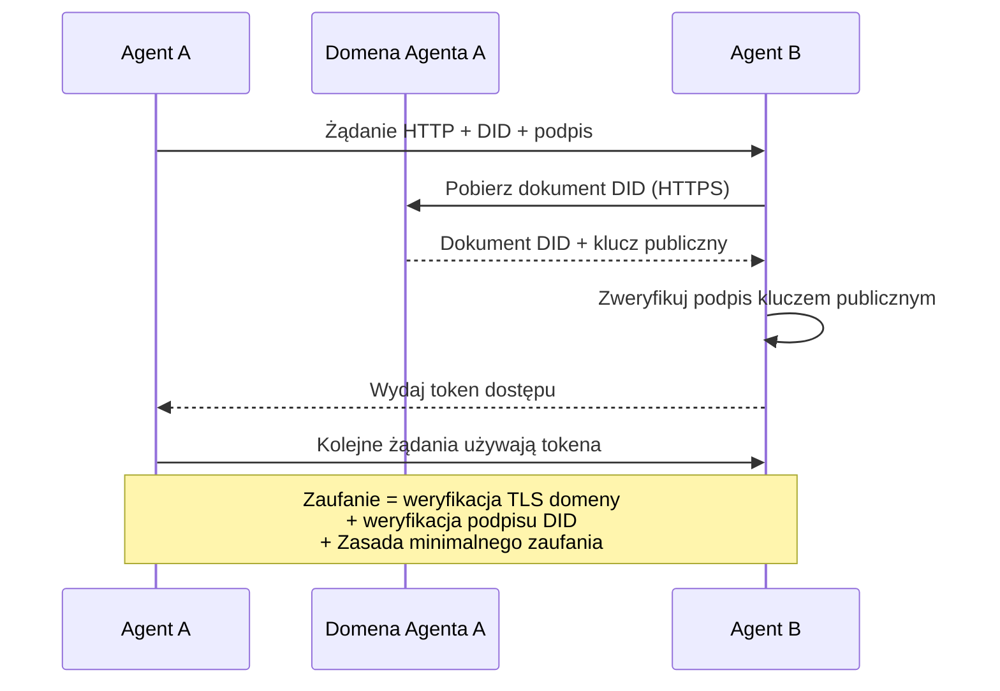

Zaufanie pochodzi z trzech źródeł:
1. **TLS na poziomie domeny** weryfikuje host dokumentu DID
2. **Kryptograficzne podpisy DID** weryfikują tożsamość agenta
3. **Zasada minimalnego zaufania** przyznaje tylko minimalne uprawnienia

Nie ma rozprzestrzeniania zaufania opartego na plotkowaniu ani scoringu PageRank. Weryfikujesz każdego agenta bezpośrednio przez jego DID.

#### Negocjacja Meta-Protokołu

To jest najbardziej nowatorska cecha ANP. Gdy dwóch agentów z różnych ekosystemów spotyka się, nie potrzebują wcześniej uzgodnionych formatów danych. Negocjują w języku naturalnym:

```json
{
  "action": "protocolNegotiation",
  "sequenceId": 0,
  "candidateProtocols": "I can communicate using:\n1. JSON-RPC with hotel booking schema\n2. REST with OpenAPI 3.1 spec\n3. Natural language over HTTP",
  "modificationSummary": "Initial proposal",
  "status": "negotiating"
}
```

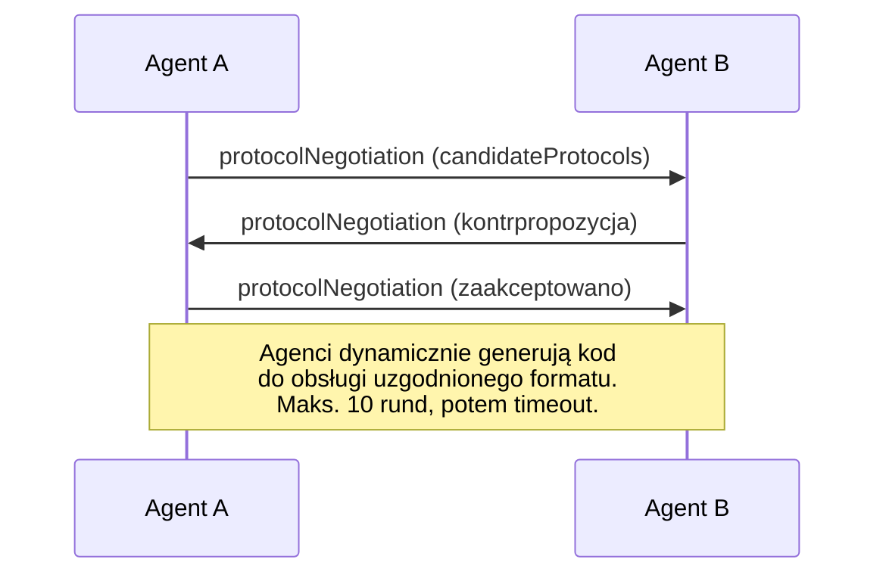

Agenci negocjują tam i z powrotem (maks. 10 rund), aż uzgodnią format, a następnie dynamicznie generują kod do jego obsługi. Status: `negotiating`, `rejected`, `accepted`, `timeout`.

Oznacza to, że dwóch agentów, którzy nigdy wcześniej się nie widzieli, może dowiedzieć się, jak komunikować, bez konieczności wcześniejszego definiowania wspólnego schematu.

### Porównanie (Poprawione)

| | MCP | A2A | ACP | ANP |
|---|---|---|---|---|
| **Stworzony przez** | Anthropic | Google / Linux Foundation | IBM / BeeAI | Społeczność |
| **Format specyfikacji** | JSON-RPC | JSON-RPC / REST / gRPC | OpenAPI 3.1 (REST) | JSON-RPC |
| **Główne zastosowanie** | Agent do Narzędzia | Agent do Agenta | Agent do Agenta | Agent do Agenta |
| **Odkrywanie** | Lista narzędzi | `/.well-known/agent-card.json` | `GET /agents`, `/.well-known/agent.yml` | `/.well-known/agent-descriptions`, endpointy usług DID |
| **Tożsamość** | Niejawna (lokalna) | Schematy zabezpieczeń (OAuth, mTLS) | Poziom serwera | W3C DID (`did:wba`) z E2EE |
| **Ślad audytu** | N/D | Podstawowy (historia zadań) | TrajectoryMetadata (wywołania narzędzi, rozumowanie) | Nieformalnie określony |
| **Maszyna stanów** | N/D | 9 stanów zadań | 7 stanów uruchomień | N/D |
| **Strumieniowanie** | N/D | SSE | SSE | Niezależne od transportu |
| **Unikalna cecha** | Schematy narzędzi | Agent Cards + Skills | Ślad audytu trajektorii | Negocjacja meta-protokołu |
| **Najlepsze do** | Narzędzia i dane | Dynamiczna współpraca | Branże regulowane | Zaufanie międzyorganizacyjne |
| **Status** | Stabilny | Stabilny (v1.0) | Łączy się z A2A | Aktywny rozwój |

### Jak Działają Razem

Te protokoły nie wykluczają się wzajemnie. Realistyczny system korporacyjny używa wielu:

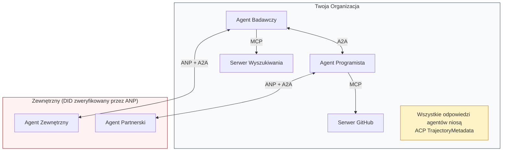

- **MCP** łączy każdego agenta z jego narzędziami
- **A2A** obsługuje współpracę między agentami (wewnętrznymi i zewnętrznymi)
- **ACP** opakowuje odpowiedzi w metadane trajektorii dla audytowalności
- **ANP** zapewnia weryfikację tożsamości dla agentów, których nie kontrolujesz

## Build It

### Krok 1: Podstawowe Typy Wiadomości

Każdy system wieloagentowy zaczyna się od formatu wiadomości. Definiujemy typy, które mapują na to, czego używają prawdziwe protokoły:

```typescript
import crypto from "node:crypto";

type MessageRole = "user" | "agent";

type MessagePart =
  | { kind: "text"; text: string }
  | { kind: "data"; data: unknown; mediaType: string }
  | { kind: "file"; name: string; url: string; mediaType: string };

type TrajectoryEntry = {
  reasoning: string;
  toolName?: string;
  toolInput?: unknown;
  toolOutput?: unknown;
  timestamp: number;
};

type AgentMessage = {
  id: string;
  role: MessageRole;
  parts: MessagePart[];
  trajectory?: TrajectoryEntry[];
  replyTo?: string;
  timestamp: number;
};

function createMessage(
  role: MessageRole,
  parts: MessagePart[],
  replyTo?: string
): AgentMessage {
  return {
    id: crypto.randomUUID(),
    role,
    parts,
    replyTo,
    timestamp: Date.now(),
  };
}

function textMessage(role: MessageRole, text: string): AgentMessage {
  return createMessage(role, [{ kind: "text", text }]);
}
```

Zauważ: `MessagePart` jest multimodalny (tekst, dane strukturalne, pliki) tak jak w prawdziwych specyfikacjach A2A i ACP. `TrajectoryEntry` przechwytuje łańcuch rozumowania, odpowiadając ACP TrajectoryMetadata.

### Krok 2: Agent Card A2A i Rejestr

Zbuduj odkrywanie agentów zgodne z prawdziwą specyfikacją A2A:

```typescript
type Skill = {
  id: string;
  name: string;
  description: string;
  tags: string[];
  inputModes: string[];
  outputModes: string[];
};

type AgentCard = {
  name: string;
  description: string;
  version: string;
  url: string;
  capabilities: {
    streaming: boolean;
    pushNotifications: boolean;
  };
  defaultInputModes: string[];
  defaultOutputModes: string[];
  skills: Skill[];
};

class AgentRegistry {
  private cards: Map<string, AgentCard> = new Map();

  register(card: AgentCard) {
    this.cards.set(card.name, card);
  }

  discoverBySkillTag(tag: string): AgentCard[] {
    return [...this.cards.values()].filter((card) =>
      card.skills.some((skill) => skill.tags.includes(tag))
    );
  }

  discoverByInputMode(mimeType: string): AgentCard[] {
    return [...this.cards.values()].filter(
      (card) =>
        card.defaultInputModes.includes(mimeType) ||
        card.skills.some((skill) => skill.inputModes.includes(mimeType))
    );
  }

  resolve(name: string): AgentCard | undefined {
    return this.cards.get(name);
  }

  listAll(): AgentCard[] {
    return [...this.cards.values()];
  }
}
```

To jest znacznie bogatsze niż prosta mapa nazwa-do-możliwości. Możesz odkrywać agentów po tagach umiejętności, po typach MIME wejścia lub po nazwie, tak jak obsługuje to prawdziwa specyfikacja A2A.

### Krok 3: Cykl Życia Zadań A2A

Zbuduj pełną maszynę stanów zadań:

```typescript
type TaskState =
  | "submitted"
  | "working"
  | "input-required"
  | "auth-required"
  | "completed"
  | "failed"
  | "canceled"
  | "rejected";

const TERMINAL_STATES: TaskState[] = [
  "completed",
  "failed",
  "canceled",
  "rejected",
];

type TaskStatus = {
  state: TaskState;
  message?: AgentMessage;
  timestamp: number;
};

type Artifact = {
  id: string;
  name: string;
  parts: MessagePart[];
};

type Task = {
  id: string;
  contextId: string;
  status: TaskStatus;
  artifacts: Artifact[];
  history: AgentMessage[];
};

type TaskEvent =
  | { kind: "statusUpdate"; taskId: string; status: TaskStatus }
  | {
      kind: "artifactUpdate";
      taskId: string;
      artifact: Artifact;
      append: boolean;
      lastChunk: boolean;
    };

type TaskHandler = (
  task: Task,
  message: AgentMessage
) => AsyncGenerator<TaskEvent>;

class TaskManager {
  private tasks: Map<string, Task> = new Map();
  private handlers: Map<string, TaskHandler> = new Map();
  private listeners: Map<string, ((event: TaskEvent) => void)[]> = new Map();

  registerHandler(agentName: string, handler: TaskHandler) {
    this.handlers.set(agentName, handler);
  }

  subscribe(taskId: string, listener: (event: TaskEvent) => void) {
    const existing = this.listeners.get(taskId) ?? [];
    existing.push(listener);
    this.listeners.set(taskId, existing);
  }

  async sendMessage(
    agentName: string,
    message: AgentMessage,
    contextId?: string
  ): Promise<Task> {
    const handler = this.handlers.get(agentName);
    if (!handler) {
      const task = this.createTask(contextId);
      task.status = {
        state: "rejected",
        timestamp: Date.now(),
        message: textMessage("agent", `Brak handlera dla ${agentName}`),
      };
      return task;
    }

    const task = this.createTask(contextId);
    task.history.push(message);
    task.status = { state: "submitted", timestamp: Date.now() };

    this.processTask(task, handler, message).catch((err) => {
      task.status = {
        state: "failed",
        timestamp: Date.now(),
        message: textMessage("agent", String(err)),
      };
    });
    return task;
  }

  getTask(taskId: string): Task | undefined {
    return this.tasks.get(taskId);
  }

  cancelTask(taskId: string): boolean {
    const task = this.tasks.get(taskId);
    if (!task || TERMINAL_STATES.includes(task.status.state)) return false;
    task.status = { state: "canceled", timestamp: Date.now() };
    this.emit(taskId, {
      kind: "statusUpdate",
      taskId,
      status: task.status,
    });
    return true;
  }

  private createTask(contextId?: string): Task {
    const task: Task = {
      id: crypto.randomUUID(),
      contextId: contextId ?? crypto.randomUUID(),
      status: { state: "submitted", timestamp: Date.now() },
      artifacts: [],
      history: [],
    };
    this.tasks.set(task.id, task);
    return task;
  }

  private async processTask(
    task: Task,
    handler: TaskHandler,
    message: AgentMessage
  ) {
    task.status = { state: "working", timestamp: Date.now() };
    this.emit(task.id, {
      kind: "statusUpdate",
      taskId: task.id,
      status: task.status,
    });

    try {
      for await (const event of handler(task, message)) {
        if (TERMINAL_STATES.includes(task.status.state)) break;

        if (event.kind === "statusUpdate") {
          task.status = event.status;
        }
        if (event.kind === "artifactUpdate") {
          const existing = task.artifacts.find(
            (a) => a.id === event.artifact.id
          );
          if (existing && event.append) {
            existing.parts.push(...event.artifact.parts);
          } else {
            task.artifacts.push(event.artifact);
          }
        }
        this.emit(task.id, event);
      }
    } catch (err) {
      task.status = {
        state: "failed",
        timestamp: Date.now(),
        message: textMessage("agent", String(err)),
      };
      this.emit(task.id, {
        kind: "statusUpdate",
        taskId: task.id,
        status: task.status,
      });
    }
  }

  private emit(taskId: string, event: TaskEvent) {
    for (const listener of this.listeners.get(taskId) ?? []) {
      listener(event);
    }
  }
}
```

To implementuje prawdziwy cykl życia zadań A2A: submitted, working, input-required, stany końcowe. Handlery to generatory asynchroniczne, które emitują zdarzenia (aktualizacje statusu i fragmenty artefaktów) zgodne z modelem strumieniowania SSE.

### Krok 4: Ślad Audytu w Stylu ACP

Opakuj komunikację śledzeniem trajektorii:

```typescript
type AuditEntry = {
  runId: string;
  agentName: string;
  input: AgentMessage[];
  output: AgentMessage[];
  trajectory: TrajectoryEntry[];
  status: "created" | "in-progress" | "completed" | "failed" | "awaiting";
  startedAt: number;
  completedAt?: number;
  sessionId?: string;
};

class AuditableRunner {
  private log: AuditEntry[] = [];
  private handlers: Map<
    string,
    (input: AgentMessage[]) => Promise<{
      output: AgentMessage[];
      trajectory: TrajectoryEntry[];
    }>
  > = new Map();

  registerAgent(
    name: string,
    handler: (input: AgentMessage[]) => Promise<{
      output: AgentMessage[];
      trajectory: TrajectoryEntry[];
    }>
  ) {
    this.handlers.set(name, handler);
  }

  async run(
    agentName: string,
    input: AgentMessage[],
    sessionId?: string
  ): Promise<AuditEntry> {
    const entry: AuditEntry = {
      runId: crypto.randomUUID(),
      agentName,
      input: structuredClone(input),
      output: [],
      trajectory: [],
      status: "created",
      startedAt: Date.now(),
      sessionId,
    };
    this.log.push(entry);

    const handler = this.handlers.get(agentName);
    if (!handler) {
      entry.status = "failed";
      return entry;
    }

    entry.status = "in-progress";
    try {
      const result = await handler(input);
      entry.output = structuredClone(result.output);
      entry.trajectory = structuredClone(result.trajectory);
      entry.status = "completed";
      entry.completedAt = Date.now();
    } catch (err) {
      entry.status = "failed";
      entry.trajectory.push({
        reasoning: `Błąd: ${String(err)}`,
        timestamp: Date.now(),
      });
      entry.completedAt = Date.now();
    }
    return entry;
  }

  getFullAuditLog(): AuditEntry[] {
    return structuredClone(this.log);
  }

  getAuditLogForAgent(agentName: string): AuditEntry[] {
    return structuredClone(
      this.log.filter((e) => e.agentName === agentName)
    );
  }

  getAuditLogForSession(sessionId: string): AuditEntry[] {
    return structuredClone(
      this.log.filter((e) => e.sessionId === sessionId)
    );
  }

  getTrajectoryForRun(runId: string): TrajectoryEntry[] {
    const entry = this.log.find((e) => e.runId === runId);
    return entry ? structuredClone(entry.trajectory) : [];
  }
}
```

Każde wykonanie agenta produkuje pełny wpis audytu: co weszło, co wyszło i kompletną trajektorię wywołań narzędzi i kroków rozumowania pomiędzy. Możesz zapytać według agenta, według sesji lub według pojedynczego uruchomienia.

### Krok 5: Weryfikacja Tożsamości w Stylu ANP

Zbuduj tożsamość i weryfikację opartą na DID:

```typescript
type VerificationMethod = {
  id: string;
  type: string;
  controller: string;
  publicKeyDer: string;
};

type DIDDocument = {
  id: string;
  verificationMethod: VerificationMethod[];
  authentication: string[];
  keyAgreement: string[];
  humanAuthorization: string[];
  service: { id: string; type: string; serviceEndpoint: string }[];
};

type AgentIdentity = {
  did: string;
  document: DIDDocument;
  privateKey: crypto.KeyObject;
  publicKey: crypto.KeyObject;
};

class IdentityRegistry {
  private documents: Map<string, DIDDocument> = new Map();

  publish(doc: DIDDocument) {
    this.documents.set(doc.id, doc);
  }

  resolve(did: string): DIDDocument | undefined {
    return this.documents.get(did);
  }

  verify(did: string, signature: string, payload: string): boolean {
    const doc = this.documents.get(did);
    if (!doc) return false;

    const authKeyIds = doc.authentication;
    const authKeys = doc.verificationMethod.filter((vm) =>
      authKeyIds.includes(vm.id)
    );

    for (const key of authKeys) {
      const publicKey = crypto.createPublicKey({
        key: Buffer.from(key.publicKeyDer, "base64"),
        format: "der",
        type: "spki",
      });
      const isValid = crypto.verify(
        null,
        Buffer.from(payload),
        publicKey,
        Buffer.from(signature, "hex")
      );
      if (isValid) return true;
    }
    return false;
  }

  requiresHumanAuth(did: string, operationKeyId: string): boolean {
    const doc = this.documents.get(did);
    if (!doc) return false;
    return doc.humanAuthorization.includes(operationKeyId);
  }
}

function createIdentity(domain: string, agentName: string): AgentIdentity {
  const did = `did:wba:${domain}:agent:${agentName}`;
  const { publicKey, privateKey } = crypto.generateKeyPairSync("ed25519");

  const publicKeyDer = publicKey
    .export({ format: "der", type: "spki" })
    .toString("base64");

  const keyId = `${did}#key-1`;
  const encKeyId = `${did}#key-x25519-1`;

  const document: DIDDocument = {
    id: did,
    verificationMethod: [
      {
        id: keyId,
        type: "Ed25519VerificationKey2020",
        controller: did,
        publicKeyDer,
      },
      {
        id: encKeyId,
        type: "X25519KeyAgreementKey2019",
        controller: did,
        publicKeyDer,
      },
    ],
    authentication: [keyId],
    keyAgreement: [encKeyId],
    humanAuthorization: [],
    service: [
      {
        id: `${did}#agent-description`,
        type: "AgentDescription",
        serviceEndpoint: `https://${domain}/agents/${agentName}/ad.json`,
      },
    ],
  };

  return { did, document, privateKey, publicKey };
}

function signPayload(identity: AgentIdentity, payload: string): string {
  return crypto
    .sign(null, Buffer.from(payload), identity.privateKey)
    .toString("hex");
}
```

To odzwierciedla prawdziwy model tożsamości ANP: agenci mają dokumenty DID z oddzielnymi kluczami uwierzytelniania, uzgadniania kluczy i autoryzacji człowieka. `IdentityRegistry` symuluje rozwiązywanie DID (w produkcji byłyby to żądania HTTP do domeny agenta).

### Krok 6: Brama Protokołów

Połącz wszystkie cztery protokoły w jeden system:

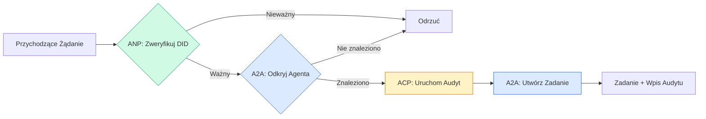

```typescript
class ProtocolGateway {
  private registry: AgentRegistry;
  private taskManager: TaskManager;
  private auditRunner: AuditableRunner;
  private identityRegistry: IdentityRegistry;

  constructor(
    registry: AgentRegistry,
    taskManager: TaskManager,
    auditRunner: AuditableRunner,
    identityRegistry: IdentityRegistry
  ) {
    this.registry = registry;
    this.taskManager = taskManager;
    this.auditRunner = auditRunner;
    this.identityRegistry = identityRegistry;
  }

  async delegateTask(
    fromDid: string,
    signature: string,
    targetAgent: string,
    message: AgentMessage,
    sessionId?: string
  ): Promise<{ task: Task; audit: AuditEntry } | { error: string }> {
    if (!this.identityRegistry.verify(fromDid, signature, message.id)) {
      return { error: "Weryfikacja tożsamości nie powiodła się" };
    }

    const card = this.registry.resolve(targetAgent);
    if (!card) {
      return { error: `Agent ${targetAgent} nie znaleziony w rejestrze` };
    }

    const audit = await this.auditRunner.run(
      targetAgent,
      [message],
      sessionId
    );
    const task = await this.taskManager.sendMessage(targetAgent, message);

    return { task, audit };
  }

  discoverAndDelegate(
    fromDid: string,
    signature: string,
    skillTag: string,
    message: AgentMessage
  ): Promise<{ task: Task; audit: AuditEntry } | { error: string }> {
    const candidates = this.registry.discoverBySkillTag(skillTag);
    if (candidates.length === 0) {
      return Promise.resolve({
        error: `Nie znaleziono agentów z tagiem umiejętności: ${skillTag}`,
      });
    }
    return this.delegateTask(
      fromDid,
      signature,
      candidates[0].name,
      message
    );
  }
}
```

Brama robi cztery rzeczy w jednym wywołaniu:
1. **ANP**: Weryfikuje tożsamość wywołującego przez podpis DID
2. **A2A**: Odkrywa agenta docelowego i sprawdza możliwości
3. **ACP**: Opakowuje wykonanie w ślad audytu z trajektorią
4. **A2A**: Tworzy zadanie z pełnym śledzeniem cyklu życia

### Krok 7: Połącz Wszystko Razem

```typescript
async function protocolDemo() {
  const registry = new AgentRegistry();
  registry.register({
    name: "researcher",
    description: "Searches and summarizes findings",
    version: "1.0.0",
    url: "https://researcher.local/a2a/v1",
    capabilities: { streaming: true, pushNotifications: false },
    defaultInputModes: ["text/plain"],
    defaultOutputModes: ["text/plain", "application/json"],
    skills: [
      {
        id: "web-research",
        name: "Web Research",
        description: "Searches the web",
        tags: ["research", "search", "summarization"],
        inputModes: ["text/plain"],
        outputModes: ["application/json"],
      },
    ],
  });
  registry.register({
    name: "coder",
    description: "Writes code from specs",
    version: "1.0.0",
    url: "https://coder.local/a2a/v1",
    capabilities: { streaming: false, pushNotifications: false },
    defaultInputModes: ["text/plain", "application/json"],
    defaultOutputModes: ["text/plain"],
    skills: [
      {
        id: "code-gen",
        name: "Code Generation",
        description: "Generates code",
        tags: ["coding", "generation"],
        inputModes: ["text/plain", "application/json"],
        outputModes: ["text/plain"],
      },
    ],
  });

  const taskManager = new TaskManager();
  const auditRunner = new AuditableRunner();

  const researchTrajectory: TrajectoryEntry[] = [];

  taskManager.registerHandler(
    "researcher",
    async function* (task, message) {
      yield {
        kind: "statusUpdate" as const,
        taskId: task.id,
        status: { state: "working" as const, timestamp: Date.now() },
      };

      researchTrajectory.push({
        reasoning: "Searching for React 19 documentation",
        toolName: "web_search",
        toolInput: { query: "React 19 compiler features" },
        toolOutput: {
          results: ["react.dev/blog/react-19", "github.com/react/react"],
        },
        timestamp: Date.now(),
      });

      researchTrajectory.push({
        reasoning: "Extracting key findings from search results",
        toolName: "doc_analysis",
        toolInput: { url: "react.dev/blog/react-19" },
        toolOutput: {
          summary:
            "React 19 compiler auto-memoizes, no manual useMemo needed",
        },
        timestamp: Date.now(),
      });

      yield {
        kind: "artifactUpdate" as const,
        taskId: task.id,
        artifact: {
          id: crypto.randomUUID(),
          name: "research-results",
          parts: [
            {
              kind: "data" as const,
              data: {
                findings: [
                  "React 19 compiler auto-memoizes components",
                  "No more manual useMemo/useCallback needed",
                  "Compiler runs at build time, not runtime",
                ],
                sources: ["react.dev/blog/react-19"],
              },
              mediaType: "application/json",
            },
          ],
        },
        append: false,
        lastChunk: true,
      };

      yield {
        kind: "statusUpdate" as const,
        taskId: task.id,
        status: { state: "completed" as const, timestamp: Date.now() },
      };
    }
  );

  auditRunner.registerAgent("researcher", async () => ({
    output: [
      textMessage("agent", "React 19 compiler auto-memoizes components"),
    ],
    trajectory: researchTrajectory,
  }));

  const identityRegistry = new IdentityRegistry();

  const coderIdentity = createIdentity("coder.local", "coder");
  const researcherIdentity = createIdentity("researcher.local", "researcher");

  identityRegistry.publish(coderIdentity.document);
  identityRegistry.publish(researcherIdentity.document);

  const gateway = new ProtocolGateway(
    registry,
    taskManager,
    auditRunner,
    identityRegistry
  );

  console.log("=== Demo Protokołów ===\n");

  console.log("1. Odkrywanie Agentów (A2A)");
  const researchAgents = registry.discoverBySkillTag("research");
  console.log(
    `   Znaleziono ${researchAgents.length} agent(ów):`,
    researchAgents.map((a) => a.name)
  );

  console.log("\n2. Weryfikacja Tożsamości (ANP)");
  const message = textMessage("user", "Research React 19 compiler features");
  const signature = signPayload(coderIdentity, message.id);
  const verified = identityRegistry.verify(
    coderIdentity.did,
    signature,
    message.id
  );
  console.log(`   DID programisty: ${coderIdentity.did}`);
  console.log(`   Podpis zweryfikowany: ${verified}`);

  console.log("\n3. Delegowanie Zadań (A2A + ACP + ANP)");
  const result = await gateway.delegateTask(
    coderIdentity.did,
    signature,
    "researcher",
    message,
    "session-001"
  );

  if ("error" in result) {
    console.log(`   Błąd: ${result.error}`);
    return;
  }

  console.log(`   ID zadania: ${result.task.id}`);
  console.log(`   Stan zadania: ${result.task.status.state}`);
  console.log(`   Artefakty: ${result.task.artifacts.length}`);

  console.log("\n4. Ślad Audytu (ACP)");
  console.log(`   ID uruchomienia: ${result.audit.runId}`);
  console.log(`   Status: ${result.audit.status}`);
  console.log(`   Kroki trajektorii: ${result.audit.trajectory.length}`);
  for (const step of result.audit.trajectory) {
    console.log(`     - ${step.reasoning}`);
    if (step.toolName) {
      console.log(`       Narzędzie: ${step.toolName}`);
    }
  }

  console.log("\n5. Pełny Dziennik Audytu");
  const fullLog = auditRunner.getFullAuditLog();
  console.log(`   Łączna liczba uruchomień: ${fullLog.length}`);
  for (const entry of fullLog) {
    const duration = entry.completedAt
      ? `${entry.completedAt - entry.startedAt}ms`
      : "w toku";
    console.log(`   ${entry.agentName}: ${entry.status} (${duration})`);
  }
}

protocolDemo().catch((err) => {
  console.error("Demo protokołów nie powiodło się:", err);
  process.exitCode = 1;
});
```

## What Goes Wrong

Protokoły rozwiązują ścieżkę szczęśliwą. Oto co się psuje w produkcji:

**Dryf schematu.** Agent A publikuje Agent Card reklamujący wyjście `application/json`. Ale schemat JSON zmienia się między wersjami. Agent B parsuje stary format i dostaje śmieci. Naprawa: wersjonuj swoje umiejętności i schematy wyjścia. Specyfikacja A2A obsługuje `version` na Agent Cards z tego powodu.

**Naruszenia maszyny stanów.** Handler agenta emituje zdarzenie `completed`, a następnie próbuje emitować więcej artefaktów. Zadanie jest niezmienne. Twój kod po cichu pomija aktualizacje lub rzuca wyjątek. Naprawa: sprawdź stan końcowy przed emisją. `TaskManager` powyżej egzekwuje to za pomocą `break` po stanach końcowych.

**Awarie rozwiązywania zaufania.** Agent A próbuje zweryfikować DID agenta B, ale domena agenta B jest niedostępna. Dokument DID nie może być pobrany. Czy otwierasz się na awarię (akceptujesz niezweryfikowanych agentów) czy zamykasz się na awarię (odrzucasz wszystko)? ANP zaleca zamykanie się na awarię z zasadą minimalnego zaufania.

**Rozrost trajektorii.** Rejestrowanie trajektorii ACP jest potężne, ale kosztowne. Złożony agent wykonujący 200 wywołań narzędzi na uruchomienie produkuje ogromne wpisy audytu. Naprawa: rejestruj trajektorię na konfigurowalnych poziomach szczegółowości. Rejestruj nazwy narzędzi i IO dla zgodności, pomiń kroki rozumowania dla obciążeń nieregulowanych.

**Horda odkrywająca.** 50 agentów jednocześnie odpytuje `GET /agents` przy starcie. Naprawa: buforuj Agent Cards z TTL, rozłóż interwały odkrywania lub użyj rejestracji opartej na push zamiast pollingu.

## Use It

### Prawdziwe Implementacje

**A2A** jest najbardziej dojrzała. [Oficjalna specyfikacja Google](https://github.com/google/A2A) jest open-source pod Linux Foundation. SDK dla Pythona i TypeScriptu. Jeśli twoi agenci potrzebują dynamicznego odkrywania i współpracy, zacznij tutaj.

**ACP** łączy się z A2A. Projekt [BeeAI IBM](https://github.com/i-am-bee/acp) stworzył ACP jako REST-ową alternatywę, ale koncepcja metadanych trajektorii jest wchłaniana do ekosystemu A2A. Używaj wzorców ACP (rejestrowanie trajektorii, cykl życia uruchomienia), nawet jeśli używasz A2A jako transportu.

**ANP** jest najbardziej eksperymentalny. [Repo społeczności](https://github.com/agent-network-protocol/AgentNetworkProtocol) ma SDK Pythona (AgentConnect). Koncepcja negocjacji meta-protokołu jest autentycznie nowatorska. Warta obserwowania dla międzyorganizacyjnych wdrożeń agentów.

**MCP** jest już omówiony w Fazie 13. Jeśli chcesz, aby agenci używali narzędzi, MCP jest standardem.

### Wybór Właściwego Protokołu

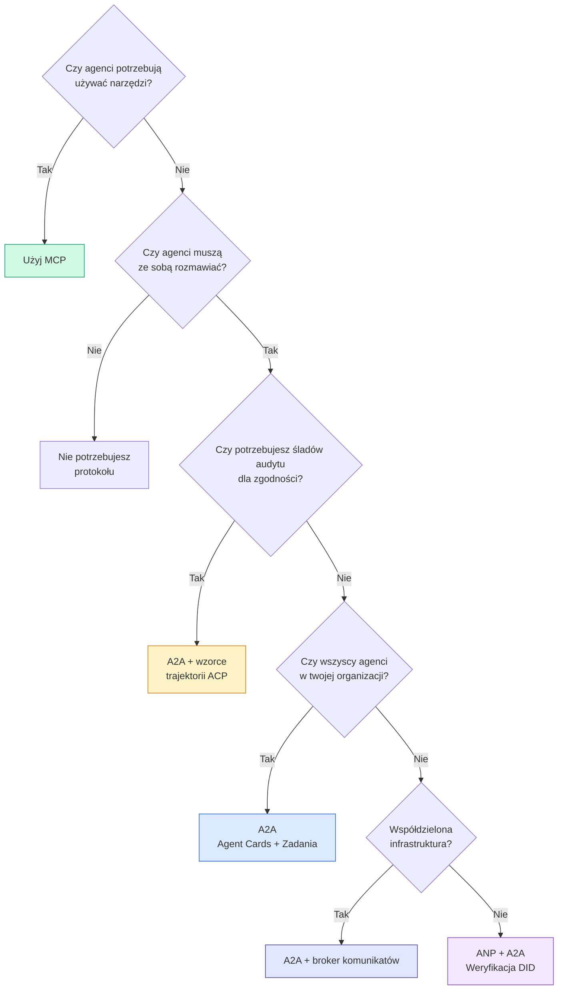

## Ship It

Ta lekcja produkuje:
- `code/main.ts` -- kompletną implementację wszystkich czterech wzorców protokołów
- `outputs/prompt-protocol-selector.md` -- prompt, który pomaga wybrać protokoły dla twojego systemu

## Exercises

1. **Wieloskokowe delegowanie zadań.** Rozszerz `TaskManager` tak, aby handler agenta mógł delegować podzadania do innych agentów. Badacz otrzymuje zadanie, deleguje podzadania „szukaj" i „podsumuj" do dwóch wyspecjalizowanych agentów, czeka, aż oba się zakończą, a następnie scala wyniki do własnych artefaktów.

2. **Strumieniowy ślad audytu.** Zmodyfikuj `AuditableRunner` do obsługi trybu strumieniowego. Zamiast czekać na pełny wynik, emituj aktualizacje `AuditEntry` w czasie rzeczywistym w miarę dodawania wpisów trajektorii. Użyj generatora asynchronicznego, który produkuje migawki audytu.

3. **Rotacja DID.** Dodaj rotację kluczy do `IdentityRegistry`. Agent powinien móc opublikować nowy dokument DID ze zaktualizowanymi kluczami, zachowując odniesienie `previousDid`. Weryfikatorzy powinni akceptować podpisy zarówno z bieżącego, jak i poprzedniego klucza w okresie karencji.

4. **Negocjacja protokołu.** Zaimplementuj koncepcję meta-protokołu ANP. Dwóch agentów wymienia wiadomości `protocolNegotiation` z kandydackimi formatami (np. „Mówię JSON-RPC" vs „Wolę REST"). Po maksymalnie 3 rundach uzgadniają format lub następuje timeout. Uzgodniony format określa, którego `TaskManager` lub `AuditableRunner` używają.

5. **Odkrywanie z ograniczeniem szybkości.** Dodaj opakowanie `RateLimitedRegistry`, które buforuje wyszukiwania Agent Card z konfigurowalnym TTL i ogranicza zapytania odkrywające na agenta na sekundę. Zasymuluj hordę 100 agentów odkrywających się nawzajem przy starcie i zmierz różnicę.

## Key Terms

| Termin | Co ludzie mówią | Co to naprawdę znaczy |
|------|----------------|----------------------|
| MCP | „Protokół dla narzędzi AI" | Protokół klient-serwer dla agentów do odkrywania i używania narzędzi. Agent-do-narzędzia, nie agent-do-agenta. |
| A2A | „Protokół agentów Google" | Protokół równorzędny dla współpracy agentów pod Linux Foundation. Odkrywanie przez Agent Cards, 9-stanowy cykl życia zadań, strumieniowanie przez SSE. Obsługuje JSON-RPC, REST i gRPC. |
| ACP | „Korporacyjne przesyłanie wiadomości agentów" | REST API IBM/BeeAI dla uruchomień agentów z TrajectoryMetadata: każda odpowiedź niesie pełny łańcuch rozumowania i wywołań narzędzi. Łączy się z A2A. |
| ANP | „Zdecentralizowana tożsamość agentów" | Społecznościowy protokół używający `did:wba` (DID) dla tożsamości kryptograficznej, HPKE dla E2EE i negocjacji meta-protokołu opartej na AI dla agentów, którzy nigdy się nie widzieli. |
| Agent Card | „Wizytówka agenta" | Dokument JSON pod `/.well-known/agent-card.json` opisujący umiejętności, obsługiwane typy MIME, schematy zabezpieczeń i wiązania protokołów. |
| DID | „Zdecentralizowany ID" | Standard W3C dla kryptograficznie weryfikowalnych tożsamości hostowanych na własnej domenie agenta. ANP używa metody `did:wba`. |
| TrajectoryMetadata | „Paragon audytu" | Mechanizm ACP do dołączania kroków rozumowania, wywołań narzędzi i ich wejść/wyjść do każdej odpowiedzi agenta. |
| Meta-protokół | „Agenci negocjujący jak rozmawiać" | Podejście ANP, w którym agenci używają języka naturalnego do dynamicznego uzgadniania formatów danych, a następnie generują kod do ich obsługi. |
| Zadanie | „Jednostka pracy" | Obiekt stanowy A2A śledzący pracę od zgłoszenia do zakończenia. Niezmienny po osiągnięciu stanu końcowego. |

## Further Reading

- [Google A2A specification](https://github.com/google/A2A) -- oficjalna specyfikacja i SDK (v1.0.0, Linux Foundation)
- [IBM/BeeAI ACP specification](https://github.com/i-am-bee/acp) -- specyfikacja OpenAPI 3.1 dla uruchomień agentów i metadanych trajektorii
- [Agent Network Protocol](https://github.com/agent-network-protocol/AgentNetworkProtocol) -- tożsamość oparta na DID, E2EE, negocjacja meta-protokołu
- [Model Context Protocol docs](https://modelcontextprotocol.io/) -- specyfikacja MCP od Anthropic (omówiona w Fazie 13)
- [W3C Decentralized Identifiers](https://www.w3.org/TR/did-core/) -- standard tożsamości leżący u podstaw ANP
- [RFC 9180 (HPKE)](https://www.rfc-editor.org/rfc/rfc9180) -- schemat szyfrowania, którego ANP używa dla E2EE
- [FIPA Agent Communication Language](http://www.fipa.org/specs/fipa00061/SC00061G.html) -- akademicki poprzednik nowoczesnych protokołów agentowych