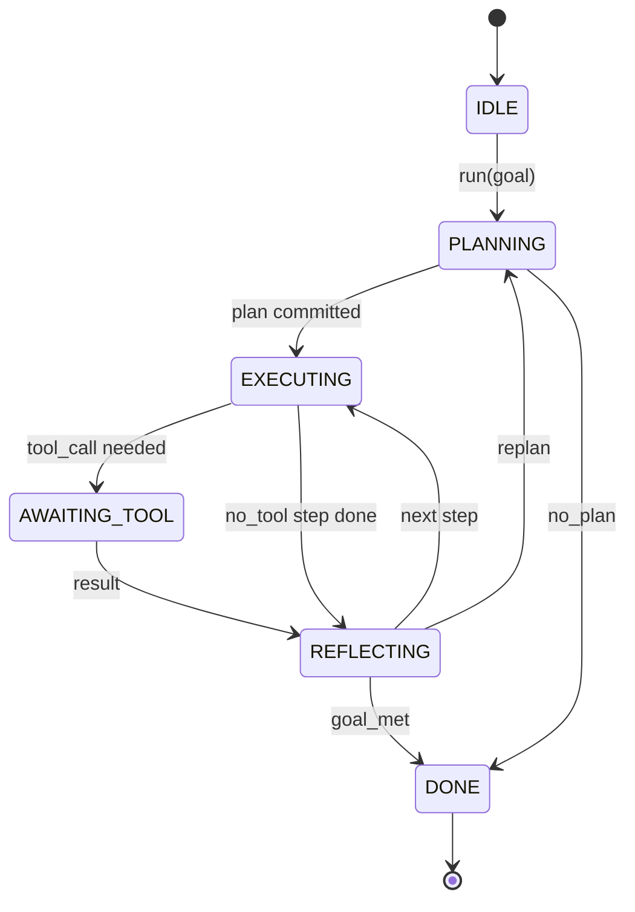

# Kontrakt Pętli Harnessa Agenta

> Harness jest agentem. Model jest koprocesorem. Ta lekcja zamraża kontrakt pętli, do którego możesz podłączyć dowolny model.

**Type:** Build
**Languages:** Python
**Prerequisites:** Phase 13 lessons 01-07, Phase 14 lesson 01
**Time:** ~90 minutes

## Cele nauczania
- Określ pętlę harnessa agenta jako deterministyczną maszynę stanów z jawnymi przejściami.
- Zaimplementuj dziesięć tematów hooków cyklu życia, w które operatorzy wpinają politykę, telemetrię i zabezpieczenia.
- Zdefiniuj dwa punkty wyciągnięcia, w których pętla oddaje kontrolę z powrotem do wywołującego i wznawia na świeżym wejściu.
- Egzekwuj budżety na sesję (kroki, wywołania narzędzi, czas ścienny) bez wycieku częściowego stanu po przekroczeniu.
- Emituj typowany strumień jedenastu typów zdarzeń, tak aby downstreamowe UI i moduły śledzące mogły subskrybować bez bezpośredniego inspekcjonowania pętli.

## Ramy

Agent programistyczny, który działa bez nadzoru przez czterdzieści kroków, nie jest pętlą czatu. To maszyna stanów, której węzły operator może przechwycić, a której krawędzie operator może audytować. Gdy zapiszesz kontrakt, zamiana modeli, narzędzi lub polityk przestaje być refaktoryzacją. Staje się wywołaniem rejestracyjnym.

Ta lekcja buduje ten kontrakt. Nazywamy sześć stanów, dziesięć tematów hooków, dwa punkty wyciągnięcia, jedenaście typów zdarzeń i kopertę budżetu. Wszystko inne w harnessie (rejestr narzędzi, transport JSON-RPC, dyspozytor, planista) podłącza się do tego kształtu.

## Stany

Pętla ma sześć stanów. Pięć jest aktywnych. Jeden jest terminalny.



`IDLE` jest jedynym prawnym punktem wejścia. `DONE` jest jedynym prawnym wyjściem. `AWAITING_TOOL` jest jedynym stanem, który oddaje punkt wyciągnięcia. Każde inne przejście jest wewnętrzne.

Maszyna stanów jest deterministyczna. Mając ten sam dziennik zdarzeń, harness wchodzi ponownie w ten sam stan. Ta właściwość pozwala odtwarzać sesje do debugowania bez ponownego wywoływania modelu.

## Tematy hooków

Hooki są szwem operatora w pętli. Harness odpala dziesięć tematów. Każdy temat akceptuje dowolną liczbę subskrybentów. Subskrybenci odpalają w kolejności rejestracji. Subskrybent może mutować ładunek, podnieść błąd, aby przerwać krok, lub zwrócić wartownika, aby pominąć następny krok.

```text
before_plan         after_plan
before_tool_call    after_tool_call
before_step         after_step
on_error
on_pause
on_budget_exceeded
on_complete
```

Kształt odzwierciedla to, co Claude Code, Cursor i OpenCode wspólnie osiągnęły do połowy 2025 roku. Nazwy są funkcjonalne, nie brandingowe. Hook, który blokuje `rm -rf`, mieszka w `before_tool_call`. Hook, który wysyła span OpenTelemetry, mieszka w `after_step`. Hook, który wznawia wstrzymaną sesję, mieszka w `on_pause`.

## Punkty wyciągnięcia

Pętla oddaje kontrolę dwa razy. Po pierwsze na `AWAITING_TOOL`, gdy nie może kontynuować bez wyniku narzędzia. Po drugie na `on_pause`, gdy budżet jest wyczerpany lub hook wyraźnie żąda przeglądu przez człowieka.

Punkt wyciągnięcia nie jest wyjątkiem. To zwrot. Wywołujący inspekcjonuje stan harnessa, pobiera to, o co harness prosił, i wywołuje `resume(payload)`. Harness kontynuuje od miejsca, w którym się zatrzymał. To ten sam kształt co generator Pythona. Transport przez punkt wyciągnięcia jest twoim wyborem. W TUI to naciśnięcie klawisza. Przez MCP to `tools/call`. Przez kolejkę to odpytywanie zadania.

## Strumień zdarzeń

Pętla dołącza zdarzenia do typowanego strumienia w określonych punktach kontraktu. Strumień jest tylko do dołączania, a subskrybenci mogą odtwarzać od dowolnego przesunięcia. Jedenaście zaimplementowanych typów zdarzeń to:

- `session.start` — emitowane raz, gdy wywołane jest `run(goal)`
- `plan.draft` — emitowane, gdy planista zwróci szkic planu
- `plan.commit` — emitowane po zatwierdzeniu szkicu jako aktywnego planu
- `step.start` — emitowane na początku każdego wykonywanego kroku
- `step.end` — emitowane na końcu każdego wykonywanego kroku
- `tool.call` — emitowane, gdy krok wymagający narzędzia oddaje kontrolę do wywołującego
- `tool.result` — emitowane po wznowieniu z wynikiem narzędzia
- `tool.error` — emitowane po wznowieniu z błędem lub gdy hook przerwie wywołanie
- `budget.warn` — emitowane po osiągnięciu limitu budżetu
- `session.pause` — emitowane, gdy pętla oddaje na pauzie (budżet lub hook)
- `session.complete` — emitowane raz, gdy pętla osiągnie `DONE`

Zdarzenia nie duplikują ładunków hooków. Hooki są imperatywne (mutuj, przerwij). Zdarzenia są obserwacyjne (rejestruj, wysyłaj). Traktuj je jako ortogonalne.

## Koperta budżetu

Sesja niesie trzy limity. Liczba kroków, liczba wywołań narzędzi, sekund czasu ściennego. Każdy krok zwiększa licznik kroków o jeden. Każde wywołanie narzędzia zwiększa licznik wywołań narzędzi o jeden. Czas ścienny jest sprawdzany przy każdym przejściu stanu. Gdy jakikolwiek limit zostanie osiągnięty, pętla odpala `on_budget_exceeded`, emituje `budget.warn`, a następnie przechodzi do `IDLE` z powodem przekroczenia budżetu przy następnym punkcie wyciągnięcia.

Budżet nie jest wyłącznikiem awaryjnym. To oddanie kontroli. Wywołujący decyduje, czy przedłużyć budżet i wznowić, czy zamknąć sesję.

## Czego ta lekcja nie robi

Nie wywołuje modelu. Nie rejestruje prawdziwych narzędzi. Nie implementuje transportu. To są następne cztery lekcje. Ta lekcja ustala kontrakt, aby następne cztery mogły się podłączyć bez przepisywania.

Deterministyczny planista w `main.py` jest zastępczy. Zwraca zakodowany na sztywno plan trzech kroków, z których dwa wymagają wyniku narzędzia. Chodzi o pętlę, nie o plan.

## Jak czytać kod

`HarnessLoop` jest główną klasą. Przechowuje stan, odpala hooki, emituje zdarzenia. `Budget` śledzi limity. `Event` jest typowaną kopertą na strumieniu. `HookRegistry` jest tablicą dyspozytorską. `_transition` jest jedyną funkcją, która zmienia stan, więc niezmienniki maszyny stanów mieszkają w jednym miejscu.

Przeczytaj `main.py` od góry do dołu. Następnie przeczytaj `code/tests/test_loop.py`. Testy przypinają każde przejście i każdą kolejność odpalania hooków.

## Idąc dalej

Najtrudniejszą częścią budowania harnessa w produkcji nie jest maszyna stanów. To sprawienie, by kontrakt był egzekwowalny. Kontrakt musi przetrwać gorące przeładowanie planisty. Musi przetrwać narzędzie, które zwraca nieprawidłowy JSON. Musi przetrwać hook, który podnosi błąd w `before_tool_call` w dwóch trzecich czterdziestokrokowej sesji. Testy w tej lekcji ćwiczą te tryby awarii. Uruchom je. Zepsuj je. Dodaj przypadki.

Następna lekcja dodaje rejestr narzędzi. Potem transport JSON-RPC. Potem dyspozytor. Do lekcji dwudziestej czwartej, pętla w tym pliku będzie uruchamiać prawdziwy plan z prawdziwymi narzędziami z egzekwowanymi prawdziwymi budżetami.