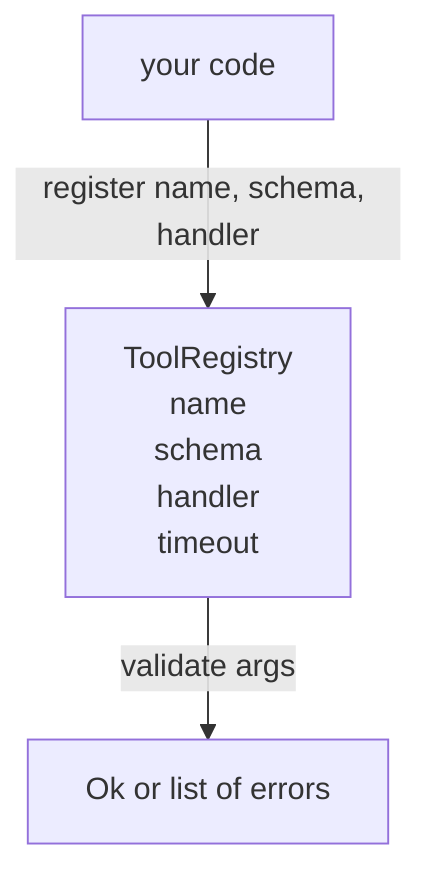

# Rejestr Narzędzi z Walidacją Schematu

> Narzędzie, którego agent nie może zwalidować, jest narzędziem, którego agent nie może wywołać. Zbuduj rejestr i sprawdzacz schematów, zanim zbudujesz narzędzia.

**Type:** Build
**Languages:** Python
**Prerequisites:** Phase 13 lessons 01-07, Phase 14 lesson 01
**Time:** ~90 minutes

## Cele nauczania
- Przechowuj typowany rejestr nazwa narzędzia → schemat → handler, który dyspozytor może zapytać raz i zaufać później.
- Zaimplementuj podzbiór JSON Schema 2020-12 obejmujący słowa kluczowe, których faktycznie używa dziewięćdziesiąt procent wywołań narzędzi.
- Zwracaj precyzyjne ścieżki błędów w kształcie json-pointer, aby model mógł się sam poprawić w jednym obiegu.
- Odrzucaj rejestrację bez jawnego nadpisania, ponieważ ciche nadpisywanie to sposób, w jaki produkcyjne katalogi narzędzi dryfują.
- Utrzymuj walidator czystym (bez I/O, bez czasu, bez globali), aby można go było ponownie uruchomić na dzienniku odtworzenia.

## Dlaczego rejestr jest przed narzędziem

Agent programistyczny w 2026 roku ma więcej zarejestrowanych narzędzi, niż model może zmieścić w pojedynczym oknie kontekstu. Niebanalny harness zarejestruje dwieście narzędzi i wyświetli dziesięć do czterdziestu w danym kroku. Rejestr jest źródłem prawdy dla "jakie narzędzia istnieją", "jaki kształt mają ich argumenty" i "jaki handler wywołać". Gdy te trzy odpowiedzi są ustalone, reszta harnessa może przestać zgadywać.

Błędem, którego unikamy, jest dostarczanie handlerów bez schematów lub dostarczanie schematów bez walidacji. Oba są powszechne. Oba zamieniają następną warstwę (dyspozytor w lekcji dwudziestej trzeciej) w grę w zgadywanie, gdzie jedynym trybem awarii jest ślad stosu z handlera.

## Jak wygląda rekord narzędzia

```text
ToolRecord
  name        : str          (unikalny, małe litery alfanumeryczne i segmenty podkreślników oddzielone kropkami, np. snake_case.segment.case)
  description : str          (jedna linia, pokazana modelowi)
  schema      : dict         (JSON Schema 2020-12 subset)
  handler     : Callable     (async lub sync, zwraca Any)
  idempotent  : bool         (dyspozytor używa tego do decyzji o ponowieniu)
  timeout_ms  : int          (nadpisanie domyślnego czasu dyspozytora na narzędzie)
```

Schemat jest jedynym polem, którego dotyka walidator. Handler jest dla niego nieprzezroczysty. Rozdzielamy je celowo. Schemat to dane. Handler to kod. Mieszanie ich kusi do umieszczania logiki walidacji wewnątrz handlera, co jest błędem, który zatrzymujemy.

## Podzbiór JSON Schema 2020-12

Pełna specyfikacja 2020-12 to praca naukowa. Potrzebujemy ośmiu słów kluczowych.

```text
type           string / number / integer / boolean / object / array / null
properties     mapa nazwa właściwości -> schemat
required       lista nazw właściwości
enum           lista dozwolonych wartości prymitywnych
minLength      liczba całkowita, dotyczy stringów
maxLength      liczba całkowita, dotyczy stringów
pattern        regex zgodny z ECMA-262, dotyczy stringów
items          schemat zastosowany do każdego elementu tablicy
```

To wystarczy, aby pokryć to, czego faktycznie potrzebuje API narzędzia. Słowa kluczowe, których nie dodajemy (oneOf, anyOf, allOf, $ref, warunkowe) są prawidłowe w produkcyjnych schematach, ale zamieniają walidator w spacerowicza drzewa z cyklami. Budujemy rejestr, nie silnik JSON Schema.

## Ścieżki błędów Json pointer

Gdy walidacja zawiedzie, walidator zwraca listę błędów. Każdy błąd niesie ścieżkę json-pointer do wejścia. Wskaźnik to ciąg z prefiksem ukośnika składający się z nazw właściwości i indeksów tablicy.

```text
{"a": {"b": [1, 2, "x"]}}
                    ^
                    /a/b/2
```

Model czyta ścieżki błędów lepiej niż czyta zdania. Jeśli schemat wymaga `args.user.email`, a model przekazał liczbę całkowitą, błąd powinien brzmieć `/user/email` z `expected_type: string`. Model naprawia to w następnym wywołaniu bez rundy języka naturalnego.

## Rejestracja i nadpisywanie

`register(name, schema, handler, **opts)` domyślnie odrzuca ponowną rejestrację. Wywołujący musi przekazać `override=True`, aby zastąpić. To higiena operacyjna. Dwie części bazy kodu cicho rejestrujące tę samą nazwę narzędzia to rodzaj błędu, którego znalezienie w produkcji zajmuje tydzień.

Rejestr udostępnia trzy metody odczytu. `get(name)` zwraca rekord lub podnosi błąd. `validate(name, args)` zwraca `Ok` lub listę błędów. `names()` zwraca nazwy narzędzi w kolejności rejestracji.

## Czym walidator jest i nie jest

Jest pojedynczym przejściem przez drzewo schematu, rekurencyjnym. Jest czysty. Nie wywołuje handlerów. Nie wymusza typów (string `"42"` nie przechodzi schematu liczbowego). Nie ucina cicho.

Nie jest granicą bezpieczeństwa. Złośliwy handler nadal może źle się zachować po przejściu walidacji. Dyspozytor w lekcji dwudziestej trzeciej dodaje warstwy czasu i sandboksa. Rejestr dodaje kształt.

## Kształt



## Jak czytać kod

`code/main.py` definiuje `ToolRegistry`, `ToolRecord`, `ValidationError` i osiem funkcji walidatora. Walidator dysponuje na `schema["type"]` (lub traktuje schemat z `enum` jako niesprawdzanie typu). Każdy walidator typu zwraca albo pustą listę, albo listę `ValidationError`. Główny spacer łączy błędy i dodaje segmenty ścieżki w miarę schodzenia.

`code/tests/test_registry.py` obejmuje rejestrację, nadpisywanie, sukces walidacji, porażkę walidacji ze ścieżkami i każde słowo kluczowe w podzbiorze.

## Idąc dalej

Dwa rozszerzenia, które będziesz chciał, gdy ta lekcja wyląduje, to rozwiązywanie `$ref` względem lokalnego bloku definicji oraz `additionalProperties: false` dla ścisłego kształtu. Oba są małe. Oba są powszechne do dodania, gdy katalog narzędzi przekroczy pięćdziesiąt narzędzi. Zostawiliśmy je poza lekcją, aby plik był poniżej jednego czytania.

Następna lekcja (dwudziesta druga) buduje transport JSON-RPC stdio, który udostępnia ten rejestr klientowi modelu. Lekcja po (dwudziesta trzecia) owija oba za dyspozytorem z limitami czasu i ponowieniami.