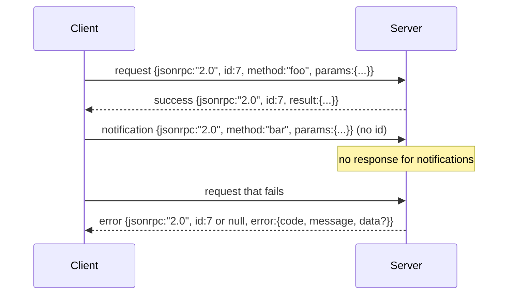

# JSON-RPC 2.0 Przez Stdio Rozdzielane Znakiem Nowej Linii

> Transport między klientem modelu a serwerem narzędzi to JSON-RPC przez stdio. Zrobienie go ręcznie raz uczy cię, za co płaci każda warstwa ramkowania.

**Type:** Build
**Languages:** Python
**Prerequisites:** Phase 13 lessons 01-07, Phase 14 lesson 01
**Time:** ~90 minutes

## Cele nauczania
- Mów JSON-RPC 2.0 oprawiony jako JSON rozdzielany znakiem nowej linii przez stdin i stdout.
- Odwzoruj pięć standardowych kodów błędów (-32700, -32600, -32601, -32602, -32603) i wyświetl je z właściwą semantyką.
- Odróżniaj żądania, odpowiedzi, powiadomienia i partie bez wymyślania nowych kluczy koperty.
- Obsłuż jeden błąd parsowania na linię bez zatruwania reszty strumienia.
- Zbuduj samo kończące się demo używające io.BytesIO, aby lekcja działała bez tworzenia procesu potomnego.

## Dlaczego JSON-RPC pozostaje lingua franca

Agent programistyczny w 2026 roku rozmawia z może dwunastoma serwerami narzędzi w jednej sesji. Każdy serwer to osobny proces lub zdalny endpoint. Format transmisji jest ten sam od 2013 roku. JSON-RPC 2.0 to dwustronicowa specyfikacja. Przetrwał, ponieważ alternatywy (gRPC, HTTP na wywołanie, niestandardowy binarny) wszystkie narzucają kompromis, którego JSON-RPC nie narzuca: wybierają albo strumieniowanie, albo grupowanie, albo sprzężenie transportowe. JSON-RPC jest symetryczny przez stdio, gniazda, websockety i HTTP, a klient może sterować serwerem, którego nigdy nie widział, jeśli obaj przestrzegają specyfikacji.

Ta lekcja buduje wariant stdio. JSON rozdzielany znakiem nowej linii. Każde żądanie to jedna linia. Każda odpowiedź to jedna linia. Granicą transportu jest `\n`.

## Kształt transmisji

Istnieją cztery kształty kopert. Dwie mówi klient. Dwie mówi serwer.



Powiadomienie nie ma `id`. Serwer nie może na nie odpowiedzieć. Jeśli serwer zwróci odpowiedź na powiadomienie, klient nie ma jak dołączyć jej do miejsca wywołania. Ta pojedyncza zasada utrzymuje prostotę matematyki ramkowania.

Partia to tablica JSON żądań lub powiadomień. Serwer odpowiada tablicą odpowiedzi, w dowolnej kolejności, po jednej na wpis niebędący powiadomieniem. Jeśli każdy wpis w partii jest powiadomieniem, serwer nie wysyła nic z powrotem.

## Pięć kodów błędów

```text
-32700  Parse error      JSON nie mógł być sparsowany
-32600  Invalid Request  Kształt koperty jest nieprawidłowy
-32601  Method not found
-32602  Invalid params
-32603  Internal error
```

Kody między -32000 a -32099 są zarezerwowane dla błędów zdefiniowanych przez serwer. Wszystko inne jest zdefiniowane przez aplikację. Lekcja trzyma się pięciu. Jeśli twój handler podnosi błąd, transport owija go jako -32603 z nazwą klasy wyjątku w `data.exception`.

Błąd parsowania ma specjalną regułę. `id` w odpowiedzi to `null`, ponieważ żądanie nigdy nie sparsowało się wystarczająco, aby wyodrębnić id.

## Ramkowanie znakiem nowej linii i demo BytesIO

Transport czyta jedną linię na raz. Linia to bajty do i włącznie z `\n`. Jeśli linia nie może być sparsowana, transport zapisuje odpowiedź -32700 z `id: null` i kontynuuje. Strumień nie jest zatruty. Następna linia jest parsowana od nowa.

Dla lekcji owijamy parę `io.BytesIO` jako stdin i stdout. Serwer czyta żądania do EOF, zapisuje odpowiedzi dla każdego i wraca. Klient czyta odpowiedzi z powrotem. Żaden proces nie jest tworzony. Żaden timeout. Zachowanie transportu jest identyczne z prawdziwym potokiem podprocesu, ponieważ interfejs `io` Pythona prezentuje ten sam kontrakt `.readline()` i `.write()`.

## Dyspozycja metod

Transport nie wie, które metody istnieją. Przekazuje do wywoływalnego `handler(method, params)`, który dostarcza harness. Handler zwraca wynik lub podnosi błąd. Trzy klasy wyjątków wyświetlają określone kody.

```text
MethodNotFound -> -32601
InvalidParams  -> -32602
Anything else  -> -32603 z nazwą wyjątku w data
```

Transport nigdy nie widzi rejestru narzędzi. Rejestr siedzi za handlerem. To jest warstwowanie, którego chcemy. Transport mówi JSON-RPC. Rejestr mówi kształtami narzędzi. Dyspozytor (lekcja dwudziesta trzecia) zszywa je razem.

## Zachowanie strumienia przy błędach

```text
klient pisze                  serwer czyta            serwer pisze
---------------               -----------             -------------
{...prawidłowe żądanie...}    parsuje ok              {...odpowiedź, id pasuje...}
{...zepsuty json...           parsowanie zawodzi      {id:null, error: -32700}
{...prawidłowe żądanie...}    parsuje ok              {...odpowiedź, id pasuje...}
{...brak metody...}           nieprawidłowa koperta   {id:X, error: -32600}
```

Zepsuta linia JSON nie zatrzymuje pętli. Brakujące pole `method` nie zatrzymuje pętli. Wyjątek handlera nie zatrzymuje pętli. Transport czyta dalej aż do EOF.

## Powiadomienia i przepływy asymetryczne

Powiadomienie to "odpal i zapomnij". Harness używa powiadomień dla zdarzeń postępu, sygnałów anulowania i linii logów. Powiadomienia są sposobem, w jaki długo działające narzędzie może strumieniować aktualizacje stanu bez wykonywania obiegu dla każdej z nich.

Lekcja implementuje jedną pomocniczą funkcję powiadomienia wychodzącego, `write_notification`. Serwer używa jej do emitowania postępu, gdy żądanie jest w locie. Demo pokazuje wzór: przychodzi żądanie, handler emituje dwa powiadomienia postępu, a następnie zapisuje końcową odpowiedź.

## Jak czytać kod

`code/main.py` definiuje `StdioTransport`, pomocnika parsowania (`parse_request`), trzech pomocników zapisu (`write_response`, `write_error`, `write_notification`) i pętlę dyspozytorską `serve`. Stałe kodów błędów żyją na poziomie modułu.

`code/tests/test_transport.py` obejmuje pięć kodów błędów, powiadomienia (brak zapisanej odpowiedzi), partie (tablica wejście, tablica wyjście, powiadomienia pominięte), zepsuty JSON (błąd parsowania potem kontynuacja) i przepływ asymetryczny, w którym handler zapisuje powiadomienie w trakcie wywołania.

## Idąc dalej

Ten transport wystarczy dla lekcji, które następują. Produkcyjne transporty dodają trzy rzeczy. Pole identyfikatora korelacji, które przetrwa przekazywanie (twój `id` już to jest, ale w siatce potrzebujesz również zewnętrznego id śledzenia). Kanał anulowania (powiadomienie takie jak `$/cancelRequest` z id wywołania w locie). I uzgadnianie negocjacji typu zawartości, aby to samo gniazdo mogło mówić JSON-RPC i Streamable HTTP. Żadne z nich nie zmienia formatu transmisji. Dodają metadane.