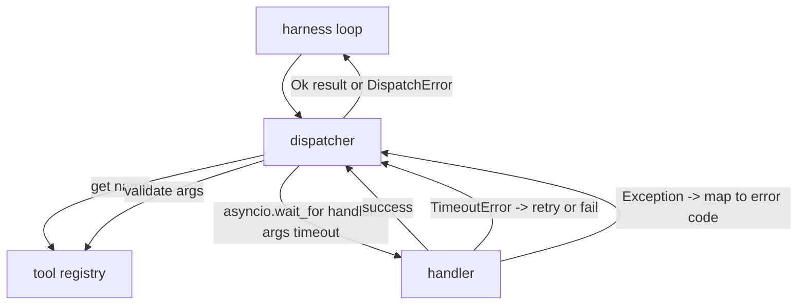
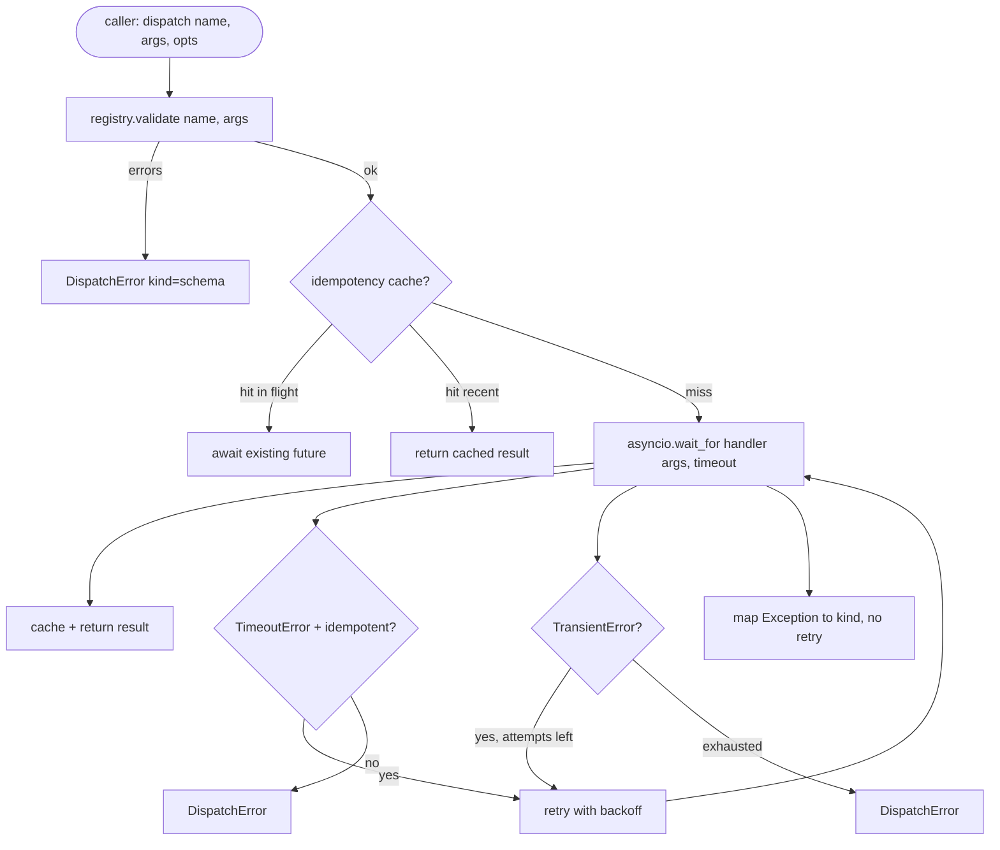

# Dyspozytor wywołań funkcji

> Dyspozytor to miejsce, gdzie harness płaci za każdą obietnicę złożoną przez schemat. Limity czasu, ponowienia, deduplikacja, mapowanie błędów. Wszystko w jednym miejscu.

**Typ:** Budowa
**Języki:** Python
**Wymagania wstępne:** Faza 13 lekcje 01-07, Faza 14 lekcja 01
**Czas:** ~90 minut

## Cele nauczania
- Owinąć handler narzędzia w limit czasu na pojedyncze wywołanie, który zwraca typowany błąd zamiast zawieszać pętlę.
- Zastosować wycofywanie wykładnicze z jitterem i maksymalną liczbą prób.
- Deduplikować ponowienia na podstawie klucza idempotentności, aby ponowienie ścigające się z wolnym oryginałem nie uruchomiło się dwukrotnie.
- Mapować wyjątki handlera i błędy transportowe na jedną kopertę błędów, którą pętla harnessa już rozumie.
- Ograniczyć równoległe wysyłanie limitem współbieżności, aby rozwidlenie na czterdzieści wywołań narzędzi nie wyczerpało pętli zdarzeń.

## Gdzie znajduje się dyspozytor

Pomiędzy pętlą harnessa (lekcja dwadzieścia) a rejestrem narzędzi (lekcja dwadzieścia jeden). Transport (lekcja dwadzieścia dwa) zasila pętlę. Pętla przekazuje wywołanie narzędzia do dyspozytora. Dyspozytor wywołuje rejestr, uruchamia handler i zwraca albo wynik, albo kopertę błędów w formacie JSON-RPC.



Dyspozytor to jedyna warstwa, która wie o timerach, ponowieniach i idempotentności. Pętla nie. Rejestr nie. Handler nie. Ta izolacja jest kluczowa.

## Limity czasu

Każde narzędzie ma domyślny limit czasu. Rekord w rejestrze zawiera `timeout_ms`. Dyspozytor nadpisuje go wartością z wywołania, gdy harness ją przekaże. Używamy `asyncio.wait_for`. Po przekroczeniu czasu zadanie handlera jest anulowane, a dyspozytor zwraca `DispatchError(kind="timeout")`.

Przekroczenie czasu nie jest domyślnie błędem kwalifikującym się do ponowienia dla narzędzi nieidempotentnych. `db.write`, który przekroczył limit, mógł zostać zatwierdzony lub nie. Ponowienie duplikuje zapis. Dyspozytor honoruje flagę `idempotent` z rekordu rejestru. Narzędzia idempotentne są ponawiane. Narzędzia nieidempotentne nie.

## Ponowienia z wycofywaniem wykładniczym

Polityka ponowień to maksymalnie trzy próby. Wycofywanie jest wykładnicze z jitterem.

```text
próba 1  -> opóźnienie 0
próba 2  -> opóźnienie 0.1s * (1 + losowe[0..0.5])
próba 3  -> opóźnienie 0.4s * (1 + losowe[0..0.5])
```

Tylko błędy `timeout` i `transient` są ponawiane. Błąd `schema`, `not_found` lub `internal` nie jest ponawiany. Błędy schematu są deterministyczne – ponowienie nie zmienia wyniku i marnuje budżet.

Pętla ponowień respektuje budżet z harnessa. Jeśli budżet wywołującego ma zero pozostałych wywołań narzędzi, dyspozytor kończy się niepowodzeniem przy pierwszej próbie i zwraca `kind="budget_exceeded"`.

## Deduplikacja klucza idempotentności

Ponowienie, które uruchamia się, gdy oryginał wciąż trwa, to prawdziwy błąd produkcyjny. Pierwsze wywołanie wisi w czwartej i dziewiątej dziesiątej sekundy (tuż przed limitem czasu). Ponowienie uruchamia się w piątej sekundzie. Teraz dwa żądania ścigają się z tym samym backendem. Jeśli narzędzie to `payments.charge`, obciążyłeś dwa razy.

Dyspozytor akceptuje opcjonalny `idempotency_key`. Jeśli ten sam klucz jest w locie, gdy nadchodzi wywołanie, dyspozytor czeka na trwającą przyszłość i zwraca jej wynik. Pamięć podręczna przechowuje klucze przez sześćdziesiąt sekund po zakończeniu, aby wchłonąć opóźnione ponowienia.

Klucz jest odpowiedzialnością wywołującego. Harness wyprowadza go z planisty: `f"{step_id}:{tool_name}:{hash(args)}"`. Dyspozytor nie wymyśla kluczy, ponieważ wyprowadzenie klucza z samych argumentów sprawia, że dwa semantycznie różne wywołania wyglądają tak samo.

## Koperta błędu

Nieudane wysłanie zwraca jeden kształt.

```text
DispatchError
  kind        : "timeout" | "transient" | "schema" | "not_found" | "internal" | "budget_exceeded"
  message     : str
  attempts    : int
  jsonrpc_code: int   (one of -32601, -32602, -32603)
```

Pętla harnessa mapuje `kind` na następny stan. `schema` i `not_found` przechodzą do `on_error` i wyzwalają przeplanowanie. `timeout` i `transient` przechodzą do `on_error` i mogą lub nie mogą przeplanować, w zależności od liczby prób. `budget_exceeded` wyzwala `on_budget_exceeded`.

## Limit współbieżności przy rozwidleniu

`gather(*calls)` uruchamia wszystkie korutyny jednocześnie. Przy czterdziestu wywołaniach narzędzi to czterdzieści otwartych gniazd lub czterdzieści potoków podprocesów. Większość backendów nie lubi czterdziestu równoległych połączeń od jednego klienta.

Dyspozytor owija `gather` w semafor. Domyślny limit współbieżności to osiem. Każde wywołanie przejmuje semafor przed wysłaniem i zwalnia po zakończeniu. Wywołujący widzi wyjście w kształcie `gather`, ale rzeczywiste planowanie jest ograniczone.

## Przepływ dla jednego wywołania



## Jak czytać kod

`code/main.py` definiuje `Dispatcher`, `DispatchError` i `TransientError`. Dyspozytor przyjmuje rejestr przy konstrukcji. Asynchroniczne `dispatch(name, args, ...)` to jedyny punkt wejścia. Limity czasu na próbę są stosowane wbudowanie wewnątrz `_run_with_retries` za pomocą `asyncio.wait_for`. `gather_bounded(calls)` uruchamia wiele wysłań z limitem współbieżności.

`code/tests/test_dispatcher.py` obejmuje wyzwalanie limitu czasu, ponowienie przy błędzie transient, brak ponowienia przy błędzie schematu, deduplikację idempotentności (dwa równoczesne wywołania z tym samym kluczem zwijają się do jednej invokacji handlera) oraz ograniczanie współbieżności (semafor w akcji).

Testy używają `asyncio.sleep(0)` i deterministycznych handlerów opartych na `Counter`, więc kończą się w milisekundach i nie polegają na czasie rzeczywistym.

## Rozwinięcie

Dwa rozszerzenia, które dodają produkcyjne dyspozytory. Po pierwsze, strukturalne logowanie przy każdej tranzycji (które strumień zdarzeń pętli już zapewnia, ale dyspozytor powinien również emitować zdarzenia `dispatch.attempt` i `dispatch.retry`). Po drugie, wyłączniki nadmiarowe: po N awariach w oknie, narzędzie otrzymuje okres schłodzenia, w którym wysłania natychmiast zwracają `kind="circuit_open"` zamiast próbować handlera. Obydwa pasują na ten dyspozytor bez zmiany kontraktu.

Lekcja dwadzieścia cztery łączy dyspozytor z agentem planuj-i-wykonuj, aby zobaczyć wszystkie cztery elementy w ruchu.
