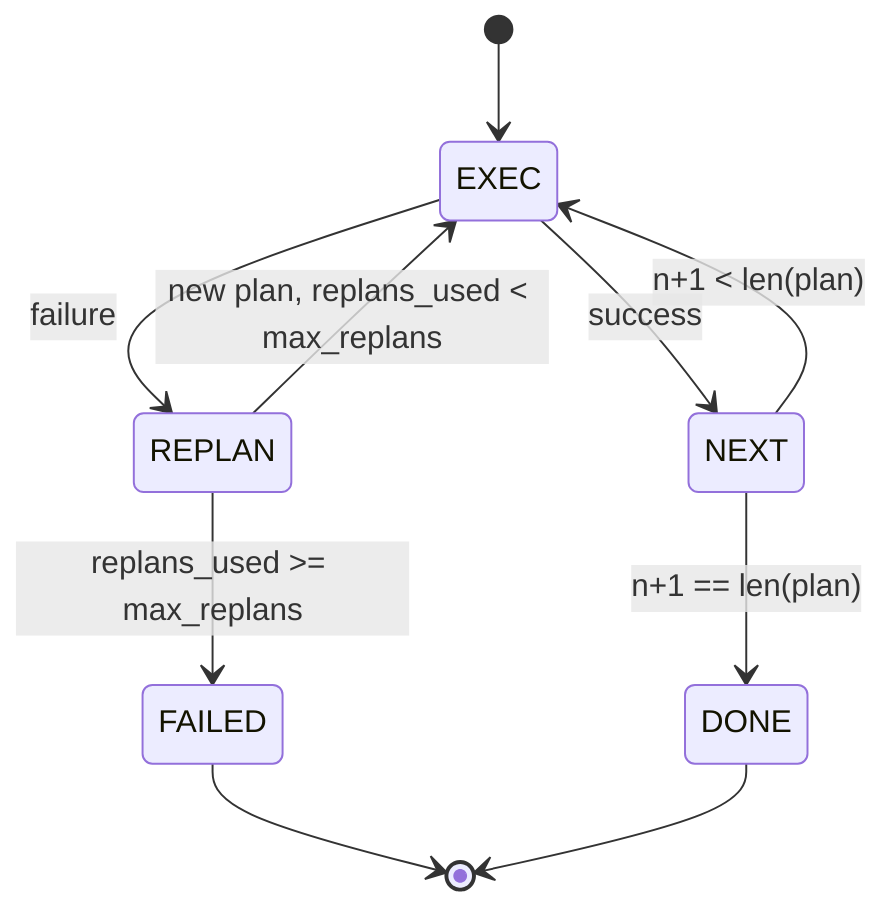

# Przepływ sterowania Planuj-Wykonuj

> Plan, który nie przetrwa awarii, to skrypt. Skrypt, który może przeplanować, to agent. Zbuduj przeplanowywacz najpierw.

**Typ:** Budowa
**Języki:** Python
**Wymagania wstępne:** Faza 13 lekcje 01-07, Faza 14 lekcja 01
**Czas:** ~90 minut

## Cele nauczania
- Reprezentować plan jako uporządkowaną listę typowanych kroków, aby executor mógł wnioskować o postępie i wyniku.
- Wykonywać kroki sekwencyjnie z kontrolowanym przekazaniem awarii z powrotem do planisty.
- Przeplanowywać od bieżącego kursora z poprzednim błędem w kontekście, aby następny plan był świadomy.
- Emitować diff planu przy każdej rewizji, aby downstreamowy tracer lub UI mogły pokazać, dlaczego plan się zmienił.
- Egzekwować dwa budżety: twardy limit kroków i twardy limit przeplanowań.

## Plan i wykonanie, a nie łańcuch myśli

Agent łańcucha myśli emituje tokeny i pozwala pętli zgadywać, gdzie kończy się wywołanie narzędzia. Agent planuj-i-wykonuj najpierw emituje strukturalny plan, a następnie wykonuje każdy krok deterministycznie. Plan to dane, które harness może analizować. Wykonanie to harness przetwarzający te dane przez dyspozytor.

Dwa elementy. Planista, który tworzy plan. Executor, który wykonuje plan. Interesująca praca polega na tym, co się dzieje, gdy executor napotka awarię. Trzy opcje:

```text
1. Przerwij         (zwróć niepowodzenie, pokaż błąd)
2. Pomiń            (oznacz krok jako nieudany, kontynuuj z resztą)
3. Przeplanuj       (przekaż błąd do planisty, uzyskaj nowy plan od kursora)
```

Przeplanowanie to to, co zamienia skrypt w agenta.

## Kształt kroku

```text
Step
  id              : int           (monotoniczny w ramach rewizji planu)
  tool_name       : str
  args            : dict
  expected_outcome: str           (zadeklarowany przez planistę warunek sukcesu)
  result          : Any | None
  error           : str | None
```

`expected_outcome` to krótkie zdanie, które planista emituje wraz z krokiem. Nie jest egzekwowane przez executor. Służy dwóm celom: przeplanowywacz czyta je przy rewizji planu; strumień zdarzeń emituje je, aby tracer mógł pokazać "ten krok miał zrobić X."

## Kształt planisty

```python
def planner(goal: str, history: list[Step], last_error: str | None) -> list[Step]:
    ...
```

Czysta funkcja. `goal` to cel użytkownika. `history` to już wykonane kroki (z wypełnionymi wynikami i błędami). `last_error` to None przy pierwszym wywołaniu i najnowszy komunikat o błędzie przy każdym kolejnym. Planista zwraca następny plan zaczynający się od kursora.

Planista nie wie o executorze. Nie wie o ponowieniach. Nie wie o limitach czasu. Tworzy plan. To wszystko.

## Executor

Executor to mała maszyna stanów. Każdy krok przechodzi przez dyspozytor. Wynik to jedna z trzech rzeczy: sukces, awaria-do-przeplanowania, awaria-krytyczna. Awarie do przeplanowania wracają do planisty. Krytyczne awarie (przekroczenie budżetu, osiągnięcie limitu przeplanowań) zwracają wynik sesji `FAILED`.



## Różnice planu przy rewizji

Gdy planista zwraca nowy plan po awarii, executor emituje zdarzenie `plan.diff` z trzema polami.

```text
removed: lista id kroków, które były w starym planie, a nie ma ich w nowym
added  : lista id kroków w nowym planie, których nie było w starym
revised: lista id kroków, których tool_name lub args uległy zmianie
```

Tracer lub UI może to wyrenderować jako przekreślenie usuniętych kroków i podświetlenie dodanych. Chodzi nie o format diffa, ale o to, że rewizja jest widocznym zdarzeniem, a nie cichym przepisaniem.

## Dwa budżety, oba twarde

`max_steps` ogranicza całkowitą liczbę wykonań kroków w całej sesji, włączając przeplanowania. Domyślnie dwanaście. Liniowy pięciokrokowy plan, który przeplanowuje się dwa razy i dodaje trzy kroki za każdym razem, osiąga szesnaście wykonań i przekracza budżet. Executor odmówi przeplanowania i zwróci FAILED.

`max_replans` ogranicza liczbę wywołań planisty po pierwszym planie. Domyślnie pięć. To ważniejszy limit. Planista, który zwraca ten sam zepsuty plan pięć razy z rzędu, w przeciwnym razie zapętliłby się, aż budżet kroków go złapie. Limitowanie przeplanowań przyspiesza awarię i wyjaśnia przyczynę.

## Deterministyczny planista w tej lekcji

W tej lekcji nie wywołujemy modelu. Lekcja dostarcza deterministycznego planistę, który wybiera plan na podstawie `last_error`.

```text
last_error is None    -> emituj czterokrokowy plan
last_error matches X  -> emituj trzykrwokowy plan, który omija X
last_error matches Y  -> emituj dwukrokowy plan, który poddaje się z gracją
otherwise             -> zwróć [] (sygnalizuje brak możliwości przeplanowania)
```

To wystarczy, aby przetestować zachowanie execútora na każdej ścieżce tranzycji: sukces, przeplanuj raz, przeplanuj dwa razy, wyczerpanie przeplanowań i wyczerpanie budżetu kroków.

## Kształt wyniku

```text
SessionResult
  status      : "completed" | "failed"
  reason      : str     ("goal_met" | "step_budget" | "replan_budget" | "no_plan")
  history     : list[Step]
  revisions   : list[PlanDiff]
  events      : list[Event]
```

Pętla harnessa z lekcji dwadzieścia może to bezpośrednio odczytać. Dyspozytor z lekcji dwadzieścia trzy wykonuje każdy krok. Rejestr z lekcji dwadzieścia jeden waliduje argumenty każdego kroku. Transport z lekcji dwadzieścia dwa wystawiłby cały ten przepływ przez JSON-RPC do klienta modelu.

## Jak czytać kod

`code/main.py` definiuje `PlanExecuteAgent`, `Step`, `PlanDiff`, `SessionResult` i deterministycznego planistę. Executor to pojedyncza metoda `run(goal)`, która zwraca `SessionResult`. Diff planu jest obliczany przez porównanie id kroków i krotek `(tool_name, args)`.

`code/tests/test_agent.py` obejmuje liniowy sukces, awarię w środku planu, która przeplanowuje się raz, wyczerpanie przeplanowań zwracające `failed:replan_budget`, wyczerpanie budżetu kroków i format zdarzenia diff planu.

## Rozwinięcie

Dwa rozszerzenia, które będą potrzebne po podłączeniu do prawdziwego modelu. Po pierwsze, częściowe buforowanie planu: gdy plan powiedzie się dla pierwszych trzech z sześciu kroków, a potem zawiedzie, nie chcesz ponownie uruchamiać pierwszych trzech. Executor już przechowuje historię; planista musi ją tylko odczytać. Po drugie, równoległe gałęzie: obecny executor jest ściśle sekwencyjny. Planista emitujący niezależną gałąź (`gather_step` zamiast `next_step`) może uruchomić dwa wywołania narzędzi równolegle przez dyspozytor.

Oba dodają rzeczywistej złożoności. Oba są łatwiejsze do dodania, gdy liniowy executor jest już ustalony. To właśnie robi ta lekcja.