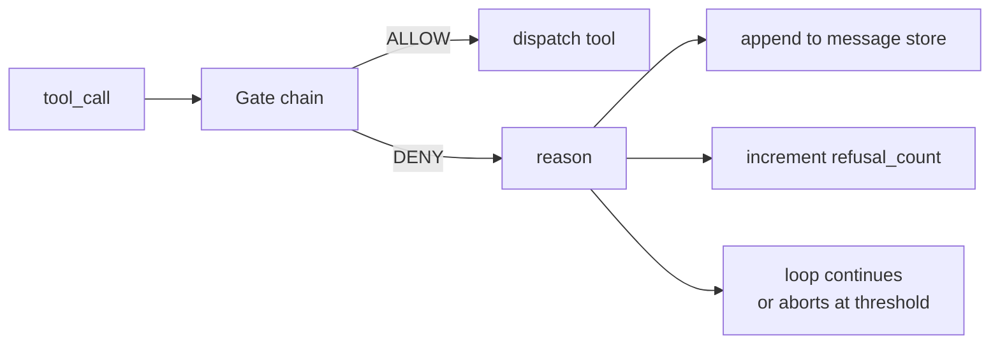
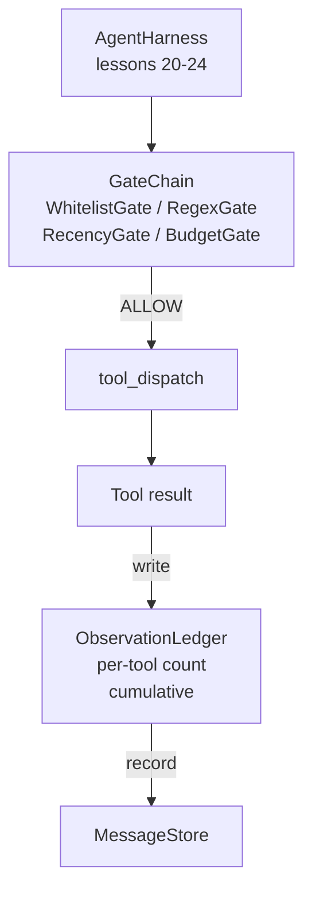

# Lekcja 25: Bramki weryfikacyjne i budżet obserwacji

> Harness agenta bez warstwy weryfikacji to życzenie w płaszczu. Ta lekcja buduje deterministyczny łańcuch bramek, który decyduje, czy wywołanie narzędzia może zostać uruchomione, ile jego wyniku agent może zobaczyć i kiedy pętla musi się zatrzymać, ponieważ agent przeczytał za dużo. Łańcuch składa się z małych, nazwanych bramek oraz rejestru obserwacji śledzącego każdy token pokazany modelowi.

**Typ:** Budowa
**Języki:** Python (stdlib)
**Wymagania wstępne:** Faza 19 · 20-24 (Ścieżka A1: pętla agenta, rejestr narzędzi, magazyn wiadomości, konstruktor promptów, router modeli), Faza 14 · 33 (instrukcje jako ograniczenia), Faza 14 · 36 (kontrakty zakresów), Faza 14 · 38 (bramki weryfikacyjne)
**Czas:** ~90 minut

## Cele nauczania

- Zbudować protokół `VerificationGate` z deterministyczną metodą `evaluate(call)`.
- Złożyć bramki budżetu, świeżości, białej listy i regex w łańcuch z semantyką wcześniejszego zakończenia.
- Śledzić każdą obserwację przez `ObservationLedger` kluczowany narzędziem i turą.
- Odmówić wywołania narzędzia, gdy skumulowany budżet obserwacji zostałby przekroczony.
- Udostępnić strukturalny rekord `GateDecision`, który downstreamowa obserwowalność może wchłonąć.

## Problem

Gdy harness agenta pozwala modelowi swobodnie wywoływać narzędzia, w ciągu pierwszej godziny rzeczywistego użytkowania pojawiają się trzy klasy błędów.

Pierwsza to nieograniczona obserwacja. Grep przez repozytorium o 200 tysiącach linii zrzuca pół miliona tokenów wyniku do następnej tury. Model widzi jedno dopasowanie na kilobajt, a reszta kontekstu jest zmarnowana. Rachunek za tokeny jest duży, a agent jest gorszy, a nie lepszy w zadaniu.

Druga to nieaktualność. Długotrwałe zadanie gromadzi pięćdziesiąt wywołań narzędzi. Model ponownie czyta pierwszy read_file z tury trzeciej, jakby to był aktualny stan. Edycje dokonane w turze czterdzieści siedem nigdy się nie pojawiają, ponieważ konstruktor promptów serializował najwcześniejsze obserwacje jako pierwsze.

Trzecia to eskalacja uprawnień. Zadanie badawcze zaczyna od wywołania `web_search`, a potem jakoś kończy uruchamiając `shell`, ponieważ model wymyślił nazwę narzędzia, a harness domyślnie był permisywny. Zanim ktokolwiek przeczyta ślad, w /tmp leży śmieciowy plik, a curl wykonał zapytanie do prywatnego API.

Bramka weryfikacyjna to komponent harnessa, który mówi nie. To nie jest model. To nie jest sędzia. To deterministyczna funkcja `(call, history, ledger)`, która zwraca ALLOW lub DENY z uzasadnieniem. Uzasadnienie jest rejestrowane. Model jest informowany. Pętla kontynuuje lub przerywa.

## Koncepcja



Bramka to wszystko, co ma metodę `evaluate(call, ctx) -> GateDecision`. Łańcuch to uporządkowana lista. Ocena kończy się wcześniej przy pierwszym deny. Kolejność ma znaczenie: tanie bramki strukturalne uruchamiają się przed kosztownymi bramkami liczącymi tokeny.

Ta lekcja dostarcza cztery bramki:

- `WhitelistGate`. Dozwolone nazwy narzędzi to jawny zbiór. Wszystko poza nim jest odrzucane. To najtańsza bramka i uruchamia się pierwsza.
- `RegexGate`. Argumenty narzędzia są dopasowywane do wyrażenia regularnego. Przydatne do odrzucania wywołań shell z `rm -rf` w środku lub wywołań HTTP do wewnętrznych IP. Działa czysto na ładunku wywołania.
- `RecencyGate`. Model widzi tylko obserwacje z ostatnich N tur. Starsze obserwacje są maskowane. Bramka odrzuca wywołanie narzędzia, którego wynik rozszerzyłby okno obserwacji, które już straciło aktualność.
- `BudgetGate`. Skumulowane tokeny, które model przeczytał w całej sesji, mają pułap. Gdy rejestr mówi, że pułap został osiągnięty, każde dalsze wywołanie narzędzia jest odrzucane.

Rejestr obserwacji to księgowość. Każde udane wywołanie narzędzia zapisuje jeden wiersz: nazwa narzędzia, tura, wyemitowane tokeny, suma skumulowana. Rejestr odpowiada na dwa pytania: ile model widział łącznie i ile widział z narzędzia X. Bramka budżetu odczytuje pierwsze. Bramka budżetu na narzędzie, którą napiszesz jako ćwiczenie, odczytuje drugie.

## Architektura



Harness pyta łańcuch. Łańcuch albo kiwa głową, albo odmawia. Jeśli kiwa, narzędzie uruchamia się, rejestr tyka, a wynik jest dołączany do magazynu wiadomości. Jeśli odmawia, model otrzymuje odmowę jako wiadomość systemową, a pętla decyduje, czy ponowić, czy przerwać.

## Co zbudujesz

Implementacja to pojedynczy `main.py` plus testy.

1. Dataklasy `Observation` i `ToolCall` definiują kształty danych.
2. `ObservationLedger` rejestruje wiersze `(turn, tool, tokens)` i odpowiada na `cumulative()` oraz `per_tool(name)`.
3. `GateDecision` przenosi `(allow, reason, gate_name)`.
4. `VerificationGate` to protokół. Każda bramka implementuje `evaluate(call, ctx)`.
5. `GateChain` opakowuje uporządkowaną listę. Wywołuje każdą bramkę, zwraca pierwsze deny lub zezwala, jeśli każda bramka przepuści.
6. Demo uruchamia małą syntetyczną pętlę agenta. Trzy tury. Trzecia tura uruchamia bramkę budżetu, a pętla zgłasza czystą odmowę z niezerową liczbą odmów.

Licznik tokenów jest celowo głupią heurystyką `len(text) // 4`. Celem tej lekcji jest hydraulika bramek, a nie tokenizer. W produkcji wstaw prawdziwy tokenizer.

## Dlaczego kolejność łańcucha ma znaczenie

Deny jest tańsze niż allow. `WhitelistGate` działa w O(1) wyszukiwania w haszmapie. `RegexGate` działa w O(pattern * argv). `RecencyGate` czyta mały wycinek magazynu wiadomości. `BudgetGate` czyta cały rejestr. Porządkujesz je według rosnącego kosztu, aby odrzucone wywołanie kończyło się wcześniej przed wykonaniem kosztownej pracy.

Porządkujesz je również według promienia rażenia. Biała lista to najsilniejsze twierdzenie: to narzędzie nie jest w kontrakcie. Bramka regex jest następna: ten argument nie jest w kontrakcie. Świeżość jest później: harness wciąż dba, ale wywołanie jest strukturalnie legalne. Budżet jest ostatni, ponieważ z definicji uruchamia się tylko wtedy, gdy wszystko inne przeszło.

## Jak to się łączy z resztą Ścieżki A

Poprzednie lekcje dały ci pętlę, rejestr narzędzi, magazyn wiadomości, konstruktor promptów i router modeli. Ta lekcja dodaje warstwę między modelem a narzędziami. Lekcja 26 dostarcza piaskownicę, której dyspozytor przekazuje wywołanie narzędzia, gdy łańcuch bramek powie ALLOW. Lekcja 27 dostarcza harness ewaluacyjny, który rejestruje liczbę odmów jako sygnał jakości. Lekcja 28 podłącza decyzje bramek do spanów OpenTelemetry. Lekcja 29 łączy to wszystko w działającego agenta kodującego.

## Uruchamianie

```bash
cd phases/19-capstone-projects/25-verification-gates-observation-budget
python3 code/main.py
python3 -m pytest code/tests/ -v
```

Demo drukuje ślad tu-ra-po-turze, w tym każdą decyzję bramki, i kończy z kodem zero. Testy obejmują rejestr, każdą bramkę w izolacji, wcześniejsze zakończenie łańcucha i syntetyczną pętlę end-to-end.