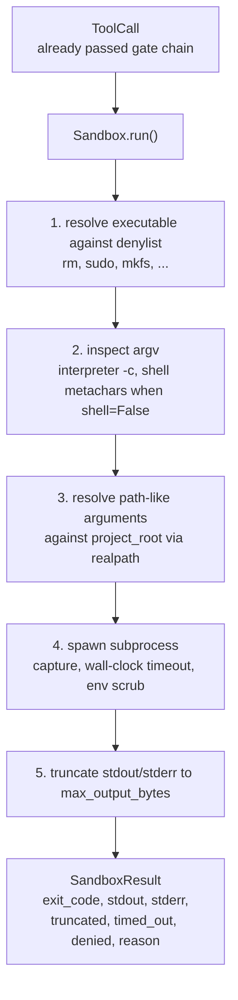
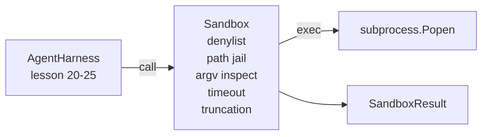

# Lekcja 26: Piaskownica z listą zabronioną i więzieniem ścieżek

> Bramka weryfikacyjna decyduje, czy wywołanie narzędzia powinno zostać uruchomione. Piaskownica decyduje, co się stanie, gdy tak się stanie. Ta lekcja dostarcza uruchamiacz podprocesów, który odmawia niebezpiecznych plików wykonywalnych, odmawia niebezpiecznych kształtów argv, zamyka każdą ścieżkę pliku w katalogu głównym projektu, obcina zbyt duże wyjście i zabija niekontrolowane procesy po przekroczeniu czasu. To druga z dwóch warstw między modelem a systemem operacyjnym.

**Typ:** Budowa
**Języki:** Python (stdlib)
**Wymagania wstępne:** Faza 19 · 25 (bramki weryfikacyjne i budżet obserwacji), Faza 14 · 33 (instrukcje jako ograniczenia), Faza 14 · 38 (bramki weryfikacyjne)
**Czas:** ~90 minut

## Cele nauczania

- Zbudować klasę `Sandbox` opakowującą `subprocess.run` z limitem czasu, przechwytywaniem i obcinaniem.
- Odmówić polecenia według nazwy z listy zabronionej i według struktury przez inspektora argv.
- Odmówić każdego argumentu ścieżki, który rozwiązuje się poza zadeklarowanym katalogiem głównym projektu.
- Odmówić metaznaków powłoki, gdy tryb powłoki jest wyłączony.
- Zwrócić strukturalny `SandboxResult`, który downstreamowa obserwowalność i harness ewaluacyjny mogą wchłonąć.

## Problem

Agent kodujący, który może uruchamiać polecenia, może instalować backdoory, eksfiltrować klucze, niszczyć laptopa programisty i generować rachunek za chmurę w jednej turze. Najtańszą obroną jest nie dawanie mu powłoki. Drugą najtańszą jest piaskownica, która mówi nie precyzyjnej liście wzorców.

Trzy klasy awarii powtarzają się w śladach agentów.

Pierwsza to niebezpieczne pliki wykonywalne. Model pod presją, aby naprawić problem ze ścieżką, spróbuje `sudo`, `chmod -R 777`, `rm -rf`, `mkfs`, `dd`. Żadne z nich nie należy do działania agenta. Lista zabroniona łapie je po nazwie i aliasie.

Druga to sztuczki z argv. Model, któremu powiedziano, że nie ma powłoki, przepuści atak przez interpreter: `python3 -c "import os; os.system('rm -rf /')"`, `bash -c '...'`, `node -e '...'`, `perl -e '...'`. Piaskownica musi wiedzieć, że każdy interpreter uruchomiony z flagą `-c`-podobną to tylko wywołanie powłoki z dodatkowymi krokami.

Trzecia to ucieczka ścieżki. Model ma odczytać `./src/main.py`, a zamiast tego czyta `../../etc/passwd`. Piaskownica zamyka każdy argument ścieżki, rozwiązując go przez `os.path.realpath` i sprawdzając prefiks.

Piaskownica nie jest granicą bezpieczeństwa w sensie systemu operacyjnego. Zdeterminowany atakujący z wykonaniem kodu może się z niej wydostać. Piaskownica jest zabezpieczeniem deweloperskim: sprawia, że typowe tryby awarii są głośne i powstrzymuje agenta przed wyrządzaniem szkód z czystej nieudolności.

## Koncepcja



Piaskownica ma cztery osie odmowy: nazwa, argv, ścieżka, struktura. Każda oś jest czystą funkcją wywołania, jeszcze bez podprocesu. Podproces uruchamiany jest dopiero po przejściu każdej osi.

Kody wyjścia `SandboxResult` są konwencjonalne: 0 sukces, niezerowe niepowodzenie, plus trzy kody wartownicze dla odmowy (-100), przekroczenia czasu (-101) i obcięcia (kod wyjścia jest prawdziwy, z ustawioną flagą). Kolejne lekcje czytają ten strukturalny wynik zamiast parsować stderr.

## Architektura



Lista zabroniona to zamrożony zbiór nazw plików wykonywalnych. Aliasy (`/bin/rm`, `/usr/bin/rm`) wszystkie rozwiązują się do tej samej nazwy. Inspektor argv zna kształt interpretera: każdy argv, gdzie argv[0] jest interpretrem, a któryś późniejszy argument zaczyna się od `-c` lub `-e`, jest odrzucany. Metaznaki powłoki (`;`, `|`, `&`, `>`, `<`, backticki, `$()`) powodują odmowę, gdy wywołanie nie jawnie zażądało powłoki.

Więzienie ścieżek to najbardziej subtelny element. Piaskownica przyjmuje `project_root` przy konstrukcji. Każdy argument, który wygląda jak ścieżka (zawiera `/` lub pasuje do istniejącego pliku), jest normalizowany przez `os.path.realpath`, a następnie sprawdzany względem realpath katalogu głównego projektu. Jeśli rozwiązany cel znajduje się poza katalogiem głównym, następuje odmowa. Próby ucieczki przez dowiązania symboliczne (dowiązanie w katalogu głównym projektu wskazujące na zewnątrz) są blokowane przez sprawdzanie realpath, a nie dosłownej ścieżki.

## Co zbudujesz

Implementacja to `main.py` plus katalog testów.

1. Dataklasa `SandboxResult`: exit_code, stdout, stderr, truncated, timed_out, denied, reason, duration_ms.
2. Dataklasa `SandboxConfig`: project_root, max_output_bytes, timeout_seconds, denylist, interpreter_block.
3. Klasa `Sandbox`: `run(argv, *, shell=False, cwd=None)` zwraca `SandboxResult`.
4. Wewnętrzne pomocniki odmowy: `_check_executable_denylist`, `_check_argv_interpreter`, `_check_shell_metachars`, `_check_path_jail`.
5. Obcinanie wyjścia z wyraźną flagą `truncated` i linią znacznikową w przechwyconym strumieniu.
6. Demo na dole: sekwencja legalnych i adversarialnych wywołań. Każde jest pokazane z wynikiem.

Piaskownica używa `subprocess.run` z `shell=False` domyślnie i `capture_output=True`. Limit czasu używa argumentu `timeout`; po `TimeoutExpired` piaskownica zabija grupę procesów i syntetyzuje SandboxResult.

## Dlaczego to nie jest prawdziwa piaskownica

Piaskownica z lekcji nie używa przestrzeni nazw, cgroups, seccomp, gVisor, Firecracker ani żadnej izolacji na poziomie jądra. Cokolwiek podproces może zrobić, piaskownica może zrobić. Ochrona jest strukturalna: agentowi odmawia się najczęstszych niebezpiecznych wywołań, a głośna odmowa trafia do obserwowalności zamiast cichego uruchomienia.

Dla produkcyjnych agentów dokładasz na wierzchu: uruchom w nieuprzywilejowanym kontenerze Docker, uruchom w mikroVM, usuń możliwości, zamontuj katalog główny projektu tylko do odczytu a katalog roboczy do odczytu-zapisu, ustaw ulimit na pamięć i CPU, wyczyść środowisko do znanej bezpiecznej białej listy. Lekcja 29 robi część z tego. Izolacja na poziomie systemu operacyjnego jest poza zakresem tej lekcji.

## Uruchamianie

```bash
cd phases/19-capstone-projects/26-sandbox-runner-denylist
python3 code/main.py
python3 -m pytest code/tests/ -v
```

Demo tworzy tymczasowy katalog, umieszcza w nim czysty plik, a następnie uruchamia baterię wywołań. Legalne wywołania udają się. Odrzucone wywołania zwracają SandboxResult z `denied=True` i uzasadnieniem. Przekroczenia czasu zwracają `timed_out=True`. Obcięcie ustawia `truncated=True`. Demo drukuje tabelę JSON wyników i kończy z kodem zero.

## Jak to się łączy z resztą Ścieżki A

Lekcja 25 stworzyła łańcuch bramek. Lekcja 26 to executor uruchamiany po bramce ALLOW. Lekcja 27 to harness ewaluacyjny porównujący wyniki piaskownicy z oczekiwanym kodem wyjścia na zadanie. Lekcja 28 emituje span `gen_ai.tool.execution` wokół każdej invokacji `Sandbox.run`. Lekcja 29 to demo end-to-end łączące prawdziwego agenta kodującego przez obie warstwy.