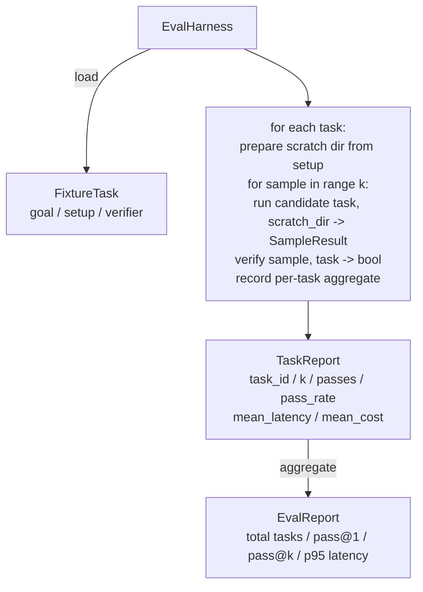

# Lekcja 27: Harness ewaluacyjny z zadaniami testowymi

> Agent kodujący jest tak dobry, jak zestaw zadań, względem których go mierzysz. Ta lekcja buduje harness ewaluacyjny, który przyjmuje folder zadań testowych, uruchamia każde przez kandydata agenta, ocenia zaliczenie/niezaliczenie przez deterministyczny weryfikator i agreguje wyniki do pass@1, pass@k, średniego opóźnienia i średniego kosztu. Harness jest źródłem prawdy, które pozwala odróżnić regresję od refaktoryzacji.

**Typ:** Budowa
**Języki:** Python (stdlib)
**Wymagania wstępne:** Faza 19 · 25 (bramki weryfikacyjne), Faza 19 · 26 (piaskownica), Faza 14 · 30 (ewaluacyjny rozwój agenta), Faza 14 · 19 (benchmarki SWE-bench i GAIA)
**Czas:** ~90 minut

## Cele nauczania

- Zdefiniować zadanie testowe jako trójkę: cel, konfiguracja i weryfikator.
- Ocenić wiele próbek na zadanie i obliczyć pass@1 i pass@k.
- Agregować opóźnienie i koszt do średnich i percentyla 95.
- Zaimplementować deterministyczne weryfikatory (diff pliku, kod wyjścia, dopasowanie regex) jako wielokrotnego użytku funkcje.
- Wyemitować strukturalny raport JSON, który skrypt śledzący regresje może wchłonąć.

## Problem

Trzy tryby awarii nękają benchmarki agentów zbudowane bez harnessa ewaluacyjnego.

Pierwszy to niezweryfikowane zaliczenie. Agent mówi, że naprawił błąd, człowiek rzuca okiem na diffa, zestaw jest oznaczony jako zielony, a trzy tygodnie później test regresyjny ujawnia ten sam błąd. Agent rozumował wiarygodnie, niczego faktycznie nie naprawiając.

Drugi to niewykryta regresja. Zmiana w szablonie prompta sprawia, że agent jest o 4% lepszy w głośnym zadaniu i o 14% gorszy w cichym. Bez zestawu złotych zadań i wyniku na zadanie, regresja wjeżdża do maina i ujawnia się dopiero, gdy klient narzeka.

Trzeci to dryf zadań. Ewaluacja została uruchomiona w poniedziałek na 100 zadaniach, a w piątek na 95 z nich, ponieważ ktoś zmienił nazwę pięciu testów. Wskaźnik zaliczeń wygląda jak 5% poprawa. Nie jest.

Harness to program, który zamienia te awarie w fakty. Uruchamia każde zadanie, za każdym razem, w powtarzalnej kolejności, względem weryfikatora, który zwraca prawdę lub fałsz na podstawie deterministycznego sprawdzenia.

## Koncepcja

```mermaid
flowchart LR
  F1[fixtures/task_001/<br/>task.json + expected/] --> Harness
  F2[fixtures/task_002/<br/>...] --> Harness
  Harness[Harness<br/>for each task:<br/>setup / run agent k samples /<br/>verify each sample /<br/>record latency, cost]
  Harness --> Report[EvalReport<br/>pass@1 / pass@k<br/>mean ms / p95 ms<br/>mean cost]
```

`FixtureTask` to mały plik JSON plus opcjonalny katalog `expected/`. JSON deklaruje `id`, `goal` (prompt podawany agentowi), blok `setup` (pliki do umieszczenia w katalogu roboczym) i blok `verifier`. Blok weryfikatora nazywa funkcję w rejestrze weryfikatorów harnessa i dostarcza jej argumenty.

Trzy kształty weryfikatorów pokrywają większość użytecznych zadań.

Pierwszy to `file_equals`. Po uruchomieniu agenta porównaj nazwany plik z oczekiwaną treścią. To łapie zadania "napraw ten błąd w dokładnie ten sposób."

Drugi to `regex_match`. Zawartość nazwanego pliku jest dopasowywana do wyrażenia regularnego. To łapie zadania "funkcja musi istnieć i zwracać X", gdzie jest wiele akceptowalnych rozwiązań.

Trzeci to `shell_exit_zero`. Harness uruchamia polecenie powłoki (przez piaskownicę z lekcji 26) i zalicza zadanie tylko wtedy, gdy polecenie kończy się kodem zero. To łapie zadania "testy muszą przejść."

Harness uruchamia każde zadanie `k` razy. Pass@k to `1 - (1 - p)^k` gdzie p to empiryczny wskaźnik zaliczeń; harness raportuje również surowe liczby, aby można było dostrzec wariancję. Opóźnienie to czas rzeczywisty na próbkę. Koszt to cokolwiek agent sam zgłosi (liczba tokenów, USD lub oba); harness sumuje go w próbkach i prezentuje liczby na zadanie i zagregowane.

```figure
pass-at-k
```

## Architektura



Kandydat jest wywoływalny: `Callable[[FixtureTask, str], SampleResult]`. Harness tworzy katalog roboczy przez `tempfile.mkdtemp()` i przekazuje jego ścieżkę jako zwykły string. Harness nie dba o to, jak kandydat działa. Kandydat może być deterministycznym aplikatorem poprawek (przydatny do autotestów harnessa), prawdziwym agentem LLM, fuzzerem. Kontraktem jest SampleResult.

## Co zbudujesz

`main.py` dostarcza:

1. Dataklasę `FixtureTask`.
2. Dataklasę `SampleResult`: success_self_reported, latency_ms, cost_units, edits.
3. Dataklasy `TaskReport`, `EvalReport` z `to_dict()`.
4. `VerifierRegistry` mapujący nazwę weryfikatora na funkcję. Wbudowane weryfikatory: file_equals, regex_match, shell_exit_zero.
5. Klasę `EvalHarness`. Uruchamia katalog zadań względem kandydata. Zwraca EvalReport.
6. Pięć zadań testowych w `tasks/`:
   - off-by-one w `fizzbuzz`
   - brakujący return w `factorial`
   - literówka w komunikacie błędu
   - puste ciało funkcji
   - off-by-one w przechodzeniu listy powiązanej
7. Deterministycznego kandydata referencyjnego (`apply_known_fixes`), którego harness używa do zademonstrowania czystego pass@1 równego 1.0.
8. Demo drukujące EvalReport jako JSON i kończące z kodem zero.

Zadania testowe są dostarczone jako pliki JSON w `tasks/` plus sparowane pliki źródłowe w `tasks/<id>/buggy/` i `tasks/<id>/expected/`. Harness kopiuje buggy do katalogu roboczego, przekazuje go kandydatowi i weryfikuje względem expected.

## Dlaczego pass@k, a nie tylko pass@1

Prawdziwe agenty LLM są stochastyczne. pass@1 wynoszący 0.6 wygląda jak porażka. pass@5 wynoszący 0.95 mówi, że agent dostaje poprawną odpowiedź przez większość czasu, ale wybiera źle na wczesnych próbkach. Rozwiązaniem jest próbkowanie i rankingowanie, a nie zawsze więcej treningu. Pass@k to ujawnia.

Pass@k jest raportowany obok pass@1, ponieważ pass@k maskuje prawdziwą porażkę: jeśli model dostaje poprawną odpowiedź raz na dwadzieścia prób, nie masz użytecznego agenta. Harness pokazuje oba.

## Jak to się łączy z resztą Ścieżki A

Lekcja 25 stworzyła łańcuch bramek. Lekcja 26 stworzyła piaskownicę. Harness używa piaskownicy dla każdego weryfikatora `shell_exit_zero`. Lekcja 28 opakowuje każde uruchomienie harnessa w ślad OTel. Lekcja 29 uruchamia demo end-to-end na jednym z dołączonych testów i sprawdza pass@1 = 1.0 dla kandydata referencyjnego.

## Uruchamianie

```bash
cd phases/19-capstone-projects/27-eval-harness-fixture-tasks
python3 code/main.py
python3 -m pytest code/tests/ -v
```

Demo drukuje EvalReport w JSON, w tym pass@1, pass@5, średnie opóźnienie i podział na zadania. Kod wyjścia to zero. Testy obejmują funkcje weryfikatorów, matematykę pass@k, ładowanie testów i harness end-to-end względem dołączonego kandydata referencyjnego.