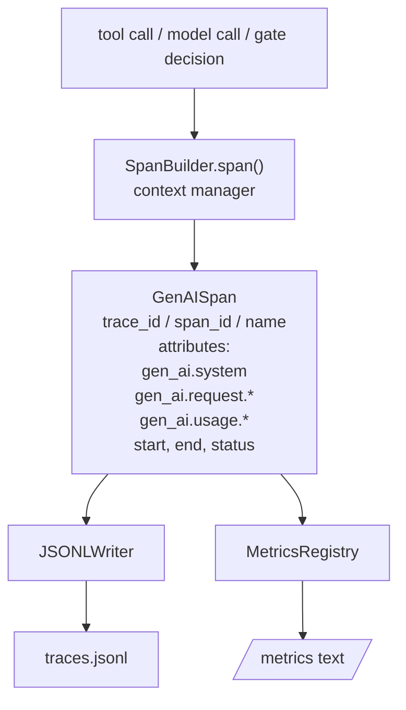
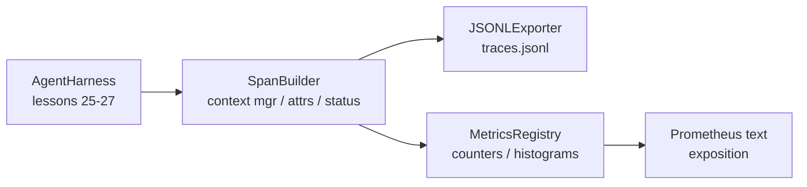

# Lekcja 28: Obserwowalność z OTel GenAI Spanami i Metrykami Prometheus

> Harness agenta bez obserwowalności to czarna skrzynka, która kosztuje pieniądze. Ta lekcja ręcznie tworzy konstruktor spanów, który emituje rekordy zgodne z semantycznymi konwencjami OpenTelemetry GenAI, zapisuje je do pliku JSON-Lines, jeden span na linię, i udostępnia liczniki oraz histogramy w formacie tekstowym Prometheus. Całość to stdlib Python i działa offline.

**Typ:** Budowa
**Języki:** Python (stdlib)
**Wymagania wstępne:** Faza 19 · 25 (bramki weryfikacyjne), Faza 19 · 26 (piaskownica), Faza 19 · 27 (harness ewaluacyjny), Faza 13 · 20 (OpenTelemetry GenAI), Faza 14 · 23 (konwencje OTel GenAI)
**Czas:** ~90 minut

## Cele nauczania

- Zbudować dataklasę spana zgodną z semantycznymi konwencjami OpenTelemetry GenAI.
- Zaimplementować eksporter JSONL zapisujący jeden samodzielny span na linię.
- Zbudować liczniki i histogramy z etykietami i ekspozycją w formacie tekstowym Prometheus.
- Owinąć dowolny wywoływalny w menedżer kontekstu spana rejestrujący czas trwania, status i wyjątki.
- Zweryfikować, że wyemitowane spany przechodzą przez `json.loads` i pasują do kształtu specyfikacji.

## Problem

Agent kodujący w produkcji produkuje trzy klasy artefaktów w każdej turze: wywołanie modelu, wykonanie narzędzia i decyzję bramki weryfikacyjnej. Żaden z nich nie jest użyteczny bez strukturalnej telemetrii.

Pierwszy tryb awarii to brakujący ślad. Coś poszło nie tak we wtorek, ale jedynym zapisem jest 500-liniowy dziennik czatu. Nie ma zapisu, które narzędzie działało, jak długo trwało, ile tokenów trafiło do prompta ani czy bramka czegokolwiek odmówiła. Autor agenta musi zgadywać.

Drugi tryb awarii to nieparsowalny ślad. Harness pisał spany, ale używał własnych, ad-hoc nazw pól. Nic w Grafan, Honeycomb, Jaeger ani lokalnym CLI nie może ich odczytać. Jakiekolwiek narzędzia istnieją w stosie zespołu są marnowane, ponieważ spany są niestandardowe.

Trzeci tryb awarii to niezagregowana metryka. Możesz zobaczyć jedno wolne wywołanie narzędzia w śladzie, ale nie możesz odpowiedzieć na pytanie "jaka jest latencja p95 wywołań read_file w ciągu ostatniej godziny?" ponieważ istnieją tylko ślady, nie metryki.

Semantyczne konwencje OpenTelemetry GenAI istnieją właśnie po to. Definiują mały zestaw standardowych atrybutów, które emitery spanów we wszystkich frameworkach LLM udostępniają. Jeśli twój harness zapisuje te atrybuty, każdy backend kompatybilny z OTel może je odczytać.

## Koncepcja



Każda operacja w harnessie produkuje span. Span ma identyfikator śladu (cała invokacja agenta), identyfikator spana (ta jedna operacja), nazwę (np. `gen_ai.chat`, `gen_ai.tool.execution`), atrybuty zgodne z konwencjami GenAI, czas rozpoczęcia i zakończenia oraz status.

Konwencje GenAI standaryzują te klucze atrybutów: `gen_ai.system` (który dostawca, np. `anthropic`, `openai`), `gen_ai.request.model` (identyfikator modelu), `gen_ai.request.max_tokens`, `gen_ai.usage.input_tokens`, `gen_ai.usage.output_tokens`, `gen_ai.response.model`, `gen_ai.response.id`, `gen_ai.operation.name`, plus klucze specyficzne dla narzędzi `gen_ai.tool.name` i `gen_ai.tool.call.id`.

Eksporter zapisuje JSONL. Jeden obiekt JSON na linię. To najprostszy możliwy format, który downstreamowe narzędzia mogą strumieniować, grepować i importować. Prawdziwy eksporter OTel mówiłby OTLP gRPC; eksporter JSONL z lekcji to odpowiednik offline i kończy się z kodem zero na każdej stacji roboczej.

Metryki żyją obok śladów. Licznik zwiększa się przy każdym wywołaniu narzędzia: `tools_called_total{tool="read_file"}`. Histogram rejestruje obserwowane opóźnienie: `tool_latency_ms{tool="read_file"}`. Oba serializują się do formatu ekspozycji tekstowej Prometheus, który jest de facto standardem dla metryk opartych na pullu.

```figure
trace-spans
```

## Architektura



Konstruktor spanów to mała klasa z metodą `span(name, attrs)` zwracającą menedżer kontekstu. Menedżer kontekstu rejestruje czas rozpoczęcia przy wejściu, czas zakończenia przy wyjściu, dołącza wyjątek, jeśli został podniesiony, i wypycha sfinalizowany span do eksportera.

Rejestr metryk to dwa słowniki. Liczniki to `{(name, frozen_labels): int}`. Histogramy przechowują surowe próbki na liście i serializują do kubełków histogramu Prometheus w momencie ekspozycji.

## Co zbudujesz

`main.py` dostarcza:

1. Dataklasę `GenAISpan`: trace_id, span_id, parent_span_id, name, attributes, start_unix_nano, end_unix_nano, status, status_message, events.
2. Klasę `SpanBuilder` z menedżerem kontekstu `span(name, attrs, parent=None)`.
3. Klasę `JSONLExporter` z `export(span)` dołączającym jedną linię.
4. Klasy `Counter` i `Histogram` plus `MetricsRegistry`.
5. `prometheus_exposition(registry)` produkujące wyjście w formacie tekstowym.
6. Dekorator `wrap_tool_call(name)` emitujący span i aktualizujący metryki.
7. Demo: syntetyzuje kompletną invokację agenta (span gen_ai.chat wokół spanów narzędzi), zapisuje traces.jsonl, drukuje ekspozycję Prometheus, kończy z kodem zero.

Identyfikatory spanów i śladów to 16-bajtowe szesnastkowe stringi, generowane z `os.urandom`. To pasuje do kontekstu śledzenia W3C OTel. Eksporter nigdy nie rzuca; błędy IO są ujawniane, ale harness kontynuuje działanie.

Histogram ma stały zestaw kubełków (domyślne OTel dla latencji w milisekundach: 5, 10, 25, 50, 100, 250, 500, 1000, 2500, 5000, 10000, +Inf). Próbki są przechowywane jako lista; ekspozycja oblicza liczby na kubełek na żądanie.

## Dlaczego ręcznie robione zamiast opentelemetry-sdk

OTel Python SDK to prawdziwa zależność. To także kilka tysięcy linii kodu, wiele procesów dla eksportera OTLP i koszt uruchomieniowy, który zalewa budżet lekcji. Ręcznie robiona wersja uczy formatu danych. W produkcji podłączasz te same atrybuty do prawdziwego SDK i dostajesz eksporter OTLP, batchowanie i wykrywanie zasobów za darmo.

Konwencje są stabilne. Format danych, który lekcja emituje, będzie parsowalny w 2030 roku, ponieważ OTel nigdy nie psuje nazw atrybutów GenAI; tylko dodaje nowe.

## Jak to się łączy z resztą Ścieżki A

Lekcja 25 stworzyła łańcuch bramek. Lekcja 26 stworzyła piaskownicę. Lekcja 27 stworzyła harness ewaluacyjny. Lekcja 28 czyni wszystkie trzy obserwowalnymi. Lekcja 29 opakowuje każdy krok dema end-to-end w spany i drukuje tekst Prometheus na końcu.

## Uruchamianie

```bash
cd phases/19-capstone-projects/28-observability-otel-traces
python3 code/main.py
python3 -m pytest code/tests/ -v
```

Demo emituje `traces.jsonl` w katalogu roboczym lekcji (sprzątany na końcu), następnie drukuje próbkę trzech spanów, a następnie drukuje ekspozycję Prometheus dla liczników i histogramów. Testy weryfikują, że spany serializują się w obie strony, że kanoniczne atrybuty GenAI są obecne, że liczniki zwiększają się poprawnie i że ekspozycja histogramu zawiera oczekiwane liczby w kubełkach.