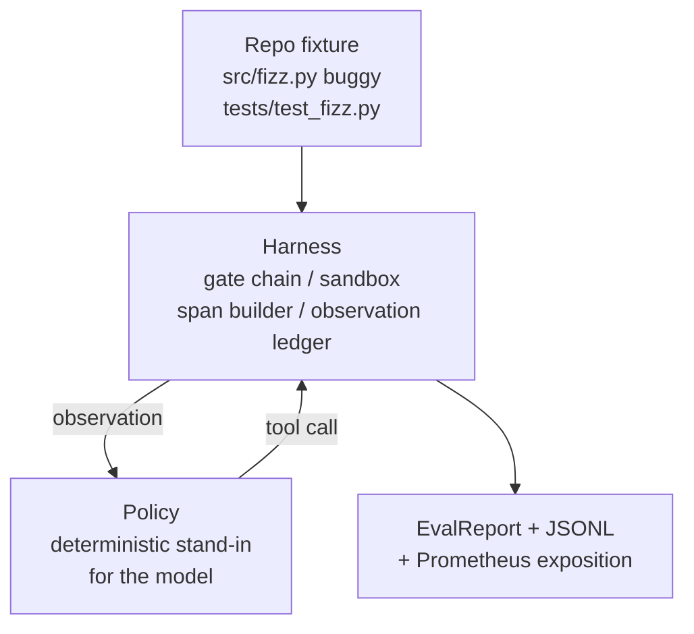
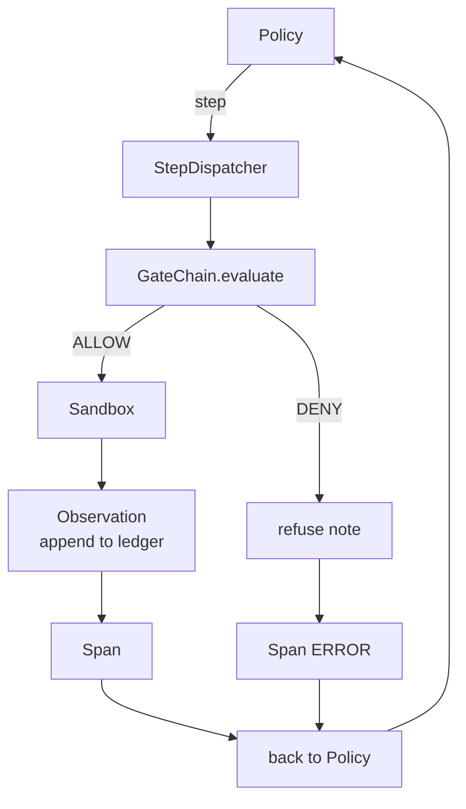

# Lekcja 29: End-to-End Agent Kodujący na Harnessie

> Wypłata Ścieżki A. Ta lekcja łączy łańcuch bramek, piaskownicę, harness ewaluacyjny i spany OTel w jednego działającego agenta kodującego, który naprawia prawdziwy (mały, w skali testu) błąd w wieloplikowym projekcie Python. Agent to deterministyczna polityka, a nie LLM; to podstawienie sprawia, że lekcja jest powtarzalna i pokazuje, że harness był interesującą częścią przez cały czas. Kontrakt jest identyczny: prawdziwy model podłącza się w miejscu polityki.

**Typ:** Budowa
**Języki:** Python (stdlib)
**Wymagania wstępne:** Faza 19 · 25 (bramki weryfikacyjne), Faza 19 · 26 (piaskownica), Faza 19 · 27 (harness ewaluacyjny), Faza 19 · 28 (obserwowalność), Faza 14 · 38 (bramki weryfikacyjne), Faza 14 · 41 (warsztat dla prawdziwych repozytoriów), Faza 14 · 42 (warsztat agenta capstone)
**Czas:** ~90 minut

## Cele nauczania

- Złożyć łańcuch bramek, piaskownicę, harness ewaluacyjny i konstruktor spanów w jedną pętlę agenta.
- Zaimplementować deterministyczną politykę używającą read_file, run_tests i write_file do naprawy błędu w teście.
- Egzekwować globalny budżet kroków plus budżet tokenów obserwacji w całym uruchomieniu end-to-end.
- Wyemitować kompletne ślady OTel GenAI i metryki Prometheus dla pełnego uruchomienia.
- Zweryfikować, że agent rozwiązuje test w mniej niż 12 krokach z zerowymi uruchomieniami bramek na legalnych narzędziach.

## Problem

Większość dem agentów działa w izolacji: piaskownica osobno, harness ewaluacyjny osobno, emiter spanów osobno. Wyglądają dobrze. Złóż je razem, a szwy stają się widoczne.

Łańcuch bramek mówi ALLOW, ale piaskownica odmawia z powodu, którego łańcuch nie przewidział. Harness ewaluacyjny rejestruje zaliczenie, ale spany OTel mówią, że bramka odrzuciła narzędzie, którego agent twierdzi, że użył. Licznik Prometheus jest zwiększany dwa razy, gdy powinien być zwiększany raz. Budżet obserwacji został przekroczony, ale agent kontynuował, ponieważ budżet był śledzony w łańcuchu, a piaskownica nie wiedziała.

Ta lekcja to test integracyjny dla całej ścieżki. Agent musi zrobić cztery rzeczy w kolejności: odczytać projekt, uruchomić testy, zidentyfikować błąd z niepowodzenia testu, napisać poprawkę, ponownie uruchomić testy i zatrzymać się. Każda operacja przechodzi przez łańcuch bramek. Każde wykonanie narzędzia przechodzi przez piaskownicę. Każdy krok jest owinięty w span. Harness ewaluacyjny punktuje całość na końcu.

## Koncepcja



Polityka agenta to maszyna stanów. Pięć stanów.

`SURVEY`: agent odczytuje listing projektu. Następny stan to RUN_TESTS.

`RUN_TESTS`: agent uruchamia polecenie testowe. Jeśli testy przejdą, maszyna stanów zatrzymuje się z sukcesem. W przeciwnym razie następny stan to INSPECT.

`INSPECT`: agent odczytuje plik źródłowy, który zawodzi. Następny stan to FIX.

`FIX`: agent zapisuje poprawiony plik. Następny stan to VERIFY.

`VERIFY`: agent ponownie uruchamia polecenie testowe. Jeśli testy przejdą, zatrzymaj z sukcesem. W przeciwnym razie zatrzymaj z niepowodzeniem.

Każdy stan odpowiada wywołaniu narzędzia. Każde wywołanie narzędzia przechodzi przez łańcuch bramek. Jeśli wywołanie narzędzia jest odrzucone, agent zgłasza odmowę w śladzie i zatrzymuje się.

Błąd w teście to off-by-one w `fizz.py`. Deterministyczna polityka wykrywa błąd z komunikatu o niepowodzeniu testu przez regex i emituje poprawiony plik. Zastąpienie polityki LLM nie zmienia kontraktu harnessa.

## Architektura



Lekcja jest samodzielna. Każdy prymityw z poprzedniej lekcji jest zaimplementowany w minimalnej skali w `main.py` (bramka, piaskownica, rejestr, span), aby lekcja działała bez importowania rodzeństwa. Nazwy pasują do lekcji 25-28 dokładnie, więc mapowanie koncepcyjne jest jednoznaczne.

## Co zbudujesz

`main.py` dostarcza:

1. Minimalne prymitywy harnessa, skopiowane z tymi samymi nazwami co lekcje 25-28: `GateChain`, `Sandbox`, `ObservationLedger`, `SpanBuilder`, `MetricsRegistry`.
2. Klasa `CodingAgentPolicy`: maszyna stanów z pięcioma stanami.
3. Pomocnik `Repo`: przygotowuje katalog roboczy z dołączonym błędnym testem.
4. Klasa `AgentRun`: napędza politykę, wysyła przez harness, zwraca `AgentRunReport`.
5. Dołączony test (`fixture_repo/`) z src/fizz.py, tests/test_fizz.py i drzewem expected/ dla harnessa ewaluacyjnego.
6. Demo: uruchamia politykę end-to-end, drukuje ślad krok po kroku, sprawdza zaliczenie, drukuje metryki.

Dołączony test ma ten sam kształt co struktura zadań z lekcji 27: błędny plik i plik testów. Komunikat o niepowodzeniu testu zawiera wystarczająco informacji, aby deterministyczna polityka zidentyfikowała poprawkę. Prawdziwy LLM zrobiłby to samo, wolniej i z szerszym zakresem, ale nie zmieniłby oczekiwań harnessa.

## Dlaczego polityka nie jest LLM

Prawdziwy LLM wymaga klucza API, wywołania sieciowego i niemożliwej do zweryfikowania stochastyczności. Harness to część, na której zależy lekcji. Podstawienie deterministycznej polityki pozwala lekcji działać na każdym laptopie deweloperskim z zerowymi zależnościami zewnętrznymi i pozwala zestawowi testów sprawdzać dokładną liczbę kroków.

Polityka lekcji jest ścisłym podzbiorem tego, co robi agent LLM. Polityka odczytuje repo, widzi zawodzący test, identyfikuje linię i emituje poprawkę. LLM przechodzi przez tę samą pętlę z tym samym kontraktem harnessa; księgowość jest identyczna.

## Co sprawdza demo

Demo end-to-end sprawdza pięć rzeczy w czasie wyjścia, a zestaw testów sprawdza je programowo:

Polityka rozwiązała test w mniej niż 12 krokach.

Budżet obserwacji nigdy nie został przekroczony.

Zero odmów bramek na legalnych narzędziach. (Agent nigdy nie wymyślił odrzuconej nazwy narzędzia.)

Każdy krok ma odpowiadający mu span w traces.jsonl.

Ekspozycja Prometheus zawiera wpis `tools_called_total{tool="read_file"}` i histogram `tool_latency_ms`.

## Jak to się łączy z resztą Ścieżki A

Ta lekcja to integracja. Lekcja 25 napisała łańcuch bramek. Lekcja 26 napisała piaskownicę. Lekcja 27 napisała harness ewaluacyjny. Lekcja 28 napisała obserwowalność. Lekcja 29 dowodzi, że działają jako system. Prawdziwy harness agenta rozszerza się stąd: zamień deterministyczną politykę na model, zamień dołączony test na zadanie z prawdziwego repo, zamień eksporter JSONL na OTLP.

## Uruchamianie

```bash
cd phases/19-capstone-projects/29-end-to-end-coding-task-demo
python3 code/main.py
python3 -m pytest code/tests/ -v
```

Demo drukuje ślad na krok, końcowy raport ewaluacyjny i ekspozycję Prometheus. Kod wyjścia to zero. Testy obejmują tranzycje stanów polityki, odmowy bramek na syntetycznych wywołaniach narzędzi, uruchomienie end-to-end na dołączonym teście i niezmienniki budżetu kroków.