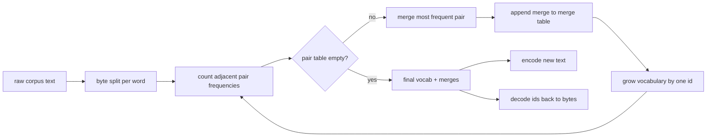
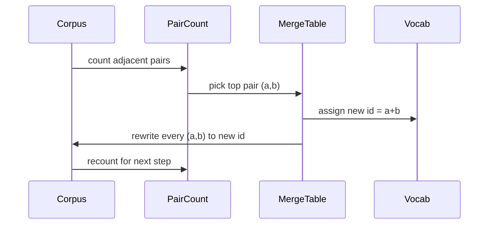

# Tokenizer BPE od podstaw

> Bajty w środku, identyfikatory na wyjściu, identyfikatory z powrotem do tych samych bajtów. Zbuduj tokenizer, od którego każdy nowoczesny model tekstowy wciąż zaczyna.

**Typ:** Budowa
**Języki:** Python
**Wymagania wstępne:** Lekcje Fazy 04, lekcje Fazy 07 o transformerach
**Czas:** ~90 minut

## Cele nauczania
- Wytrenować słownik kodowania par bajtów z surowego korpusu tekstowego poprzez wielokrotne łączenie najczęstszej sąsiedniej pary symboli.
- Zaimplementować deterministyczną tabelę łączeń i zastosować ją do nowego tekstu, aby uzyskać strumień identyfikatorów podslow.
- Wykonać konwersję w obie strony dowolnego wejścia UTF-8 na identyfikatory i z powrotem bez utraty informacji.
- Zarezerwować i chronić specjalne tokeny (`<|endoftext|>`, `<|pad|>`), aby przetrwały trenowanie i dekodowanie.
- Wyjaśnić, dlaczego alfabet na poziomie bajtów jest właściwym podłożem dla tokenizera ogólnego przeznaczenia.

## Ramy

Model językowy nigdy nie widzi tekstu. Widzi liczby całkowite. Mapa z stringa na listę liczb całkowitych i z powrotem to tokenizer. Zrób tę warstwę źle, a każda krzywa straty w treningu mierzy niewłaściwą rzecz.

Dominującą rodziną tokenizerów podslow dla ogólnych modeli tekstowych jest kodowanie par bajtów. Pomysł jest prosty. Zacznij od znanego alfabetu. Znajdź sąsiednią parę symboli, która pojawia się najczęściej w korpusie treningowym. Połącz ją w nowy symbol. Powtarzaj, aż słownik osiągnie docelowy rozmiar. Kodowanie nowego tekstu używa tej samej listy łączeń w tej samej kolejności.

Zbudujemy wariant na poziomie bajtów. Alfabet to 256 surowych bajtów, a nie punktów kodowych Unicode. Ten wybór pozwala tokenizerowi obsługiwać dowolne wejście UTF-8 bez uciekania się do nieznanego tokena.

## Potok

Strona treningowa i strona inferencyjna dzielą tabelę łączeń. To dzielenie jest kontraktem. Jeśli zmienisz kolejność łączeń podczas inferencji, dekodujesz inny strumień identyfikatorów.

## Alfabet bajtów

Pierwsze 256 identyfikatorów jest zarezerwowanych dla surowych bajtów 0x00 do 0xFF. To gwarantuje, że każdy ciąg wejściowy może być wyrażony w słowniku przed jakimkolwiek łączeniem. Po bloku bajtów rezerwujemy mały zakres dla specjalnych tokenów. Pętla treningowa nigdy nie proponuje tych identyfikatorów jako celów łączenia, ponieważ trzymamy je poza wstępnie tokenizowanym strumieniem.

Pretokenizer dzieli korpus na granicach białych znaków i interpunkcji, zanim trening go zobaczy. Bez tego podziału krok łączenia BPE chętnie nauczyłby się łączeń przekraczających granice słów, a słownik wypełniłby się całymi popularnymi frazami. Z podziałem łączenia pozostają wewnątrz słowa, a wynik się uogólnia.

## Pętla treningowa

Dla każdego kroku treningowego pętla robi trzy rzeczy. Przechodzi przez każde słowo w korpusie i zlicza, jak często każda sąsiednia para bieżących symboli występuje, ważone przez to, jak często samo słowo występuje. Wybiera parę z najwyższą liczbą. Przepisuje każde wystąpienie tej pary w pojedynczy nowy symbol, którego identyfikator jest następnym wolnym miejscem w słowniku. Następnie rejestruje łączenie.

Koszt każdego kroku jest liniowy względem rozmiaru korpusu wyrażonego jako lista sekwencji symboli. Dla miliona słów i docelowego słownika dziesięciu tysięcy identyfikatorów pętla działa do końca w sekundach, ponieważ sekwencje symboli kurczą się w miarę wykonywania łączeń.

## Kodowanie nowego tekstu

Inferencja nie wywołuje licznika par. Stosuje tabelę łączeń w tej samej kolejności, w jakiej została nauczona. Dla nowego słowa enkoder zaczyna od podziału na bajty. Skanuje bieżącą sekwencję w poszukiwaniu najniżej notowanego łączenia (najwcześniejszego, które ma zastosowanie). Wykonuje to łączenie. Skanuje ponownie. Pętla kończy się, gdy żadne łączenie z tabeli nie ma zastosowania do bieżącej sekwencji.

Porządkowanie według rangi to właściwość, która czyni kodowanie deterministycznym i dopasowuje zachowanie treningowe na tym samym wejściu. Łączenie, które zostało nauczone jako pierwsze, znajduje się na szczycie tabeli i jest stosowane jako pierwsze. Jeśli dwa łączenia mogłyby być zastosowane na tej samej pozycji, to z niższą rangą wygrywa.

## Specjalne tokeny

Specjalne tokeny to identyfikatory, których strumień bajtów nigdy nie może wyprodukować. Rezerwujemy je ręcznie. Dwa wystarczą na potrzeby tej lekcji.

- `<|endoftext|>` oddziela dokumenty podczas pretreningu. Mówi modelowi "nowy dokument zaczyna się tutaj, nie pozwól, aby kontekst poprzedniego wyciekł."
- `<|pad|>` wypełnia krótkie sekwencje, aby partia mogła być prostokątnym tensorem. Maska straty ukrywa go podczas treningu.

Enkoder akceptuje flagę pozwalającą na specjalne tokeny na wejściu. Z flagą wyłączoną, stringi `<|endoftext|>` i `<|pad|>` są tokenizowane jako bajty, które je składają. Z flagą włączoną, dosłowne stringi są mapowane na zarezerwowane identyfikatory i nie podlegają żadnym łączeniom.

## Gwarancja konwersji w obie strony

Zakodowanie, a następnie odkodowanie musi zwrócić dokładnie te same bajty wejściowe. Dekoder łączy rozszerzenia bajtowe każdego identyfikatora w kolejności. Ponieważ każdy identyfikator jest albo surowym bajtem, albo łączeniem dwóch wcześniej znanych identyfikatorów, rekurencyjne rozszerzanie zawsze kończy się na surowych bajtach. Dekodowanie zwraca następnie string UTF-8, który te bajty tworzą.

Zestaw testów w tej lekcji sprawdza tę właściwość na nieznanym zdaniu, na zdaniu z emoji Unicode i na zdaniu zawierającym dosłowny token `<|endoftext|>`.

## Czego ta lekcja nie robi

Nie buduje pretokenizera napędzanego regexem w stylu największych produkcyjnych tokenizerów. Pretokenizer tutaj to prosty podział na białe znaki i interpunkcję. To wystarczy, aby wyprodukować sensowne łączenia na małym korpusie treningowym, a kontrakt z resztą łańcucha lekcji pozostaje ten sam. Następna lekcja traktuje tokenizer jako czarną skrzynkę i buduje na nim zestaw danych z przesuwnym oknem.

Nie paralelizuje licznika par. Pętla w Pythonie na korpusie kilku tysięcy słów kończy się w dobrze poniżej sekundy. Dla większych korpusów oczywistym ruchem jest liczenie par na słowo równolegle i redukcja.

## Jak czytać kod

`main.py` definiuje cztery obiekty. `BPETokenizer` przechowuje słownik, tabelę łączeń i tabelę specjalnych tokenów. `train` to pętla treningowa. `encode` to ścieżka inferencyjna. `decode` to łączenie bajtów. Demo na dole trenuje mały tokenizer na wbudowanym korpusie, koduje wstrzymane zdanie, dekoduje identyfikatory z powrotem i drukuje oba. Testy w `code/tests/test_bpe.py` ustalają właściwość konwersji w obie strony, rezerwację specjalnych tokenów i kolejność łączeń.

Uruchom demo. Następnie zmień docelowy rozmiar słownika w demo z 300 na 600 i obserwuj, jak długość zakodowanego wstrzymanego zdania spada. Ta krzywa to krzywa kompresji BPE.