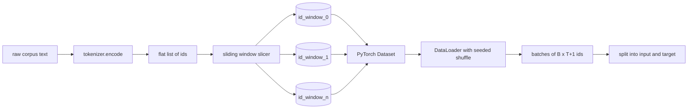
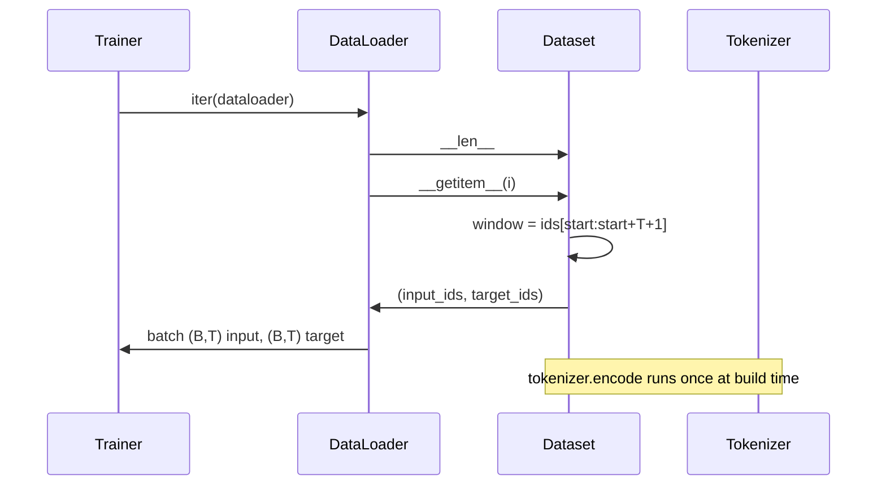

# Tokenizowany zestaw danych z przesuwnym oknem

> Uruchomienie pretreningowe to funkcja od identyfikatorów tokenów do gradientów. Ta lekcja buduje przenośnik, który dostarcza identyfikatory.

**Typ:** Budowa
**Języki:** Python
**Wymagania wstępne:** Lekcje Fazy 04, lekcje Fazy 07 o transformerach, Lekcja 30 tej fazy
**Czas:** ~90 minut

## Cele nauczania
- Przekonwertować surowy korpus na strumień identyfikatorów tokenów przez jednokrotne wywołanie tokenizera.
- Pokroić strumień identyfikatorów na okna o stałej długości z konfigurowalnym krokiem nakładania.
- Zbudować zestaw danych PyTorch zwracający tensory wejściowe i docelowe dla przewidywania następnego tokena.
- Owinąć zestaw danych w DataLoader z deterministycznym tasowaniem wysiewanym na epokę.
- Wyjaśnić kompromis między krokiem, nadmiarowością a efektywnym rozmiarem zestawu danych.

## Ramy

Uruchomienie pretreningowe odczytuje jedną partię identyfikatorów tokenów na raz i aktualizuje model. Kształt każdej partii jest ustalony przez kontrakt treningowy. Dla modelu języka przyczynowego partia zawiera identyfikatory wejściowe `(B, T)` i identyfikatory docelowe `(B, T)`, gdzie cel to wejście przesunięte w lewo o jeden. Zadaniem potoku danych jest dostarczenie tego kontraktu na żądanie, w sposób deterministyczny i powtarzalny, z korpusu, który może mieć kilka gigabajtów surowego tekstu.

Ta lekcja buduje potok. Tokenizer z poprzedniej lekcji zamienia tekst na długą płaską listę identyfikatorów. Przesuwne okno kroi tę listę na przykłady treningowe. Niestandardowy zestaw danych udostępnia przykłady jako tensory. DataLoader łączy je w partie i tasuje ze znanym ziarnem.

## Kontrakt kształtu

Przyczynowy LM konsumuje identyfikatory w kształcie `(B, T)`, gdzie `B` to rozmiar partii, a `T` to długość kontekstu. Cel na pozycji `t` to wejście na pozycji `t+1`. To oznacza, że każdy przykład treningowy obejmuje `T+1` surowych identyfikatorów. Krok okna kontroluje, jak duże nakładanie istnieje między kolejnymi przykładami.

Krajalnica nigdy nie nachodzi na granicę korpusu. Jeśli ostatnie okno nie ma wystarczająco identyfikatorów, aby wypełnić `T+1` pozycji, krajalnica je odrzuca. Dopełnianie ogona `<|pad|>` jest również poprawnym wyborem, ale komplikuje maskę straty. Na potrzeby tej lekcji odrzucamy.

## Dlaczego przesuwne okno

Korpus pretreningowy to jeden długi strumień identyfikatorów. Gdyby model widział tylko nienachodzące na siebie okna, każdy przykład treningowy uczyłby go tych samych `T` granic. Dostosowanie kroku przesuwa te granice, aby model widział bardziej zróżnicowane zadania przewidywania następnego tokena.

Krok `T` produkuje nienachodzące na siebie okna. Krok `T // 2` produkuje pięćdziesięcioprocentowe nakładanie i podwaja efektywny zestaw danych. Krok `1` produkuje maksymalne nakładanie i zwiększa zestaw danych o czynnik `T`. Kosztem jest więcej obliczeń na epokę. Korzyścią jest większa różnorodność granic. Większość pretreningów używa kroku równego długości kontekstu, ponieważ korpus jest już znacznie większy, niż model może ukończyć w jednej epoce, więc argument różnorodności granic jest słabszy.

## Klasa Dataset

Zestaw danych PyTorch ma dwie wymagane metody. `__len__` zwraca liczbę przykładów. `__getitem__` zwraca jeden przykład jako parę tensorów. Nasz zestaw danych przechowuje zakodowany strumień identyfikatorów i krok. Indeksowanie oblicza początek okna na bieżąco, więc koszt pamięci to jedna kopia strumienia identyfikatorów niezależnie od tego, ile przykładów produkuje krok.

Przesunięcie o jeden odbywa się wewnątrz `__getitem__`. Zestaw danych zwraca `(input, target)`, gdzie `input = window[:-1]` i `target = window[1:]`. Oba są długimi tensorami PyTorch. Pętla treningowa traktuje je jako prawdę podstawową.

## Deterministyczne tasowanie

DataLoader z `shuffle=True` odczytuje z generatora liczb losowych PyTorch. Przekazując jawny `torch.Generator` wysiewany na epokę, otrzymujemy to samo tasowanie za każdym razem, gdy uruchomienie jest restartowane. Ta właściwość ma znaczenie, gdy chcesz porównać dwa uruchomienia różniące się tylko jednym hiperparametrem. Bez ziarna dwa uruchomienia widzą dane w różnych kolejnościach, a krzywe straty różnią się z powodów niezwiązanych ze zmianą.

Kontrakt ziarna w tej lekcji jest prosty. `epoch_seed = base_seed + epoch_index`. Podstawowe ziarno jest przekazywane przy konstrukcji. Indeks epoki jest zwiększany przez trenera na początku każdej epoki. Ponowne uruchomienie z tym samym podstawowym ziarnem zawsze widzi tę samą kolejność w każdej epoce.

## Próbnik partii

Domyślny próbnik w PyTorch wybiera indeksy jednostajnie losowo bez zastępowania. To jest to, czego chcemy dla pretreningu. Dla dostrajania na małym zestawie danych kontrakt jest ten sam. DataLoader składa partię, wywołując `__getitem__` `B` razy i układając wyniki. Ponieważ każdy przykład ma tę samą długość z konstrukcji, nie jest potrzebna logika dopełniania.

Lekcja utrzymuje `num_workers=0` dla prostoty. W produkcyjnym uruchomieniu pracownicy paralelizują wywołania `__getitem__`. Z naszym potokiem jest to głównie no-op, ponieważ praca to tylko wycinek tensora w pamięci, ale to samo API Dataset wspiera czysto pracowników.

## Liczenie przykładów

Dla strumienia identyfikatorów o długości `N`, długości kontekstu `T` i kroku `S`, liczba przykładów to `max(0, 1 + (N - (T + 1)) // S)`. Lekcja udostępnia to obliczenie jako metodę statyczną na Dataset, aby trener mógł obliczyć całkowitą liczbę kroków na epokę bez iterowania.

## Czego ta lekcja nie robi

Nie strumieniuje z dysku. Korpus jest zakodowany w pełni w pamięci i przechowywany jako pojedynczy tensor. Dla korpusu kilku milionów identyfikatorów to dobrze poniżej stu megabajtów i jest odpowiednim kształtem dla lekcji. Strumieniowanie z dysku to osobna kwestia, która wpinana jest przez wymianę magazynu, ale zachowuje kontrakt Dataset.

Nie obsługuje wielu dokumentów. Korpus jest traktowany jako jeden ciągły strumień identyfikatorów. Granica następnego dokumentu jest kodowana przez wstawienie identyfikatorów `<|endoftext|>`, gdy korpus jest zbudowany z wielu dokumentów. Model uczy się przewidywać wokół granicy.

## Jak czytać kod

`main.py` definiuje dwie klasy i jeden pomocnik. `SlidingWindowDataset` to zestaw danych PyTorch. `make_dataloader` zwraca skonfigurowany DataLoader z wysianym generatorem. `_encode_corpus_to_ids` to jednorazowe wywołanie tokenizera. Demo na dole buduje mały tokenizer w procesie, koduje wbudowany korpus, konstruuje zestaw danych i dataloader, drukuje jedną partię i sprawdza kontrakt kształtu. Testy w `code/tests/test_dataset.py` ustalają formułę liczby okien, właściwość przesunięcia o jeden, deterministyczne tasowanie i kompromis kroku.

Uruchom demo. Następnie zmień długość kontekstu z 16 na 32 i obserwuj, jak spada liczba przykładów na epokę. Ta liczba to twój budżet kroków na epokę.