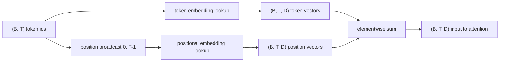
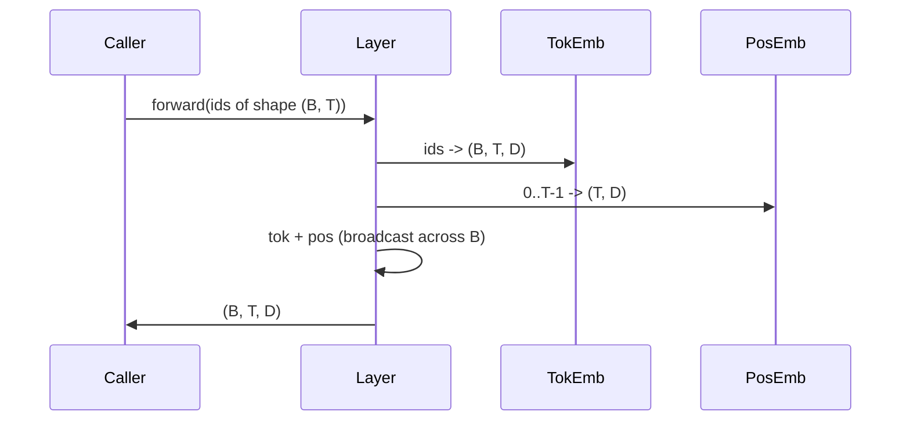

# Osadzenia tokenów i pozycyjne

> Identyfikatory to liczby całkowite. Model chce wektorów. Dwie tablice przeglądowe znajdują się między nimi, a wybór tej pozycyjnej kształtuje to, czego model może się nauczyć.

**Typ:** Budowa
**Języki:** Python
**Wymagania wstępne:** Lekcje Fazy 04, lekcje Fazy 07 o transformerach, Lekcje 30 i 31 tej fazy
**Czas:** ~90 minut

## Cele nauczania
- Zbudować tablicę przeglądową osadzeń tokenów, która mapuje identyfikatory słownika na gęste wektory.
- Zbudować wyuczoną tablicę przeglądową osadzeń pozycyjnych indeksowaną pozycją.
- Zbudować stałe sinusoidalne osadzenie pozycyjne indeksowane pozycją bez parametrów.
- Złożyć osadzenia tokenów i pozycyjne w pojedyncze wejście dla bloku transformera.
- Porównać wyuczone i sinusoidalne osadzenia pod kątem generalizacji długości i liczby parametrów.

## Ramy

Pierwszy kontakt modelu z identyfikatorem tokena to wyszukiwanie wiersza w macierzy osadzeń tokenów. Macierz ma jeden wiersz na identyfikator słownika i jedną kolumnę na wymiar modelu. Wyszukiwanie zwraca wektor, który reszta modelu traktuje jako znaczenie identyfikatora. Wsteczna propagacja aktualizuje wiersze, które zostały użyte w przejściu do przodu. W trakcie treningu geometria tych wierszy uczy się kodować podobieństwo w kierunkach.

Same identyfikatory tokenów nie mają kolejności. Model potrzebuje drugiego sygnału, który mówi mu, że pozycja pierwsza różni się od pozycji siedemnastej. Dwa dominujące wybory dla tego sygnału to wyuczone osadzenie pozycyjne (druga tablica przeglądowa, jeden wiersz na pozycję) i stałe sinusoidalne osadzenie pozycyjne (wzór matematyczny bez parametrów). Wybór ma konsekwencje. Wyuczona tablica jest parametrem i jest ograniczona przez maksymalną długość kontekstu, na której model był trenowany. Sinusoidalna tablica jest teoretycznie wolna od parametrów, a wzór rozszerza się na dowolną pozycję, ale `SinusoidalPositionalEmbedding` w tej lekcji wstępnie oblicza stałą tabelę na `max_context_length`, a jej `forward` zgłasza błąd po przekroczeniu tego limitu; oba moduły egzekwują więc maksymalną długość kontekstu. Model może wciąż mieć trudności poza swoją długością treningową, nawet gdy tabela jest wystarczająco duża, aby indeksować.

Ta lekcja buduje oba i łączy je z osadzeniem tokena w pojedyncze wejście dla bloku uwagi z następnej lekcji.

## Kontrakt kształtu

Wejściem do etapu osadzania jest partia identyfikatorów tokenów w kształcie `(B, T)`. Wyjściem jest tensor w kształcie `(B, T, D)`, gdzie `D` to wymiar modelu. Każdy element partii ma tę samą długość kontekstu `T`. Każda pozycja ma ten sam wymiar wektora `D`.



Złożenie to suma, a nie konkatenacja. Sumowanie utrzymuje `D` stałe przez sieć i pozwala modelowi decydować na poziomie cechy, czy znaczenie tokena czy pozycja dominuje w każdej warstwie.

## Macierz osadzeń tokenów

Osadzenie tokena to tensor parametrów w kształcie `(V, D)`, gdzie `V` to rozmiar słownika. PyTorch udostępnia to jako `nn.Embedding(V, D)`. Przy inicjalizacji wpisy są losowane z małego rozkładu Gaussa, tradycyjnie ze średnią zero i odchyleniem standardowym około `0.02` dla modeli w skali transformera. Dokładna inicjalizacja ma mniejsze znaczenie niż to, że pozostaje spójna między uruchomieniami.

Przejście do przodu to pojedyncza operacja indeksowania. PyTorch mapuje identyfikatory int64 `(B, T)` na liczby zmiennoprzecinkowe `(B, T, D)` przez zbieranie wierszy. Przejście wsteczne akumuluje gradienty tylko w wiersze, które zostały dotknięte w przejściu do przodu. Dwa wiersze, które nigdy nie pojawiły się w partii, otrzymują zerowy gradient w tym kroku.

Subtelny detal. Osadzenie tokena i projekcja wyjściowa na końcu modelu często dzielą wagi (wiązanie wag). Gdy tak się dzieje, każde przejście wsteczne dotyka każdego wiersza osadzenia przez stronę wyjściową. Lekcja tutaj udostępnia oba jako osobne moduły, ale ta sama macierz mogłaby pełnić obie role w pełnym modelu.

## Wyuczone osadzenie pozycyjne

Wyuczone osadzenie pozycyjne to drugie `nn.Embedding` w kształcie `(max_context_length, D)`. Wyszukiwanie jest kluczowane identyfikatorem pozycji `0, 1, 2, ..., T-1`. Przejście do przodu rozgłasza ten wektor pozycji przez wymiar partii.

Wadą wyuczonej tablicy jest to, że nie może być odpytywana na pozycji `T`, jeśli model był trenowany tylko do pozycji `T-1`. Wiersz nie istnieje. Produkcyjne modele tylko-dekoderowe, które używają tego schematu, wbudowują maksymalną długość kontekstu w architekturę i odmawiają przetwarzania dłuższych wejść.

## Sinusoidalne osadzenie pozycyjne

Sinusoidalne osadzenie pozycyjne to funkcja od pozycji do wektora. Pozycja `p` i cecha `i` produkują

```python
angle = p / (10000 ** (2 * (i // 2) / D))
emb[p, 2k]     = sin(angle)
emb[p, 2k + 1] = cos(angle)
```

Funkcja nie ma parametrów. Każda pozycja ma unikalny wektor. Długość fali zmienia się geometrycznie w poprzek wymiarów cech, więc niższe wymiary kodują grubą pozycję, a wyższe wymiary kodują drobną pozycję.

Właściwością wynikającą z wyboru `sin` i `cos` razem jest to, że wektor na pozycji `p + k` jest liniową funkcją wektora na pozycji `p`. To daje warstwie uwagi łatwą ścieżkę do uczenia się przesunięć względnych pozycji. Model nie potrzebuje osobnego parametru, aby wyrazić "spójrz pięć tokenów wstecz."

Lekcja oblicza pełną sinusoidalną tabelę raz przy konstrukcji i indeksuje do niej w czasie przejścia do przodu.

## Złożenie

Potok wejściowy robi trzy rzeczy w kolejności. Odczytuje identyfikatory tokenów. Wyszukuje wektory tokenów. Dodaje wektory pozycyjne. Zwraca sumę.



Rozgłaszanie w kroku sumowania replikuje `(T, D)` tensor pozycyjny wzdłuż wymiaru partii. PyTorch obsługuje to automatycznie, ponieważ tensor pozycyjny ma kształt `(1, T, D)` po unsqueeze.

## Analiza porównawcza

Lekcja uruchamia oba warianty na tych samych wejściach i drukuje dwie diagnostyki.

Pierwsza to liczba parametrów. Wariant wyuczony dodaje `max_context_length * D` parametrów na wierzchu osadzenia tokena. Wariant sinusoidalny dodaje zero.

Druga to podobieństwo cosinusowe między osadzeniami na sąsiednich pozycjach. Wariant sinusoidalny ma gładki i przewidywalny spadek, ponieważ funkcja jest ciągła. Wariant wyuczony przy inicjalizacji ma prawie losowe podobieństwo, ponieważ wiersze są losowane niezależnie. Po treningu wariant wyuczony typowo rozwija podobną gładką strukturę, ale musi odkryć tę strukturę z danych.

## Czego ta lekcja nie robi

Nie buduje rotacyjnego kodowania pozycyjnego (RoPE) ani AliBi. To są nowoczesne wybory w produkcyjnych transformerach. Oba podążają za tym samym kontraktem kształtu co osadzenia tutaj (stosują transformację zależną od pozycji do wektorów w kształcie `(B, T, D)`), ale stosują je na etapie projekcji uwagi, a nie na wejściu. Następna lekcja buduje blok uwagi, a jednym z opcjonalnych rozszerzeń jest złożenie rotacji do projekcji zapytanie-klucz.

Nie trenuje osadzenia. Trening wymaga straty, która wymaga wyjścia modelu, które wymaga uwagi i głowy LM. To jest następna lekcja i kolejna po niej.

## Jak czytać kod

`main.py` definiuje trzy moduły. `TokenEmbedding` opakowuje `nn.Embedding(V, D)`. `LearnedPositionalEmbedding` opakowuje `nn.Embedding(L, D)`. `SinusoidalPositionalEmbedding` wstępnie oblicza tabelę i udostępnia ją jako bufor. `EmbeddingComposer` łączy osadzenie tokena i osadzenie pozycyjne. Demo na dole drukuje kształty, liczby parametrów i diagnostykę podobieństwa sąsiednich pozycji. Testy w `code/tests/test_embeddings.py` ustalają kształt, zachowanie rozgłaszania, liczbę parametrów i wzór sinusoidalny.

Uruchom demo. Następnie zmień wymiar modelu `D` z 64 na 32 i obserwuj, jak zmieniają się sinusoidalne pasma długości fal.