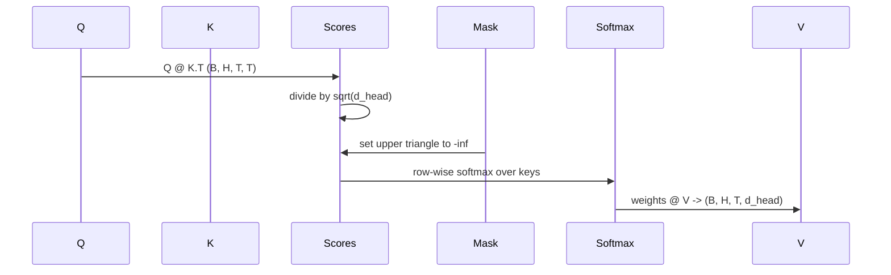

# Wielogłowowa samo-uwaga

> Jedna liniowa projekcja, trzy widoki, H równoległych głów, jedna maska. Blok uwagi tak, jak model go faktycznie używa.

**Typ:** Budowa
**Języki:** Python
**Wymagania wstępne:** Lekcje Fazy 04, lekcje Fazy 07 o transformerach, Lekcje 30 do 32 tej fazy
**Czas:** ~90 minut

## Cele nauczania
- Zaimplementować wsadową projekcję Zapytanie/Klucz/Wartość jako pojedynczą warstwę liniową podzieloną na H głów.
- Obliczyć skalowaną uwagę iloczynową z poprawną normalizacją i obsługą typu danych.
- Zastosować przyczynową maskę, która zapobiega pozycji przed zwracaniem uwagi na przyszłe pozycje.
- Zbadać wagi uwagi na głowę dla ustalonego wejścia i wyjaśnić, na co patrzy każda głowa.
- Wytrenować mały blok uwagi na zabawkowym zadaniu i obserwować spadek straty w miarę specjalizacji głów.

## Ramy

Uwaga to funkcja, która pozwala reprezentacji tokena pobierać informacje z innych tokenów w tej samej sekwencji. Samo-uwaga oznacza, że zapytania, klucze i wartości są wszystkie wyprowadzone z tego samego wejścia. Wielogłowowość oznacza, że projekcja jest podzielona na H równoległych problemów uwagi, których wyniki są łączone i ponownie projektowane.

Wzorzec wydajnej implementacji to jedna warstwa liniowa, która projektuje z `D` do `3 * D` i jest dzielona na trzy widoki, a następnie przekształcana na H głów o rozmiarze `D // H` każda. Mnożenie macierzy, softmax i ważona suma działają jako wsadowe operacje na tensorach, więc głowy działają równolegle na akceleratorze.

Ta lekcja buduje ten blok. Dodaje również przyczynową maskę, aby ten sam kod działał jako warstwa uwagi w modelu języka tylko-dekoderowego. Następna lekcja składa blok w pełny transformer, a lekcja po niej go trenuje.

## Kontrakt kształtu

Wejście to `(B, T, D)`. Wyjście to `(B, T, D)`. Maska to `(T, T)` lub rozgłaszalna do tego. Wewnątrz bloku tensory pośrednie mają kształt `(B, H, T, d_head)`, gdzie `d_head = D // H`. Ograniczeniem jest `D % H == 0`.

```mermaid
flowchart LR
    A["(B, T, D) input"] --> B[Linear D -> 3D]
    B --> C["split into Q, K, V"]
    C --> D["reshape to (B, H, T, d_head)"]
    D --> E["scores = Q @ K.T / sqrt(d_head)"]
    E --> F[apply causal mask]
    F --> G[softmax over keys]
    G --> H["context = weights @ V"]
    H --> I["reshape to (B, T, D)"]
    I --> J[output Linear D -> D]
    J --> K["(B, T, D) output"]
```

Dwie warstwy liniowe (projekcja QKV i projekcja wyjściowa) to jedyne parametry w bloku. Maska, softmax, mnożenia macierzy i przekształcenia są wszystkie wolne od parametrów.

## Podział QKV

Naiwna implementacja ma trzy osobne warstwy liniowe, po jednej dla Q, K i V. Wydajna ma jedną warstwę, która wyjściowo daje `3 * D` cech i dzieli wynik. Te dwie są matematycznie równoważne, ponieważ trzy osobne mnożenia macierzy przez wagi `(D, D)` są dokładnie jednym mnożeniem macierzy przez wagę `(3D, D)` ułożoną z nich.

Wydajna wersja jest szybsza, ponieważ akcelerator uruchamia jeden matmul zamiast trzech. Jest również łatwiejsza do zainicjalizowania, ponieważ trzy pod-macierze żyją w tym samym tensorze parametrów i mogą być inicjalizowane razem.

## Przekształcenie głów

Po podziale każdy z Q, K, V ma kształt `(B, T, D)`. Aby zamienić to na H równoległych problemów uwagi, przekształcamy do `(B, T, H, d_head)` i transponujemy do `(B, H, T, d_head)`. Wymiar głów znajduje się teraz obok wymiaru partii, więc PyTorch traktuje uwagę na głowę jako wsadową operację na `B * H` niezależnych instancjach.

Wymiar d_head pozostaje ostatni, więc mnożenie macierzy wyników `Q @ K.transpose(-2, -1)` go kontraktuje. Wynik to `(B, H, T, T)` wagi uwagi na głowę.

## Skalowanie

Wyniki są dzielone przez `sqrt(d_head)` przed softmaxem. Bez tego skalowania iloczyny skalarne rosną wraz ze wzrostem `d_head` i wypychają softmax w reżim, gdzie jeden wpis ma prawie całą masę, a pozostałe są znikomo małe. Gradienty w tym reżimie są maleńkie, a uczenie się zatrzymuje. Dzielenie przez `sqrt(d_head)` utrzymuje wariancję wyników w przybliżeniu stałą dla rozmiarów głów.

## Przyczynowa maska

Model języka tylko-dekoderowego może warunkować się tylko na przeszłości przy przewidywaniu następnego tokena. Maska to egzekwuje. Konkretnie, przed softmaxem, każdy wpis powyżej przekątnej macierzy wyników `(T, T)` jest zastępowany ujemną nieskończonością. Po softmaxie te pozycje otrzymują wagę zero.

Rejestrujemy maskę jako bufor przy konstrukcji, aby żyła na tym samym urządzeniu co model i nie była częścią grafu gradientów. Maska obejmuje maksymalną długość kontekstu, jaką blok kiedykolwiek zobaczy. W czasie przejścia do przodu wycinamy lewy górny róg `(T, T)`.

## Projekcja wyjściowa

Po wektorach kontekstu na głowę `(B, H, T, d_head)`, transponujemy z powrotem do `(B, T, H, d_head)`, przekształcamy do `(B, T, D)` i stosujemy końcową projekcję liniową `(D, D)`. Projekcja wyjściowa pozwala modelowi mieszać głowy. Bez niej, H głów mogłyby się łączyć tylko przez późniejsze warstwy, a blok byłby sztucznie ograniczony.

## Inspekcja wag uwagi

Lekcja udostępnia flagę `return_weights=True` na przejściu do przodu. Gdy ustawiona, blok zwraca wagi uwagi na głowę w kształcie `(B, H, T, T)` obok wyjścia. Demo drukuje heatmapę wag jednej głowy na krótkim wejściu, aby zobaczyć strukturę przyczynowego trójkąta i skupienie na pozycji.

W wytrenowanym modelu różne głowy uczą się różnych wzorców. Niektóre głowy zwracają uwagę na bezpośrednio poprzedni token. Niektóre głowy zwracają uwagę na początek sekwencji. Niektóre głowy rozpraszają uwagę prawie jednostajnie. Hak inspekcyjny jest punktem wejścia do tej pracy interpretowalności.

## Demo treningowe

Demo na dole `main.py` podłącza blok uwagi do małej głowy LM i trenuje całość na zadaniu powtarzania. Każdy wiersz wejścia to pojedynczy losowy identyfikator replikowany w kontekście. Celem jest wejście przesunięte o jeden, więc model musi nauczyć się, że następny token jest taki sam jak poprzedni. Stratą jest entropia krzyżowa. Z H=4, D=32, T=12 i słownikiem 64, strata spada z losowej (około `log(64) ~ 4.16`) do znacznie poniżej `1.0` w ciągu trzech epok na CPU.

Celem dema nie jest wytrenowanie użytecznego modelu. Celem jest potwierdzenie, że gradienty płyną przez każdy element bloku, a głowy czegoś się uczą na problemie, gdzie odpowiedź jest oczywista.

## Czego ta lekcja nie robi

Nie dodaje bloku sprzężenia zwrotnego. Warstwa transformera w prawdziwym modelu to uwaga, po której następuje dwuwarstwowy MLP z połączeniem resztkowym i normalizacją warstw wokół każdego. Następna lekcja dodaje te elementy.

Nie implementuje kodowania pozycyjnego rotary ani AliBi. Oba stosują się na etapie projekcji QKV w tym samym bloku, ale są osobną jednostką nauczania. Blok zbudowany tutaj jest kompatybilny z każdym z nich przez transformację Q i K przed mnożeniem macierzy.

Nie implementuje pamięci podręcznej KV dla inferencji. Buforowanie kluczy i wartości przez kolejne przejścia do przodu to optymalizacja, która sprawia, że dekodowanie autoregresyjne jest szybkie. Zmienia ona kontrakt kształtu na tensorach K i V, ale nie na Q. Należy do lekcji o inferencji.

## Jak czytać kod

`main.py` definiuje `MultiHeadSelfAttention`. Klasa przechowuje dwie warstwy liniowe i zarejestrowany bufor maski. Przejście do przodu projektuje, przekształca, oblicza wyniki, maskuje, softmaxuje, waży, przekształca i projektuje ponownie. Demo na dole buduje mały model, który opakowuje uwagę z osadzeniami tokenów i pozycyjnymi oraz głową LM, trenuje na zadaniu kopiowania przez trzy epoki i drukuje krzywą straty oraz heatmapę uwagi na głowę. Testy w `code/tests/test_attention.py` ustalają kontrakt kształtu, właściwość przyczynowości, właściwość softmaxu, właściwość podziału na głowy i przepływ gradientów.

Uruchom demo. Następnie zwiększ `n_heads` z 4 do 8 (utrzymując `d_model=32`, więc `d_head=4`) i obserwuj zmianę heatmapy.