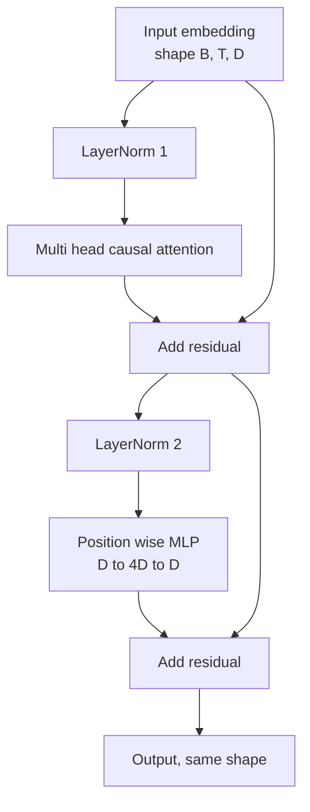
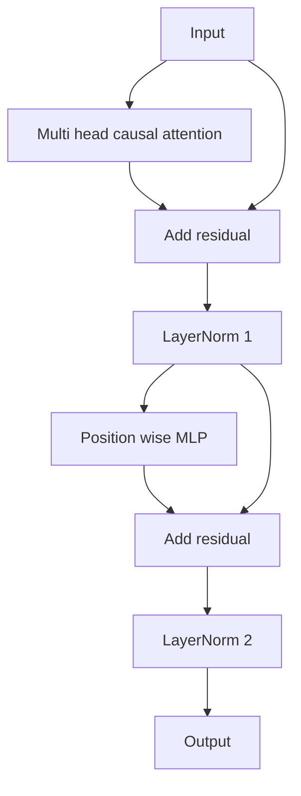

# Blok transformera od podstaw

> Jeden blok jest jednostką każdego nowoczesnego dekoderowego LLM. Normalizacja warstw, wielogłowowa uwaga, połączenie resztkowe, MLP, połączenie resztkowe. Wariant pre-LN trenuje stabilnie bez rozgrzewania. Wariant post-LN to ten, który został dostarczony w oryginalnej publikacji. Ta lekcja buduje oba, obok siebie, i pokazuje, który przetrwa stos 12 warstw przy typowych współczynnikach uczenia.

**Typ:** Budowa
**Języki:** Python
**Wymagania wstępne:** Lekcje Fazy 19 od 30 do 33 (tokenizer, osadzenia, matematyka uwagi, wsadowy data loader)
**Czas:** ~90 minut

## Cele nauczania

- Zbudować blok transformera w PyTorch z czterech ruchomych części: LayerNorm, wielogłowowa przyczynowa uwaga, połączenia resztkowe, MLP pozycyjny.
- Umieścić LayerNorm w dwóch konfiguracjach (pre-LN i post-LN) i wyjaśnić, dlaczego jedna trenuje stabilnie bez rozgrzewania.
- Zaimplementować przyczynowe maskowanie wewnątrz wielogłowowej uwagi, aby token `i` nie mógł widzieć tokenów `j > i`.
- Śledzić przepływ gradientów przez oba warianty na stosie 12 warstw i odczytać wynik bez gołosłownych twierdzeń.
- Ponownie użyć bloku jako wpinanej jednostki, gdy następna lekcja składa model GPT o 124 milionach parametrów.

## Problem

Transformer to jeden powtarzany blok. Źle zbuduj blok raz, powtórz go dwanaście razy, a dostarczysz model, który rozbiega się w pierwszej epoce lub potrzebuje hacków rozgrzewania przez resztę drogi. Dwa tryby awarii, które zobaczysz w tej lekcji, nie są egzotyczne. Pojawiają się za pierwszym razem, gdy uczeń naiwnie układa bloki. Jeden to warstwa uwagi zwracająca uwagę na przyszłość. Drugi to LayerNorm umieszczony tam, gdzie nie może okiełznać sygnału resztkowego na głębokości.

Poprawka jest mechaniczna, gdy już to zobaczysz. Blok ma dokładnie dwie ścieżki resztkowe i dokładnie dwie pozycje normalizacji. Wybierz pozycje poprawnie, a reszta stosu to tylko księgowość.

## Koncepcja

Każdy blok transformera tylko-dekoderowego to funkcja, która przyjmuje tensor w kształcie `(batch, sequence, embedding)` i zwraca tensor o tym samym kształcie. Wewnątrz dwie podwarstwy wykonują pracę.



To jest wariant pre-LN. LayerNorm znajduje się wewnątrz gałęzi resztkowej, przed podwarstwą. Połączenie resztkowe przenosi nieznormalizowany sygnał do przodu.

Wariant post-LN przenosi LayerNorm po dodaniu resztkowym.



Kształt jest identyczny. Zachowanie treningowe nie. Z post-LN gradient płynący z powrotem przez ścieżkę resztkową musi przejść przez LayerNorm. Na głębokości dwunastu i współczynniku uczenia `3e-4`, ten gradient kurczy się wystarczająco szybko, aby potrzebować harmonogramu rozgrzewania. Pre-LN pozostawia ścieżkę resztkową nieznormalizowaną, więc gradienty propagują się czysto do warstwy osadzeń. Pre-LN to konfiguracja, z którą GPT-2 i późniejsze są dostarczane z tego powodu.

### Przyczynowa wielogłowowa uwaga

Podwarstwa uwagi projektuje wejście na trzy sposoby w tensory zapytań, kluczy i wartości. Każdy jest przekształcany z `(B, T, D)` do `(B, H, T, D/H)`, gdzie `H` to liczba głów. Skalowana uwaga iloczynowa oblicza `softmax(Q K^T / sqrt(d_k))` na głowę, maskuje górny trójkąt ujemną nieskończonością, stosuje maskę przez softmax, a następnie mnoży przez `V`. Głowy są łączone z powrotem w pojedynczy tensor `(B, T, D)` i ponownie projektowane. Maska to jedyna część, która czyni model przyczynowym. Zapomnij o masce, a trenujesz model, który oszukuje.

### MLP

MLP pozycyjny stosuje tę samą dwuwarstwową sieć do każdego tokena niezależnie. Ukryta szerokość to czterokrotność szerokości osadzenia, aktywacja to GELU, a dropout podąża za drugą warstwą liniową. Żadne tokeny nie rozmawiają ze sobą wewnątrz MLP. Całe mieszanie tokenów odbywa się w uwadze.

### Połączenia resztkowe robią dwie rzeczy

Sprawiają, że ścieżka gradientu jest addytywna w poprzek głębokości, co utrzymuje normę gradientu w skali przez dwanaście warstw. Pozwalają również każdemu blokowi uczyć się addytywnej aktualizacji bieżącej reprezentacji, a nie pełnej wymiany. Oba efekty są powodem, dla którego blok skaluje się.

## Budowa

`code/main.py` implementuje:

- `class LayerNorm` z uczoną skalą i przesunięciem, obciążonym eps, stosowany na wektor tokena.
- `class MultiHeadAttention` z `num_heads`, `head_dim = d_model // num_heads`, scaloną projekcją QKV, zarejestrowaną przyczynową maską, dropoutem uwagi i resztkowym.
- `class FeedForward` z dwiema warstwami liniowymi, aktywacją GELU, dropoutem.
- `class TransformerBlock` z flagą `pre_ln` przełączającą między dwoma wariantami.
- Demo, które buduje 6-warstwowy stos pre-LN i 6-warstwowy stos post-LN z identycznymi wejściami i drukuje (a) kształt wyjścia, (b) normę gradientu przy osadzeniu po jednym przejściu wstecznym.

Uruchom:

```bash
python3 code/main.py
```

Wyjście: sprawdzenie kształtu dla obu stosów, normy gradientów obok siebie. Gradient osadzenia stosu pre-LN jest o rząd wielkości większy niż stosu post-LN przy tym samym współczynniku uczenia, co jest empirycznym sygnałem, że pre-LN trenuje bez rozgrzewania.

## Stos

- `torch` do matematyki tensorów, autograd i `nn.Module`.
- Bez `transformers`, bez wstępnie wytrenowanych wag. Blok jest zaimplementowany z prymitywów.

## Wzorce produkcyjne w praktyce

Trzy wzorce zamieniają podręcznikowy blok w coś, co można dostarczyć.

**Scalona projekcja QKV.** Trzy osobne warstwy liniowe kosztują trzy uruchomienia jądra i trzy matmule. Jedna warstwa liniowa o szerokości `3 * d_model` wykonuje tę samą pracę w jednym uruchomieniu, a następnie dzieli wyjście wzdłuż ostatniej osi. Scalona ścieżka jest szybsza na każdym akceleratorze i pasuje do tego, co dostarczają referencyjne implementacje GPT-2, LLaMA i Mistral.

**Zarejestrowany bufor przyczynowej maski.** Maska zależy tylko od maksymalnej długości kontekstu. Przydziel ją raz przy konstrukcji z `register_buffer`, wytnij aktywne okno na przejście do przodu i pomiń alokację na wywołanie. Zapomnienie o tym zamienia maskę w gorący punkt alokatora przy długim kontekście.

**Dropout w dwóch miejscach, nie trzech.** Dropout należy po softmaxie uwagi (dropout uwagi) i po drugiej warstwie liniowej MLP (dropout resztkowy). Dropout na samym połączeniu resztkowym psuje addytywną tożsamość, która pozwala gradientowi płynąć na głębokości. Niektóre wczesne implementacje zrobiły to źle i zapłaciły za to kruchym treningiem.

## Użycie

- Blok z tej lekcji wpinany jest bezpośrednio do składania GPT w lekcji 35 bez modyfikacji.
- Wariant pre-LN jest tym, czego używa każdy nowoczesny LLM z otwartymi wagami. Wariant post-LN jest tym, czego używał oryginalny artykuł o uwadze z 2017 roku. Znajomość obu wystarczy do odczytania dowolnej architektury dekodera, jaką napotkasz.
- Zamień GELU na SiLU, a masz rodzinę aktywacji LLaMA. Zamień LayerNorm na RMSNorm, a masz rodzinę normalizacji LLaMA. Ten sam szkielet.

## Ćwiczenia

1. Dodaj flagę `bias=False` do każdej warstwy liniowej w bloku. Nowoczesne LLMy z otwartymi wagami są dostarczane bez obciążeń na warstwach liniowych. Zmierz, ile parametrów oszczędzasz w modelu 12-warstwowym 768-wymiarowym.
2. Zastąp `nn.LayerNorm` ręcznie napisanym RMSNorm i zweryfikuj, że kształt wyjścia jest niezmieniony.
3. Dodaj flagę zwracającą wagi uwagi dla pierwszej głowy jako tensor `(B, T, T)`. Narysuj górny trójkąt, aby potwierdzić, że jest zerem po softmaxie.
4. Zbuduj test poprawnościowy, który podaje tensor `(2, 16, 384)` z `H=6` przez oba warianty i sprawdza, że wyjścia forward są różne (np. `not torch.allclose`), gdy wagi są inicjalizowane identycznie, a dropout ustawiony na zero.

## Kluczowe terminy

| Termin | Co ludzie mówią | Co to faktycznie oznacza |
|--------|-----------------|--------------------------|
| Pre-LN | "Pre norm" | LayerNorm wewnątrz gałęzi resztkowej, przed każdą podwarstwą; połączenie resztkowe przenosi nieznormalizowany sygnał |
| Post-LN | "Post norm" | LayerNorm po dodaniu resztkowym; to, co dostarczył artykuł z 2017 roku i co potrzebuje rozgrzewania |
| Maska przyczynowa | "Trójkątna maska" | Górny trójkąt logitów uwagi ustawiony na ujemną nieskończoność, aby token i nie mógł czytać tokena j, gdy j jest większe od i |
| Scalone QKV | "Połączona projekcja" | Jedna warstwa liniowa o szerokości 3D zamiast trzech warstw liniowych o szerokości D; jedno jądro, jeden matmul |
| Strumień resztkowy | "Połączenie pomijające" | Nieznormalizowany tensor płynący od góry do dołu przez każdy blok; to, do czego każdy blok dodaje |

## Dalsza lektura

- Faza 7 lekcja 02 (samo-uwaga od podstaw) dla matematyki uwagi pod tym blokiem.
- Faza 7 lekcja 05 (pełny transformer) dla wersji enkoder-dekoder tego samego szkieletu.
- Faza 10 lekcja 04 (pretrening mini GPT) dla procedury treningowej, do której ten blok się wpinany.
- Faza 19 lekcja 35 (ta ścieżka), która układa dwanaście takich bloków w model GPT.