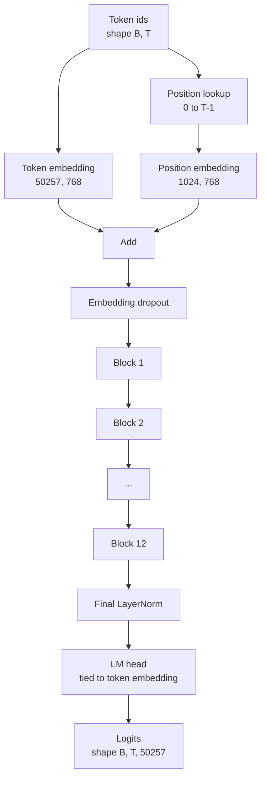
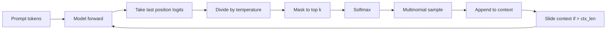

# Składanie modelu GPT

> Dwanaście ułożonych bloków, osadzenie tokena, wyuczone osadzenie pozycji, końcowa LayerNorm i związana głowa modelu językowego. To cały model GPT o 124 milionach parametrów. Ta lekcja składa te elementy w działającą klasę, liczy parametry, aby potwierdzić, że model pasuje do referencyjnego kształtu 124M, i generuje tekst z próbkowaniem wielomianowym, temperaturą i top-k.

**Typ:** Budowa
**Języki:** Python
**Wymagania wstępne:** Lekcje Fazy 19 od 30 do 34
**Czas:** ~90 minut

## Cele nauczania

- Złożyć blok transformera z lekcji 34 w pełny model GPT: osadzenie tokena, osadzenie pozycji, N bloków, końcowa LayerNorm, głowa modelu językowego.
- Odtworzyć konfigurację 124 milionów parametrów: słownik 50257, kontekst 1024, osadzenie 768, dwanaście głów, dwanaście warstw.
- Związać wagi głowy modelu językowego z osadzeniem tokena i wyjaśnić, dlaczego oszczędza to ~38 milionów parametrów w tej skali.
- Generować tekst z prompta przez próbkowanie wielomianowe, skalowanie temperaturą i obcięcie top-k, utrzymując długość kontekstu z przesuwnym oknem.
- Zmierzyć liczbę parametrów i koszt przejścia do przodu względem celu 124M.

## Problem

Blok transformera sam w sobie nic nie robi. Musisz zamienić identyfikatory tokenów na wektory, dodać informację pozycyjną, przepuścić przez stos i rzutować z powrotem na logity słownika. Zapomnij o którymkolwiek z tych czterech kroków, a model albo nie przejdzie do przodu, albo dryfuje w informacji pozycyjnej, albo nie może mówić.

Kształt modelu również ma znaczenie. Referencyjny GPT-2 small ma 124 miliony parametrów w dokładnie powyższej konfiguracji. Liczby nie są magiczne. Słownik 50257 razy osadzenie 768 to tablica tokenów. Pozycja 1024 razy 768 to tablica pozycji. Dwanaście bloków po około 7 milionów parametrów każdy to 84 miliony. Końcowa głowa ponownie używa tablicy tokenów przez wiązanie wag. Zsumuj elementy i wychodzi 124 miliony. Zbudowanie modelu, którego liczba parametrów nie pasuje do referencji, to znak, że coś podłączyłeś źle.

## Koncepcja



Identyfikatory tokenów stają się wektorami tokenów. Identyfikatory pozycji stają się wektorami pozycji. Oba są dodawane i wysyłane przez stos. Końcowa LayerNorm to jedyny element poza blokami, który przetrwa w każdym nowoczesnym wariancie. Głowa LM ponownie używa macierzy osadzeń tokenów – to właśnie oznacza wiązanie wag.

### Wiązanie wag

Osadzenie tokena ma kształt `(vocab, d_model)`. Głowa modelu językowego musi rzutować z `d_model` z powrotem do `vocab`. To są transpozycje siebie nawzajem. Związanie ich oznacza dosłownie ten sam tensor parametrów, użyty dwukrotnie. Przy słowniku 50257 i d_model 768, macierz ma 38 milionów parametrów. Odwiązane, płacisz za to dwa razy. Związane, płacisz raz i dostajesz nieco czystszy sygnał gradientu, ponieważ osadzenie i głowa aktualizują się razem.

### Osadzenie pozycji jest wyuczone, a nie sinusoidalne

GPT-2 dostarcza wyuczone osadzenie pozycji. Tablica pozycji to jeden tensor parametrów w kształcie `(1024, 768)`. Model wyszukuje pozycję 0 przez T-1 przy każdym przejściu do przodu i dodaje wynik do osadzenia tokena. To najprostszy ze schematów pozycji (RoPE, ALiBi, T5 relative bias są alternatywami) i jest tym, czego używa referencja 124M.

### Generowanie: temperatura, top-k, wielomianowe

Generowanie jest autoregresyjne. Na każdym kroku model zwraca logity nad pełnym słownikiem na każdej pozycji. Bierzesz tylko ostatnią pozycję, dzielisz przez temperaturę, opcjonalnie maskujesz wszystkie logity poza top k ujemną nieskończonością, softmax aby uzyskać prawdopodobieństwa i próbkujesz jeden token z wynikowego rozkładu.



Trzy pokrętła, trzy różne zachowania. Temperatura bliska zera zapada się w zachłanne. Temperatura jeden odpowiada naturalnemu rozkładowi modelu. Top-k jeden jest zachłanne. Top-k czterdzieści filtruje długi ogon. Kombinacje mają znaczenie; następna lekcja o treningu używa generowania jako jakościowego sygnału ewaluacyjnego.

## Budowa

`code/main.py` implementuje:

- `class GPTConfig` dataklasa z domyślnymi 124M: `vocab_size=50257`, `context_length=1024`, `d_model=768`, `num_heads=12`, `num_layers=12`, `mlp_expansion=4`, `dropout=0.1`, `use_bias=True`, `weight_tying=True`.
- `class GPTModel` z osadzeniem tokena, osadzeniem pozycji, dropoutem osadzenia, dwunastoma `TransformerBlock`, końcową LayerNorm i `lm_head`, który wiąże się z osadzeniem tokena, gdy flaga jest ustawiona.
- Pomocnik `count_parameters` zwracający unikalną liczbę parametrów (tak aby wiązanie wag było honorowane w liczeniu).
- Funkcja `generate` wykonująca temperaturę, top-k, wielomianowe i przesuwne okno kontekstu.
- Demo, które buduje model, drukuje liczbę parametrów obok referencji 124M i generuje krótką sekwencję z ustalonego prompta, aby pokazać potok end-to-end.

Uruchom:

```bash
python3 code/main.py
```

Wyjście: liczba parametrów obok referencji 124M, wygenerowane identyfikatory tokenów z losowego prompta i potwierdzenie, że głowa LM i osadzenie tokena dzielą pamięć, gdy wiązanie jest włączone.

Aby demo było szybkie, skrypt uruchamia również małą konfigurację (`d_model=64`, `num_layers=2`) end-to-end i drukuje wygenerowaną sekwencję tokenów w linii. Konfiguracja 124M jest zbudowana, ale tylko jej liczba parametrów i jedno przejście do przodu są wykonywane.

## Stos

- `torch` do matematyki tensorów, autograd i modułów.
- `code/main.py` implementuje lokalnie ten sam wzorzec bloku z lekcji 34.

## Wzorce produkcyjne w praktyce

Trzy wzorce robią różnicę między modelem, który działa, a modelem, który można dostarczyć.

**Inicjalizuj projekcje resztkowe małe.** Projekcja wyjściowa uwagi i druga warstwa liniowa MLP obie zasilają bezpośrednio dodanie resztkowe. Inicjalizowanie ich z tym samym odchyleniem standardowym co każda inna warstwa liniowa daje strumień resztkowy, który rośnie z głębokością i wypycha końcową LayerNorm w gorący reżim. Skaluj std przez `1 / sqrt(2 * num_layers)` dla tych dwóch projekcji; strumień resztkowy pozostaje w rozsądnym zakresie przez dwanaście warstw.

**Buforuj tensor identyfikatora pozycji, nie przeliczaj.** `torch.arange(T)` alokuje świeżą pamięć przy każdym przejściu do przodu. Przydziel raz w `__init__` dla maksymalnego kontekstu, wytnij pierwsze T wpisów na wywołanie i pomiń podróż alokatora.

**Zwiąż wagi na poziomie parametru, nie tylko przez kopiowanie.** Ustawienie `lm_head.weight = token_embedding.weight` dzieli tensor; kopiowanie nie. Optymalizator musi aktualizować jeden parametr, a graf autograd potrzebuje jednej akumulacji. Jeśli kopiujesz, głowa oddala się od osadzenia, a wiązanie wag nic ci nie daje.

## Użycie

- Klasa modelu w tej lekcji ma ten sam kształt co ta, którą następna lekcja trenuje.
- Zastąpienie wyuczonego osadzenia pozycji RoPE daje rodzinę LLaMA bez dotykania bloku lub głowy.
- Zastąpienie GELU na SiLU i LayerNorm na RMSNorm daje resztę zmian rodziny LLaMA.
- Funkcja generowania działa z dowolnym źródłem logitów, nie tylko tym modelem. Możesz pobrać logity z wstępnie wytrenowanego pliku GPT-2 w lekcji 37 i ponownie użyć tej samej pętli generowania.

## Ćwiczenia

1. Odwiąż głowę LM od osadzenia tokena i przelicz parametry. Zweryfikuj, że delta wynosi 50257 razy 768 = 38 milionów.
2. Zastąp wyuczone osadzenie pozycji sinusoidalną tabelą obliczoną w czasie konstrukcji. Potwierdź, że model wciąż przechodzi do przodu, a liczba parametrów spada o 786 432.
3. Dodaj flagę `greedy=True` do generowania, która pomija próbkowanie i wybiera argmax. Potwierdź, że sekwencja jest deterministyczna między uruchomieniami.
4. Dodaj pokrętło `repetition_penalty`, które dzieli logit dowolnego tokena w prompcie lub wygenerowanej historii przez stałą przed softmaxem. Pokaż na ustalonym prompcie, że wartości powyżej jednego zmniejszają liczbę powtórzeń w wyjściu.
5. Dodaj próbkowanie `top_p` (jądrowe) obok `top_k`. Dwu-liniowe sprawdzenie, że suma prawdopodobieństw utrzymanych tokenów przekracza `top_p`.

## Kluczowe terminy

| Termin | Co ludzie mówią | Co to faktycznie oznacza |
|--------|-----------------|--------------------------|
| Wiązanie wag | "Związane osadzenia" | Głowa LM i osadzenie tokena dzielą ten sam tensor parametrów; oszczędza słownik razy d_model parametrów i pasuje do referencji GPT-2 |
| Osadzenie pozycji | "Wyuczone pozycje" | Osobna tablica w kształcie (długość kontekstu, d_model) dodawana do wektorów tokenów; uczona end-to-end |
| Przesuwne okno kontekstu | "Limit kontekstu" | Gdy prompt plus wygenerowane tokeny przekraczają długość kontekstu, odrzuć najstarsze tokeny, aby aktywne okno się zmieściło |
| Próbkowanie top-k | "Obcięcie K" | Utrzymaj K logitów z najwyższymi wartościami, zamaskuj resztę ujemną nieskończonością, softmax nad resztą |
| Temperatura | "Temperatura próbkowania" | Podziel logity przez T przed softmaxem; T mniejsze niż 1 wyostrza, T równe 1 utrzymuje naturalny rozkład, T większe niż 1 spłaszcza |

## Dalsza lektura

- Faza 19 lekcja 34 dla bloku, który ten model układa.
- Faza 19 lekcja 36 dla pętli treningowej napędzającej ten modelem stratą entropii krzyżowej.
- Faza 19 lekcja 37 dla ładowania wstępnie wytrenowanych wag GPT-2 do tej dokładnej architektury.
- Faza 7 lekcja 07 (GPT przyczynowe modelowanie języka) dla matematyki przewidywania następnego tokena.
- Faza 10 lekcja 04 (pretrening mini GPT) dla oryginalnej procedury treningowej na tej samej architekturze.