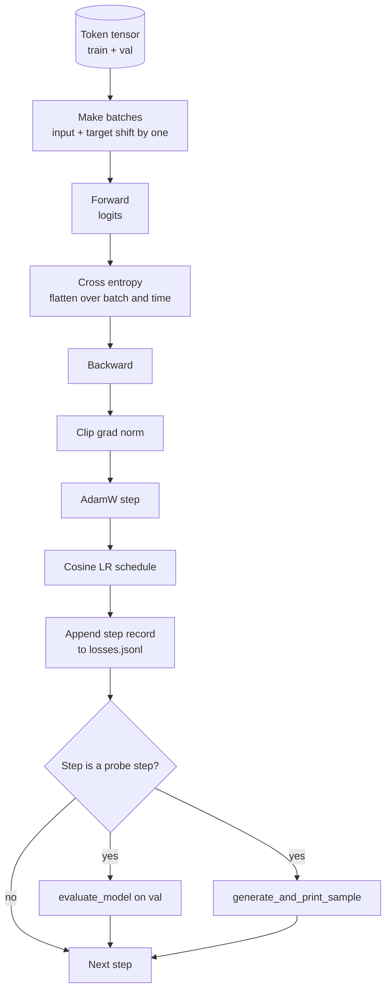

# Pętla treningowa i ewaluacja

> Pętla, która nie mierzy, to pętla, która kłamie. Ta lekcja buduje pętlę treningową napędzającą model GPT: AdamW z podziałem na redukcję wag, harmonogram współczynnika uczenia z rozgrzewaniem i cosinusem, pomocnik `calc_loss_batch`, przebieg `evaluate_model` na wstrzymanych danych, jakościową próbkę `generate_and_print_sample` co K kroków i dziennik JSONL strat, który można wykreślić po fakcie. Ten sam szkielet trenuje każdy dekoderowy LLM, jaki kiedykolwiek zbudujesz.

**Typ:** Budowa
**Języki:** Python
**Wymagania wstępne:** Lekcje Fazy 19 od 30 do 35
**Czas:** ~90 minut

## Cele nauczania

- Zbudować pętlę treningową obliczającą stratę entropii krzyżowej z poprawnym wyrównaniem wejścia i celu dla przewidywania następnego tokena.
- Skonfigurować AdamW z redukcją wag stosowaną do tensorów wag, a nie do tensorów LayerNorm lub obciążeń.
- Zaimplementować harmonogram współczynnika uczenia z liniowym rozgrzewaniem i cosinusowym zanikiem oraz odczytać wynikowy LR w czasie.
- Ewaluować na wstrzymanym podziale przez `evaluate_model`, aby strata ewaluacyjna była porównywalna między uruchomieniami.
- Generować jakościową próbkę co K kroków przez `generate_and_print_sample`, aby złapać rozbieżność zanim krzywa straty to zrobi.
- Zatrzymać stratę na krok do JSONL, aby móc ponownie załadować, wykreślić i dostarczyć dziennik treningowy jako artefakt.

## Problem

Skrypt treningowy, który drukuje stratę, ale nie robi nic więcej, zawodzi na trzy sposoby. Nie może ci powiedzieć, czy strata spada z właściwego powodu (model może przeuczyć się na zbiorze treningowym i nigdy się nie uczyć). Nie może ci powiedzieć, czy zaczyna się rozbieżność (strata może pikować dla jednego kroku i odzyskać, albo jeden krok i runąć). Nie może ci powiedzieć, czego model się nauczył (strata jest skalarem; wygenerowana próbka to akapit). Wszystkie trzy awarie ukrywają się, chyba że pętla mierzy.

Pętla w tej lekcji mierzy na trzy sposoby. Stratę na partii treningowej na każdym kroku. Stratę na wstrzymanej partii co K kroków. Wygenerowaną kontynuację z ustalonego prompta co K kroków. Dziennik treningowy ląduje w JSONL, więc artefaktem jest świadectwo pętli.

## Koncepcja



Dwa nieoczywiste elementy to wyrównanie straty i podział zaniku AdamW.

### Wyrównanie straty

Model przewiduje następny token na każdej pozycji. Jeśli partia wejściowa to tokeny `[t0, t1, t2, t3]`, partia docelowa musi być `[t1, t2, t3, t4]`. Entropia krzyżowa jest obliczana na płaskim kształcie `(batch * seq, vocab)` względem płaskiego celu `(batch * seq,)`. Zapomnij o przesunięciu, a trenujesz model do przewidywania samego siebie, co zbiega do zerowej straty, nie ucząc niczego użytecznego.

### Podział zaniku AdamW

Zanik wag regularyzuje tensory wag, ale nie skale normalizacji ani obciążenia. Umieszczenie zaniku na skali LayerNorm powoli spycha skalę do zera i psuje normalizację. Umieszczenie zaniku na obciążeniu jest matematycznie nieszkodliwe, ale stratą cykli. Standardowy podział to: tensory w kształcie macierzy (wagi liniowe, tablice osadzeń) dostają zanik, wszystko, co wygląda jak skala lub przesunięcie, nie.

### Harmonogram rozgrzewania plus cosinus

Rozgrzewanie podnosi współczynnik uczenia od zera do celu przez kilkaset kroków, aby stan optymalizatora miał czas się wypełnić. Zanik cosinusowy opuszcza współczynnik uczenia z powrotem w kierunku zera przez pozostałe kroki, aby końcowa faza precyzyjnie dostroiła wagi przy małym rozmiarze kroku. Kombinacja jest najczęstszym harmonogramem w treningu LLM z otwartymi wagami, ponieważ usuwa większość kruchych momentów w pierwszym tysiącu kroków i ostatnim tysiącu kroków.

### Ewaluacja na wstrzymanych danych

`evaluate_model` uruchamia ustaloną liczbę partii z podziału walidacyjnego, akumuluje stratę, dzieli przez liczbę partii i zwraca. Bez gradientu. Bez dropoutu. Liczba jest powtarzalna między uruchomieniami przy tym samym ziarnie i tym samym podziale. Raportowanie wstrzymanej straty obok straty treningowej to sposób na wykrycie przeuczenia.

### Jakościowe próbkowanie jako wczesny sygnał

Model, którego strata treningowa ładnie spada, ale którego wygenerowane próbki są tym samym tokenem, jest zepsuty. Model, którego krzywa straty wygląda płasko, ale którego wygenerowane próbki wyostrzają się w spójne słowa, uczy się. Jakościowa sonda działa szybciej niż czytanie pełnej krzywej i łapie tryby, które skalar pomija.

## Budowa

`code/main.py` implementuje:

- `make_batches(token_ids, batch_size, context_length)` która kroi długi tensor tokenów na pary wejście-cel.
- `calc_loss_batch(model, inputs, targets)` która przechodzi do przodu, spłaszcza i zwraca skalarną entropię krzyżową.
- `evaluate_model(model, val_loader, max_batches)` która iteruje ustaloną liczbę partii walidacyjnych bez grad i zwraca średnią stratę.
- `generate_and_print_sample(model, prompt, max_new_tokens)` która uruchamia funkcję generowania z lekcji 35 na ustalonym prompcie i drukuje wynik.
- `build_param_groups(model, weight_decay)` która produkuje dwugrupową listę parametrów AdamW.
- `cosine_with_warmup(step, warmup_steps, total_steps, max_lr, min_lr)` która zwraca LR na danym kroku.
- `train(...)` która uruchamia pętlę, zapisuje `outputs/losses.jsonl` i drukuje stratę ewaluacyjną i próbkę co `eval_every` kroków.
- Demo, które trenuje mały model na syntetycznych danych przez małą liczbę kroków, zapisuje dziennik JSONL i drukuje stratę ewaluacyjną i próbkę w punktach sondy. Demo działa w dobrze poniżej minuty na CPU.

Uruchom:

```bash
python3 code/main.py
```

Wyjście: linia straty na krok, strata ewaluacyjna na każdym kroku sondy, wygenerowana próbka na każdym kroku sondy i końcowy plik `outputs/losses.jsonl`, który można załadować z `json.loads` na linię.

## Stos

- `torch` do autograd, optymalizatora i modułów.
- `main.py` implementuje lokalnie `GPTModel` z lekcji 35 i wspierające moduły.

## Wzorce produkcyjne w praktyce

Trzy wzorce zamieniają podręcznikową pętlę w coś, co można zostawić działające na noc.

**Obcinanie normy gradientu jest bezwzględnie konieczne.** Zła partia (anomalne dane, pik LR, numeryczny przypadek brzegowy) produkuje ogromny gradient, który niszczy godziny treningu. `torch.nn.utils.clip_grad_norm_(params, max_norm=1.0)` po `backward` i przed `step` utrzymuje optymalizator w bezpiecznym zakresie. Wartość obcięcia jest wolnym parametrem; jeden to domyślne, które przetrwa większość konfiguracji.

**Wznawialne logowanie JSONL, a nie stan marynowany.** Rekordy straty na krok jako `{"step": int, "train_loss": float, "lr": float}` linie w JSONL są trwałe: każda awaria pozostawia czytelny artefakt, możesz grepować, możesz wykreślić z trzydziestoma liniami Pythona i możesz wznowić trening przez odczytanie ostatniego kroku. Stan marynowany przywiązuje cię do dokładnego układu modułu, który wyprodukował plik, co jest kruche przy refaktoryzacjach.

**Partie ewaluacyjne pobrane z ustalonego wycinka.** Tokeny walidacyjne są krojone na partie na starcie skryptu, a nie na bieżąco. Powtarzalność zależy od tego, czy partie ewaluacyjne są identyczne między uruchomieniami; w przeciwnym razie porównanie straty ewaluacyjnej między dwoma uruchomieniami mierzy tasowanie partii tak samo jak model.

## Użycie

- Pętla w tej lekcji to ten sam szkielet, który trenuje model 124M na prawdziwych danych. Zamień syntetyczny tensor tokenów na loader w stylu `datasets`, a pętla działa bez zmian.
- Dziennik JSONL to artefakt, który zamienia uruchomienie treningowe w dowód. Następna lekcja używa jednego do porównania świeżo wytrenowanego punktu kontrolnego z wstępnie wytrenowanym.
- Jakościowa sonda próbki to zabezpieczenie, którego skalarna strata nie może zastąpić.

## Ćwiczenia

1. Dodaj testy jednostkowe `weight_decay_groups()` potwierdzające, że parametry skali i obciążenia lądują w grupie bez zaniku, a wagi liniowe i osadzeń w grupie z zanikiem.
2. Zastąp syntetyczne losowe tokeny bajtami z małego pliku tekstowego, aby demo trenowało na czymś czytelnym. Zweryfikuj, że wygenerowana próbka używa znaków obecnych w pliku.
3. Dodaj podłogę `min_lr` na 10 procent `max_lr` do harmonogramu cosinusowego i ponownie wykreśl.
4. Zapisz punkt kontrolny co `eval_every` kroków oprócz dziennika JSONL. Dodaj flagę `resume_from`, która ponownie ładuje stan modelu i stan optymalizatora.
5. Zaloguj przepustowość na krok (tokeny na sekundę) obok straty i potwierdź, że utrzymuje się w stałym paśmie.

## Kluczowe terminy

| Termin | Co ludzie mówią | Co to faktycznie oznacza |
|--------|-----------------|--------------------------|
| Wyrównanie straty | "Przesunięcie o jeden" | Tokeny wejściowe na pozycjach 0..T-1, tokeny docelowe na pozycjach 1..T; entropia krzyżowa obliczana na spłaszczonych kształtach |
| Podział zaniku | "Dwie grupy" | AdamW otrzymuje tensory w kształcie macierzy z zanikiem wag i tensory skali lub obciążenia bez |
| Rozgrzewanie | "Rampa" | Współczynnik uczenia rośnie od zera do celu przez ustaloną liczbę kroków, aby stan optymalizatora mógł się wypełnić |
| Partie ewaluacyjne | "Wstrzymane partie" | Ustalony wycinek tensora tokenów walidacyjnych, pokrojony raz na starcie skryptu, używany identycznie przy każdej sondzie |
| Sonda jakościowa | "Druk próbki" | Krótkie generowanie z ustalonego prompta drukowane co K kroków, aby złapać tryby awarii, które sama strata ukrywa |

## Dalsza lektura

- Faza 19 lekcja 35 dla modelu, który pętla napędza.
- Faza 19 lekcja 37 dla ładowania wstępnie wytrenowanych wag do tego samego modelu.
- Faza 10 lekcja 04 (pretrening mini GPT) dla procedury na prawdziwych danych.
- Faza 10 lekcja 10 (ewaluacja) dla szerszej powierzchni ewaluacyjnej poza stratą entropii krzyżowej.