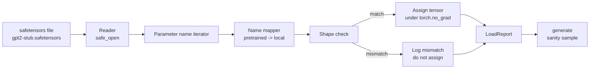

# Ładowanie wstępnie wytrenowanych wag

> Trenowanie modelu o 124 milionach parametrów od zera to decyzja budżetowa; załadowanie opublikowanego punktu kontrolnego to wtorek. Ta lekcja ładuje wstępnie wytrenowane wagi w stylu GPT-2 z pliku safetensors do dokładnej architektury z lekcji 35, przechodzi przez mapowanie nazw parametrów kawałek po kawałku i generuje testową kontynuację, aby udowodnić, że ładowanie zadziałało. Bez sieci, bez zewnętrznych ładowaczy, bez nieprzejrzystej magii.

**Typ:** Budowa
**Języki:** Python
**Wymagania wstępne:** Lekcje Fazy 19 od 30 do 36
**Czas:** ~90 minut

## Cele nauczania

- Odczytać plik safetensors za pomocą biblioteki Python `safetensors` i sprawdzić nazwy i kształty tensorów.
- Zamapować każdą nazwę wstępnie wytrenowanego parametru na parametr wewnątrz modelu GPT z lekcji 35.
- Obsłużyć dwie konwencje nazewnictwa różniące się między opublikowanymi wagami GPT-2 a modelem w tej ścieżce: `wte/wpe/h.N.attn.c_attn/c_proj` i `mlp.c_fc/c_proj` wobec lokalnie nazwanych `tok_embed/pos_embed/blocks.N.attn.qkv/out_proj` i `mlp.fc1/fc2`.
- Wykryć i odrzucić niedopasowanie kształtu z jasnym błędem przed jakimkolwiek przypisaniem wag.
- Wygenerować krótką kontynuację z załadowanymi wagami i potwierdzić, że tokeny pochodzą z załadowanego rozkładu, a nie z losowo zainicjalizowanego.

## Problem

Opublikowane wagi nie są zapakowane dla twojej architektury. Niosą nazwy, których użyła oryginalna implementacja. Plik wstępnie wytrenowany ma `transformer.h.0.attn.c_attn.weight` w kształcie `(2304, 768)`; twój model oczekuje `blocks.0.attn.qkv.weight` w kształcie `(2304, 768)` (co jest tą samą macierzą w innej konwencji układu) lub twój model używa `nn.Linear`, który przechowuje macierz transponowaną. Ten sam parametr pojawia się z trzema subtelnie różnymi tożsamościami (nazwa, kształt, układ bajtów), a ładowacz musi pogodzić wszystkie trzy.

Ładowacz, który kopiuje na ślepo, umieszcza właściwy tensor w niewłaściwym miejscu i dostajesz model, który generuje nonsensy. Ładowacz, który odmawia kopiowania, gdy kształt się różni, ale nic nie loguje, pozostawia cię zgadującym, który tensor nie dotarł. Ładowacz w tej lekcji jest jawny: każde przypisanie jest rejestrowane, każdy kształt jest sprawdzany, a `LoadReport` podsumowuje trafienia, chybienia i niedopasowania kształtów, abyś mógł odczytać, co się stało.

## Koncepcja



Mapa nazw to tylko funkcja z stringa na string. Sprawdzenie kształtu to jeden if. Przypisanie odbywa się wewnątrz `torch.no_grad()`, aby autograd nie śledził ładowania. Raport zawiera wynik każdej nazwy.

### Konwencja nazewnictwa GPT-2

Opublikowane wagi GPT-2 żyją pod nazwami jak:

| Nazwa wstępnie wytrenowana | Kształt | Znaczenie |
|---------------------------|---------|-----------|
| `wte.weight` | (50257, 768) | Osadzenie tokena |
| `wpe.weight` | (1024, 768) | Osadzenie pozycji |
| `h.N.ln_1.weight` | (768,) | Skala LayerNorm 1 w bloku N |
| `h.N.ln_1.bias` | (768,) | Przesunięcie LayerNorm 1 w bloku N |
| `h.N.attn.c_attn.weight` | (768, 2304) | Scalone wagi liniowe QKV |
| `h.N.attn.c_attn.bias` | (2304,) | Scalone obciążenie liniowe QKV |
| `h.N.attn.c_proj.weight` | (768, 768) | Projekcja wyjściowa uwagi |
| `h.N.attn.c_proj.bias` | (768,) | Obciążenie projekcji wyjściowej uwagi |
| `h.N.ln_2.weight` | (768,) | Skala LayerNorm 2 |
| `h.N.ln_2.bias` | (768,) | Przesunięcie LayerNorm 2 |
| `h.N.mlp.c_fc.weight` | (768, 3072) | Waga MLP fc1 |
| `h.N.mlp.c_fc.bias` | (3072,) | Obciążenie MLP fc1 |
| `h.N.mlp.c_proj.weight` | (3072, 768) | Waga MLP fc2 |
| `h.N.mlp.c_proj.bias` | (768,) | Obciążenie MLP fc2 |
| `ln_f.weight` | (768,) | Końcowa skala LayerNorm |
| `ln_f.bias` | (768,) | Końcowe przesunięcie LayerNorm |

Dwie niespodzianki do zaplanowania. Liniowe `c_attn`, `c_proj`, `c_fc` są przechowywane z macierzą transponowaną względem tego, czego oczekuje `nn.Linear.weight`. Ładowacz transponuje podczas przypisania. Głowa LM nie jest w pliku w ogóle; model polega na wiązaniu wag z `wte`, więc głowa jest ustawiana przez aliasowanie, gdy `wte` trafi.

### Lokalna konwencja nazewnictwa

Model w tej ścieżce używa opisowych nazw:

| Nazwa lokalna | Znaczenie |
|--------------|-----------|
| `tok_embed.weight` | Osadzenie tokena |
| `pos_embed.weight` | Osadzenie pozycji |
| `blocks.N.ln1.scale` | Skala LayerNorm 1 w bloku N |
| `blocks.N.ln1.shift` | Przesunięcie LayerNorm 1 |
| `blocks.N.attn.qkv.weight` | Scalone QKV |
| `blocks.N.attn.qkv.bias` | Obciążenie QKV |
| `blocks.N.attn.out_proj.weight` | Projekcja wyjściowa uwagi |
| `blocks.N.attn.out_proj.bias` | Obciążenie projekcji wyjściowej |
| `blocks.N.ln2.scale` | Skala LayerNorm 2 |
| `blocks.N.ln2.shift` | Przesunięcie LayerNorm 2 |
| `blocks.N.mlp.fc1.weight` | MLP fc1 |
| `blocks.N.mlp.fc1.bias` | Obciążenie MLP fc1 |
| `blocks.N.mlp.fc2.weight` | MLP fc2 |
| `blocks.N.mlp.fc2.bias` | Obciążenie MLP fc2 |
| `final_ln.scale` | Końcowa skala LayerNorm |
| `final_ln.shift` | Końcowe przesunięcie LayerNorm |

Mapowanie to ustalona funkcja. Lekcja dostarcza ją jako słownik, który ładowacz iteruje.

### Test zastępczy

Prawdziwe wagi GPT-2 mają 0,5 GB. Demo ich nie pobiera; generuje mały test zastępczy safetensors przy pierwszym uruchomieniu, z dokładną konwencją nazewnictwa GPT-2 i kształtami odpowiednimi dla modelu 12-blokowego przy d_model 192 zamiast 768. Test ma odpowiednią strukturę, aby przećwiczyć każdą ścieżkę kodu w ładowaczu. Zamień test na prawdziwy plik, a ładowacz działa bez modyfikacji.

## Budowa

`code/main.py` implementuje:

- Małą replikę `GPTModel` z lekcji 35, aby ta lekcja była samodzielna.
- `make_pretrained_to_local(num_layers)` która rozwija wpisy na warstwę.
- `load_safetensors(model, path)` która iteruje nazwy, mapuje je, sprawdza kształt, transponuje wagi w stylu conv1d i przypisuje pod `torch.no_grad()`. Zwraca `LoadReport`.
- `make_stub_safetensors(path, cfg)` która generuje plik testowy z dokładną konwencją nazewnictwa wstępnie wytrenowanego.
- Demo, które tworzy `outputs/gpt2-stub.safetensors` przy pierwszym uruchomieniu, buduje świeży model, przechwytuje jedną wygenerowaną kontynuację z losowej inicjalizacji, ładuje test, przechwytuje drugą kontynuację, drukuje obie i sprawdza, że są różne (ładowanie faktycznie zmieniło model).

Uruchom:

```bash
python3 code/main.py
```

Wyjście: ścieżka testu, dziennik ładowania na nazwę, podsumowanie `LoadReport`, kontynuacja przed ładowaniem, kontynuacja po ładowaniu i niedopasowanie kształtu na jednym celowo złym tensorze wstrzykniętym do testu, aby ścieżka awarii została przećwiczona.

## Stos

- `safetensors` dla formatu dyskowego i strumieniowego czytnika.
- `torch` dla modelu i matematyki przypisania.
- Bez `transformers`, bez `huggingface_hub`, bez wywołań sieciowych.

## Wzorce produkcyjne w praktyce

Trzy wzorce sprawiają, że ładowacz przetrwa kontakt z wagami, których nie stworzyłeś.

**Zawsze waliduj plik przed jakimkolwiek przypisaniem.** Otwórz plik, wypisz każdą nazwę tensora z jej typem i kształtem, uruchom pełne mapowanie ze sprawdzeniem kształtów i dopiero po sukcesie zacznij przypisywać. Do połowy załadowane modele to ciche maszyny awarii.

**Loguj każde przypisanie z nazwą źródła i nazwą miejsca docelowego.** Gdy coś wygląda źle, dziennik mówi ci, który tensor trafił gdzie; alternatywą jest czytanie zrzutów szesnastkowych. Dataklasa `LoadReport` w tej lekcji śledzi listy `loaded`, `missing`, `unexpected` i `shape_mismatch` i drukuje podsumowanie na końcu.

**Głowa LM to alias wiązania wag, a nie osobna kopia.** Ustawienie `model.lm_head.weight = model.tok_embed.weight` po załadowaniu `tok_embed` to kanoniczny wzorzec. Kopiowanie macierzy osadzeń do świeżego parametru `lm_head.weight` psuje wiązanie i cicho podwaja liczbę parametrów.

## Użycie

- Ładowacz działa dla dowolnego pliku safetensors, który używa konwencji nazewnictwa wstępnie wytrenowanego. Prawdziwe pliki GPT-2 (small / medium / large / xl) działają bez zmian w kodzie; tylko konfiguracja modelu się różni.
- Ten sam wzorzec rozszerza się na wagi LLaMA, Mistral, Qwen po zaktualizowaniu mapy nazw. Sprawdzenia kształtów i raport pozostają identyczne.
- Generowanie testowe po ładowaniu to szybka bramka: jeśli próbki po ładowaniu wyglądają jak próbki przed ładowaniem, ładowanie nie zmieniło modelu, co oznacza, że mapowanie cicho ominęło każdy tensor.

## Ćwiczenia

1. Dodaj argument `dtype` do ładowacza, który rzutuje każdy tensor na docelowy typ (`bfloat16`, `float16`, `float32`) podczas przypisania. Potwierdź, że model `float32` może być zrzutowany w dół do `bfloat16` i wciąż generować.
2. Dodaj argument `expected_layers`, który odmawia załadowania punktu kontrolnego, którego indeksy `h.N` nie pasują do `num_layers` modelu.
3. Podłącz ładowacz do funkcji generowania z lekcji 35 i wyprodukuj dwie próbki obok siebie: jedną z losowej inicjalizacji, drugą z załadowanego testu.
4. Dodaj ścieżkę eksportu: zapisz bieżący stan modelu do świeżego pliku safetensors przy użyciu konwencji nazewnictwa wstępnie wytrenowanego. Przeprowadź ładowacz w obie strony i potwierdź, że raport ma zero niedopasowań kształtu.
5. Rozszerz `NAME_MAP`, aby obsłużyć konwencję nazewnictwa LLaMA (bez obciążeń, RMSNorm, scalony układ qkv) i ponownie uruchom ładowacz na zastępczym teście LLaMA, który wygenerujesz.

## Kluczowe terminy

| Termin | Co ludzie mówią | Co to faktycznie oznacza |
|--------|-----------------|--------------------------|
| Mapa nazw | "Ponowne mapowanie kluczy" | Funkcja z nazw tensorów wstępnie wytrenowanych na lokalne nazwy parametrów; zwykle dosłowny słownik z jednym wpisem na indeks warstwy rozwinięty w pętli |
| Niedopasowanie kształtu | "Zły kształt" | Tensor wstępnie wytrenowany istnieje pod mapowaną nazwą, ale jego wymiary nie zgadzają się z lokalnym parametrem; ładowacz odmawia przypisania i loguje parę |
| Transpozycja podczas ładowania | "Układ Conv1d" | Opublikowany GPT-2 przechowuje projekcje uwagi i MLP w transpozycji tego, czego oczekuje nn.Linear; ładowacz transponuje podczas przypisania |
| Alias wiązania wag | "Współdzielona głowa LM" | Ustawienie model.lm_head.weight = model.tok_embed.weight tak, aby głowa i osadzenie dzieliły pamięć; głowa nie jest w pliku z tego powodu |
| Raport ładowania | "Podsumowanie pokrycia" | Mała dataklasa śledząca listy loaded, missing, unexpected i shape_mismatch; wydrukowanie go to sposób na stwierdzenie, czy ładowanie się powiodło |

## Dalsza lektura

- Faza 19 lekcja 35 dla architektury, która otrzymuje wagi.
- Faza 19 lekcja 36 dla pętli treningowej produkującej punkt kontrolny o tym samym kształcie.
- Faza 10 lekcja 11 (kwantyzacja) dla tego, co zrobić z załadowanymi wagami, gdy pamięć jest ciasna.
- Faza 10 lekcja 13 (budowanie pełnego potoku LLM) dla pełnego cyklu życia wokół ładowania i inferencji.