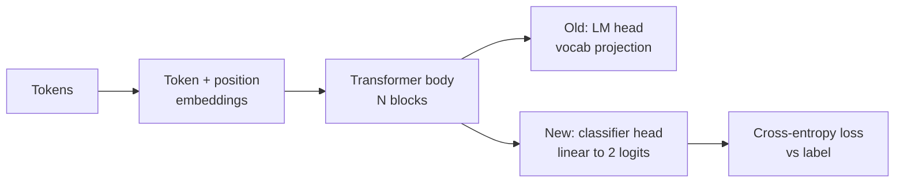
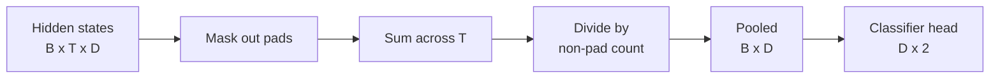
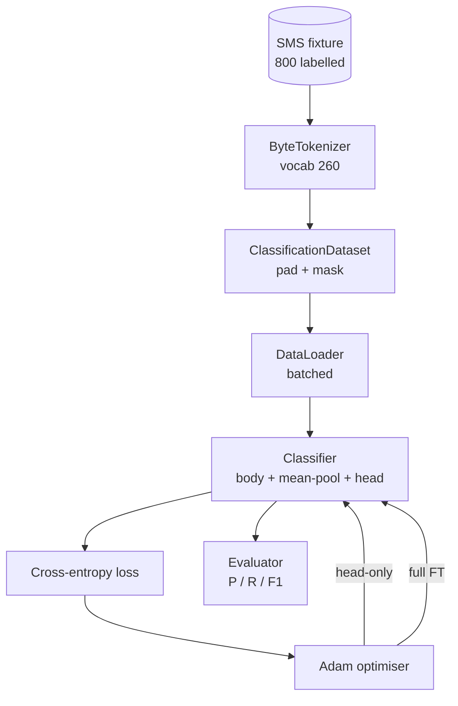

# Lekcja 38: Dostrajanie klasyfikatora przez wymianę głowy

> Pierwsze capstone ścieżki B. Wstępnie wytrenowany model językowy to stos bloków samo-uwagi kończący się głową przewidywania tokenów. Gdy chcesz spam vs ham, głowa jest zła, ale korpus jest w większości poprawny. Ta lekcja urywa głowę, przykleja dwuklasową warstwę liniową na uśrednionej reprezentacji i trenuje klasyfikator na dwa różne sposoby: tylko ostatnia warstwa i pełne dostrajanie. Ewaluacja to precyzja, czułość i F1 na wstrzymanym podziale. Uczysz się, co każda strategia ci daje i ile kosztuje.

**Typ:** Budowa
**Języki:** Python (torch, numpy)
**Wymagania wstępne:** Lekcje Fazy 19 od 30 do 37 (ścieżka NLP LLM: tokenizer, tablica osadzeń, blok uwagi, korpus transformera, pętla pretreningowa, punkty kontrolne, generowanie, perplexity)
**Czas:** ~90 minut

## Cele nauczania

- Zastąpić głowę modelu językowego głową klasyfikacyjną bez reinicjalizacji korpusu.
- Zaimplementować dwa reżimy treningowe: zamrożony korpus (tylko głowa) i pełne dostrajanie, współdzielące jedną pętlę treningową.
- Zbudować potok danych świadomy tokenizera, który dopełnia, maskuje dopełnienie i uśrednia wyjście uwagi.
- Obliczyć precyzję, czułość, F1 i macierz pomyłek z surowych logitów.
- Wyjaśnić kompromis między liczbą parametrów, czasem treningu a rezerwą.

## Problem

Wytrenowałeś mały transformer na ogólnym korpusie. Głowa wyjściowa projektuje ostatni ukryty stan na słownik 1000 tokenów. Masz teraz 800 wiadomości SMS oznaczonych jako spam lub ham i chcesz binarny klasyfikator. Istnieją trzy opcje.

Zła opcja to wytrenowanie świeżego klasyfikatora od zera na 800 przykładach. Korpus wstępnie wytrenowanego modelu już koduje użyteczną strukturę: tożsamość słów, pozycję, proste współwystępowanie. Wyrzucenie go marnuje obliczenia, które go zbudowały.

Dwie dobre opcje to wymiana głowy z zamrożonym korpusem i wymiana głowy z trenowalnym korpusem. Trening tylko głowy jest szybki, prawie darmowy w pamięci i rzadko przeucza się z tak małą ilością danych. Pełne dostrajanie jest wolniejsze, może przeuczyć się na małych danych, ale osiąga wyższą dokładność, gdy domena docelowa odbiega od korpusu pretreningowego.

Ta lekcja buduje oba, abyś mógł je porównać na tym samym teście.

## Koncepcja

Model to funkcja `f_theta(tokens) -> hidden_states`. Głowa to funkcja `g_phi(hidden) -> logits`. Wymiana głowy oznacza utrzymanie `theta` i zastąpienie `g_phi`. Parametry korpusu są drogie. Głowa to pojedyncza warstwa liniowa.

Dwa trenowalne zestawy parametrów mają znaczenie:

- `theta` (korpus): dziesiątki tysięcy wag na blok uwagi.
- `phi` (głowa): `hidden_dim * num_classes` wag plus obciążenie.

W treningu tylko głowy obliczasz gradienty względem `phi` i zerujesz je względem `theta`. PyTorch pozwala na to przez ustawienie `requires_grad=False` na parametrach korpusu. Optymalizator widzi wtedy tylko głowę, a korpus pozostaje zamrożony.

W pełnym dostrajaniu pozwalasz gradientom płynąć z powrotem przez cały stos. Wagi korpusu dryfują, aby dopasować się do celu klasyfikacji. Ryzykiem jest katastroficzne zapominanie na małych danych: pretrening korpusu jest wypłukiwany przez szum przeuczenia.

## Kwestia uśredniania

Klasyfikator potrzebuje jednego wektora na sekwencję, a nie jednego wektora na token. Trzy popularne wybory:

- **Średnia**: uśrednij ukryte stany w sekwencji, ważone maską uwagi.
- **CLS**: dodaj specjalny token na początku i użyj tylko jego wyjścia. To robi BERT.
- **Ostatni token**: użyj ostatniego nie-dopełniającego tokena. To robią klasyfikatory stylu GPT.

Ta lekcja używa uśredniania z jawnym ważeniem maską uwagi. Jest najprostsze, daje stabilny sygnał w poprzek długości sekwencji i nie wymaga pretreningu tokena CLS.

## Dane

Osiemset wiadomości SMS, zbalansowanych 400 spam i 400 ham, jest generowanych deterministycznie w `code/main.py`. Generator używa ustalonego ziarna, wybiera szablony i podstawia wypełniacze slotów, emitując wiadomości o długości od 5 do 25 tokenów. Prawdziwe zestawy danych mają szum, którego ten test nie ma. Celem testu jest powtarzalność.

Dane dzielą się 80/20: 640 treningowych, 160 testowych. Podziały są stratyfikowane, więc zestaw testowy utrzymuje balans 50/50. Wstrzymany zestaw o znanym balansie pozwala odczytać precyzję i czułość jako uczciwe liczby.

## Metryki

Klasyfikacja binarna z klasą 1 jako klasą pozytywną (spam). Liczniki to:

- `TP`: przewidziano spam, był spamem.
- `FP`: przewidziano spam, był ham.
- `FN`: przewidziano ham, był spamem.
- `TN`: przewidziano ham, był ham.

Trzy główne metryki:

- `precision = TP / (TP + FP)`. Jaka część wiadomości oznaczonych jako spam faktycznie nimi jest?
- `recall = TP / (TP + FN)`. Jaka część faktycznego spamu została oznaczona przez model?
- `F1 = 2 * P * R / (P + R)`. Średnia harmoniczna obu.

Macierz pomyłek drukuje cztery liczby jako siatkę 2x2. Demo zapisuje to do stdout dla obu reżimów treningowych.

## Architektura

Korpus to celowo mały transformer: słownik 260, ukryty 64, 4 głowy, 2 bloki, maksymalna sekwencja 32. Jest wystarczająco mały, aby wytrenować oba reżimy do zbieżności w ciągu dziewięćdziesięciu sekund na CPU. Nie jest wstępnie wytrenowany w lekcji; zamiast tego pomocnik `pretrain_quick` robi pięć epok treningu LM na tekście tego samego testu, aby dać korpusowi nietrywialny punkt startowy. To utrzymuje lekcję samodzielną.

## Co zbudujesz

Implementacja to jeden `main.py` plus jeden moduł testowy (`code/tests/test_main.py`).

1. `ByteTokenizer`: mapuje bajty na identyfikatory, rezerwuje identyfikator dopełnienia.
2. `Block`: blok transformera z wielogłowową uwagą i warstwą sprzężenia zwrotnego. Pre-norm.
3. `LMBody`: osadzenia tokenów + pozycji plus stos bloków. Zwraca ukryte stany.
4. `MeanPool`: średnia ważona maską wzdłuż osi sekwencji.
5. `Classifier`: korpus, uśrednianie, liniowa głowa. Korpus to ta sama instancja w obu reżimach.
6. `freeze_body` i `unfreeze_body`: przełączają `requires_grad` na parametrach korpusu.
7. `train_classifier`: jedna współdzielona pętla. Przyjmuje model i optymalizator skonfigurowany dla trenowalnej grupy parametrów.
8. `evaluate`: uruchamia zestaw testowy i zwraca `Metrics(precision, recall, f1, confusion)`.
9. `run_demo`: wstępnie trenuje korpus krótko, następnie trenuje i ewaluuje tylko głowę, potem pełne dostrajanie, drukuje oba raporty i kończy z kodem zero.

## Dlaczego porównanie ma znaczenie

Reżim tylko głowy zwykle trenuje szybciej i bardziej elegancko niedoucza się. Na tym teście zazwyczaj widzisz precyzję blisko 0.9 i czułość blisko 0.85 po dwudziestu epokach treningu tylko głowy. Pełne dostrajanie zajmuje około trzy razy dłużej i ląduje w granicach kilku punktów w tę lub w tę, w zależności od ziarna losowego.

Lekcja nie wybiera zwycięzcy. Uczy cię czytać liczby i koszt. Na 800 przykładach i małym korpusie tylko głowa to właściwy wybór. Na 80 000 przykładach i większym korpusie pełne dostrajanie zaczyna się opłacać. Kontrakt, który wynosisz z tej lekcji, to API: ta sama funkcja `train_classifier` obsługuje oba, a przełącznik to jedno wywołanie.

## Cele dodatkowe

- Dodaj trzeci reżim, który odmraża tylko ostatni blok. To się czasem nazywa częściowym dostrajaniem. Kosztuje mniej niż pełne FT i uczy się więcej niż tylko głowa.
- Dodaj harmonogram współczynnika uczenia. Harmonogram cosinusowy na głowie plus mniejszy stały współczynnik na korpusie to popularna konfiguracja produkcyjna.
- Zastąp uśrednianie wyuczoną pulą uwagi: małą warstwą uwagi z jednym wyuczonym zapytaniem. To często bije średnią na dłuższych sekwencjach.

Implementacja daje ci haki. Testy ustalają kontrakt. Liczby należą do ciebie, aby je pchać.