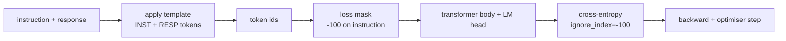
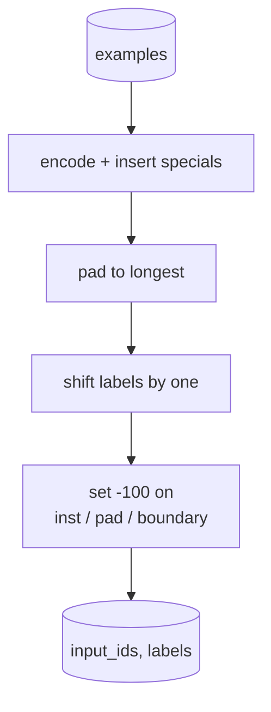
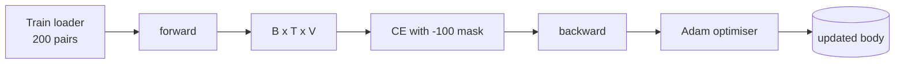

# Lekcja 39: Dostrajanie instrukcji przez nadzorowane dostrajanie

> Wstępnie wytrenowany model bazowy może przedłużyć sekwencję, ale nie może podążać za instrukcją. Nadzorowane dostrajanie to najmniejsza zmiana, która to naprawia: podaj modelowi sparowane przykłady instrukcji i pożądanej odpowiedzi i trenuj korpus do przewidywania tokenów odpowiedzi. Sztuczka polega na tym, że chcesz, aby strata liczyła tylko odpowiedź, a nie instrukcję. Ta lekcja buduje pętlę SFT w stylu Alpaca z niestandardową funkcją łączenia, która maskuje tokeny instrukcji przez `ignore_index=-100`, trenuje na 200 parach instrukcja-odpowiedź i ewaluuje na wstrzymanym podziale przy użyciu dokładnego dopasowania.

**Typ:** Budowa
**Języki:** Python (torch, numpy)
**Wymagania wstępne:** Lekcje Fazy 19 od 30 do 37 (ścieżka NLP LLM: tokenizer, tablica osadzeń, blok uwagi, korpus transformera, pętla pretreningowa, punkty kontrolne, generowanie, perplexity)
**Czas:** ~90 minut

## Cele nauczania

- Sformatować sparowane dane instrukcja-odpowiedź w pojedynczą przyczynową sekwencję z jawnymi tokenami granicznymi.
- Zbudować funkcję łączenia, która maskuje tokeny instrukcji, aby entropia krzyżowa liczyła tylko tokeny odpowiedzi.
- Wytrenować mały korpus transformera pod celem SFT i obserwować, jak metryka ewaluacyjna się zmienia.
- Zaimplementować generowanie zachłanne i z próbkowaniem temperatury, które respektuje granicę początku odpowiedzi.
- Obliczyć dokładne dopasowanie na wstrzymanych wygenerowanych uzupełnieniach.

## Problem

Model bazowy wytrenowany na przewidywaniu następnego tokena nie ma pojęcia, czym jest instrukcja. Pokaż mu string `"Jaka jest stolica Francji?"`, a będzie kontynuował pytanie lub wymyśli nowe zdanie. Model ma język, ale nie ma kontraktu formatu.

Kontrakt SFT to szablon stringa. Każdy przykład treningowy staje się pojedynczą sekwencją z trzema regionami:

```text
<INST> Jaka jest stolica Francji? <RESP> Stolica Francji to Paryż.
```

Tokeny graniczne to specjalne tokeny zarezerwowane w czasie treningu. Model uczy się, że wszystko po `<RESP>` to odpowiedź, a odpowiedź jest tym, co jest oceniane. Cel przewidywania następnego tokena modelu bazowego wciąż obowiązuje; jest po prostu trenowany na korpusie, gdzie każdy przykład ma ten kształt.

Ale jest haczyk. Jeśli podasz całą sekwencję do waniliowej entropii krzyżowej, trenujesz model do również przewidywania tokenów instrukcji. Instrukcja jest dana. Chcesz zerowy gradient na tych pozycjach. Poprawką jest maska.

## Koncepcja



`ignore_index` to funkcja `torch.nn.functional.cross_entropy`. Każda pozycja celu równa `ignore_index` wnosi zerową stratę i zerowy gradient. Konwencją w PyTorch jest `-100`. Funkcja łączenia buduje dwa tensory na przykład: `input_ids` (pełna sekwencja) i `labels` (kopia `input_ids` z pozycjami instrukcji nadpisanymi przez `-100`).

Model widzi całą sekwencję podczas przejścia do przodu; uwaga może zwracać uwagę na instrukcję. Strata liczy tylko tokeny odpowiedzi. To dokładnie to, czego chcesz: warunkuj na instrukcji, przewiduj odpowiedź.

## Dane

Dwieście par instrukcja-odpowiedź jest generowanych deterministycznie w `main.py`. Obejmują sześć typów zadań:

- faktyczne jednorazowe (stolica X)
- arytmetyczne
- ekstrakcja listy
- jednozdaniowe podsumowanie
- kod (print, sort)
- definicja

Każde zadanie ma szablonową instrukcję i deterministyczną odpowiedź. To jest celowo proste. Dokładne dopasowanie jest kruche, a lekcja używa testu, gdzie poprawna odpowiedź to jeden konkretny string. Prawdziwe zestawy danych SFT potrzebują rozmytych metryk; zasada jest identyczna.

Podziały to 160 treningowych, 40 testowych. Zestaw testowy obejmuje wszystkie sześć typów zadań, aby można było raportować dokładne dopasowanie na kategorię.

## Tokenizacja i dopełnianie

Tokeniser jest na poziomie bajtów z trzema zarezerwowanymi specjalnymi:

- `INST_ID = 256`: oznacza początek regionu instrukcji.
- `RESP_ID = 257`: oznacza granicę między instrukcją a odpowiedzią.
- `PAD_ID = 258`: dopełnianie dla partii o zmiennej długości.

Sekwencja to `[INST] inst_bytes [RESP] resp_bytes [PAD]*`. Funkcja łączenia:

1. Tokenizuje każdy przykład.
2. Dopełnia każdy przykład w partii do najdłuższej sekwencji w partii.
3. Buduje `labels` = `input_ids` przesunięte o jeden (przyczynowy cel LM), z:
   - Regionem instrukcji zastąpionym przez `-100`.
   - Regionem dopełnienia zastąpionym przez `-100`.
   - Samą pozycją granicy `RESP_ID` zastąpioną przez `-100` (nie trenujesz modelu do przewidywania tokena granicy; przewiduje to, co następuje).



Przesunięcie to standardowa przyczynowa sztuczka: pozycja `i` z `input_ids` przewiduje pozycję `i+1`, więc `labels[i] = input_ids[i+1]` (z ostatnią pozycją usuniętą z wejścia i pierwszą usuniętą z celu). Maska jest stosowana po przesunięciu, aby trafić na właściwe pozycje.

## Trening



Pętla to standardowa pętla SFT PyTorch. Adam, współczynnik uczenia około 3e-4 do 1e-3, dziesięć do dwudziestu epok na tym teście, bez harmonogramu. Model jest wystarczająco mały (ukryty 96, 2 bloki, maksymalna długość 64), aby wytrenować do zbieżności na CPU w ciągu dwóch minut.

Co piątą epokę pętla uruchamia mały przebieg ewaluacyjny na wstrzymanym zestawie i drukuje dokładne dopasowanie. Obserwowanie, jak dokładne dopasowanie idzie od 0.0 w pierwszej epoce do czegoś około 0.85 w piętnastej epoce, to wypłata lekcji: widzisz, jak model uczy się formatu i odpowiedzi jednocześnie.

## Generowanie

W czasie ewaluacji model dostaje prefiks instrukcji `[INST] inst_bytes [RESP]` i generuje tokeny, dopóki albo:

- sekwencja nie osiągnie `max_len`, albo
- model nie wyemituje heurystyki stopu: dwóch kolejnych bajtów kończących zdanie (`.`, `!`, `?`).

Lekcja dostarcza dekodowanie zachłanne plus opcjonalny próbnik temperatury. Dokładne dopasowanie używa zachłannego, ponieważ temperatura sprawiłaby, że metryka byłaby stochastyczna. Prawdziwe systemy często próbkują, a potem oceniają rozmycie; ten potok to lekcja 41.

## Ewaluacja dokładnego dopasowania

Dokładne dopasowanie to najbardziej rygorystyczna metryka tekstowa. Przewidziany string odpowiedzi jest normalizowany (małe litery, usunięcie białych znaków, scalenie podwójnych spacji) i porównywany z referencyjną odpowiedzią, normalizowaną w ten sam sposób. Metryka to albo 1, albo 0 na przykład. Agregat to średnia.

Prawdziwe potoki SFT uzupełniają dokładne dopasowanie o F1 na poziomie tokenów (lekcja 41) i model sędzi. Dokładne dopasowanie pozostaje użyteczne, ponieważ jest jednoznaczne; jeśli mówi 0.7, dokładnie 70 procent instrukcji testowych wyprodukowało złotą odpowiedź znak po znaku.

## Co zbudujesz

Implementacja to jeden `main.py` plus testy.

1. `InstructionTokenizer`: enkoder na poziomie bajtów z zarezerwowanymi specjalnymi. Koduje albo prefiks instrukcji, albo pełną parę.
2. `make_dataset`: generuje 200 par w poprzek sześciu typów zadań z ustalonym ziarnem.
3. `SFTDataset`: zwraca `(input_ids, labels)` na przykład, już przygotowane z maską.
4. `sft_collate`: dynamiczne dopełnianie, buduje tensor partii, ustawia `-100` na pozycjach instrukcji i dopełnienia.
5. `TinyGPT`: korpus transformera plus związana lub odwiązana głowa LM.
6. `train_sft`: pętla SFT, z hakami ewaluacyjnymi na epokę.
7. `generate`: przyczynowe dekodowanie z prefiksu, zachłanne lub próbkowane, z heurystyką stopu.
8. `exact_match`: znormalizowane porównanie stringów, zwraca float w `[0, 1]`.
9. `run_demo`: buduje dane, trenuje przez dwadzieścia epok, ewaluuje, drukuje podział na kategorię, kończy z kodem zero po sukcesie.

## Dlaczego maska ma znaczenie

Bez maski strata traktuje tokeny instrukcji jako cele. Model uczy się przewidywać instrukcję. To inny cel i produkuje gorszy model na dwa sposoby. Po pierwsze, pojemność modelu jest marnowana na rekonstruowanie wejść, które użytkownik zawsze dostarcza. Po drugie, strata odpowiedzi jest mniejsza w sumie gradientów, ponieważ tokeny instrukcji przewyższają liczebnie tokeny odpowiedzi w większości partii; efektywny współczynnik uczenia optymalizatora na części, na której ci zależy, jest niższy, niż zamierzałeś. Maska to nie polerka; to cel.

## Cele dodatkowe

- Dodaj rozgrzewanie współczynnika uczenia, po którym następuje zanik cosinusowy. SFT jest bardziej czuły na LR niż pretrening.
- Dodaj logowanie straty na token i wykreśl krzywą straty podczas treningu. Zauważ, że wczesne epoki są zdominowane przez tokeny szablonu (`<RESP>`, wspólne prefiksy), a późniejsze epoki są zdominowane przez rzeczywiste tokeny odpowiedzi.
- Rozszerz ewaluację o BLEU-1 lub chrF. Dokładne dopasowanie niedoszacowuje modeli, które produkują parafrazę z tą samą odpowiedzią.
- Dodaj szablon czatu z formatowaniem wieloturniowym i trenuj na teście, który zawiera pytania uzupełniające.

Implementacja daje ci kontrakt formatu, maskę i pętlę. Zmiana celu z modelu bazowego na naśladowcę instrukcji to jedna funkcja łączenia.