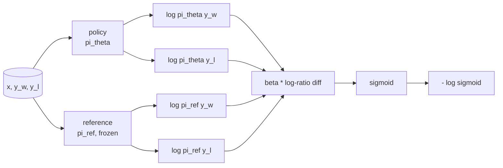
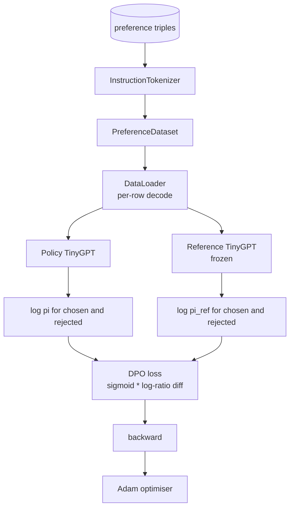

# Lekcja 40: Bezpośrednia optymalizacja preferencji od podstaw

> Modele nagrody i PPO to klasyczny stos RLHF. DPO zwija ten stos w pojedynczą nadzorowaną stratę, która dopasowuje politykę bezpośrednio do par preferencji. Ta lekcja wyprowadza stratę DPO z tożsamości różnicy nagród, dostarcza działający model referencyjny plus model polityki, oblicza log-prawdopodobieństwa na token i trenuje mały transformer na teście preferencji wybranych i odrzuconych uzupełnień. Testy ustalają matematykę straty i kierunek gradientu, abyś wiedział, że implementacja pasuje do artykułu.

**Typ:** Budowa
**Języki:** Python (torch, numpy)
**Wymagania wstępne:** Lekcje Fazy 19 od 30 do 37 (ścieżka NLP LLM: tokenizer, tablica osadzeń, blok uwagi, korpus transformera, pętla pretreningowa, punkty kontrolne, generowanie, perplexity)
**Czas:** ~90 minut

## Cele nauczania

- Wyprowadzić stratę DPO jako sigmoidę nad skalowaną różnicą log-stosunku i połączyć ją z ukrytą nagrodą.
- Zbudować parę model referencyjny + model polityki z zamrożoną referencją i trenowalną polityką.
- Obliczyć log-prawdopodobieństwa na poziomie sekwencji pod oboma modelami, maskując tokeny prompta.
- Wytrenować politykę na trójkach `(prompt, chosen, rejected)` i obserwować wzrost log-prawdopodobieństwa wybranego względem odrzuconego.
- Ustalić zachowanie testami matematyki straty, znaku gradientu i niezmienniczości referencji.

## Problem

Masz model SFT. Podąża za instrukcjami, ale jego wyniki są nierówne; niektóre uzupełnienia są jasne, niektóre rozwlekłe lub błędne. Masz również mały zestaw danych par preferencji: dla tego samego prompta, człowiek oznaczył jedno uzupełnienie jako wybrane, a drugie jako odrzucone.

Klasyczna odpowiedź RLHF to dwuetapowy potok. Wytrenuj model nagrody na preferencjach. Optymalizuj politykę względem nagrody za pomocą PPO. To działa, ale jest drogie: dwa modele w pamięci podczas PPO, kontrola KL, aby utrzymać politykę blisko referencji, hackowanie nagrody, gdy model nagrody jest kruchy.

DPO zastępuje oba etapy pojedynczą nadzorowaną stratą. Model nagrody nigdy jawnie nie istnieje. Polityka jest trenowana bezpośrednio na parach preferencji, z jawną karą KL w kierunku referencji SFT. To samo optymalne rozwiązanie przy modelu preferencji Bradleya-Terry'ego, znacznie mniej kodu.

## Koncepcja

Zacznij od modelu Bradleya-Terry'ego. Dla prompta `x` i dwóch uzupełnień `y_w` (wybrane) i `y_l` (odrzucone), prawdopodobieństwo, że człowiek preferuje `y_w` to

```text
P(y_w > y_l | x) = sigmoid( r(x, y_w) - r(x, y_l) )
```

gdzie `r` to pewna ukryta funkcja nagrody. RLHF najpierw dopasowuje `r` z preferencji, a następnie trenuje politykę `pi`, aby maksymalizować `r` z kotwicą KL:

```text
max_pi   E_{x, y~pi} [ r(x, y) ] - beta * KL(pi || pi_ref)
```

Wyprowadzenie DPO zauważa, że optymalna polityka `pi*` pod tym celem ma zamkniętą formę w terminach `r`:

```text
pi*(y | x) = (1/Z(x)) * pi_ref(y | x) * exp( r(x, y) / beta )
```

Przekształć dla `r`:

```text
r(x, y) = beta * ( log pi*(y | x) - log pi_ref(y | x) ) + beta * log Z(x)
```

Termin `log Z(x)` jest taki sam dla obu `y_w` i `y_l` (zależy od `x`, nie od `y`), więc znosi się przy obliczaniu różnicy preferencji:

```text
r(x, y_w) - r(x, y_l) = beta * ( log pi_theta(y_w|x) - log pi_ref(y_w|x)
                                - log pi_theta(y_l|x) + log pi_ref(y_l|x) )
```

Podstaw do sigmoidy Bradleya-Terry'ego i weź ujemne logarytmowanie wiarygodności na parach preferencji:

```text
L_DPO(theta) = - E_{(x, y_w, y_l)} [
  log sigmoid( beta * ( log pi_theta(y_w|x) - log pi_ref(y_w|x)
                       - log pi_theta(y_l|x) + log pi_ref(y_l|x) ) )
]
```

To jest strata. Jest sigmoidą nad pojedynczym skalarem na przykład, obliczonym z czterech log-prawdopodobieństw. Żaden osobny model nagrody. Żadne PPO. Żaden termin KL w stracie; ograniczenie KL jest wbudowane w wyprowadzenie zamkniętej formy.



## Znak gradientu

Użyteczne sprawdzenie poprawności przed każdym uruchomieniem treningowym. Weź gradient względem `log pi_theta(y_w | x)`:

```text
d L_DPO / d log pi_theta(y_w | x) = - beta * (1 - sigmoid(z))
```

gdzie `z` to argument sigmoidy. Jest ujemny dla wszystkich `z`, co oznacza: zwiększenie log-prawdopodobieństwa polityki dla wybranego uzupełnienia zmniejsza stratę. Symetrycznie, gradient względem `log pi_theta(y_l | x)` jest dodatni: zwiększenie odrzuconego log-prawdopodobieństwa zwiększa stratę. Trening wypycha wybrane w górę, a odrzucone w dół. Referencja jest zamrożona; nie zmienia się.

## Dane

Dwanaście trójek preferencji jest dostarczonych z lekcją. Każda to `(prompt, chosen, rejected)`. Wybrane uzupełnienie jest krótkie i precyzyjne. Odrzucone jest rozwlekłe, nie na temat lub błędne. Pary obejmują te same rodziny zadań co lekcja 39 (stolica, arytmetyka, lista), więc polityka, która zaczęła od bazy SFT, ma rozsądny punkt startowy.

Test jest celowo mały. DPO działa na dziesiątkach tysięcy par w produkcji; tutaj chodzi o to, że matematyka straty i pętla działają end-to-end na małym zestawie danych, a luka log-prawdopodobieństwa wybrane-versus-odrzucone widocznie rośnie.

## Niezmienniczość referencji

Implementacja DPO musi ostrożnie obsługiwać model referencyjny. Referencja to model SFT zamrożony w miejscu. Trzy właściwości muszą być zachowane:

- Parametry referencyjne nigdy nie otrzymują gradientów.
- Log-prawdopodobieństwa referencyjne nigdy nie zmieniają się między epokami.
- Polityka zaczyna od tych samych wag co referencja. (Optymalna `theta` to referencja plus wyuczona aktualizacja; inicjalizacja polityki jako kopii referencji jest dobrze zdefiniowanym startem.)

Implementacja egzekwuje je przez:

- Owijanie referencji w `torch.no_grad()` podczas przejść do przodu.
- Ustawienie `requires_grad=False` na każdym parametrze referencyjnym.
- Konstruowanie polityki przez `policy.load_state_dict(reference.state_dict())` po zbudowaniu referencji.

## Architektura



Model to ten sam TinyGPT używany w lekcji 39 (tylko-dekoderowy, przyczynowy, tokenizer bajtowy). Referencja i polityka dzielą architekturę; wagi polityki oddalają się od referencji pod treningiem, podczas gdy referencja pozostaje stała.

## Co zbudujesz

Implementacja to jeden `main.py` plus testy.

1. `InstructionTokenizer`: tokenizer bajtowy z specjalnymi `INST` i `RESP`. Ten sam kształt co lekcja 39.
2. `TinyGPT`: transformer tylko-dekoderowy. Ten sam kształt co lekcja 39, aby lekcja była samodzielna, nawet jeśli pominąłeś 39.
3. `make_preferences`: zwraca dwanaście trójek `(prompt, chosen, rejected)`.
4. `sequence_log_prob`: biorąc model, prefiks prompta i uzupełnienie, zwraca sumę log-prawdopodobieństw następnego tokena nad uzupełnieniem (bez udziału pozycji prompta).
5. `dpo_loss`: bierze cztery log-prawdopodobieństwa i `beta`, zwraca tensor straty na przykład i deltę ukrytej nagrody do logowania.
6. `train_dpo`: pętla na epokę, która oblicza log-prawdopodobieństwa wybranego i odrzuconego pod polityką i referencją, stosuje stratę i wykonuje krok Adama.
7. `evaluate_margins`: zwraca średni margines log-prawdopodobieństwa wybranego-minus-odrzuconego pod polityką w dowolnym punkcie.
8. `run_demo`: buduje referencję i politykę z małego rozgrzewającego pretreningu, kopiuje wagi, trenuje przez trzydzieści kroków, drukuje stratę i margines na krok i kończy z kodem zero po sukcesie.

## Dlaczego DPO działa

DPO jest matematycznie równoważne RLHF pod modelem preferencji Bradleya-Terry'ego, aż do parametryzacji nagrody. Ukryta nagroda `r(x, y) = beta * (log pi(y|x) - log pi_ref(y|x))` jest identyfikowalna z preferencji aż do funkcji `x`, która znosi się w różnicy. Polityka w zamkniętej formie pozwala pominąć jawny model nagrody. Ograniczenie KL jest egzekwowane strukturalnie: każde odchylenie `pi` od `pi_ref` sprawia, że log-stosunek jest większy, a sigmoida nasyca się, co tłumi gradient, gdy polityka oddala się za daleko. Referencja jest twoją siatką bezpieczeństwa.

## Cele dodatkowe

- Dodaj normalizację długości do sumy log-prawdopodobieństwa: podziel przez długość uzupełnienia. Błąd długości to znany tryb awarii DPO, gdzie model preferencyjnie wybiera krótsze uzupełnienia, ponieważ ich log-prawdopodobieństwa są większe w wartościach bezwzględnych.
- Dodaj wariant IPO straty: zastąp sigmoidę + log przez `(z - 1)^2`. Porównaj zbieżność na teście.
- Dodaj parametr wygładzania etykiet, który interpoluje między twardą etykietą wybrane-odrzucone a jednostajnym 0.5.
- Zastąp referencję mniejszym, tańszym modelem (wersja dystylacji wiedzy).

Implementacja daje ci stratę, niezmienniczość referencji i pętlę treningową. Matematyka jest lekcją. Kod czyni matematykę konkretną.