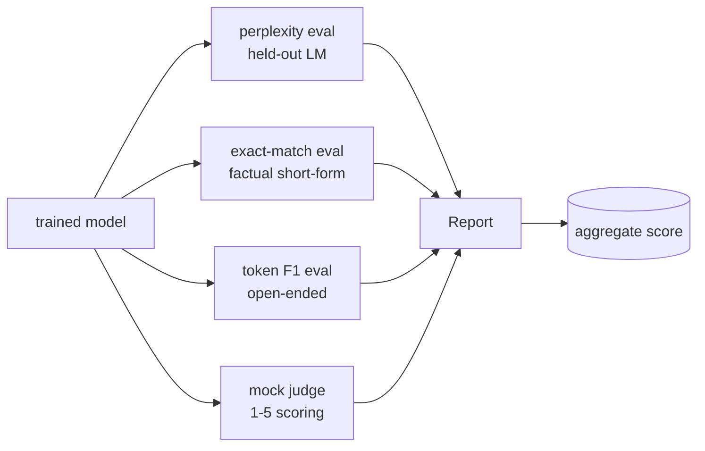
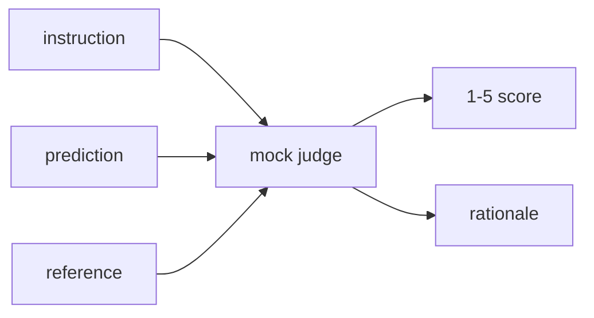
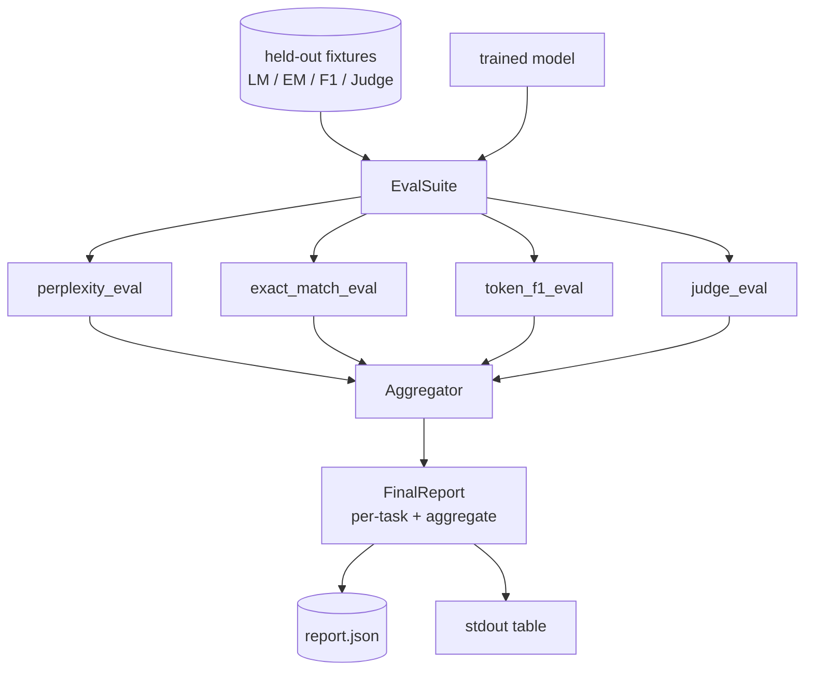

# Lekcja 41: Pełny potok ewaluacyjny

> Trening to część, którą możesz monitorować krzywymi straty. Ewaluacja to część, którą musisz zaprojektować. Ta lekcja buduje ujednolicony potok ewaluacyjny, który bierze dowolny wytrenowany model językowy, uruchamia na nim cztery heterogeniczne ewaluacje, agreguje wyniki do raportu na zadanie i dostarcza lokalnego atrapowego sędziego LLM-as-a-judge, aby pętla działała bez sieci. Cztery ewaluacje obejmują wymiary, których potrzebuje każdy dostarczany model: modelowanie języka (perplexity), poprawność krótkiej odpowiedzi (dokładne dopasowanie), podobieństwo otwartej odpowiedzi (F1 tokenów) i ocenę jakościową (sędzia).

**Typ:** Budowa
**Języki:** Python (torch, numpy)
**Wymagania wstępne:** Lekcje Fazy 19 od 30 do 37 (ścieżka NLP LLM: tokenizer, tablica osadzeń, blok uwagi, korpus transformera, pętla pretreningowa, punkty kontrolne, generowanie, perplexity)
**Czas:** ~90 minut

## Cele nauczania

- Obliczyć wstrzymaną perplexity z księgowaniem maskowanych tokenów na małym transformerze.
- Uruchomić ewaluację dokładnego dopasowania na faktograficznych krótkich promptach.
- Obliczyć F1 na poziomie tokenów między przewidywanym a referencyjnym stringiem z normalizacją.
- Zbudować lokalnego atrapowego sędziego LLM-as-judge, który punktuje wyjścia modelu w skali 1-5.
- Zagregować cztery ewaluacje do pojedynczego ważonego raportu z podziałem na zadanie.

## Problem

Pojedyncza metryka nigdy nie opisuje modelu językowego. Perplexity mówi, jak dobrze model dopasowuje rozkład języka, ale nic nie mówi o tym, czy odpowiada na pytania. Dokładne dopasowanie mówi, czy model produkuje złoty string, ale karze poprawne parafrazy. F1 tokenów wybacza parafrazę, ale jest oszukiwane przez leksykalne nakładanie się z błędną treścią. LLM-as-judge wychwytuje jakościowe wymiary, ale jest drogie i stochastyczne.

Potok, którego faktycznie chcesz, ma wszystkie cztery. Każda ewaluacja obejmuje wymiar, który inne pomijają. Każda działa na innym podzbiorze wstrzymanych danych ukształtowanych dla tej metryki. Końcowy raport pokazuje liczby na zadanie obok siebie i agregat, aby recenzent mógł na pierwszy rzut oka zobaczyć, jakie kompromisy robi model.

Ta lekcja buduje ten potok, end-to-end, w jednym pliku.

## Koncepcja

Każda ewaluacja to funkcja z `(model, dataset) -> EvalResult`. Wynik niesie wartość metryki, szczegóły na przykład do inspekcji i nazwę dla agregatu. Potok łączy je z konfiguracją, która mówi, które ewaluacje uruchomić i jak je ważyć.

## Perplexity, poprawnie liczone

Perplexity to `exp(średnie ujemne logarytmowanie wiarygodności na token)`. Implementacja ma dwa pułapki:

- Średnia musi być nad faktycznymi pozycjami tokenów, a nie nad batch * sequence. Tokeny dopełnienia muszą być wykluczone z mianownika, w przeciwnym razie perplexity będzie wyglądać lepiej niż jest.
- Model przewiduje następny token, więc logity na pozycji `i` przewidują token na pozycji `i+1`. Błędy off-by-one tutaj są ciche: strata wciąż trenuje, ale metryka staje się bez znaczenia.

Ewaluacja oblicza sumy na partię `-log p(token)` nad nie-dopełniającymi pozycjami i liczbę tokenów na partię, a następnie dzieli na końcu. To jest numerycznie bezpieczniejsze niż uśrednianie perplexity na partię (które niedoważa krótkie sekwencje) i pasuje do podręcznikowej definicji.

## Dokładne dopasowanie, z normalizacją

Harness normalizuje zarówno przewidywanie, jak i referencję przed porównaniem:

- Małe litery.
- Usunięcie otaczających białych znaków.
- Scalanie wewnętrznych przebiegów białych znaków do pojedynczej spacji.
- Usunięcie końcowej interpunkcji (`.`, `!`, `?`), jeśli obie strony różnią się tylko interpunkcją.

Normalizacja czyni dokładne dopasowanie użytecznym w praktyce. Model, który mówi `"Paryż"` jest poprawny; ten, który mówi `"Paryż."` też jest poprawny; ten, który mówi `"  paryż  "` też jest poprawny. Metryka wciąż wymaga, aby odpowiedź była tym samym stringiem po normalizacji.

## F1 tokenów, we właściwy sposób

F1 tokenów to harmoniczna średnia precyzji i czułości obliczona nad zbiorem tokenów. Kroki:

1. Normalizuj przewidywanie i referencję (te same zasady co dokładne dopasowanie).
2. Podziel każdy na listę tokenów (tokenizacja białymi znakami).
3. Policz przecięcie multizbiorów.
4. Precyzja = `intersection_count / len(pred_tokens)`. Czułość = `intersection_count / len(ref_tokens)`. F1 = harmoniczna średnia.

Jeśli zarówno przewidywanie, jak i referencja są puste, F1 wynosi 1 (dopasowanie niepuste). Jeśli tylko jedno jest puste, F1 wynosi 0. Ten wzorzec pasuje do referencji ewaluacyjnej SQuAD i produkuje stabilne liczby w poprzek parafraz.

## Lokalny atrapowy LLM-as-Judge

Prawdziwy sędzia to model graniczny za API. Na potrzeby tej lekcji sędzia musi działać offline. Atrapowy sędzia to deterministyczny punktator, który bierze instrukcję, przewidywanie modelu i referencję, i zwraca wynik w `{1, 2, 3, 4, 5}` plus jednoliniowe uzasadnienie. Zasady punktowania są jawne:

- 5, jeśli znormalizowane przewidywanie równa się znormalizowanej referencji.
- 4, jeśli F1 tokenów między przewidywaniem a referencją wynosi co najmniej 0.8.
- 3, jeśli F1 tokenów jest w `[0.5, 0.8)`.
- 2, jeśli F1 tokenów jest w `[0.2, 0.5)`.
- 1 w przeciwnym razie.

To nie jest prawdziwy sędzia, ale ma właściwy interfejs. Wymień na prawdziwy model później, zmieniając jedną funkcję. Potok nie dba o to.

## Agregacja

Agregat to ważona średnia znormalizowanych wyników ewaluacji. Każda ewaluacja raportuje własną liczbę w `[0, 1]`:

- Perplexity: normalizuj jako `1 / (1 + log(perplexity))`. Perplexity 1 mapuje się na 1, nieskończoność na 0.
- Dokładne dopasowanie: już w `[0, 1]`.
- F1 tokenów: już w `[0, 1]`.
- Sędzia: podziel przez 5.

Wagi są konfigurowalne. Domyślna mieszanka to 0.2 perplexity, 0.3 dokładne dopasowanie, 0.3 F1 tokenów, 0.2 sędzia. Wybór wag to decyzja produktowa; lekcja udostępnia pokrętło, abyś mógł eksperymentować.

## Architektura

`EvalSuite` to cienki orkiestrator. Każda indywidualna ewaluacja to wolna funkcja, która bierze `(model, tokenizer, dataset, config)` i zwraca `EvalResult`. `Aggregator` zbiera wyniki i produkuje końcowy raport. Demo drukuje tabelę i zapisuje kopię JSON, którą downstream CI może wchłonąć.

## Co zbudujesz

Implementacja to jeden `main.py` plus testy.

1. `TinyGPT`: ta sama architektura tylko-dekoderowa używana w lekcjach 38-40, zawarta, aby lekcja stała samodzielnie.
2. `InstructionTokenizer`: tokenizer bajtowy z specjalnymi INST / RESP / PAD.
3. Cztery testy: korpus LM, zestaw EM, zestaw F1 i zestaw sędziego. Po dwadzieścia przykładów, deterministyczne.
4. `perplexity_eval`: zwraca `EvalResult` z wartością perplexity i histogramem straty na token.
5. `exact_match_eval`: zwraca średnie EM i rekordy na przykład.
6. `token_f1_eval`: zwraca średnie F1 tokenów i rekordy na przykład.
7. `mock_judge` i `judge_eval`: wynik i uzasadnienie na przykład, średni wynik w zestawie.
8. `Aggregator.normalise`: reguła normalizacji na ewaluację.
9. `Aggregator.aggregate`: ważona średnia i złożony raport.
10. `run_demo`: trenuje mały model krótko, uruchamia wszystkie cztery ewaluacje, drukuje tabelę raportu i zapisuje JSON, kończy z kodem zero po sukcesie.

## Czytanie raportu

Raport ma trzy warstwy. Góra to wynik zagregowany. Poniżej są cztery liczby na ewaluację. Poniżej nich są podziały na przykład do diagnostyki. Awarie CI zazwyczaj chcą agregatu, ale recenzent szukający regresji chce podziału na przykład, aby zobaczyć, które wejścia model dostał źle.

Zrzut JSON używa stabilnych kluczy, aby dashboard CI mógł wykreślić trendy w wersjach. Ładnie wydrukowana tabela jest dla ludzi wpatrujących się w terminal po treningu.

## Cele dodatkowe

- Dodaj ewaluację kalibracji: czy prawdopodobieństwa softmax modelu pasują do jego dokładności? Podziel przewidywania według ufności i raportuj empiryczną dokładność na przedział.
- Dodaj ewaluację odporności: oznacz każdy przykład perturbacją (literówka, parafraza, dystraktor) i raportuj spadek metryki na perturbację.
- Zastąp atrapowego sędziego prawdziwym modelem za wywołaniem HTTP. Sygnatura funkcji się nie zmienia.
- Dodaj uczenie wag na zadanie: zamiast stałych wag, dopasuj wagi do docelowej kolejności preferencji między modelami.

Implementacja daje ci cztery ewaluacje, agregator i raport. Prawdziwe potoki ewaluacyjne dokładają wiele więcej wymiarów na wierzchu; wzór pozostaje ten sam: jedna funkcja na ewaluację, jeden agregator, jeden raport.