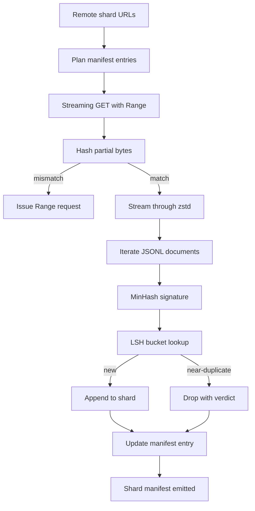

# Pobieracz dużego korpusu

> Trenowanie modelu językowego zaczyna się na długo przed pierwszym przejściem do przodu. Korpus musi wylądować na dysku, zdekompresowany, zdeduplikowany i dostępny, z historią wznawiania już opracowaną zanim sieć padnie przy 4 procentach. Ta lekcja buduje strumieniowy pobieracz, który ściąga skompresowane shardy, dekompresuje w locie za pomocą Zstandard, odciska palce prawie duplikatów przez MinHash plus haszowanie wrażliwe na lokalność i zapisuje manifest shardów, któremu reszta potoku może zaufać.

**Typ:** Budowa
**Języki:** Python
**Wymagania wstępne:** Lekcje Fazy 19 od 30 do 37
**Czas:** ~90 minut

## Cele nauczania

- Strumieniować zdalne shardy przez `urllib` i dekompresować przez `zstandard` bez buforowania całego pliku w pamięci.
- Wznawiać częściowe pobieranie przez wysyłanie żądań HTTP `Range` względem zweryfikowanego przesunięcia bajtowego.
- Zbudować sygnaturę MinHash na dokument i zasobnikować ją za pomocą LSH, aby prawie duplikaty kolidowały.
- Wyemitować manifest shardu z hashem treści, rozmiarem bajtowym, liczbą dokumentów i werdyktem deduplikacji.

## Problem

Pierwszy raz, gdy trenujesz na 200 GB korpusie, sieć pada przy 41 procentach, a skrypt kończy się z wyjątkiem `urllib`. Drugi raz pada przy 78 procentach. Przy 99 procentach przepisałeś pętlę trzy razy. Dwie awarie, które musisz zaprojektować od pierwszej minuty, to wznawianie częściowego pobierania i usuwanie duplikatów dokumentów. Oba mają dobrze znane rozwiązania; oba są rutynowo pomijane, ponieważ potok zaczyna się jako jednowierszowe wywołanie `requests.get`, które obrasta w zęby.

Wznawianie to problem HTTP. Serwer musi honorować `Range`, klient musi śledzić zweryfikowane przesunięcie względem rekordu na dysku, a zweryfikowane przesunięcie musi przetrwać śmierć procesu. Jeśli przesunięcie i plik różnią się choćby o jeden bajt, wznowione pobieranie zapisuje śmieci, a korpus jest uszkodzony w sposób, który ujawnia się dopiero podczas tokenizacji.

Deduplikacja to problem sygnatur. Deduplikacja przez dokładny hash nie łapie prawie duplikatów: ten sam artykuł Wikipedii pojawia się z trzema różnymi standardowymi stopkami, ten sam plik kodu z innym nagłówkiem licencji, ten sam post na blogu z parametrem śledzenia na każdym linku. MinHash plus LSH łapie je przy sub-liniowym koszcie. Koszt to jedna sygnatura na dokument i jedno wyszukiwanie w zasobniku na sygnaturę.

## Koncepcja



### Strumieniowanie z `urllib`

Standardowo-biblioteczny `urllib.request.urlopen` zwraca obiekt podobny do pliku. Owiń go w `zstandard.ZstdDecompressor().stream_reader`, a bajty płyną z sieci przez dekompresor do iteratora dokumentów, bez materializowania skompresowanego shardu lub zdekompresowanego shardu w pamięci. Jedynym kosztem pamięci jest bufor linii, sygnatura MinHash dla bieżącego dokumentu i indeks LSH.

### Wznawianie z `Range`

Pobieracz zapisuje dwa pliki na shard: sam shard i punkt kontrolny `.partial.json`. Punkt kontrolny rejestruje `verified_bytes`, `expected_size`, `sha256_prefix` (obliczony nad pierwszymi `verified_bytes` bajtami) i URL źródłowy. Przy starcie pobieracz odczytuje punkt kontrolny, ponownie oblicza `sha256_prefix` nad bajtami na dysku i wznawia tylko, jeśli ponownie obliczony hash pasuje. Jeśli hash jest zły, część jest odrzucana, a pobieranie restartuje się od bajtu zero. Ciche uszkodzenie jest niemożliwe, ponieważ zweryfikowane bajty są sprawdzane, a nie zakładane.

### MinHash plus LSH

MinHash szacuje podobieństwo Jaccarda dwóch zbiorów w stałej przestrzeni. Dla dokumentu zbiór to shingle (zachodzące na siebie n-gramy) jego tekstu. Sygnatura to `k` minimalnych wartości hashu, jedna na niezależną funkcję hashującą. Dwa dokumenty z podobieństwem Jaccarda `s` mają prawdopodobieństwo `s` zgodności na dowolnym pojedynczym składniku sygnatury.

LSH następnie grupuje `k` składników w `b` pasm po `r` wierszy każde, gdzie `k = b * r`. Dwa dokumenty kolidują w co najmniej jednym paśmie z prawdopodobieństwem `1 - (1 - s^r)^b`, co jest ostrą granicą wokół wartości `s`, do której dostrajasz `(b, r)`. Próg dla typowej deduplikacji korpusu to `s = 0.8`, który literatura LSH osiąga z `k = 128`, `b = 32`, `r = 4`.

### Manifest shardu jako kontrakt

Jedynym trwałym wyjściem pobieracza jest manifest. Manifest przechowuje, na shard, URL, liczbę zdekompresowanych bajtów, liczbę dokumentów, liczbę unikalnych dokumentów po deduplikacji i sha256 końcowego pliku shardu. Downstreamowa tokenizacja czyta manifest, a nie listing katalogu. Jeśli shard brakuje lub jego sha256 jest złe, manifest mówi następnemu etapowi, aby odmówić startu. Manifest jest krawędzią decyzyjną między "dane są pobrane" a "dane są pobrane i weryfikowalne".

## Budowa

`code/main.py` implementuje:

- `ShardPlanner` - czyta listę URL-i shardów i produkuje zaplanowane wpisy manifestu.
- `StreamingDownloader` - otwiera strumień `urllib` z opcjonalnym `Range`, zapisuje do tymczasowego pliku, aktualizuje punkt kontrolny `.partial.json` na każdym kawałku i weryfikuje prefiks sha256 przy wznawianiu.
- `ZstdDocIterator` - owija strumień podobny do pliku w `zstandard.ZstdDecompressor` i zwraca jeden dokument na linię.
- `MinHasher` - produkuje `k`-składnikową sygnaturę dla stringa przy użyciu ustalonej rodziny ziaren hashu.
- `LSHIndex` - ładuje sygnatury do zasobników według pasma i raportuje kolizje.
- `Dedup` - łączy hasher i indeks, aby oznaczyć każdy dokument `keep` lub `near_duplicate` wraz z pasującym id shardu.
- `ManifestWriter` - zbiera statystyki na shard i zapisuje `manifest.json`.

Demo na dole pliku buduje mały syntetyczny korpus na dysku, kompresuje go `zstandard`, pobiera przez URL `file://`, deduplikuje i drukuje manifest.

Uruchom:

```bash
python3 code/main.py
```

Skrypt kończy z kodem zero i drukuje podsumowanie manifestu.

## Wzorce produkcyjne

Cztery wzorce skalują tę lekcję do prawdziwych korpusów.

**Punkt kontrolny przed zapisem.** `.partial.json` musi być `fsync`-owany, zanim bajty zostaną dołączone do shardu. W przeciwnym razie utrata zasilania odwraca kolejność: bajty shardu na dysku, punkt kontrolny bez nich, następne wznowienie wierzy, że ma mniej zweryfikowanych bajtów niż faktycznie, zduplikowane bajty przyrostka uszkadzają plik. Najpierw punkt kontrolny, potem zapis. To ta sama dyscyplina co dziennik zapisu z wyprzedzeniem.

**Indeks LSH w shardach.** Pojedynczy indeks LSH nad całym korpusem nie mieści się w RAM w skali 200 GB. Podziel indeks LSH przez hash pierwszego pasma, przechowuj partycje na dysku i konsultuj tylko partycję, w którą trafiłaby nowa sygnatura. Koszt to jeden dodatkowy odczyt z dysku na dokument; korzyść to indeks LSH, który nie jest już twardym sufitem pamięci.

**Nagrobek, a nie usunięcie.** Odrzucone duplikaty są rejestrowane w manifeście z werdyktem `near_duplicate` i id shardu dokumentu, z którym kolidowały. Usunięcie ich traci link między duplikatem a jego strażnikiem. Nagrobek zachowuje ślad audytowy i pozwala downstreamowemu przejściu zmienić zdanie co do progu.

**Sha256 na shard w manifeście plus manifest sha256.** Sam manifest dostaje hash treści. Etapy downstreamowe weryfikują hash manifestu, zanim zaufają wpisom na shard. Bez tego manifest jest cichą powierzchnią ataku: atakujący, który może edytować jeden plik, może uszkodzić cały potok.

## Użycie

Wzorce produkcyjne:

- **Wznawiaj przy każdym uruchomieniu CI.** Uruchomienia CI są efemeryczne. Pobieracz musi zakładać świeży dysk przy każdym uruchomieniu i odzyskiwać z pamięci podręcznej lub zdalnie. `--cache-dir` to flagę pierwszej klasy.
- **Deduplikacja przed tokenizacją.** Tokenizacja jest droga. Uruchomienie jej dwa razy na tym samym dokumencie to podwójny koszt za tę samą krzywą straty. Dedup jest upstreamem tokenizacji, a nie downstreamem.
- **Manifest jako bramka scalania.** Uruchomienie treningowe czyta sha256 manifestu z przypiętego commita. Nowa wersja zestawu danych wymaga nowego commita manifestu. Link między kodem a danymi to git, a nie folklor.

## Dostarczenie

`outputs/skill-corpus-downloader.md` opisałby na prawdziwym projekcie, które URL-e zasilają pobieracz, jak ułożony jest katalog punktów kontrolnych, jaką szerokość shingle i trójkę `(k, b, r)` używa dedup i gdzie manifest żyje w kontroli wersji. Ta lekcja dostarcza silnik.

## Ćwiczenia

1. Dodaj flagę `--shingle-width` i zmierz, jak zmienia się werdykt dedupu przy szerokościach 3, 5, 9. Uzasadnij wybraną domyślną.
2. Dodaj obsługę gzip obok zstd przez wykrywanie magicznych bajtów. Pobieracz nie powinien wymagać od wywołującego określania kodeka.
3. Dodaj tryb `--resume-only`, który odmawia rozpoczęcia świeżego pobierania, jeśli nie znaleziono punktu kontrolnego. Przydatne w CI, aby jedno uruchomienie nie przypadkiem ponownie ściągnęło 200 GB.
4. Przenieś indeks LSH do pliku shelf lub sqlite i zmierz przepustowość względem wariantu w pamięci.
5. Dodaj sprawdzenie sha256 manifestu przy starcie. Pobieracz powinien zamknąć się z błędem, jeśli manifest na dysku nie zgadza się z hashem manifestu w `manifest.lock`.

## Kluczowe terminy

| Termin | Co ludzie mówią | Co to faktycznie oznacza |
|--------|-----------------|--------------------------|
| Shard | "Plik" | Samodzielny wycinek korpusu z własnym sha256, używany jako jednostka wznawiania i dedupu |
| Sygnatura MinHash | "Odcisk palca" | `k`-składnikowy szkic zbioru, gdzie każdy składnik to minimum jednego niezależnego hashu nad zbiorem |
| Pasmo LSH | "Zasobnik" | Grupa `r` składników sygnatury używana jako pojedynczy klucz zasobnika do wykrywania kolizji |
| Zweryfikowane bajty | "Przesunięcie wznowienia" | Bajty na dysku, których prefiks sha256 pasuje do punktu kontrolnego; jedyne bezpieczne przesunięcie do wznawiania |
| Manifest | "Indeks" | Pojedynczy trwały zapis tego, co wyprodukował pobieracz, włącznie z hashami treści |

## Dalsza lektura

- [RFC 7233](https://datatracker.ietf.org/doc/html/rfc7233) - żądania HTTP Range, protokół wznawiania
- [Specyfikacja formatu Zstandard](https://datatracker.ietf.org/doc/html/rfc8478) - format ramki, który czyni strumieniową dekompresję bezpieczną
- [MinHash](https://en.wikipedia.org/wiki/MinHash) - rodzina sygnatur, której używa ta lekcja
- [Haszowanie wrażliwe na lokalność](https://en.wikipedia.org/wiki/Locality-sensitive_hashing) - schemat pasmowy za progiem dedupu
- Faza 19 · 43 - tokenizowany korpus HDF5, który zasila pobieracz
- Faza 19 · 44 - harmonogram cosinusowy, który trenuje na korpusie
- Faza 19 · 45 - pętla AMP, która konsumuje harmonogram