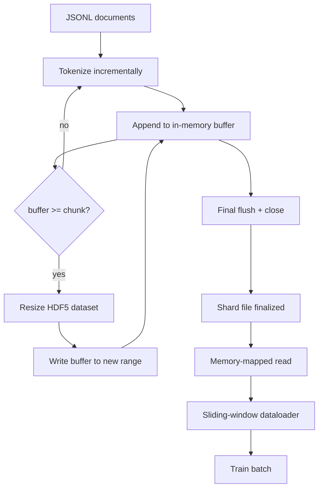

# Tokenizowany korpus HDF5

> Pobrany korpus musi wylądować w układzie, który trener może strumieniować z prędkością liniową. JSONL na dysku nie przetrwa 16 pracowników dataloadera. HDF5 z zmiennym rozmiarem, chunkowanym zestawem danych liczb całkowitych – tak. Ta lekcja buduje strumieniową tokenizację do zmiennego rozmiaru zestawu danych HDF5, shardowany zapis w wielu plikach, odczyt z mapowaniem pamięci w czasie treningu i dataloader z przesuwnym oknem produkujący sekwencje o stałej długości z odpowiednimi regułami pakowania.

**Typ:** Budowa
**Języki:** Python
**Wymagania wstępne:** Lekcje Fazy 19 od 30 do 37
**Czas:** ~90 minut

## Cele nauczania

- Strumieniować dokumenty do zmiennego rozmiaru zestawu danych HDF5 liczb całkowitych z deterministycznym chunkowaniem.
- Rozdzielić zapis na wiele plików HDF5, aby awaria była ograniczona i paralelizacja możliwa.
- Odczytać tokeny z powrotem przez układowy chunkowany HDF5 wspierany pamięcią podręczną stron, aby dataloader kopiował do buforów partii tylko w czasie partii.
- Zaimplementować dataloader z przesuwnym oknem, który emituje sekwencje treningowe o stałej długości z jawnymi regułami pakowania.

## Problem

Nowoczesne uruchomienie treningowe modelu językowego odczytuje tokeny z prędkością setek tysięcy próbek na sekundę w poprzek dziesiątek pracowników. JSONL na dysku umiera przy pierwszym błędzie strony na zimnej pamięci podręcznej: parser JSON jest wolny, granice dokumentów nie są adresowalne, a szukanie "próbki 4,217,884" wymaga skanowania pliku. Nawet Parquet, który dobrze kompresuje, jest słabym dopasowaniem, ponieważ trener nie chce kolumn; chce płaskiego strumienia tokenów z dostępem swobodnym O(1).

HDF5 pasuje, ponieważ oferuje chunkowany, zmienny, tylko-liczby-całkowite zestaw danych, którego chunki są przyjazne pamięci podręcznej stron przy odczycie. Trener prosi o wycinek `tokens[3,200,000 : 3,200,8192]`, a HDF5 kopiuje żądaną hiperpłaszczyznę z pamięci podręcznej stron do świeżo przydzielonej tablicy NumPy. Koszt to jeden otwarty uchwyt pliku i footprint pamięci podręcznej stron rozmiaru chunka na pracownika, co jest znikome w porównaniu z kosztem dekodowania JSONL.

Problem budowy polega na uczciwości strony zapisu. Zestawy danych o zmiennym rozmiarze są łatwe do nadużycia: zapisz jeden dokument na raz, a plik HDF5 jest pofragmentowany do punktu niezdatności do użytku. Zapisz wszystkie dokumenty w jednym przeskalowaniu, a śmierć procesu traci cały shard. Właściwą dyscypliną jest buforuj-następnie-rozszerz, z rozmiarem bufora pasującym do rozmiaru chunka i shardowanym zapisem, który dzieli obciążenie na pliki, aby awaria traciła co najwyżej jeden shard.

## Koncepcja



### Zmienny rozmiar HDF5 zrobiony dobrze

Zestaw danych tokenów jest tworzony z `maxshape=(None,)` i stałym `chunks=(chunk_size,)`. Zapis postępuje przez buforowanie tokenów w tablicy NumPy o długości `chunk_size`. Gdy bufor się wypełnia, zestaw danych jest zmieniany rozmiar o dokładnie `chunk_size`, a bufor zapisywany w nowym zakresie. Na koniec shardu resztkowy bufor jest zapisywany w końcowym częściowym zakresie. Każdy zapis jest ciągły i wyrównany do chunka z wyjątkiem ostatniego, o którym czytelnik jest informowany, aby obciął przy zarejestrowanym `token_count` w atrybutach HDF5 shardu.

### Shardowany zapis

Pojedynczy plik HDF5 to pojedynczy punkt awarii. Potok zapisuje shardy równolegle: każdy shard wejściowy z Fazy 19 lekcji 42 produkuje jeden wyjściowy shard HDF5. Indeks `shards.json` rejestruje, na shard, ścieżkę pliku, liczbę tokenów, liczbę dokumentów i sha256 nad tokenami. Trener czyta `shards.json`, aby obliczyć globalne przesunięcia i zweryfikować korpus.

### Odczyt z mapowaniem pamięci

W czasie treningu każdy pracownik otwiera swoją część plików HDF5 w trybie `swmr=True` i prosi o `tokens[start:stop]`. Układ chunków HDF5 czyni to odczytem wspieranym pamięcią podręczną stron, gdy chunk jest gorący. Pracownik nigdy nie materializuje całego pliku: wycinek jest kopiowany do bufora partii dataloadera, który dataloader następnie kopiuje do przypiętego tensora treningowego w czasie partii. Gorąca ścieżka ma jedno wywołanie systemowe na tranzycję chunka; wszystko inne to dostęp do RAM.

### Dataloader z przesuwnym oknem

Dataloader to jedyny etap, który wie o długości sekwencji treningowej. Wybiera losowy indeks początku w globalnym strumieniu tokenów, odczytuje `window_size + 1` tokenów i zwraca `(input, target) = (tokens[:-1], tokens[1:])`. Granice dokumentów nie są egzekwowane: okno może rozciągać się na dwa dokumenty, z jawnym `boundary_token_id` między nimi, aby model nauczył się używać separatora. To standardowa reguła pakowania; to także reguła, o której początkujący zapomina, kończąc z korpusem, który jest w 8 procentach tokenami granicznymi treningu i w 92 procentach naturalnym tekstem.

## Budowa

`code/main.py` implementuje:

- `Tokenizer` - deterministyczny tokenizer na poziomie bajtów wystarczająco dobry dla dema. Interfejs to `encode(text) -> list[int]` i `vocab_size`.
- `HDF5ShardWriter` - otwiera zmienny zestaw danych liczb całkowitych, buforuje tokeny do rozmiaru chunka, zmienia rozmiar i zapisuje w krokach o stałym rozmiarze, rejestruje `token_count` i `sha256` jako atrybuty HDF5 przy zamknięciu.
- `ShardedTokenizationPipeline` - iteruje dokumenty wejściowe, kieruje je do pisarza i emituje indeks `shards.json`.
- `MmapTokenStore` - otwiera pliki shardów do odczytu z mapowaniem pamięci, oblicza globalne przesunięcia, udostępnia pojedyncze API `get_slice(start, stop)`.
- `SlidingWindowDataloader` - wybiera losowe okna z globalnego strumienia i zwraca tablice NumPy `(input_ids, target_ids)`.

Demo na dole pliku buduje mały korpus w pamięci, tokenizuje do dwóch shardów, otwiera je przez mapowanie pamięci, uruchamia dataloader dla 10 partii i drukuje kształt na partię i sumę kontrolną.

Uruchom:

```bash
python3 code/main.py
```

Skrypt kończy z kodem zero i drukuje sumy kontrolne partii.

## Wzorce produkcyjne

Cztery wzorce skalują tę lekcję do prawdziwego uruchomienia treningowego.

**Rozmiar chunka równy typowemu odczytowi.** Trener odczytuje `window_size + 1` tokenów na próbkę. Ustaw chunk HDF5 na wielokrotność `window_size`, a odczyty są wyrównane do pamięci podręcznej stron. Niedopasowane chunki zmniejszają przepustowość o połowę, ponieważ każda próbka dotyka dwóch chunków.

**Liczba tokenów w atrybutach, a nie w zestawie danych.** Końcowy wycinek zestawu danych może być częściowo pełny, ponieważ rozmiar chunka nie dzieli granicy dokumentu. Zapisz prawdziwy `token_count` jako atrybut HDF5 na zestawie danych i każ czytelnikowi obciąć przy tej wartości. Bez tego czytelnik wychodzi poza koniec w tokeny wypełnione zerami, a model uczy się przewidywać zero.

**Shardowany sha256 z równoległą weryfikacją.** Każdy shard ma własny sha256 nad bajtami tokenów. Trener może zweryfikować wszystkie shardy równolegle przed rozpoczęciem treningu. Zły sha256 kończy uruchomienie wcześnie, a nie w trzeciej epoce po szesnastu godzinach.

**`swmr=True` po obu stronach, z `libver="latest"` u pisarza.** Tryb Single-Writer-Multiple-Reader wymaga, aby pisarz otworzył z `libver="latest"`, utworzył każdy zestaw danych z góry, a następnie ustawił `file.swmr_mode = True`. Potem pisarz musi wywołać `dataset.flush()` po każdym przeskalowaniu, aby pracownicy czytelnicy (otwarci z `swmr=True`) widzieli spójne dane. Pominięcie `libver="latest"` lub włączenie SWMR po zmianach strukturalnych to częste źródło awarii "plik jest zablokowany".

## Użycie

Wzorce produkcyjne:

- **Jeden HDF5 na shard źródłowy.** Pobieracz (lekcja 42) emituje jeden shard na URL; tokenizacja (ta lekcja) emituje jeden HDF5 na shard źródłowy. Mapowanie 1:1 czyni wznawianie i odzyskiwanie po częściowej awarii trywialnym.
- **Identyfikator tokena granicznego.** Token graniczny jest częścią słownika tokenizera i jest jedynym tokenem, który dataloader wstrzykuje. Strata treningowa maskuje token graniczny, jeśli model ma go ignorować; w przeciwnym razie uczy się używać go jako separatora sekwencji.
- **`shards.json` jako źródło prawdy.** Dodanie nowego shardu oznacza zapisanie HDF5, obliczenie jego sha256 i dołączenie wpisu. Trener czyta plik raz przy starcie i nigdy więcej nie dotyka listingu katalogu.

## Dostarczenie

`outputs/skill-hdf5-tokenized-corpus.md` opisałby na prawdziwym projekcie, który tokenizer zasila potok, jaki rozmiar chunka pasuje do okna trenera, gdzie `shards.json` żyje w kontroli wersji i jak pracownicy dataloadera są rozdzielani na pliki. Ta lekcja dostarcza silnik.

## Ćwiczenia

1. Dodaj flagę `--compression gzip` do pisarza HDF5 i zmierz koszt przepustowości na korpusie dema. Uzasadnij wybraną domyślną.
2. Dodaj deterministyczne ziarno do dataloadera z przesuwnym oknem i zweryfikuj, że dwa uruchomienia z tym samym ziarnem produkują identyczne partie.
3. Dodaj tryb `--validate`, który odczytuje każdy shard, ponownie oblicza sha256 nad jego tokenami i porównuje z `shards.json`. CI powinien uruchomić to przed rozpoczęciem treningu.
4. Porównaj przepustowość dataloadera przy rozmiarach chunka równych, połowie i dwukrotności rozmiaru okna. Raportuj efekt pamięci podręcznej stron.
5. Dodaj flagę `--max-document-tokens`, która obcina bardzo długie dokumenty w czasie zapisu. Uzasadnij kompromis wobec decyzji w czasie odczytu.

## Kluczowe terminy

| Termin | Co ludzie mówią | Co to faktycznie oznacza |
|--------|-----------------|--------------------------|
| Zestaw danych zmienny | "Tylko-do-dopisywania" | Zestaw danych HDF5 z `maxshape=(None,)` rosnący przez wywołania `resize` w krokach rozmiaru chunka |
| Układ chunkowany | "Jak HDF5 to przechowuje" | Strony dyskowe o stałym rozmiarze, które jądro może mapować w pamięci, a dataloader czytać ciągle |
| Tryb `swmr` | "Czytaj-podczas-zapisu" | Tryb Single-Writer-Multiple-Reader, który pozwala pracownikom dataloadera bezpiecznie współdzielić plik |
| Indeks shardów | "shards.json" | Trwały indeks wszystkich shardów tokenów z przesunięciami i hashami treści |
| Przesuwne okno | "Próbka treningowa" | Wycięcie o stałej długości z globalnego strumienia tokenów, które trener łączy z celem przesuniętym o jeden |

## Dalsza lektura

- [Dokumentacja chunkowania HDF5](https://docs.hdfgroup.org/hdf5/v1_14/) - chunkowany, zmienny układ zestawu danych, którego używa ta lekcja
- [Przewodnik użytkownika h5py](https://docs.h5py.org/en/stable/) - wiązania Python dla HDF5
- [Mapowanie pamięci NumPy](https://numpy.org/doc/stable/reference/generated/numpy.memmap.html) - prymityw strony odczytu, który HDF5 udostępnia przez h5py
- Faza 19 · 42 - pobieracz, którego wyjście ta lekcja tokenizuje
- Faza 19 · 44 - harmonogram cosinusowy, który konsumuje ten dataloader
- Faza 19 · 45 - pętla AMP, która opakowuje krok treningowy