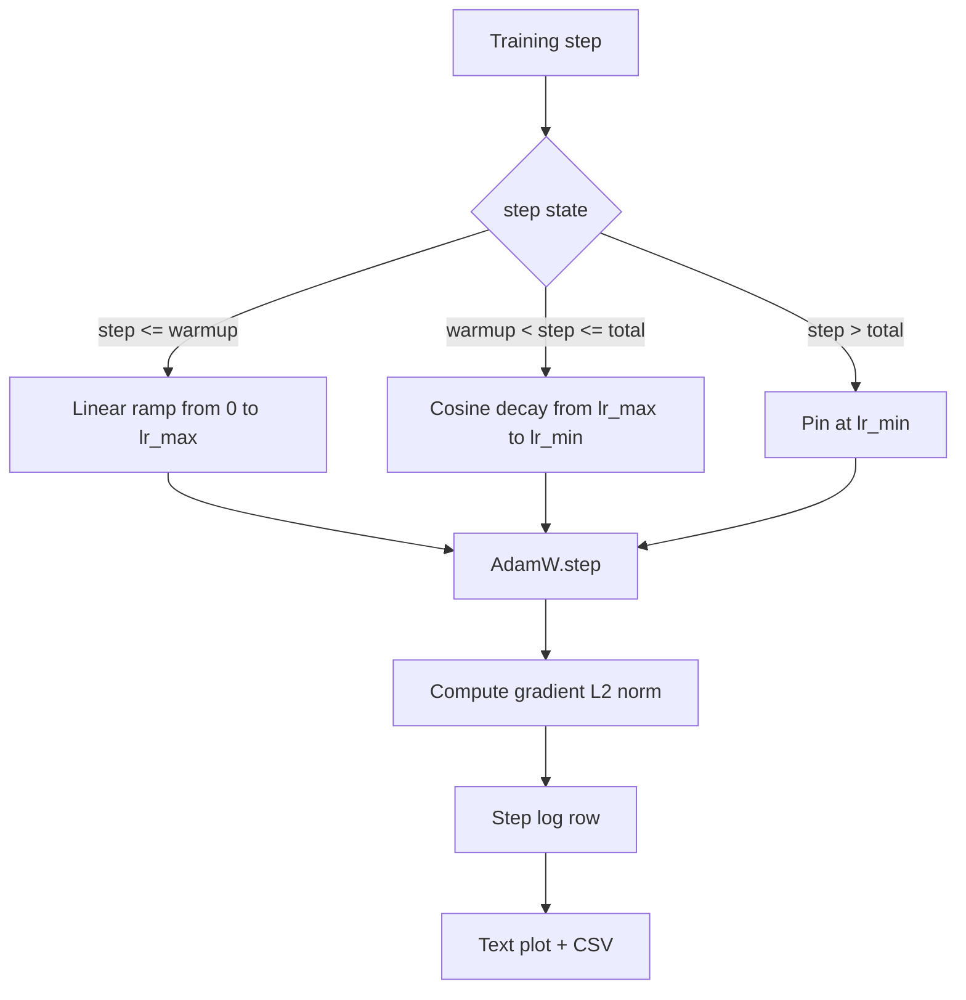

# Harmonogram LR Cosinusowy z liniowym rozgrzewaniem

> Harmonogram współczynnika uczenia to drugi najważniejszy wybór po funkcji straty. AdamW z zanikiem cosinusowym i liniowym rozgrzewaniem to nowoczesny domyślny wybór dla treningu modeli językowych, ponieważ pozwala modelowi zobaczyć mały efektywny rozmiar kroku podczas kruchych pierwszych tysięcy aktualizacji, zwiększa do skonfigurowanego szczytu i płynnie zanika z powrotem w kierunku zera. Ta lekcja buduje ten harmonogram, wykreśla krzywą nad krokami treningowymi, rejestruje normy gradientów obok harmonogramu i udowadnia, że harmonogram honoruje granice rozgrzewania, szczytu i zaniku.

**Typ:** Budowa
**Języki:** Python
**Wymagania wstępne:** Lekcje Fazy 19 od 30 do 37
**Czas:** ~90 minut

## Cele nauczania

- Zaimplementować optymalizator AdamW podłączony do harmonogramu współczynnika uczenia cosinusowego z liniowym rozgrzewaniem.
- Obliczyć dokładną wartość harmonogramu w dowolnym kroku bez dryfu zmiennoprzecinkowego między uruchomieniami.
- Zalogować normę L2 gradientów obok współczynnika uczenia, aby zdrowie treningu było obserwowalne.
- Wyrenderować harmonogram do wykresu tekstowego, który oko może odczytać, i CSV, który każde narzędzie może skonsumować.

## Problem

Pierwszy tysiąc aktualizacji treningowych jest najgłośniejszy. Wagi modelu są wciąż blisko inicjalizacji. Estymator drugiego momentu optymalizatora nie ustabilizował się. Norma gradientu jest duża i głośna. Jeśli współczynnik uczenia jest na swoim szczycie podczas tych aktualizacji, model albo rozbiega się wprost, albo osiada na płaskowyżu straty, z którego nigdy nie ucieka. Dwie dobrze znane poprawki to obcinanie gradientów, które jest tematem Fazy 19 lekcji 45, i harmonogram współczynnika uczenia, który zaczyna mały i zwiększa się.

Harmonogram cosinusowy z rozgrzewaniem ma trzy regiony. Od kroku zero do kroku `warmup_steps` współczynnik uczenia skaluje się liniowo od zera do skonfigurowanego szczytu `lr_max`. Od kroku `warmup_steps` do kroku `total_steps` współczynnik uczenia podąża za górną połówką krzywej cosinusowej, zanikając od `lr_max` do `lr_min`. Po `total_steps` współczynnik uczenia jest przypięty na `lr_min`, aby źle skonfigurowany trener, który przekroczy, nie wyszedł cicho z harmonogramu.

Problem budowy polega na tym, że harmonogramy są łatwe do pomylenia off-by-one. Off-by-one ujawnia się sześć godzin w uruchomieniu treningowym jako współczynnik uczenia o 1 procent za wysoki lub za niski w momencie, gdy model zaczyna się przeuczać, co jest niewidoczne, chyba że harmonogram jest wyczerpująco testowany na granicach.

## Koncepcja



### Wzór rozgrzewania

Dla `step` w `[0, warmup_steps]` z `warmup_steps > 0`, współczynnik uczenia to `lr_max * step / warmup_steps`. Zdegenerowany przypadek `warmup_steps = 0` jest traktowany jako "brak rozgrzewania": harmonogram zaczyna bezpośrednio od `lr_max` w kroku zero i natychmiast wchodzi w zanik cosinusowy. Niektóre harnessy testowe przekazują `warmup_steps = 0`, aby sprawdzić, czy harmonogram wciąż produkuje użyteczną krzywą.

### Wzór cosinusowy

Dla `step` w `(warmup_steps, total_steps]` współczynnik uczenia to `lr_min + 0.5 * (lr_max - lr_min) * (1 + cos(pi * progress))`, gdzie `progress = (step - warmup_steps) / max(1, total_steps - warmup_steps)`. W `step = warmup_steps` cosinus wynosi `cos(0) = 1`, co daje `lr_max`, dokładnie pasując do punktu końcowego rozgrzewania. W `step = total_steps` cosinus wynosi `cos(pi) = -1`, co daje `lr_min`, dokładnie pasując do punktu końcowego zaniku.

Ciągłość na obu końcach nie jest przypadkowa. To powód, dla którego harmonogram jest zaimplementowany jako pojedyncza funkcja nad `step`, a nie jako trzy różne funkcje sklejone. Sklejony harmonogram traci jedną granicę za pierwszym razem, gdy `lr_max` jest zmieniony.

### Podłoga po total_steps

Dla `step > total_steps` współczynnik uczenia pozostaje na `lr_min`. Kontrakt jest jawny: harmonogram nie kończy się błędem i nie ekstrapoluje; przypina się na podłodze i pozwala trenerowi zalogować ostrzeżenie. Trenerzy, którzy muszą przedłużyć trening, zmieniają `total_steps` harmonogramu, a nie pętlę.

### Rejestrowanie normy gradientu obok współczynnika

Harmonogram to połowa zdrowia treningu. Norma gradientu to druga połowa. Pętla treningowa rejestruje oba na krok. Rozbieżne uruchomienie treningowe pokazuje skok normy gradientu przed stratą; dobrze dostrojone rozgrzewanie utrzymuje normę rosnącą liniowo z współczynnikiem; zbyt agresywny szczyt objawia się normą, która pozostaje wysoka po rozgrzewaniu. Zestaw danych na dysku to `step, lr, grad_l2_norm, loss`. CSV jest jedynym trwałym zapisem.

## Budowa

`code/main.py` implementuje:

- `CosineWithWarmup` - bezstanowa funkcja `lr(step) -> float` nad skonfigurowanym harmonogramem.
- `TrainState` - opakowuje model, optymalizator `AdamW` i harmonogram w pojedynczą funkcję kroku.
- `TrainState.step` - uruchamia jedno przejście do przodu, jedno przejście wsteczne, rejestruje normę L2 gradientu i stosuje `lr(step)` do optymalizatora.
- `plot_schedule_ascii` - renderuje harmonogram jako wykres tekstowy, który oko może odczytać.
- `write_schedule_csv` - emituje jeden wiersz na krok z współczynnikiem uczenia.

Demo na dole pliku buduje mały model `nn.Linear`, trenuje przez 20 kroków nad stałą partią wejściową i drukuje współczynnik uczenia na krok, normę gradientu i stratę. Harmonogram jest również renderowany jako wykres tekstowy dla wizualnego sprawdzenia poprawności.

Uruchom:

```bash
python3 code/main.py
```

Skrypt kończy z kodem zero i drukuje dziennik treningowy na krok plus wykres harmonogramu.

## Wzorce produkcyjne

Cztery wzorce podnoszą harmonogram do rangi artefaktu produkcyjnego.

**Harmonogram żyje w konfiguracji, nie w kodzie.** Trener odczytuje `warmup_steps`, `total_steps`, `lr_max`, `lr_min` z konfiguracji YAML lub JSON, która jest commitowana do gita. Harmonogram jest powtarzalny, ponieważ konfiguracja jest adresowana treścią; harmonogram jest audytowalny, ponieważ konfiguracja jest częścią diffa PR.

**Licznik kroków jest monotoniczny i odsprzężony od epok.** Niektóre frameworki mylą krok z epoką, gdy zestaw danych jest shardowany lub dataloader restartuje się. Harmonogram odczytuje `global_step` z punktu kontrolnego trenera, a nie z lokalnego licznika. Wznowione uruchomienie kontynuuje na właściwej pozycji harmonogramu, ponieważ licznik kroków jest trwałą osią.

**Wykres harmonogramu w katalogu uruchomienia.** Każde uruchomienie treningowe zapisuje `outputs/lr_schedule.png` (lub w tej lekcji wykres tekstowy) do swojego katalogu uruchomienia. Recenzent, który przegląda katalog, może sprawdzić harmonogram bez ponownego uruchamiania czegokolwiek. To łapie klasę błędów źle skonfigurowanego harmonogramu w czasie PR.

**Schemat wiersza dziennika jest stały.** `step, lr, grad_l2_norm, loss` w tej kolejności. Downstreamowy notebook lub dashboard odczytuje schemat; zmiana nazwy kolumny bez zwiększania wersji unieważnia każdy istniejący dashboard.

## Użycie

Wzorce produkcyjne:

- **Skanuj szczyt przed skanowaniem czegokolwiek innego.** `lr_max` to najbardziej czułe pokrętło. Skanuj go na małym modelu najpierw; optymalny `lr_max` skaluje się słabo z rozmiarem modelu, więc skan na małym modelu jest silnym prior.
- **Rozgrzewanie to ułamek całkowitej liczby kroków, a nie bezwzględna liczba.** Uruchomienie 200-milionowych kroków z 2000 krokami rozgrzewania zaczyna na szczycie prawie natychmiast; uruchomienie 20 000 kroków z tą samą liczbą rozgrzewa się przez 10 procent. Konfiguruj rozgrzewanie jako ułamek (typowy: 1-3 procent), aby harmonogram skalował się z czasem trwania treningu.
- **`lr_min` jest niezerowe celowo.** Podłoga, która wynosi 10 procent `lr_max`, utrzymuje optymalizator uczący się podczas długiego ogona. Harmonogram `lr_min = 0` produkuje krzywą treningową, która wygląda świetnie na wykresie i model, który faktycznie nie zakończył treningu.

## Dostarczenie

`outputs/skill-cosine-warmup.md` opisałby na prawdziwym projekcie, która konfiguracja niesie harmonogram, z którego kroku trenera odczytywany jest licznik globalny i jaki skan `lr_max` wyprodukował wdrożoną wartość. Ta lekcja dostarcza silnik.

## Ćwiczenia

1. Dodaj wariant odwrotności pierwiastka kwadratowego harmonogramu i porównaj go na zabawkowym uruchomieniu treningowym 200 kroków. Która krzywa produkuje niższą stratę końcową?
2. Dodaj flagę `--restart`, która dodaje drugie rozgrzewanie w `total_steps / 2`. Uzasadnij, czy gorące restarty poprawiają czy pogarszają zabawkowe uruchomienie.
3. Dodaj test jednostkowy ciągłości harmonogramu: dla każdego kroku w `[0, total_steps]` różnica `|lr(step+1) - lr(step)|` jest ograniczona przez `lr_max / warmup_steps`.
4. Podłącz harmonogram do `torch.optim.lr_scheduler.LambdaLR`, aby komponował się z kodem frameworka. Lekcja używa zwykłej funkcji kroku; co zmienia opakowanie?
5. Dodaj flagę `--plot-png`, która zapisuje prawdziwy wykres przez `matplotlib`. Uzasadnij, czy wykres tekstowy lekcji czy PNG jest lepszym domyślnym wyborem dla uruchomień CI.

## Kluczowe terminy

| Termin | Co ludzie mówią | Co to faktycznie oznacza |
|--------|-----------------|--------------------------|
| Rozgrzewanie | "Wolny start" | Liniowa rampa od zera do `lr_max` przez pierwsze `warmup_steps` aktualizacji |
| Zanik cosinusowy | "Gładki spadek" | Górna połówka krzywej cosinusowej od `lr_max` do `lr_min` nad pozostałymi krokami |
| Podłoga | "Po treningu" | Stała wartość `lr_min`, którą harmonogram przypina po `total_steps` |
| Norma gradientu | "L2 gradientów" | Norma Euklidesowa połączonego wektora gradientu, rejestrowana na każdym kroku |
| Krok globalny | "Oś harmonogramu" | Monotoniczny licznik kroków, który przetrwa restart i napędza harmonogram |

## Dalsza lektura

- [Loshchilov and Hutter, SGDR: Stochastic Gradient Descent with Warm Restarts (arXiv 1608.03983)](https://arxiv.org/abs/1608.03983) - referencyjny artykuł harmonogramu cosinusowego
- [Loshchilov and Hutter, Decoupled Weight Decay Regularization (arXiv 1711.05101)](https://arxiv.org/abs/1711.05101) - referencyjny artykuł AdamW
- [PyTorch torch.optim.lr_scheduler](https://docs.pytorch.org/docs/stable/optim.html#how-to-adjust-learning-rate) - jak funkcje kroku komponują się z schedulerami frameworka
- Faza 19 · 42 - pobieracz, którego korpus ten harmonogram konsumuje
- Faza 19 · 43 - dataloader, z którym harmonogram współewoluuje
- Faza 19 · 45 - obcinanie gradientu i AMP, następna warstwa w pętli