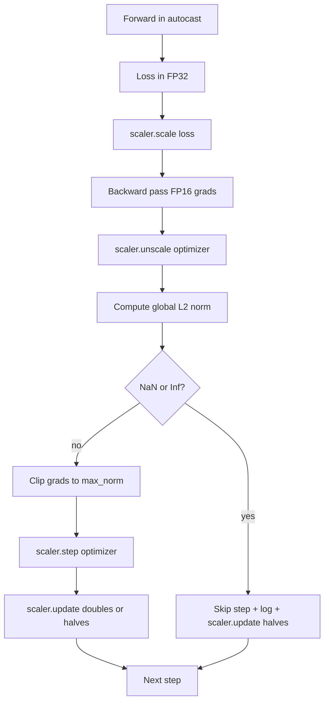

# Obcinanie gradientów i mieszana precyzja

> Optymalizator i harmonogram z poprzedniej lekcji zakładają, że gradienty są rozsądne. Zwykle nie są. Pojedyncza zła partia może podbić normę gradientu o trzy rzędy wielkości. Trening w mieszanej precyzji wzmacnia to przez wprowadzenie przepełnienia FP16 po stronie straty. Ta lekcja buduje dwa pasy bezpieczeństwa, bez których produkcyjny trening nie może być dostarczony: obcinanie gradientów do skonfigurowanej globalnej normy L2 i pętlę mieszanej precyzji z autocast i GradScaler, które wykrywają NaN i Inf, czysto pomijają krok i rejestrują współczynnik skalowania dla celów kryminalistycznych.

**Typ:** Budowa
**Języki:** Python
**Wymagania wstępne:** Lekcje Fazy 19 od 30 do 37
**Czas:** ~90 minut

## Cele nauczania

- Obliczyć globalną normę L2 nad wszystkimi gradientami parametrów i obciąć w miejscu, gdy przekracza skonfigurowany próg.
- Owinąć krok treningowy w autocast plus GradScaler, aby przejścia do przodu i wsteczne FP16 przetrwały przepełnienie.
- Wykryć NaN i Inf w stracie lub gradiencie, pominąć krok optymalizatora i zalogować pominięcie.
- Raportować współczynnik skalowania GradScaler na każdym kroku, aby długi ciąg pominięć był natychmiast widoczny.

## Problem

Uruchomienie treningowe, które wczoraj działało czysto, produkuje krzywą straty, która idzie w pionie w kroku 8,217. Winowajcą jest pojedyncza partia, której norma gradientu wynosi 4,200, dwadzieścia razy poprzedni szczyt. Bez obcinania optymalizator stosuje krok, który resetuje całe uczenie, które model zrobił w poprzedniej godzinie. Z globalnym obcięciem L2 na normie 1.0, ta sama partia wnosi aktualizację o normie jednostkowej; strata pozostaje na swojej linii trendu; uruchomienie przetrwa.

Trening w mieszanej precyzji zwiększa przepustowość 2-3x przez obliczanie przejścia do przodu i większości przejścia wstecznego w FP16. Kosztem jest to, że FP16 ma wąski zakres wykładnika. Typowy gradient, który przepełnia się w FP16, przyjmuje wartość Inf, która propaguje się przez kolejne warstwy jako NaN, który ustawia każdą wagę na NaN przy następnym kroku optymalizatora. GradScaler PyTorch rozwiązuje to przez pomnożenie straty przez duży współczynnik skalowania przed przejściem wstecznym i podzielenie gradientów przez ten sam współczynnik przed krokiem optymalizatora. Jeśli któryś gradient jest Inf lub NaN w czasie odskalowania, skaler pomija krok i połowi współczynnik skalowania; jeśli poprzednie N kroków było czystych, skaler podwaja współczynnik. W trakcie treningu współczynnik znajduje najwyższą wartość, na jaką pozwala zakres FP16.

Problem budowy polega na prawidłowym połączeniu tych dwóch. Obetnij przed odskalowaniem, a próg jest na skalowanych gradientach; obetnij po odskalowaniu, a kolejność operacji na GradScaler ma znaczenie. Właściwa kolejność to: `scaler.scale(loss).backward()`, potem `scaler.unscale_(optimizer)`, potem `clip_grad_norm_`, potem `scaler.step(optimizer)`, potem `scaler.update()`. Każda inna kolejność produkuje cicho zepsutą pętlę.

## Koncepcja



### Globalna norma L2

Globalna norma L2 to norma Euklidesowa połączonego wektora gradientu, a nie norma na parametr. PyTorch implementuje to jako `torch.nn.utils.clip_grad_norm_(parameters, max_norm)`. Funkcja zwraca normę przed obcięciem, więc lekcja może zalogować zarówno naturalną, jak i obciętą wartość, co jest konieczne dla diagnozy "obcinamy na każdym kroku."

### autocast i GradScaler

`torch.amp.autocast(device_type)` to menedżer kontekstu, który selektywnie uruchamia kwalifikujące się operacje (większość operacji typu matmul) w FP16. `torch.amp.GradScaler(device_type)` to pomocnik, który skaluje stratę przed przejściem wstecznym i odwrotnie skaluje gradienty przed krokiem optymalizatora. Oba są zaprojektowane razem; użycie jednego bez drugiego to błąd konfiguracji, który test powinien złapać.

Lekcja używa autocast CPU, ponieważ to działa w CI; ten sam wzorzec przenosi się dosłownie na CUDA przez zmianę `device_type="cpu"` na `device_type="cuda"`. GradScaler na CPU to atrapa (autocast CPU już działa domyślnie w BF16 i nie potrzebuje skalowania straty), ale lekcja zawiera miejsca wywołań, aby okablowanie było identyczne z pętlą GPU.

### Wykrywanie NaN i Inf

Wykrywanie odbywa się w dwóch miejscach. Po pierwsze, sama strata jest sprawdzana przez `torch.isfinite` przed przejściem wstecznym; strata Inf lub NaN nie produkuje użytecznych gradientów i jest pomijana bez wchodzenia w optymalizator. Po drugie, po `scaler.unscale_(optimizer)` lekcja skanuje odskalowane gradienty przez `has_non_finite_grad(...)` i traktuje każde Inf lub NaN jako pominięcie. Dwa sprawdzenia razem obejmują zarówno tryby awarii przejścia do przodu, jak i przejścia wstecznego.

### Diagnostyka współczynnika skalowania

Współczynnik skalowania to stan wewnętrzny GradScaler. Na każdym kroku lekcja odczytuje `scaler.get_scale()` i rejestruje go obok współczynnika uczenia i normy gradientu. Zdrowe uruchomienie pokazuje współczynnik skalowania rosnący w potęgach dwójki, aż nasyci się blisko `2^17` lub `2^18`. Źle zachowujące się uruchomienie pokazuje współczynnik oscylujący między wysokimi i niskimi wartościami, co jest sygnałem, że gradienty modelu są czasami w zakresie, a czasami nie. Diagnostyka jest niewidoczna bez rejestrowania.

## Budowa

`code/main.py` implementuje:

- `clip_global_l2_norm` - opakowanie wokół `torch.nn.utils.clip_grad_norm_`, które zwraca zarówno normę przed obcięciem, jak i po obcięciu.
- `has_non_finite_grad` - pomocnik skanujący gradienty w poszukiwaniu NaN i Inf.
- `AmpTrainState` - opakowuje model, optymalizator `AdamW`, GradScaler i urządzenie autocast. Udostępnia `step(inputs, targets)`, który uruchamia pełny potok obcinania, skalowania i pomijania przy NaN.
- `StepLog` i `SkipLog` - strukturalne rekordy na krok.
- Demo, które trenuje mały model `nn.Linear` przez 20 kroków, wstrzykuje Inf do gradientu w kroku 5, aby przećwiczyć ścieżkę pomijania, i drukuje wynikowy dziennik.

Uruchom:

```bash
python3 code/main.py
```

Skrypt kończy z kodem zero i drukuje dziennik na krok, z każdym wierszem oznaczonym `STEP` lub `SKIP`; co najmniej jeden wiersz to `SKIP`.

## Wzorce produkcyjne

Cztery wzorce podnoszą pętlę do produkcyjnego kroku treningowego.

**Licznik pominięć jako alert, a nie linia dziennika.** Kilka pominiętych kroków na uruchomienie treningowe jest zdrowe. Setki pominięć na epokę to twardy alert: model jest w reżimie, którego FP16 nie może utrzymać, a pętla cicho zawodzi. Lekcja śledzi 1000-krokowy toczący się wskaźnik pominięć i w produkcji pagowałby przy wskaźniku powyżej 5 procent.

**Próg obcinania żyje w konfiguracji.** `max_norm = 1.0` to nowoczesna domyślna wartość dla treningu modeli językowych. Skanuj go na małym modelu najpierw; większe progi pozwalają modelowi odzyskiwać się z naprawdę trudnych partii; mniejsze progi ograniczają najgorszy przypadek kosztem bardziej głośnej krzywej straty. Próg należy do tej samej konfiguracji YAML lub JSON co harmonogram z lekcji 44.

**Dziennik norm idzie do CSV z harmonogramem.** Kolumny CSV to `step, lr, grad_l2_pre_clip, grad_l2_post_clip, loss, skipped, skip_reason, scaler_scale`. Recenzent, który otwiera plik, widzi harmonogram, historię gradientów, współczynnik skalowania i wynik pominięcia (z uzasadnieniem) w jednym wierszu. Dzielenie kolumn między pliki to przepis na źle wyrównane analizy.

**`scaler.update()` uruchamia się na każdym kroku, nawet przy pominięciu.** Na czystym kroku skaler odczytuje swój licznik braku-inf, zwiększa go i ewentualnie podwaja współczynnik. Na pominiętym kroku skaler połowi współczynnik i resetuje licznik. Zapomnienie `update()` na ścieżce pomijania to błąd, który produkuje "współczynnik skalowania nigdy się nie zmienił."

## Użycie

Wzorce produkcyjne:

- **Urządzenie autocast pasuje do urządzenia optymalizatora.** `torch.amp.autocast(device_type="cuda")` do treningu GPU; `torch.amp.autocast(device_type="cpu")` do CPU. Mieszanie urządzeń produkuje cichy błąd typu, który objawia się krzywą straty wyglądającą dobrze, ale modelem, który się nie uczy.
- **Sprawdzenie straty przed przejściem wstecznym.** `torch.isfinite(loss).all()` to jedna redukcja tensora; koszt jest znikomy, a oszczędności na stracie NaN to cały krok treningowy. Zawsze uruchamiaj.
- **`set_to_none=True` w `zero_grad`.** Ustawia gradienty na `None` zamiast zero, co pozwala optymalizatorowi pominąć obliczenia dla niezmienionych grup parametrów. To ustawienie to darmowa poprawa przepustowości i niewielkie zmniejszenie powierzchni błędów.

## Dostarczenie

`outputs/skill-clip-amp.md` opisałby na prawdziwym projekcie, który próg obcinania i urządzenie autocast używa krok treningowy, gdzie CSV na krok żyje w kontroli wersji i jaki jest produkcyjny próg alertu wskaźnika pominięć. Ta lekcja dostarcza silnik.

## Ćwiczenia

1. Zastąp syntetyczne wstrzyknięcie Inf prawdziwym skokiem straty (pomnóż cel jednej partii przez 1e8) i zweryfikuj, że ścieżka pomijania się uruchamia.
2. Dodaj tryb `--bf16`, który przełącza autocast na BF16 zamiast FP16. BF16 ma szerszy zakres wykładnika niż FP16 i rzadko potrzebuje skalowania straty; zweryfikuj, że wskaźnik pominięć spada do zera na tym samym demie.
3. Dodaj test jednostkowy, że opakowanie obcinania gradientów zwraca normę przed obcięciem i po obcięciu poprawnie, gdy nie występuje obcinanie.
4. Dodaj obliczanie toczącego się wskaźnika pominięć i flagę CLI, która kończy uruchomienie z błędem, jeśli wskaźnik przekracza skonfigurowany próg dla 100 kolejnych kroków.
5. Podłącz pętlę do zapisywania kanonicznego CSV (`step, lr, grad_l2_pre_clip, grad_l2_post_clip, loss, skipped, skip_reason, scaler_scale`) i potwierdź, że plik przetrwa Ctrl-C przez flushowanie po każdym wierszu.

## Kluczowe terminy

| Termin | Co ludzie mówią | Co to faktycznie oznacza |
|--------|-----------------|--------------------------|
| Globalna norma L2 | "Cel obcinania" | Norma Euklidesowa połączonego wektora gradientu we wszystkich trenowalnych parametrach |
| autocast | "Mieszana precyzja" | Selektywne wykonanie FP16 (lub BF16) kwalifikujących się operacji wewnątrz bloku `with` |
| GradScaler | "Skaler straty" | Pomocnik mnożący stratę przed przejściem wstecznym i odwrotnie skalujący gradienty przed krokiem optymalizatora |
| Pominięcie | "Zły krok" | Krok optymalizatora odrzucony, ponieważ gradient lub strata była nie-skończona; skaler połowi współczynnik |
| Współczynnik skalowania | "Stan skalera" | Bieżący mnożnik GradScaler; podwaja się po czystych odcinkach i połowi przy każdym pominięciu |

## Dalsza lektura

- [Micikevicius et al., Mixed Precision Training (arXiv 1710.03740)](https://arxiv.org/abs/1710.03740) - oryginalna propozycja skalowania straty
- [Pascanu, Mikolov, Bengio, On the difficulty of training recurrent neural networks (arXiv 1211.5063)](https://arxiv.org/abs/1211.5063) - referencyjny artykuł o obcinaniu gradientów
- [PyTorch torch.amp.GradScaler](https://docs.pytorch.org/docs/stable/amp.html) - API skalera, które ta lekcja opakowuje
- [PyTorch torch.nn.utils.clip_grad_norm_](https://docs.pytorch.org/docs/stable/generated/torch.nn.utils.clip_grad_norm_.html) - prymityw obcinania, którego używa ta lekcja
- Faza 19 · 42 - pobieracz, którego korpus zasila pętlę
- Faza 19 · 43 - dataloader, który pętla konsumuje
- Faza 19 · 44 - harmonogram, z którym ta pętla się łączy