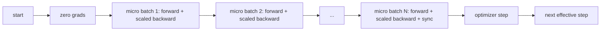
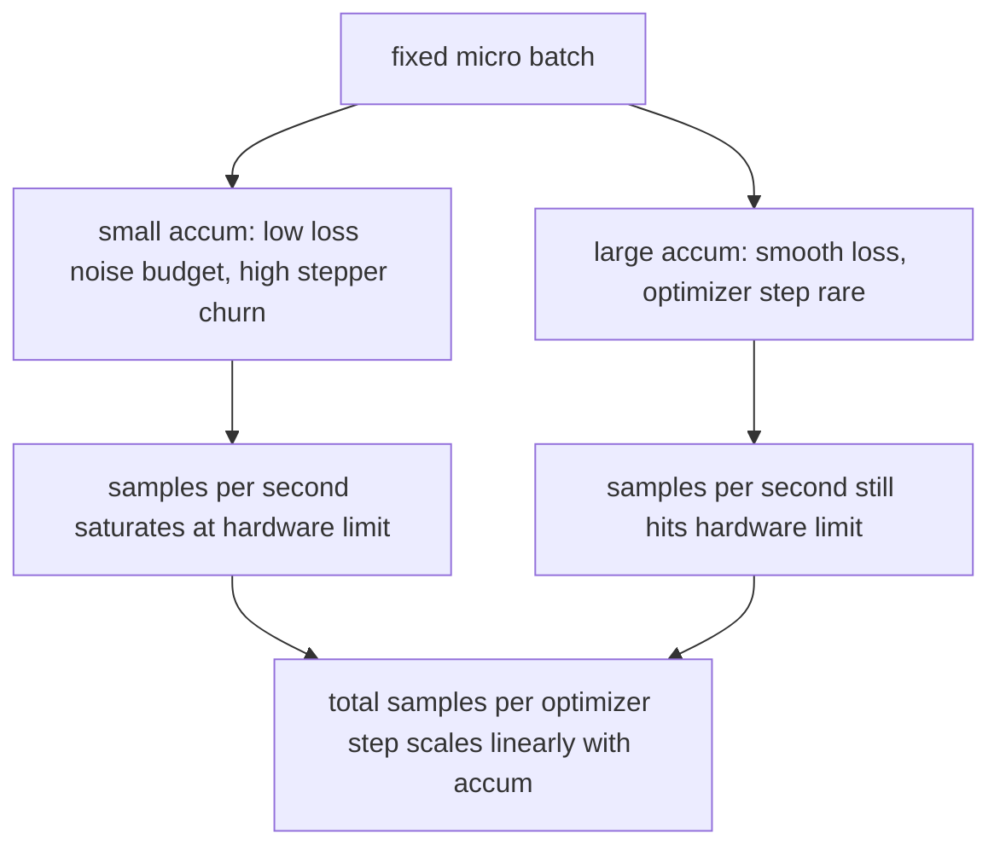

# Akumulacja Gradientów

> Trenuj z efektywnym batch-em, na który nie możesz sobie pozwolić, po jednym mikrobatchu na raz. Skaluj stratę, wstrzymaj krok optymalizatora i pozwól gradientom się kumulować.

**Typ:** Build
**Języki:** Python
**Wymagania wstępne:** Faza 19, lekcje 42 do 45
**Czas:** ~90 minut

## Cele dydaktyczne

- Wyprowadzić tożsamość efektywnego batcha: `effective_batch = micro_batch * accum_steps`.
- Zaimplementować skalowanie straty na mikrobatch, aby skumulowany gradient odpowiadał pojedynczemu backward'owi pełnego batcha.
- Pominąć synchronizację optymalizatora do ostatniego mikrobatcha (sync-on-last-step).
- Odczytać krzywą przepustowości względem efektywnego batcha i wyjaśnić malejące zyski.

## Problem

Chcesz trenować z efektywnym batch-em 512, ponieważ krzywa straty jest gładsza, a krok optymalizatora ma więcej sensu w tej skali. Akcelerator na biurku mieści 32 przykłady, zanim zabraknie pamięci. Podwojenie batcha nie wchodzi w grę. Zmniejszenie modelu o połowę też nie. Sztuczka, po którą sięgnięto w 2017 roku i której nigdy nie zaprzestano, to wykonanie 16 przebiegów wstecz, pozwolenie gradientom na akumulację w buforach parametrów i wykonanie kroku optymalizatora dopiero po osiągnięciu celu.

Ryzyko polega na tym, że strata nie jest już tą samą liczbą, co przy większym batchu. Entropia krzyżowa 16 mini-batchy zsumowana naiwnie jest 16 razy większa niż strata jednego pełnego batcha. Bez skalowania kierunek gradientu jest poprawny, ale jego wielkość jest zła, a krok optymalizatora jest 16 razy za duży. Naprawa to jeden dzielnik. Łatwo też o nim zapomnieć.

## Koncepcja



Kontrakt jest krótki:

- Strata dla każdego mikrobatcha jest dzielona przez `accum_steps` przed `backward()`. PyTorch domyślnie sumuje gradienty w `param.grad`; dzielenie sprowadza bieżącą sumę z powrotem do właściwej skali.
- Krok optymalizatora uruchamiany jest raz na efektywny batch, po backwardzie ostatniego mikrobatcha. Wykonanie kroku w trakcie akumulacji wypacza każdy parametr, od którego zależy reszta uruchomienia.
- Stan optymalizatora (bufory pędu, momenty Adama) jest aktualizowany raz na efektywny krok, nie raz na mikrobatch. Wykładnicze średnie kroczące widziałyby w przeciwnym razie złą częstotliwość i spaliłyby harmonogram.
- Na pojedynczym urządzeniu jest to księgowość. W klastrze wielorankowym ten sam wzorzec otacza nieostatnie mikrobatche kontekstem `no_sync`, który pomija all-reduce gradientów; ostatni mikrobatch redukuje pełny skumulowany gradient w jednym przejściu zamiast płacić koszt sieciowy N razy.

### Dowód równoważności w kodzie

```python
loss = criterion(model(x_full), y_full)
loss.backward()
opt.step()
```

jest równoważne

```python
for x, y in chunks(x_full, y_full, n):
    scaled = criterion(model(x), y) / n
    scaled.backward()
opt.step()
```

z dokładnością do kolejności sumowania zmiennoprzecinkowego. Skumulowany bufor gradientu na końcu pętli jest tym samym tensorem, który wyprodukowałby pojedynczy pełny backward batcha. Kod lekcji potwierdza to z maksymalną różnicą bezwzględną poniżej 1e-4 w `equivalence_check`.

### Gdzie idzie koszt

Każdy mikrobatch kosztuje jeden forward i jeden backward. Z akumulacją zamieniasz pamięć na czas. Krzywa przepustowości w `outputs/accum-curve.json` pokazuje, co się dzieje, gdy efektywny batch rośnie przy ustalonym mikrobatchu:



Nie ma darmowego obiadu. Podwojenie `accum_steps` podwaja czas ścienny na krok optymalizatora. Zmienia się wariancja estymaty gradientu: przy tym samym budżecie ściennym wykonałeś mniej kroków optymalizatora, ale każdy był uśredniony po większej liczbie próbek. Literatura traktuje duży batch i mały batch jako różne problemy optymalizacyjne; ta lekcja ma charakter mechaniczny, a nie statystyczny.

## Zbuduj to

`code/main.py` to uruchamialny artefakt. Robi trzy rzeczy.

### Krok 1: sprawdzenie równoważności

`equivalence_check()` buduje dwie kopie tej samej sieci z tym samym seedem. Jedna widzi 16-elementowy batch w jednym przejściu w przód. Druga widzi cztery 4-elementowe fragmenty ze stratą podzieloną przez cztery. Funkcja porównuje bufory gradientów przed krokiem optymalizatora i parametry po nim. Asercja to `max_abs_diff < 1e-4`.

### Krok 2: wzorzec sync-on-last-step

`train_one_optimizer_step` przechodzi przez mikrobatche. Dla każdego mikrobatcha z wyjątkiem ostatniego wchodzi w `no_sync_context(model)`. W pojedynczym procesie kontekst jest pustą operacją; w DDP tutaj pomijane jest all-reduce gradientów. Księgowość jest taka sama niezależnie. `sync_counter` rejestruje, ile razy opuściliśmy zakres no_sync; dla N mikrobatchy liczba ta wynosi jeden na efektywny krok, a nie N.

### Krok 3: krzywa przepustowości

`sweep_effective_batches` uruchamia ten sam model z ustalonym mikrobatchem i listą kroków akumulacji. Dla każdego ustawienia rejestruje:

- `samples_per_sec`: całkowita liczba próbek podzielona przez czas ścienny
- `median_step_ms`: 50. percentyl na efektywny krok
- `sync_calls`: wykonane punkty kolektywne
- `avg_loss`: średnia strata w całym przeglądzie kroków optymalizatora

Wynik ląduje w `outputs/accum-curve.json` i jest wielokrotnego użytku z notebooka.

Uruchom:

```bash
python3 code/main.py
```

Skrypt wypisuje różnicę równoważności, następnie tabelę przeglądu, a następnie ścieżkę JSON. Kod wyjścia zero.

## Użyj tego

W treningu produkcyjnym akumulacja gradientów żyje za jednym pokrętłem. Wzorzec PyTorcha to `accumulation_steps = effective_batch // (micro_batch * world_size)`. Frameworki, których nie wolno ci tu używać, opakowują tę samą pętlę, ale kroki są takie same: skalowanie straty, pomijanie synchronizacji na nieostatnich mikrobatchach, kumulowanie, jeden krok.

Trzy wzorce spotykane w praktyce:

- Rozmiar mikrobatcha jest dobrany tak, aby nasycić pamięć urządzenia. Cokolwiek mniejszego marnuje cykle akceleratora. Cokolwiek większego powoduje awarię.
- Efektywny batch jest wybierany z harmonogramu współczynnika uczenia się. Duże efektywne batche wymagają skalowanych współczynników uczenia się i rozgrzewki; jest to reguła skalowania liniowego, o której mówi się od 2017 roku.
- Liczba akumulacji jest pomostem między nimi i jedynym pokrętłem, które można swobodnie dostroić w czasie wykonywania bez przepisywania ładowacza danych.

## Dostarcz to

`outputs/skill-gradient-accumulation.md` zawiera przepis, aby współpracownik mógł wrzucić go do nowego repozytorium: skaluj stratę przez `accum_steps`, pomiń synchronizację optymalizatora na nieostatnich mikrobatchach, wykonaj krok optymalizatora raz na efektywny batch, rejestruj przepustowość względem efektywnego batcha jako JSON, aby zależność była widoczna.

## Ćwiczenia

1. Uruchom ponownie przegląd z `--num-steps 100` i wykreśl próbki na sekundę względem efektywnego batcha. Gdzie krzywa się wypłaszcza?
2. Dodaj wariant z błędnym skalowaniem (brak dzielenia) i pokaż różnicę parametrów w kroku 1 względem odniesienia.
3. Zamień SGD na AdamW i potwierdź, że stan optymalizatora jest aktualizowany raz na efektywny krok, a nie raz na mikrobatch.
4. Wprowadź prawdziwy wrapper `DistributedDataParallel` i skieruj `no_sync_context` do jego metody. Potwierdź, że sync_calls spada o N-1 na efektywny batch.
5. Zmodyfikuj sprawdzenie równoważności, aby porównać dwa różne podziały mikrobatchy (2 na 8 vs 4 na 4) i wyjaśnij wszelkie tolerancje, które musisz rozluźnić.

## Kluczowe terminy

| Termin | Co ludzie mówią | Co to naprawdę znaczy |
|--------|-----------------|-----------------------|
| Mikrobatch | Batch, który forwardujesz | Wycinek mieszczący się w pamięci w pojedynczym przebiegu w przód |
| Kroki akumulacji | Backwardy na krok | Liczba backwardów zsumowanych przed jednym krokiem optymalizatora |
| Efektywny batch | Batch | Mikrobatch razy kroki akumulacji razy rozmiar świata równoległości danych |
| Skalowanie straty | Dzielenie przez N | Dzielenie na mikrobatch, aby zsumowane gradienty odpowiadały pełnemu batchowi |
| Sync on last | Pomiń resztę | Uruchom kolektywę gradientów tylko na ostatnim backwardzie w oknie |

## Dalsza lektura

- Dokumentacja PyTorch na temat `DistributedDataParallel.no_sync` dla produkcyjnej wersji sztuczki sync-on-last-step.
- Goyal i in., 2017, o skalowaniu liniowym dla trenowania z dużym batchem, kanoniczny powód, aby dbać o efektywny batch.
- Śledzik problemów PyTorch na temat interakcji akumulacji gradientów z mieszaną precyzją.
- Faza 19, lekcje 42 do 45 obejmują model, ładowacz danych, optymalizator i szkielet trenera, które zakłada ta lekcja.
- Faza 19, lekcja 47 obejmuje punkt kontrolny i wznowienie, aby długie uruchomienie akumulacji przetrwało limit czasu ściennego.
