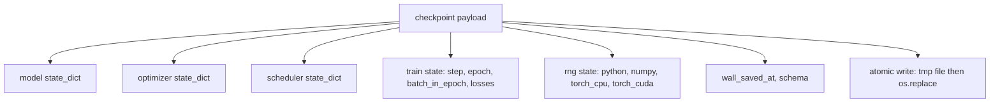
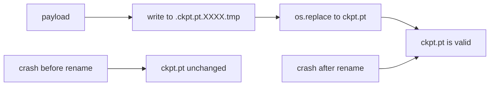
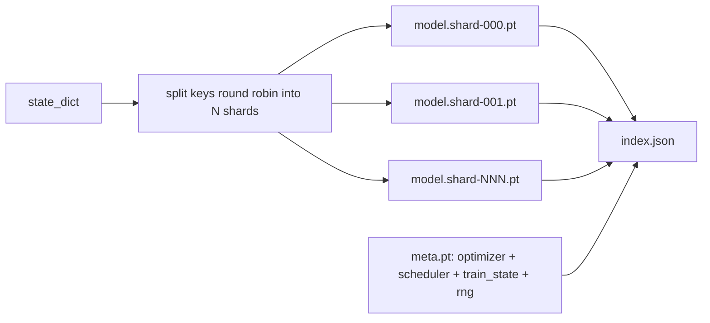

# Zapisywanie i Wznawianie Punktów Kontrolnych

> Przerwy w trenowaniu zabijają uruchomienia; punkty kontrolne pozwalają im kontynuować. Zapisz model, optymalizator, scheduler, historię strat, licznik kroków i stan RNG, atomowo, tak aby zabicie w dowolnym momencie pozostawiło prawidłowy plik na dysku.

**Typ:** Build
**Języki:** Python
**Wymagania wstępne:** Faza 19, lekcje 42 do 45
**Czas:** ~90 minut

## Cele dydaktyczne

- Przechwycić pełny stan trenowania do pojedynczej porcji danych, którą można ponownie załadować w nowym procesie.
- Zaimplementować atomowy zapis z zapisem do pliku tymczasowego i zmianą nazwy, aby awaria nigdy nie pozostawiła częściowo zapisanego pliku.
- Przywrócić stan RNG dla Pythona, NumPy i PyTorch, aby strata po wznowieniu pasowała do nieprzerwanej linii bazowej.
- Zbudować rozłożony na fragmenty układ punktu kontrolnego dla modeli, które nie mieszczą się już w jednym pliku, z fragmentami zweryfikowanymi hash-em i indeksem JSON.

## Problem

Ustawiasz zadanie trenowania na 18 godzin. Limit czasu ściennego wynosi 4 godziny. Klaster restartuje się w 11. godzinie, ponieważ ktoś wyżej zatwierdził aktualizację jądra. Bez punktów kontrolnych zaczynasz od nowa. Bez wznawiania tracisz również stan optymalizatora, którego nauczenie zajęło pierwsze 11 godzin, więc nawet jeśli wagi modelu przetrwały, momenty AdamW zniknęły, a następny krok szarpie w kierunku, który trajektoria trenowania już minęła.

Właściwy artefakt to pojedynczy plik zawierający wszystko, czego potrzeba do kontynuacji: parametry modelu, stan optymalizatora, stan schedulera, historię strat dla wykresów, bieżący krok i epokę oraz licznik batcha w epoce, a także stan RNG dla każdego źródła losowości. Bez stanu RNG wznowiona krzywa straty to inna krzywa. Ten sam model, te same dane, inny shuffle, inna maska dropoutu, inna liczba na pulpicie.

Atomowy zapis to druga połowa kontraktu. Zapis bezpośrednio do docelowej nazwy pliku oznacza, że awaria w trakcie zapisu pozostawia uszkodzony plik; wznowienie odczytuje śmieci. Zapis do pliku tymczasowego w tym samym katalogu, a następnie zmiana nazwy oznacza, że awaria w trakcie zapisu pozostawia poprzedni dobry plik nietknięty. Zmiana nazwy jest atomowa w systemach plików POSIX.

## Koncepcja



### Pięć wiader stanu

| Wiadro | Dlaczego to ważne |
|--------|-------------------|
| Model | Wagi i bufory; czym jest model. |
| Optymalizator | Pęd i adaptacyjne momenty; bez nich następny krok to inny problem optymalizacyjny. |
| Scheduler | Gdzie współczynnik uczenia się znajduje się na swojej krzywej; harmonogramy cosinus szczególnie na tym polegają. |
| Liczniki trenowania | Krok, epoka, batch-w-epoce, plus historia strat, która rysuje pulpit. |
| Stan RNG | Deterministyczność dla dropoutu, tasowania danych i wszelkiego próbkowania wewnątrz modelu. |

### Atomowy zapis



Dwie zasady. Po pierwsze, plik tymczasowy znajduje się w tym samym katalogu co cel, aby zmiana nazwy pozostała w obrębie tego samego systemu plików; zmiany nazw między urządzeniami nie są atomowe. Po drugie, tymczasowa nazwa jest unikalna dla każdej próby, aby dwóch zapisujących nie kolidowało.

### Rozłożone punkty kontrolne

Gdy model staje się duży, porcja danych w jednym pliku staje się zbyt duża, aby szybko załadować, zbyt duża, aby sprawdzić i zbyt uciążliwa, gdy udział sieciowy zacinie się w trakcie odczytu. Naprawą jest podzielenie stanu parametrów na fragmenty i napisanie małego indeksu, który je łączy.



Indeks rejestruje liczbę fragmentów, sha256 każdego fragmentu i sha256 pliku meta. Ładowacz głośno zawodzi, gdy którykolwiek hash się nie zgadza. Fragmenty mogą lądować na różnych fizycznych dyskach; meta jest małe i jest odczytywane jako pierwsze.

### Wznowienie kontynuuje w trakcie epoki

Wznowienie, które przeskakuje na początek następnej epoki, marnuje od minut do dnia czasu. Naprawą jest `(epoch, batch_in_epoch)` plus stan RNG. Po załadowaniu pętla trenowania przewija generator liczb losowych poza batche już zużyte w bieżącej epoce i kontynuuje od `batch_in_epoch`. Kod lekcji robi to dokładnie; asercja mówi, że trajektoria straty po wznowieniu pasuje do nieprzerwanej linii bazowej w granicach 1e-4.

## Zbuduj to

`code/main.py` dostarcza cztery prymitywy i sterownik demo.

### Krok 1: przechwycenie i przywrócenie stanu RNG

`capture_rng_state` zwraca słownik z `random.getstate` Pythona, `np.random.get_state` NumPy oraz bajtami RNG CPU i CUDA PyTorch. `restore_rng_state` odwraca to. Tensor CPU to bufor bajtowy uint8, który RNG PyTorch wie, jak konsumować.

### Krok 2: atomowy zapis

`atomic_save` zapisuje porcję danych do pliku tymczasowego w katalogu docelowym, a następnie `os.replace` podmienia go na ostateczną nazwę. `atomic_write_json` robi to samo dla indeksu rozłożonego na fragmenty.

### Krok 3: pełne przejście punktu kontrolnego w obie strony

`save_checkpoint` pakuje model, optymalizator, scheduler, stan trenowania i RNG do jednego słownika. `load_checkpoint` odwraca to i zwraca `TrainState`. Pole schematu to hak uaktualnienia: przyszłe zmiany formatu zwiększają wersję, a ładowacz dysponuje.

### Krok 4: wariant rozłożony na fragmenty

`save_sharded_checkpoint` rozdziela klucze parametrów round-robin po N fragmentach, zapisuje każdy fragment z własnym atomowym zapisem, zapisuje plik meta z optymalizatorem, schedulem i stanem trenowania oraz zapisuje indeks JSON z sha256 fragmentów. `load_sharded_checkpoint` weryfikuje każdy fragment przed scaleniem.

### Krok 5: demo wznowienia

`run_resume_demo` trenuje mały model przez `total_steps`, zapisuje punkt kontrolny w `interrupt_at`, a następnie kontynuuje. Drugi proces przywraca punkt kontrolny i uruchamia pozostałe kroki. Funkcja zwraca maksymalną bezwzględną różnicę między dwiema trajektoriami strat po punkcie przerwania. Z przywróconym RNG różnica wynosi zero lub szum zmiennoprzecinkowy.

Uruchom:

```bash
python3 code/main.py
```

Dema z pojedynczym plikiem i z podziałem na fragmenty oba potwierdzają max-diff poniżej 1e-4. Podsumowanie ląduje w `outputs/resume-demo.json`.

## Użyj tego

Produkcyjne stosy trenowania dostarczają punkty kontrolne jako część trenera. Kształt jest ten sam: model + optymalizator + scheduler + liczniki + RNG, zapisane atomowo, nazwane po kroku, aby najnowszy był łatwy do znalezienia. Rozłożone układy zasilają ładowanie dużych modeli z równoległymi odczytami; index.json jest tym, co to umożliwia.

Trzy wzorce do egzekwowania:

- **Schemat jest ciągiem znaków w porcji danych.** Migracje rozgałęziają się na nim. Bez niego nie można ewoluować formatu bez psucia starych uruchomień.
- **Sha256 każdego fragmentu.** Cicho obcięte pobieranie to najgorszy rodzaj błędu; ładowacz zawodzi szybko lub zawodzi późno.
- **Utrzymuj uczciwy kadencję punktów kontrolnych.** Zapisuj co N kroków i co minutę czasu ściennego, w zależności od tego, co jest krótsze. W przeciwnym razie długi krok, który powoduje awarię, marnuje całe okno pracy.

## Dostarcz to

`outputs/skill-checkpoint-save-resume.md` to przepis na każdy nowy skrypt trenowania: kształt porcji danych, atomowy zapis, przechwytywanie RNG, indeks rozłożony. Wrzuć umiejętność do repozytorium, podłącz `save_checkpoint` w miejscu okresowego zapisu, podłącz `load_checkpoint` przy starcie, a uruchomienie przetrwa zabicia.

## Ćwiczenia

1. Zastąp fragmentację round-robin fragmentacją według grup parametrów (warstwy kończące się na `.weight` vs `.bias`). Kiedy każdy układ jest lepszy?
2. Rozszerz pętlę zapisu, aby przechowywać ostatnie K punktów kontrolnych i usuwać starsze. Jakie jest właściwe K, gdy dysk jest mały?
3. Dodaj flagę `--ckpt-every-seconds`, która wyzwala zapis w interwale czasu ściennego, a nie tylko licznika kroków.
4. Dodaj ścieżkę weryfikacji sumy kontrolnej, która uruchamia się przy starcie, skanuje każdy punkt kontrolny w katalogu i zgłasza, które są uszkodzone.
5. Zaimplementuj funkcję `migrate_v1_to_v2`, która dodaje nowe pole do porcji danych i zwiększa schemat. Spraw, aby ładowacz tolerował obie wersje.

## Kluczowe terminy

| Termin | Co ludzie mówią | Co to naprawdę znaczy |
|--------|-----------------|-----------------------|
| Atomowy zapis | "Napisz i módl się" | Zapisz do pliku tymczasowego w tym samym katalogu, a następnie os.replace do docelowej nazwy |
| State dict | "Wagi" | Parametry i bufory modelu, kluczowane według nazwy parametru |
| Rozłożony punkt kontrolny | "Plik dużego modelu" | Wiele plików, jeden na fragment, plus plik meta i indeks JSON z sha256 |
| Stan RNG | "Ziarno losowe" | Przechwycony stan dla python random, numpy, torch CPU, torch CUDA; nie tylko ziarno |
| Wznowienie w trakcie epoki | "Restart" | Przewiń RNG i kontynuuj od następnego batcha w tej samej epoce |

## Dalsza lektura

- Semantyka `rename` POSIX dla gwarancji atomowości, na której polega `os.replace`.
- Dokumentacja PyTorch na temat `torch.save` i `torch.load`, w tym `map_location` dla przywracania między urządzeniami.
- Faza 19, lekcja 46 obejmuje akumulację gradientów, którą porcja danych punktu kontrolnego w tej lekcji przetrzymuje.
- Faza 19, lekcja 48 obejmuje opakowania rozproszone, których format state dict ten schemat obsługuje.
- Dokumentacja jądra Linux `fsync` dla gwarancji trwałości stojącej za atomową zmianą nazwy.