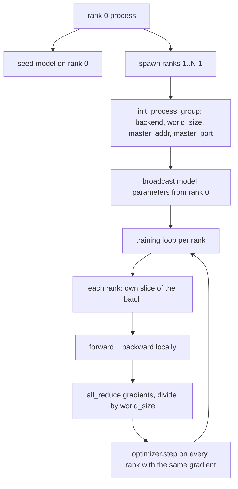
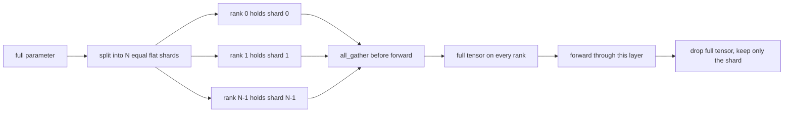

# Rozproszona Równoległość Danych i FSDP od Podstaw

> Trenowanie wielorankowe to dwie kolektywy i jedna zasada. Rozgłoś parametry przy starcie, uśrednij gradienty po backwardzie, nigdy nie pozwól, aby rangi różniły się co do tego, na którym kroku są.

**Typ:** Build
**Języki:** Python
**Wymagania wstępne:** Faza 19, lekcje 42 do 45
**Czas:** ~90 minut

## Cele dydaktyczne

- Uruchomić grupę procesów na N rangach z backendem `gloo`, bez specjalnego sprzętu.
- Zaimplementować minimalne opakowanie DDP, które rozgłasza parametry przy konstrukcji i wykonuje all-reduce gradientów po backwardzie.
- Udowodnić, że all-reduce gradientów na rangę odpowiada gradientowi pojedynczego procesu na połączonym wejściu.
- Naszkicować fragmentację parametrów FSDP: każda ranga trzyma wycinek, pełny tensor jest zbierany dla forwarda i odrzucany po nim.

## Problem

Model mieści się na jednym urządzeniu. Zbiór danych nie. Budżet optymalizacyjny mówi, że chcesz widzieć N razy więcej przykładów na sekundę ścienną. Pierwsza dźwignia to równoległość danych: każda ranga uruchamia ten sam model na innym wycinku batcha, a następnie uśrednia gradienty przed krokiem optymalizatora. Druga dźwignia to FSDP: model nie mieści się na jednym urządzeniu, więc każda ranga trzyma ułamek każdego parametru i rekonstruuje pełne tensory warstwa po warstwie podczas forwarda.

Ból to księgowość. Jeśli parametry dryfują między rangami, uruchomienie jest po cichu uszkodzone. Jeśli uśredniasz gradienty, ale nie stratę, pulpit kłamie. Jeśli backend kolektywny nie może uzgodnić topologii, uruchomienie wisi w nieskończoność. Naprawą jest ręczne napisanie kolektyw raz i nigdy nie ufanie wrapperowi, którego nie możesz odtworzyć.

Ta lekcja działa na CPU. CUDA nie jest zakładana. Backend `gloo` jest dostarczany z każdą kompilacją PyTorch i akceptuje pracowników `torch.multiprocessing`; ten sam kod przełącza się na `nccl` na węźle z wieloma GPU bez zmiany struktury.

## Koncepcja



### Dwie kolektywy, które mają znaczenie

| Kolektywa | Co robi | Kiedy |
|-----------|---------|-------|
| `broadcast` | Kopiuje tensor z jednej rangi do wszystkich pozostałych | Inicjalizacja parametrów, stan schedulera, dowolna synchronizacja jeden-do-wszystkich |
| `all_reduce` | Sumuje (lub uśrednia, lub max) tensor we wszystkich rangach, każda ranga dostaje wynik | Uśrednianie gradientów po backwardzie |
| `all_gather` | Każda ranga wnosi tensor, każda ranga dostaje konkatenację | Zbieranie logitów, odfragmentowanie parametrów FSDP |

Kontrakt DDP to `broadcast` przy konstrukcji i `all_reduce` po backwardzie. Szkic FSDP dodaje `all_gather` przed forwardem każdej warstwy.

### Uśrednianie gradientów odpowiada gradientowi pojedynczego procesu

Model trenowany na batchu B przykładów na N rangach musi dawać ten sam gradient co pojedynczy proces trenujący na batchu N*B. Sztuczka polega na tym, że sumowanie gradientów na rangę i dzielenie przez N daje średni gradient straty, czyli to, co entropia krzyżowa z redukcją mean wyprodukowałaby na pełnym batchu. Kod lekcji potwierdza to z `max-abs-diff < 1e-3` między ręcznym all-reduce gradientem a referencyjnym gradientem pojedynczego procesu.

### Szkic FSDP



Zysk pamięciowy jest dokładny: pamięć na rangę dla parametrów spada do 1/N. Kosztem jest gather, który jest płacony przy każdym forwardzie. Produkcyjne FSDP nakłada gather na obliczenia poprzedniej warstwy, więc koszt ścienny jest znacznie mniejszy, niż przewiduje naiwne rozliczenie. Lekcja wykonuje round-trip na każdym parametrze i potwierdza, że rekonstrukcja jest bitowo równa oryginałowi.

### CPU i backend gloo

CUDA jest docelowym środowiskiem produkcyjnym, ale te same ścieżki kodu istnieją na CPU. `gloo` to backend kolektyw CPU. Jest wolniejszy niż `nccl` na GPU o rzędy wielkości, ale powierzchnia API jest identyczna. Grupa procesów w lekcji jest inicjowana z `backend="gloo"`, a rangi są tworzone za pomocą `torch.multiprocessing` zamiast `torchrun`; oba kończą na tych samych wywołaniach `torch.distributed`. Na węźle z wieloma GPU jedynymi zmianami są `backend="nccl"`, tensory urządzeń i `torchrun` do uruchomienia.

## Zbuduj to

`code/main.py` to uruchamialny artefakt.

### Krok 1: uruchomienie grupy procesów

```python
os.environ["MASTER_ADDR"] = "127.0.0.1"
os.environ["MASTER_PORT"] = str(port)
dist.init_process_group(backend="gloo", rank=rank, world_size=world_size)
```

`MASTER_ADDR` i `MASTER_PORT` to rendez-vous: każda ranga wybiera ten sam port na tym samym hoście. Lekcja wybiera wolny port przez sztuczkę bind-and-close, aby uniknąć kolizji, gdy kilka uruchomień dzieli jedną maszynę.

### Krok 2: rozgłaszanie przy konstrukcji

`MinimalDDP.__init__` przechodzi przez każdy parametr i bufor i wywołuje `dist.broadcast(tensor, src=0)`. Wartości rangi 0 stają się kanoniczną inicjalizacją. Bez tego każda ranga inicjuje własnym seedem i rangi rozchodzą się od pierwszego kroku.

### Krok 3: all-reduce gradientów po backwardzie

```python
def all_reduce_grads_(module, world_size):
    for p in module.parameters():
        if p.grad is None:
            p.grad = torch.zeros_like(p.data)
        dist.all_reduce(p.grad.data, op=dist.ReduceOp.SUM)
        p.grad.data.div_(world_size)
```

Każda ranga kończy z tym samym uśrednionym gradientem. Krok optymalizatora jest teraz funkcją tego samego wejścia na każdej randze, dlatego parametry pozostają zsynchronizowane przez całe uruchomienie.

### Krok 4: udowodnienie równoważności

`manual_all_reduce_matches_single_process` buduje ten sam model na randze 0 i porównuje gradient po all-reduce z gradientem, który pojedynczy proces obliczyłby na połączonym wejściu. Max-abs-diff wynosi około 1e-8.

### Krok 5: round-trip FSDP

`fsdp_round_trip_sketch` spłaszcza każdy parametr, dopełnia do wielokrotności `world_size`, kroi, zbiera i usuwa dopełnienie. Rekonstrukcja każdej rangi jest równa oryginałowi. To jest krok odfragmentowania; odwrotność (ponowna fragmentacja po forwardzie) to jeden wycinek z zebranego tensora.

Uruchom:

```bash
python3 code/main.py
```

Domyślny rozmiar świata to 2. Dwa procesy CPU uruchamiają się, rozmawiają przez `gloo` i kończą z kodem zero. Wynik `outputs/ddp-demo.json` przechwytuje sumy parametrów na rangę, normę gradientu po all-reduce, wynik round-trip FSDP i różnicę gradientu ręcznego vs referencyjnego.

## Użyj tego

Produkcyjne stosy trenowania wywołują te same prymitywy. PyTorch `DistributedDataParallel` dodaje: haki gradientowe po backwardzie, które nakładają all-reduce na backward, grupowany all-reduce łączący kilka małych gradientów w jedną kolektywę i kontekst `no_sync` użyty w lekcji 46.

PyTorch FSDP dodaje: płaski widok parametrów na warstwę, aby każda ranga trzymała jeden ciągły bufor, nakładanie odfragmentowania następnej warstwy na obliczenia bieżącej warstwy i opcjonalne zrzucanie fragmentów na CPU.

Kształt pozostaje ten sam: rozgłaszanie przy starcie, redukcja po backwardzie, fragmentacja parametrów, gdy już nie mieszczą się w pamięci.

## Dostarcz to

`outputs/skill-distributed-fsdp-ddp.md` zawiera przepis na nowy skrypt trenowania: uruchom grupę procesów z `gloo` dla CPU i `nccl` dla GPU, opakuj model w powłokę DDP, która rozgłasza przy konstrukcji i redukuje po backwardzie, opcjonalnie fragmentuj parametry wzorcem all_gather ze szkicu FSDP.

## Ćwiczenia

1. Uruchom z `--world-size 4` i potwierdź, że rozrzut parametrów pozostaje poniżej 1e-3 przez całe uruchomienie.
2. Zastąp ręczne uśrednianie `dist.all_reduce(op=dist.ReduceOp.AVG)` i zmierz różnicę czasu.
3. Dodaj hak po backwardzie do opakowania DDP, aby all-reduce nakładał się na resztę backwardu; zmierz poprawę czasu ściennego.
4. Zaimplementuj krok ponownej fragmentacji FSDP: po forwardzie zastąp pełny tensor z powrotem lokalnym fragmentem. Potwierdź spadek pamięci na rangę.
5. Przełącz backend na `nccl` na maszynie z CUDA. Zanotuj, które zmienne środowiskowe się zmieniają, a które pozostają takie same.

## Kluczowe terminy

| Termin | Co ludzie mówią | Co to naprawdę znaczy |
|--------|-----------------|-----------------------|
| Backend | "gloo or nccl" | Biblioteka implementująca operacje kolektywne; gloo to CPU, nccl to GPU |
| Rozmiar świata | "Łączna liczba rang" | Liczba procesów w grupie; grupa to jednostka, na której działają kolektywy |
| Ranga | "Identyfikator pracownika" | Identyfikator procesu w grupie, indeksowany od zera |
| All-reduce | "Zsumuj gradienty" | Sumuje tensor we wszystkich rangach, każda ranga kończy z tym samym wynikiem |
| Odfragmentowanie | "Zbierz parametry" | Rekonstruuje pełny tensor z wycinków na rangę przez all_gather |

## Dalsza lektura

- Dokumentacja PyTorch `torch.distributed` dla semantyki kolektyw, na której opiera się ta lekcja.
- Lista kolektyw biblioteki `gloo`, identyczna kształtem z prymitywami CUDA `nccl`.
- Faza 19, lekcja 46 dla wzorca akumulacji gradientów, który opakowuje all-reduce DDP w `no_sync`.
- Faza 19, lekcja 47 dla układu punktu kontrolnego, który przetrwa uruchomienia DDP i FSDP.
- Dokumentacja PyTorch FSDP dla produkcyjnej implementacji fragmentacji parametrów naszkicowanej tutaj.