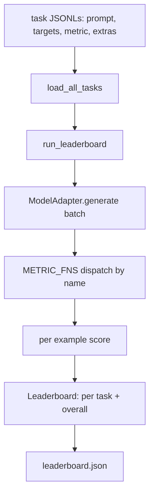
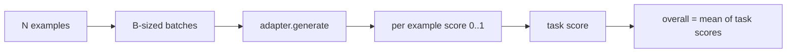

# Środowisko Testowe Ewaluacji Modeli Językowych

> Model, który dobrze radzi sobie z zadaniem, którego nie możesz zdefiniować, to model, który dobrze radzi sobie przez przypadek. Środowisko testowe to definicja zadania, metryka, uruchamiacz i tablica wyników w jednym krótkim, wymiennym kształcie.

**Typ:** Build
**Języki:** Python
**Wymagania wstępne:** Faza 19, lekcje 42 do 45
**Czas:** ~90 minut

## Cele dydaktyczne

- Zdefiniować zadanie jako plik JSONL z `prompt`, `targets`, `metric` i opcjonalnym `extras` na przykład.
- Zaimplementować pięć metryk: exact match, rouge-l F1, sprawdzenie wykonywalności, wielokrotnego wyboru i zawierania podciągu.
- Zbudować uruchamiacz, który grupuje przykłady według zadań i dysponuje do wymiennego adaptera modelu.
- Wyemitować JSON tablicy wyników z wynikami na zadanie, opóźnieniem i średnią ogólną, która jest odtwarzalna.

## Problem

Nowy model językowy pojawia się co tydzień. Twierdzenie marketingowe mówi, że radzi sobie dobrze. Uczciwe pytanie brzmi: dobrze w czym? Uczciwa odpowiedź to tablica wyników, którą sam napisałeś, ponieważ tablica wyników dostawcy jest tą, do której dostroili.

Bez środowiska testowego w twoim repozytorium porównujesz dwa modele na wyczucie. Ze środowiskiem testowym porównujesz je według wyniku na ustalonym zestawie zadań z ustaloną metryką, na wyjściu JSON, które możesz porównać. Środowisko testowe to kontrakt między wczorajszym uruchomieniem a dzisiejszym. Bez niego regresje są wdrażane.

Pułapką jest nadmierne dopasowanie środowiska do pojedynczego modelu. Naprawą jest ta sama pułapka w odwrotną stronę: środowisko jest na tyle małe, że można je przeczytać w piętnaście minut, zadania są na tyle małe, że można je dostarczyć w repozytorium, metryki są napisane od podstaw, aby współpracownik mógł je sprawdzić, a adapter jest jedynym miejscem, w którym żyje kod specyficzny dla modelu. Wymień adapter, tablica wyników się przesuwa; wymień zadania, tablica wyników się przesuwa. Nic innego nie powinno się przesuwać.

## Koncepcja



### Specyfikacja zadania

Każdy przykład to jedna linia JSONL:

```json
{"id": "arith-00", "prompt": "compute: 2 + 2", "targets": ["4"], "metric": "exact_match"}
```

Dla metryk, które potrzebują pomocników do oceny, `extras` przenosi dodatkową porcję danych:

```json
{
  "id": "code-00",
  "prompt": "python: write a function f that doubles its input",
  "targets": ["ok"],
  "metric": "code_exec",
  "extras": {"io_pairs": [[1, 2], [3, 6]]}
}
```

Zadanie to plik `.jsonl` w `outputs/tasks/`. Nazwa pliku to nazwa zadania. Wszystkie przykłady w pliku dzielą metrykę.

### Pięć zadań przykładowych

| Zadanie | Metryka | Co testuje |
|---------|---------|------------|
| arithmetic | exact_match | Poprawność na poziomie tokenów dla deterministycznej odpowiedzi |
| summary | rouge_l | Najdłuższa wspólna sekwencja F1 względem jedno-liniowego referencyjnego podsumowania |
| code-exec | code_exec | Test wykonywalny: przewidywana funkcja musi spełniać listę par wejście-wyjście |
| multiple-choice | multiple_choice | Pierwsza litera przewidywania musi pasować do dozwolonej litery |
| generation | substring_contains | Dowolny tekst musi zawierać co najmniej jeden docelowy podciąg |

### Kontrakt metryki

Każda metryka to funkcja z `(prediction, targets, extras) -> float in [0.0, 1.0]`. Środowisko uśrednia wyniki na przykład, aby uzyskać wynik zadania, a następnie uśrednia wyniki zadań, aby uzyskać wynik ogólny. Funkcje metryk są małe:

- `exact_match`: małe litery, zgnieć białe znaki, równość.
- `substring_contains`: ta sama normalizacja, test podciągu.
- `multiple_choice`: pierwszy znak zamieniony na wielką literę.
- `rouge_l`: długość LCS podzielona przez długości przewidywania i referencji, F1 precyzji i czułości.
- `code_exec`: wykonaj przewidywanie w ograniczonej przestrzeni nazw, wywołaj `f(x)` na każdej parze wejście-wyjście, policz dopasowania.

Metryka code_exec uruchamia przewidywanie w okrojonej przestrzeni nazw builtins. Test lekcji potwierdza, że `import os` wybucha, ponieważ `os` nie ma w przestrzeni nazw; nie możesz uzyskać dostępu do systemu plików z przewidywania kodu.

### Adapter modelu

```python
class ModelAdapter(Protocol):
    def generate(self, prompts: Sequence[str]) -> List[str]: ...
    @property
    def name(self) -> str: ...
```

Adapter to szew. Lekcja dostarcza `ToyAdapter`, deterministyczny dopasowujący wzorce, który zwraca poprawną odpowiedź dla każdego promptu w pięciu zadaniach przykładowych. Prawdziwy adapter wywołuje model i zwraca jego wynik. Środowisko nie obchodzi, który.

### Uruchamiacz

`run_task` grupuje `batch_size` promptów na raz i dysponuje do funkcji metryki. `run_leaderboard` przechodzi przez każde zadanie i uśrednia. `write_leaderboard` emituje JSON z ciągiem schematu, aby przyszłe zmiany formatu nie psowały cicho pulpitów.



```figure
eval-harness-matrix
```

## Zbuduj to

`code/main.py` to uruchamialny artefakt.

### Krok 1: zasiej przykładowe zadania

`seed_fixture_tasks(target_dir)` zapisuje pięć plików `.jsonl`. Pierwsze uruchomienie `main.py` sieje je, gdy katalog jest pusty.

### Krok 2: załaduj zadania

`load_all_tasks(task_dir)` czyta każdy `.jsonl` i zwraca słownik z nazwy zadania na listę rekordów `Example`. Linie komentarza zaczynające się od `#` i puste linie są pomijane, aby współtwórcy mogli adnotować pliki.

### Krok 3: zaimplementuj metryki

Każda metryka to mała funkcja z testem jednostkowym. Zestaw testów lekcji zawiera 13 przypadków obejmujących normalizację, częściowe nakładanie, wykonywanie kodu i odrzucanie niebezpiecznego kodu.

### Krok 4: napisz uruchamiacz

`run_task` iteruje przez batche i tworzy `TaskResult` z wynikiem, liczbą poprawnych, całkowitą liczbą i opóźnieniem. `run_leaderboard` przechodzi przez wszystkie zadania i tworzy `Leaderboard` ze średnią ogólną.

### Krok 5: emituj JSON

`write_leaderboard` serializuje tablicę. Flaga `--include-per-example` zrzuca rekordy na przykład, abyś mógł porównać przewidywania z poprzednim uruchomieniem, gdy wyniki się przesuwają.

Uruchom:

```bash
python3 code/main.py
```

Skrypt sieje przykładowe dane przy pierwszym uruchomieniu, ocenia je za pomocą adaptera zabawkowego (który dostaje każde zadanie prawidłowo) i zapisuje `outputs/leaderboard.json`. Ogólny wynik to 1.0 z adapterem zabawkowym; test adaptera zastępczego w `test_main.py` pokazuje, że to samo środowisko daje 0.0, gdy adapter nie może odpowiedzieć.

## Użyj tego

Aby podłączyć prawdziwy model, napisz adapter. Kształt:

```python
class HttpAdapter:
    name = "vendor.v1"

    def __init__(self, endpoint, api_key):
        self.endpoint = endpoint
        self.api_key = api_key

    def generate(self, prompts):
        out = []
        for prompt in prompts:
            response = http_post(self.endpoint, prompt, self.api_key)
            out.append(response["text"])
        return out
```

Zamień `ToyAdapter` na `HttpAdapter` na górze `main()`. Środowisko testowe, zadania, metryki i tablica wyników pozostają takie same.

Trzy wzorce do egzekwowania podczas wdrażania środowiska w prawdziwym projekcie:

- **Przypnij pliki zadań.** Tablica wyników leaderboard.json przenosi treść zadań przypiętą hashem lub przenosi JSONL-e obok; w przeciwnym razie wynik przesuwa się, gdy plik zadania się zmienia i nie możesz stwierdzić, który.
- **Porównuj przewidywania, nie tylko wyniki.** Flaga `--include-per-example` pozwala zobaczyć, co model powiedział w dniu, w którym wynik spadł.
- **Ogranicz rozmiar batcha.** Prawdziwe adaptery mają limity szybkości. Mały rozmiar batcha utrzymuje środowisko kompatybilne u różnych dostawców.

## Dostarcz to

`outputs/skill-lm-eval-harness.md` zawiera przepis: specyfikacja zadania JSONL, pięć metryk, wymienny adapter, grupowany uruchamiacz, tablica wyników JSON z ciągiem schematu. Pliki zadań w `outputs/tasks/` są przykładowe; skopiuj je do prawdziwego projektu jako startery.

## Ćwiczenia

1. Dodaj szóste zadanie z niestandardową metryką napisaną od podstaw (nakładanie BLEU, ocena referencyjna BLEURT, cokolwiek z jasnym kontraktem).
2. Rozszerz `code_exec` o przechwytywanie stdout i akceptowanie listy oczekiwanych stdout jako celów.
3. Dodaj polecenie porównania tablic wyników: mając dwa `leaderboard.json`, wypisz, które zadania się przesunęły i o ile.
4. Ogranicz opóźnienie na przykład. Opakuj wywołanie adaptera w timeout; wyświetl osobną kolumnę `timeouts` w tablicy wyników.
5. Przypnij treść zadania sha256 w tablicy wyników, aby przyszły czytelnik mógł zweryfikować, że ocenił te same zadania.

## Kluczowe terminy

| Termin | Co ludzie mówią | Co to naprawdę znaczy |
|--------|-----------------|-----------------------|
| Specyfikacja zadania | "Format ewaluacji" | Plik JSONL z prompt, targets, metric, opcjonalny extras na przykład |
| Metryka | "Jak oceniasz" | Funkcja z (prediction, targets, extras) na float w [0, 1] |
| Adapter | "Klient modelu" | Obiekt z metodą generate(prompts) -> list[str]; jedyny kod specyficzny dla modelu |
| Tablica wyników | "Tablica wyników" | JSON z wynikami na zadanie, całkowitymi liczbami, opóźnieniem i średnią ogólną |
| Metryka wykonania kodu | "Uruchom i sprawdź" | Wykonaj przewidywanie w ograniczonej przestrzeni nazw, porównaj z parami wejście-wyjście |

## Dalsza lektura

- Oryginalne lm-evaluation-harness dla referencji produkcyjnej, znacznie większe, ale o tym samym kształcie.
- HuggingFace lighteval dla alternatywnej implementacji tego samego kontraktu.
- Faza 19, lekcja 46 obejmuje wzorce akumulacji gradientów używane w stosie trenowania, który środowisko ocenia.
- Faza 19, lekcja 47 obejmuje format punktu kontrolnego, względem którego oceniasz; przypnij hash punktu kontrolnego w tablicy wyników.
- Faza 19, lekcja 48 obejmuje stos trenowania rozproszonego, który wyprodukował testowany model.