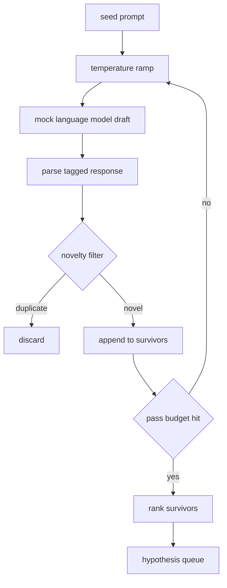

# Generator Hiptez

> Agent badawczy, który zadaje to samo pytanie dwa razy, marnuje tokeny. Sztuczka polega na zmuszeniu każdego szkicu do lądowania w nowym miejscu.

**Typ:** Build
**Języki:** Python
**Wymagania wstępne:** Faza 19, lekcje Track A 20-29
**Czas:** ~90 minut

## Cele dydaktyczne
- Przeprowadzić próbnik przez prompt początkowy i przekształcić jego wyniki w typowane rekordy hipotez.
- Zwiększać temperaturę próbnika przy każdym przejściu, aby następny szkic dryfował dalej od poprzedniego.
- Odfiltrować prawie duplikaty za pomocą małego modelu osadzania i progu odległości cosinusowej.
- Uszeregować ocalałych funkcją punktacji, która łączy nowość, szczegółowość i testowalność.
- Utrzymać każdy krok deterministycznym, aby ten sam seed zawsze produkował tę samą kolejkę.

## Dlaczego generować, potem filtrować

Planista, który pyta jeden model raz, dostaje jedną hipotezę. To wystarcza do przepracowanego przykładu. Dla pętli badawczej to zły kształt. Pętla chce rankingowej kolejki z głębokością, więc gdy pierwsza hipoteza zawiedzie, uruchamiacz ma gotową następną bez płacenia za kolejne pełne przejście próbkowania.

Dwa pomysły łączą się, by wyprodukować tę kolejkę. Pierwszy to zwiększanie temperatury: każde przejście przez próbnik podnosi temperaturę o jeden stopień, więc późniejsze szkice są zachęcane do błądzenia. Drugi to filtrowanie nowości: po każdym szkicu generator mierzy odległość osadzenia od każdego poprzedniego ocalałego i odrzuca wszystko wewnątrz klastra.

Lekcja dostarcza model językowy typu `mock`, który zwraca skryptowane sekwencje tokenów dla ustalonych promptów. Mock wystarcza, aby przećwiczyć pełną ścieżkę: prompt wejściowy, zastosowana rampa temperatury, przeanalizowani kandydaci, uruchomiony filtr nowości, rankingowa kolejka na wyjściu.

## Kształt hipotezy

```text
Hypothesis
  id             : int           (monotonic within a run)
  text           : str           (the claim)
  variables      : list[str]     (what changes between conditions)
  metric         : str           (what the runner will measure)
  baseline_ref   : str | None    (which paper or run the comparison cites)
  draft_pass     : int           (which sampler pass produced this)
  temperature    : float         (the sampler setting at draft time)
  novelty_score  : float         (distance from prior survivors, 0..1)
  rank_score     : float         (weighted sum used for ordering)
```

`variables` i `metric` nie są dowolnym tekstem. Parser wyciąga je z oznaczonej odpowiedzi. Uruchamiacz w lekcji pięćdziesiąt dwa czyta te pola bezpośrednio, gdy buduje konfigurację eksperymentu.

`baseline_ref` jest opcjonalny, ale zalecany. Ewaluator w lekcji pięćdziesiąt trzy potrzebuje linii bazowej do porównania. Jeśli hipoteza go pomija, ewaluator cofa się do poprzedniego uruchomienia na tej samej metryce.

## Architektura



Pętla jest prosta. Interesującą częścią jest to, że każde pole ma twardy kontrakt.

## Zwiększanie temperatury

Zacznij od `t_min`, zakończ na `t_max`, krok `(t_max - t_min) / (n_passes - 1)`. Każde przejście wywołuje próbnik przy bieżącej temperaturze, produkując `n_passes` równomiernie rozmieszczonych wartości z `GeneratorConfig.schedule()`. Model mock honoruje temperaturę, przełączając się między małym zestawem skryptowanych odpowiedzi kluczowanych na `(prompt, temp_bucket)`. Wiadra są otwartymi przedziałami, więc mała zmiana temperatury wybiera inne wiadro i produkuje inny szkic. W produkcji próbnik byłby prawdziwym modelem z `temperature=t` przekazanym dalej.

Domyślny harmonogram to sześć przejść od `0.2` do `1.2`. Sześć wystarcza, aby wypełnić kolejkę bez płacenia za próbki, które filtr nowości i tak odrzuci. Poniżej `0.2` model powtarza prompt. Powyżej `1.2` odpowiedzi mają tendencję do dryfowania od tematu i zawodzą parser.

## Filtr nowości

Po przeanalizowaniu każdego szkicu generator osadza tekst i porównuje z każdą zaakceptowaną hipotezą. Osadzenie to mały haszowany worek tokenów słów, znormalizowany do długości jednostkowej. Odległość cosinusowa między dwoma wektorami jednostkowymi to `1 - dot(a, b)`. Szkic przechodzi, jeśli jego minimalna odległość do dowolnego poprzedniego ocalałego jest powyżej `novelty_threshold`. Domyślnie `0.25`.

Haszowane osadzenie nie jest wymyślne. Jest deterministyczne, ma zero zależności i wystarcza do wychwycenia oczywistego przypadku: dwóch szkiców, które dzielą większość rzeczowników. Produkcja wymieniłaby je na mały model zdań. Interfejs pozostaje ten sam.

## Wynik rankingowy

```text
rank_score = w_novelty * novelty_score
           + w_specificity * specificity_score
           + w_testability * testability_score
```

Trzy podwyniki. `novelty_score` to minimalna odległość osadzenia od poprzednich ocalałych. `specificity_score` to liczba konkretnych zmiennych w hipotezie podzielona przez docelową liczbę. `testability_score` wynosi jeden, jeśli hipoteza określa zarówno metrykę, jak i linię bazową, połowę, jeśli ma tylko metrykę, zero w przeciwnym razie.

Domyślne wagi to `0.4`, `0.3`, `0.3`. Wagi żyją w konfiguracji generatora, aby późniejsza lekcja mogła je przesunąć bez forkowania kodu.

## Model językowy typu mock

```python
class MockLLM:
    def sample(self, prompt: str, temperature: float, seed: int) -> str:
        ...
```

Próbnik jest deterministyczny przy danej trójce `(prompt, temperature, seed)`. Mock przechowuje tabelę skryptowanych odpowiedzi kluczowanych na `(prompt_signature, temperature_bucket)`. Jeśli tabela nie ma wpisu dla klucza, próbnik zwraca odpowiedź zastępczą, która zawodzi parser. Ścieżka zastępcza jest ćwiczona przez jeden z testów.

Seed jest mieszany do odpowiedzi, aby ta sama para `(prompt, temperature)` z różnymi seedami produkowała różne szkice. W testach przypinamy seed, aby utrzymać wyniki odtwarzalne. W produkcji seed pochodziłby z zegara systemowego lub licznika.

## Kolejka wyjściowa

Wyjściem jest lista rekordów `Hypothesis` posortowanych według `rank_score` malejąco. Uruchamiacz w lekcji pięćdziesiąt dwa ściąga głowę, uruchamia eksperyment, a ewaluator w lekcji pięćdziesiąt trzy zapisuje werdykt. Jeśli werdykt mówi, że hipoteza była błędna, uruchamiacz ściąga następną.

Kolejka jest skończona. Gdy jest pusta, orkiestrator może albo poszerzyć prompt początkowy i uruchomić generator ponownie, albo zatrzymać się i zgłosić wyczerpanie budżetu.

## Jak czytać kod

`code/main.py` definiuje `Hypothesis`, `MockLLM`, `HypothesisGenerator` i deterministyczne demo. Generator udostępnia pojedynczą metodę `run(seed_prompt)` zwracającą posortowaną kolejkę; liczba przejść jest odczytywana z `GeneratorConfig.n_passes` zamiast być przekazywana jako argument. Osadzenie to haszowany worek tokenów. Filtr nowości to pojedyncza funkcja. Wynik rankingowy to pojedyncza funkcja. Nic nie zależy od `numpy`; matematyka osadzenia to czysty stdlib, więc lekcja pozostaje przenośna.

`code/tests/test_generator.py` obejmuje ścieżkę liniową, ścieżkę odrzucania duplikatów, ścieżkę awarii parsera, granice zwiększania temperatury i kolejność rankingową.

## Gdzie to pasuje

Lekcja pięćdziesiąt produkuje kolejkę. Lekcja pięćdziesiąt jeden bierze głowę kolejki i uruchamia wyszukiwanie literatury, aby ją potwierdzić lub obalić. Lekcja pięćdziesiąt dwa bierze tę samą głowę i uruchamia rzeczywisty eksperyment. Lekcja pięćdziesiąt trzy czyta oba wyniki i zapisuje werdykt. Cztery lekcje składają się w pętlę badawczą bez człowieka; człowiek może wkroczyć na dowolnej granicy.