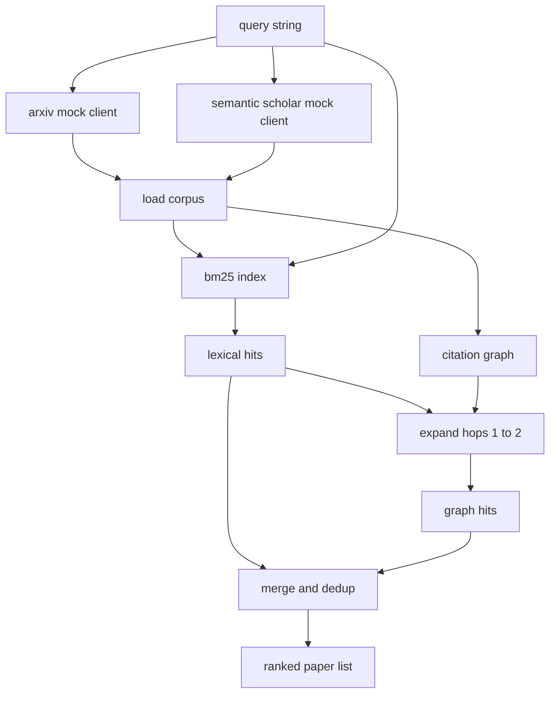

# Wyszukiwanie Literatury

> Hipoteza jest tania. Wiedza, czy ktoś już ją udowodnił, jest kosztowna. Zbuduj warstwę wyszukiwania, która odpowie na to pytanie, zanim uruchamiacz uruchomi piaskownicę.

**Typ:** Build
**Języki:** Python
**Wymagania wstępne:** Faza 19, lekcje Track A 20-29
**Czas:** ~90 minut

## Cele dydaktyczne
- Zamodelować mały rekord artykułu z polami, które pętla będzie czytać w dalszych lekcjach.
- Zbudować indeks BM25 na abstraktach tylko ze strukturami danych stdlib.
- Przejść graf cytowań, aby wyświetlić artykuły, które wyszukiwanie leksykalne pominęło.
- Usunąć duplikaty trafień z leksykalnego i grafowego przejścia po stabilnym identyfikatorze artykułu.
- Opakować dwa mockowane zewnętrzne API za pojedynczym klientem, aby miejsce wywołania pozostało takie samo, gdy pojawią się prawdziwe punkty końcowe.

## Dlaczego dwa przejścia wyszukiwania

Wyszukiwanie słów kluczowych po abstraktach zwraca artykuły, które dzielą słownictwo z zapytaniem. To obejmuje większość powierzchni. Pomija dwa przypadki. Pierwszy to gdy fundamentalny artykuł używa innego słownictwa; na przykład zapytanie o "sparse attention" pomija artykuł zatytułowany "block selection in transformer routing". Drugi to gdy istotny artykuł jest kontynuacją cytującą znany punkt zaczepienia; bardziej wydajne jest znalezienie punktu zaczepienia i pójście naprzód niż brute force'owanie puli abstraktów.

Lekcja buduje oba przejścia. BM25 po abstraktach łapie leksykalne trafienia. Przejście grafu cytowań rozszerza początkowy zbiór do przodu i do tyłu o jeden lub dwa skoki. Unia jest deduplikowana po ID artykułu i rankingowana przez mały łączny wynik.

## Kształt artykułu

```text
Paper
  id          : str           (stable identifier, "p001" for the mock corpus)
  title       : str
  abstract    : str
  year        : int
  authors     : list[str]
  references  : list[str]     (paper ids this paper cites)
  citations   : list[str]     (paper ids that cite this paper)
  source      : str           (which mock api supplied it, "arxiv" or "s2")
```

Pola references i citations tworzą skierowany graf cytowań. Dwa mockowe API zwracają nakładające się, ale nie identyczne pola, więc ładowacz korpusu łączy je na `id`.

## Architektura



Klient wyszukiwania posiada oba przejścia i scalanie. Osoba wywołująca przekazuje mu zapytanie i otrzymuje rankingową listę, gdzie każdy wpis przenosi pola wyniku na artykuł (`bm25_score`, `graph_distance`, `recency_score`, `final_score`), które wyjaśniają ranking.

## BM25 od podstaw

Implementacja to standardowy Okapi BM25 z domyślnymi parametrami `k1=1.5`, `b=0.75`. Indeks to dwa słowniki: `term -> doc_frequency` i `term -> list of (doc_id, term_count)`. Długość dokumentu to liczba tokenów abstraktu. Średnia długość dokumentu jest obliczana raz podczas budowania indeksu. Punktacja zapytania to suma po tokenach zapytania `idf * tf_norm`, gdzie `tf_norm` to standardowa znormalizowana długością częstość terminu BM25.

Tokenizator to `lower`, a następnie podział na niealfanumeryczne. Nie jest stematyzowany. System produkcyjny wymieniłby mały stemizator. Interfejs pozostaje ten sam.

```text
idf(t)      = log((N - df + 0.5) / (df + 0.5) + 1.0)
tf_norm(t)  = (f * (k1 + 1)) / (f + k1 * (1 - b + b * dl / avgdl))
score(d, q) = sum over t in q of idf(t) * tf_norm(t)
```

## Przejście grafu cytowań

Graf jest budowany raz z korpusu. Krawędzie do przodu idą od artykułu do jego referencji. Krawędzie wsteczne idą od artykułu do jego cytowań. Przejście to przeszukiwanie wszerz zainicjowane przez najlepsze trafienia BM25, ograniczone do dwóch skoków.

Dwa skoki to celowy limit. Jeden skok jest zbyt płytki; agent często chce bezpośredniego przodka lub potomka. Trzy skoki rozsadzają rozmiar wyniku na połączonym grafie i mają tendencję do dryfowania od tematu. Lekcja udostępnia limit skoków jako pokrętło konfiguracyjne, aby późniejsza pętla mogła go dokręcić.

## Deduplikacja i ranking

Dwa przejścia zwracają nakładające się zbiory. Scalanie kluczuje po ID artykułu. Dla każdego artykułu końcowy wynik jest ważoną mieszanką.

```text
final_score = w_bm25 * bm25_score_norm
            + w_graph * graph_score
            + w_recency * recency_score
```

`bm25_score_norm` to wynik BM25 podzielony przez maksymalny wynik BM25 w scalonym zbiorze (więc pole żyje w zero do jeden). `graph_score` wynosi jeden dla bezpośrednich trafień leksykalnych, potem `0.6` dla jednego skoku, `0.3` dla dwóch skoków, zero w przeciwnym razie. `recency_score` to liniowa rampa od zera w minimalnym roku korpusu do jednego w maksymalnym.

Domyślne wagi to `0.5`, `0.3`, `0.2`. Wagi są konfigurowalne; nieaktualny temat może obniżyć recency, podczas gdy szybko zmieniający się temat je podnosi.

## Korpus typu mock

Korpus to sto artykułów, wygenerowanych przez `build_corpus()`. Każdy artykuł ma ręcznie napisany tytuł i abstrakt na jeden z pięciu tematów: rzadkość uwagi, augmentacja wyszukiwania, adaptery niskiego rzędu, destylacja zbiorów danych i środowiska ewaluacyjne. Referencje i cytowania są połączone tak, że każdy temat tworzy połączony podgraf z kilkoma krawędziami między tematami.

Dwa mockowane klienty API (`ArxivMockClient`, `SemanticScholarMockClient`) czytają z tego samego korpusu, ale udostępniają różne pola. Arxiv zwraca tytuł, abstrakt, rok, autorów. Semantic Scholar dodaje referencje i cytowania. Klient wyszukiwania łączy na id; obsługa niezgodności pól między klientami jest odłożona do następnej lekcji.

## Co czytają lekcje 52 i 53

Uruchamiacz w lekcji pięćdziesiąt dwa czyta `paper.id`, `paper.title` i trzy pierwsze zdania abstraktu jako kontekst dla eksperymentu. Ewaluator w lekcji pięćdziesiąt trzy czyta `paper.year` i `paper.references`, aby przypisać linię bazową do konkretnego artykułu.

Klient wyszukiwania zwraca `RetrievalResult` z listą rankingową i metrykami na zapytanie: liczba trafień, średni wynik, najwyższy wynik, całkowity czas ścienny. Uruchamiacz je rejestruje, aby późniejsze przejście obserwowalności mogło wykreślić jakość w czasie.

## Jak czytać kod

`code/main.py` definiuje `Paper`, `ArxivMockClient`, `SemanticScholarMockClient`, `BM25Index`, `CitationGraph`, `RetrievalClient` i deterministyczne demo. Klienci mock i korpus są w tym samym pliku, aby lekcja pozostała przenośna. Implementacja BM25 to jedna klasa, sześćdziesiąt linii. Przejście grafu to jedna metoda.

`code/tests/test_retrieval.py` obejmuje ścieżkę leksykalną, ścieżkę grafu, scalanie, deduplikację i puste zapytanie.

## Gdzie to pasuje

Lekcja pięćdziesiąt produkuje hipotezę. Lekcja pięćdziesiąt jeden przeszukuje literaturę, aby sprawdzić, czy ta hipoteza jest już rozstrzygnięta. Lekcja pięćdziesiąt dwa uruchamia eksperyment, jeśli nie jest. Lekcja pięćdziesiąt trzy czyta zarówno wynik wyszukiwania, jak i metryki eksperymentu, aby napisać werdykt. Klient wyszukiwania jest najtańszym z czterech etapów i uruchamia się jako pierwszy w orkiestratorze.