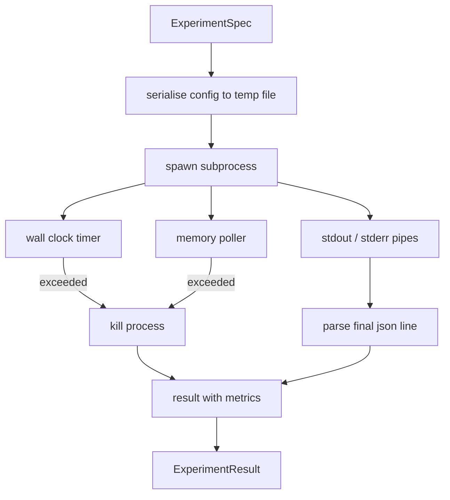

# Uruchamiacz Eksperymentów

> Pętla jest tak uczciwa, jak jej pomiary. Zbuduj uruchamiacz, który bierze specyfikację, wykonuje ją w odizolowanym podprocesie i emituje JSON metryk, któremu ewaluator może zaufać.

**Typ:** Build
**Języki:** Python
**Wymagania wstępne:** Faza 19, lekcje Track A 20-29
**Czas:** ~90 minut

## Cele dydaktyczne
- Zakodować eksperyment jako typowaną specyfikację, którą uruchamiacz może serializować do podprocesu.
- Uruchomić podproces z twardym limitem czasu ściennego i miękkim limitem pamięci, i udostępnić oba jako warunki terminalne.
- Przechwycić stdout, stderr i ustrukturyzowany JSON metryk w jeden rekord wynikowy.
- Zbudować tabelę ablacji, która przeszukuje jeden parametr konfiguracyjny na raz względem ustalonej specyfikacji bazowej.
- Utrzymać każdy wynik deterministyczny przy danym seedzie, aby ewaluator widział te same liczby w różnych uruchomieniach.

## Dlaczego podproces

Pętla badawcza uruchamia niezaufany kod. Hipoteza pochodzi z próbnika, skrypt eksperymentu pochodzi z tej samej ścieżki; traktowanie któregokolwiek jako bezpiecznego w procesie to proszenie się o awarię, która zabiera orkiestrator. Podprocesy to najprostsza izolacja, jaką dostarcza język: oddzielny proces, niezależna przestrzeń adresowa, obsługa sygnałów po stronie rodzica.

Uruchamiacz tutaj nie implementuje pełnej piaskownicy. Nie ma cgroup, filtra seccomp, ponownego mapowania przestrzeni nazw. Co ma, to limit czasu ściennego, pętlę odpytywania wzrostu pamięci i ścieżkę zabicia, która kończy proces po przekroczeniu któregokolwiek limitu. To jest kontrakt czasu wykonania, który każda bardziej rozbudowana piaskownica rozszerza. Lekcja utrzymuje kontrakt na tyle mały, że można go przeczytać za jednym razem.

## Kształt specyfikacji eksperymentu

```text
ExperimentSpec
  spec_id        : str            (stable id, "exp_001")
  hypothesis_id  : int            (link back to the queue from lesson 50)
  script_path    : str            (path to the python script to run)
  config         : dict           (passed to the script as one json arg)
  seed           : int            (deterministic seed for the experiment)
  wall_timeout_s : float          (hard timeout, killed on exceed)
  memory_cap_mb  : int            (soft cap, polled; killed on exceed)
  metric_keys    : list[str]      (which fields the evaluator will read)
```

Skrypt żyje na dysku; uruchamiacz zapisuje konfigurację do tymczasowej ścieżki pliku, którą skrypt czyta. Oczekuje się, że skrypt wydrukuje pojedynczą linię JSON na stdout, której klucze są nadzbiorem `metric_keys`. Wszystko inne na stdout jest przechwytywane, ale ignorowane przez parser metryk.

## Architektura



Uruchamiacz to jedna klasa z jedną główną metodą. Poller to mały wątek, który budzi się raz na interwał odpytywania i czyta odpowiednik `psutil` podprocesu z systemu plików proc, gdy jest dostępny, wracając do no-op, gdy platforma go nie udostępnia.

## Dlaczego miękki limit pamięci

Twarde limity pamięci potrzebują `resource.setrlimit` i działają tylko na POSIX. Lekcja dostarcza przenośne podejście: odpytywać rozmiar rezydującego zestawu z platformy i zabić podproces, jeśli przekroczy limit. Limit jest miękki, ponieważ poller ma niezerowy interwał; proces może wzrosnąć ponad limit między odpytywaniami, a następnie spaść. Uruchamiacz rejestruje maksymalny obserwowany RSS, aby ewaluator mógł zobaczyć, jak blisko limitu znalazło się uruchomienie.

W systemach bez wsparcia inspekcji procesów poller loguje jednorazowe ostrzeżenie i wyłącza się. Limit czasu ściennego nadal obowiązuje. Testy lekcji obejmują obie ścieżki.

## Przechwytywanie stdout i stderr

Uruchamiacz czyta oba potoki opróżnione po zakończeniu. Stdout jest skanowany linia po linii; ostatnia linia, która parsuje jako JSON ze wszystkimi wymaganymi `metric_keys`, jest traktowana jako porcja metryk. Wcześniejsze linie JSON są przechowywane w wyniku jako `intermediate_metrics`; ewaluator może ich użyć do krzywych uczenia się.

Stderr jest przechwytywane dosłownie do wyniku. Uruchamiacz nigdy nie podnosi błędu przy niezerowym kodzie wyjścia; zamiast tego rejestruje kod w wyniku. Każde niezerowe wyjście jest oznaczane `"crash"`, nawet jeśli skrypt wydrukował metryki, aby ewaluator domyślnie traktował częściowe uruchomienia jako porażki.

## Tabela ablacji

```python
def ablate(base: ExperimentSpec, knob: str, values: list[Any]) -> list[ExperimentSpec]:
    ...
```

Mając specyfikację bazową i nazwę parametru, pomocnik zwraca jedną specyfikację na wartość z nadpisanym `config[knob]`. Każda specyfikacja otrzymuje pochodny `spec_id` (`f"{base.spec_id}_{knob}_{value}"`). Uruchamiacz dostarcza `AblationRunner`, który uruchamia je po kolei i zwraca `AblationTable` kluczowaną po wartości parametru.

Dlaczego jeden parametr na raz. Pełne przeszukiwanie czynnikowe rośnie wykładniczo i produkuje wyniki, których ewaluator nie może zinterpretować. Jeden parametr na raz produkuje czystą oś, którą ewaluator może wykreślić. Lekcja obsługuje przeszukiwanie wielu parametrów tylko jako powtarzane ablacje pojedynczego parametru, komponowane przez osobę wywołującą.

## Deterministyczność

Każda specyfikacja przenosi seed. Uruchamiacz przekazuje seed do skryptu przez słownik konfiguracyjny (`config["__seed"] = spec.seed`). Mockowe skrypty eksperymentów w `code/experiments/` honorują seed i produkują identyczne metryki w różnych uruchomieniach. Ewaluator w lekcji pięćdziesiąt trzy zależy od tego; bez determinizmu "regresja" może być inną losową inicjalizacją.

## Mockowy skrypt eksperymentu

Lekcja dostarcza jeden skrypt eksperymentu: `code/experiments/sparsity_experiment.py`. Jest to prawdziwy skrypt, który czyta swój plik konfiguracyjny, symuluje małe uruchomienie trenowania z losowym przejściem numpy i drukuje JSON metryk. Skrypt honoruje parametr `sleep_s` do testowania limitów czasu i `allocate_mb` do testowania pollera pamięci.

Symulacja nie trenuje niczego prawdziwego. Jest to obliczenie numeryczne, które naśladuje kształt pętli trenowania: krzywa straty, końcowa perplexity, czas ścienny. Celem lekcji jest uruchamiacz, nie symulacja. Prawdziwy skrypt eksperymentu importowałby model.

## Kształt wyniku

```text
ExperimentResult
  spec_id              : str
  hypothesis_id        : int
  exit_code            : int
  terminal             : "ok" | "timeout" | "oom" | "crash"
  wall_time_s          : float
  peak_rss_mb          : float | None
  metrics              : dict
  intermediate_metrics : list[dict]
  stdout_tail          : str
  stderr_tail          : str
```

Ewaluator czyta `metrics` i `terminal` jako pierwsze. Jeśli terminal jest czymś innym niż `"ok"`, eksperyment liczy się jako nieudane uruchomienie i werdykt ewaluatora jest automatyczny. W przeciwnym razie metryki są przepuszczane przez test istotności.

## Jak czytać kod

`code/main.py` definiuje `ExperimentSpec`, `ExperimentResult`, `ExperimentRunner`, `AblationRunner` i deterministyczne demo. Zarządzanie podprocesem to jedna klasa. Poller pamięci to mały wątek. Pomocnik ablacji to pojedyncza funkcja.

`code/experiments/sparsity_experiment.py` to mockowy eksperyment używany w testach. Czyta ścieżkę pliku konfiguracyjnego z argv i zapisuje pojedynczą linię JSON metryk po zakończeniu.

`code/tests/test_runner.py` obejmuje ścieżkę sukcesu, ścieżkę limitu czasu, ścieżkę awarii, tabelę ablacji i sprawdzenie determinizmu w dwóch uruchomieniach.

## Gdzie to pasuje

Lekcja pięćdziesiąt generuje hipotezę. Lekcja pięćdziesiąt jeden odfiltrowuje wszystko, co literatura już rozstrzygnęła. Lekcja pięćdziesiąt dwa uruchamia eksperyment dla tego, co zostało. Lekcja pięćdziesiąt trzy czyta wynik, uruchamia test istotności i zapisuje werdykt, który orkiestrator przechowuje względem ID hipotezy.