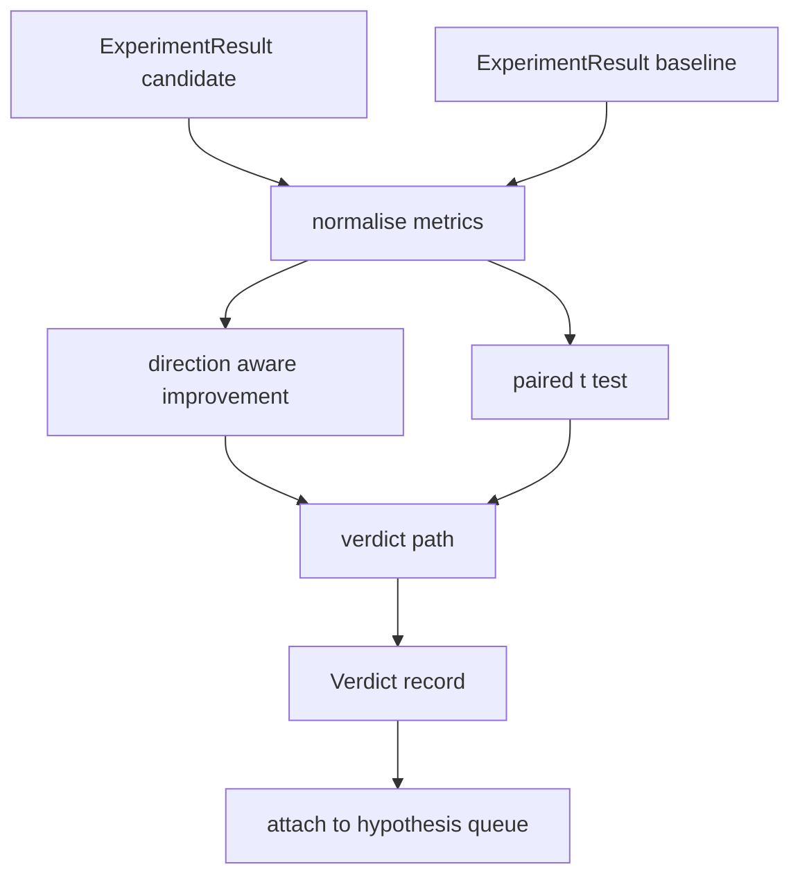

# Ewaluator Wyników

> Uruchamiacz wyprodukował liczby. Ewaluator decyduje, czy te liczby są poprawą, regresją czy szumem. Zbuduj ścieżkę werdyktu, która przekształca metryki w jednowierszowe podsumowanie.

**Typ:** Build
**Języki:** Python
**Wymagania wstępne:** Faza 19, lekcje Track A 20-29
**Czas:** ~90 minut

## Cele dydaktyczne
- Porównać uruchomienie kandydata z linią bazową używając poprawy świadomej kierunku i ustalonego progu.
- Przeprowadzić sparowany test t od podstaw na metrykach na seed i odczytać wynikowe p.
- Znormalizować metryki w skali logarytmicznej, aby późniejszy raport mógł je łączyć z metrykami liniowymi.
- Wyemitować werdykt na hipotezę, który orkiestrator może dołączyć do kolejki z lekcji pięćdziesiąt.
- Utrzymać każdy krok czystym, aby te same wejścia zawsze produkowały ten sam werdykt.

## Dlaczego sparowany test

Pojedyncza liczba z uruchamiacza nie mówi, czy zmiana jest rzeczywista. Ta sama konfiguracja z innym seedem daje inną perplexity. Zmiana może być szumem. Właściwym porównaniem jest sparowane: te same seedy z tymi samymi danymi, uruchomione raz z kandydatem i raz z linią bazową. Każdy seed wnosi różnicę. Średnia tych różnic to efekt. Błąd standardowy tych różnic to poziom szumu.

Lekcja implementuje test od podstaw. Nie ma `scipy.stats`. Matematyka jest wystarczająco mała, by zmieścić się na jednym ekranie.

```text
diffs    = [a_i - b_i for i in seeds]
mean     = sum(diffs) / n
variance = sum((d - mean) ** 2 for d in diffs) / (n - 1)
t_stat   = mean / sqrt(variance / n)
df       = n - 1
p_value  = two_sided_p(t_stat, df)
```

Dwustronna wartość p używa uregulowanej niekompletnej funkcji beta. Lekcja dostarcza małą implementację, która używa ułamka łańcuchowego Lentza. Całość to sześćdziesiąt linii stdlib math.

## Poprawa świadoma kierunku

Niektóre metryki poprawiają się, gdy rosną (dokładność, przepustowość). Inne poprawiają się, gdy maleją (strata, perplexity, czas ścienny). Ewaluator przenosi pole `direction` na każdej metryce.

```text
if direction == "higher_is_better":
    improvement = (candidate - baseline) / abs(baseline)
elif direction == "lower_is_better":
    improvement = (baseline - candidate) / abs(baseline)
```

Poprawa jest ze znakiem. Ujemna poprawa w metryce "wyższa znaczy lepsza" oznacza, że kandydat jest gorszy. Ścieżka werdyktu czyta znak i wielkość razem.

Płaski próg (`improvement_threshold=0.02`, dwa procent) decyduje, czy zmiana jest wystarczająco duża, by ją nazwać. Poniżej tego werdykt to "noise" niezależnie od wartości p; pętla nie interesuje się zmianami, których użytkownik nie mógłby zmierzyć.

## Architektura



Ewaluator uruchamia trzy niezależne obliczenia i łączy je w ścieżce werdyktu. Każde obliczenie to czysta funkcja bez współdzielonego stanu.

## Normalizacja logarytmiczna

Perplexity jest wykładnicza względem straty. Spadek straty o 0.1 to znacznie większy spadek perplexity. Porównywanie perplexity bezpośrednio w dwóch konfiguracjach jest w porządku, ale łączenie jej z metrykami liniowymi w jednym raporcie wymaga normalizacji.

Lekcja normalizuje każdą metrykę, której pole `scale` to `"log"`, biorąc logarytm naturalny przed obliczeniem poprawy. Próg jest następnie stosowany w przestrzeni log. Spadek perplexity z 32 do 28 to `log(28) - log(32) = -0.133` w metryce "niższa znaczy lepsza", co jest znacznie powyżej dwuprocentowego progu.

```text
if scale == "log":
    a = log(candidate)
    b = log(baseline)
else:
    a = candidate
    b = baseline
```

Metryki z `scale="linear"` (domyślnie) pomijają transformację. Ta sama ścieżka kodu obsługuje oba.

## Sparowany test na seed

Uruchamiacz z lekcji pięćdziesiąt dwa emituje jeden końcowy JSON metryk na uruchomienie. Dla sparowanego testu ewaluator potrzebuje jednej porcji danych na seed dla kandydata i jednej na seed dla linii bazowej. Orkiestrator uruchamia ten sam eksperyment w obu konfiguracjach na liście seedów i przekazuje ewaluatorowi dwie listy rekordów `ExperimentResult`.

Ewaluator łączy je po seedzie (seed żyje w `result.metrics["seed"]`) i przechodzi przez żądaną metrykę. Jeśli seedy nie pasują między dwiema listami, ewaluator podnosi `PairingError`. Orkiestrator powinien uruchomić ponownie.

## Kształt werdyktu

```text
Verdict
  hypothesis_id          : int
  metric                 : str
  direction              : "higher_is_better" | "lower_is_better"
  scale                  : "linear" | "log"
  candidate_mean         : float
  baseline_mean          : float
  improvement            : float       (signed, fraction; see direction rules)
  p_value                : float | None  (None if n < 2)
  significance_threshold : float
  improvement_threshold  : float
  verdict                : "improved" | "regressed" | "noise" | "failed"
  rationale              : str
```

Ścieżka werdyktu to mała tabela decyzyjna:

```text
1. If any candidate result has terminal != "ok": verdict = "failed"
2. else if |improvement| < improvement_threshold:  verdict = "noise"
3. else if p_value is None or p_value > significance: verdict = "noise"
4. else if improvement > 0:                          verdict = "improved"
5. else:                                             verdict = "regressed"
```

Rationale to jednowierszowe zdanie zrozumiałe dla człowieka, które orkiestrator może zalogować względem ID hipotezy.

## Jak czytać kod

`code/main.py` definiuje `MetricSpec`, `Verdict`, `Evaluator`, pomocniki statystyki t i niekompletnej beta oraz deterministyczne demo. Test t jest zaimplementowany w czystym stdlib math; numpy jest używane tylko do odczytu listy metryk i obliczenia średnich i wariancji.

`code/tests/test_evaluator.py` obejmuje ścieżkę poprawy, ścieżkę regresji, ścieżkę szumu (mała poprawa), ścieżkę szumu (małe n), ścieżkę nieudanego terminala, ścieżkę normalizacji logarytmicznej, test t względem znanej wartości referencyjnej i błąd parowania.

## Gdzie to pasuje

Lekcja pięćdziesiąt wyprodukowała kolejkę hipotez. Lekcja pięćdziesiąt jeden odfiltrowała wszystko, co literatura rozstrzygnęła. Lekcja pięćdziesiąt dwa uruchomiła eksperyment w konfiguracjach kandydata i linii bazowej na seedach. Lekcja pięćdziesiąt trzy czyta te uruchomienia i zapisuje werdykt. Orkiestrator łączy cztery:

```text
for hypothesis in queue:
    literature = retrieval.search(hypothesis.text)
    if literature_settles(hypothesis, literature):
        attach(hypothesis, verdict="settled")
        continue
    candidates = runner.run_all(specs_for(hypothesis))
    baselines  = runner.run_all(baseline_specs_for(hypothesis))
    metric_spec = MetricSpec("perplexity", direction=LOWER, scale=LOG)
    verdict = evaluator.evaluate(hypothesis.id, metric_spec, candidates, baselines)
    attach(hypothesis, verdict)
```

Ten orkiestrator nie znajduje się w tej lekcji; cztery lekcje składają się na niego bez żadnego kleju poza dataclassami, które każda definiuje.