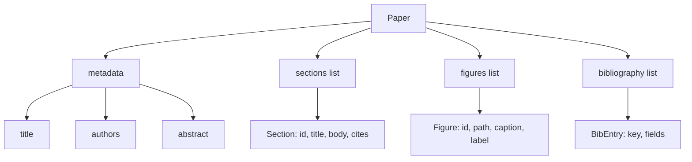
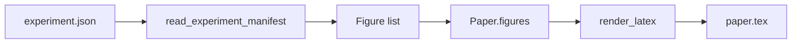
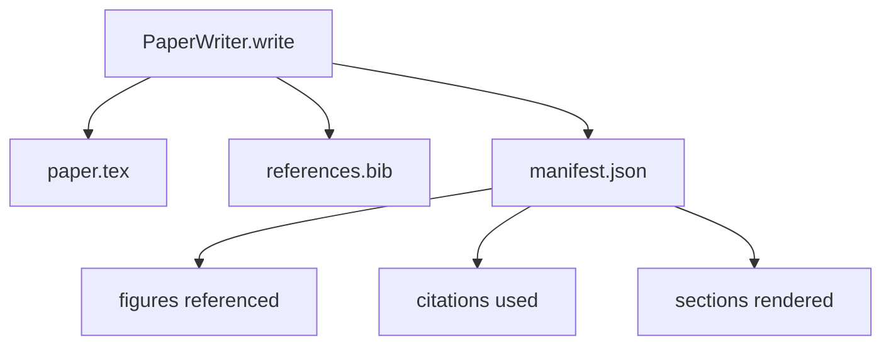

# Pisarz Artykułów

> Szkielet LaTeX to kontrakt między badaczem a składem. Jeśli kontrakt jest złamany, dokument się nie kompiluje, a awaria jest głośna. Zbuduj szkielet najpierw, potem go wypełnij.

**Typ:** Build
**Języki:** Python
**Wymagania wstępne:** Faza 19, lekcje 50-53
**Czas:** ~90 minut

## Cele dydaktyczne

- Traktować artykuł badawczy jako ustrukturyzowany artefakt ze znanym grafem sekcji, a nie swobodny dokument.
- Wygenerować szkielet LaTeX, który deklaruje abstrakt, sekcje, miejsca na figury i klucze bibliografii, zanim jakakolwiek proza zostanie napisana.
- Wstrzyknąć figury z wyników eksperymentów (ścieżki i podpisy) do szkieletu przez deterministyczny mechanizm miejsc.
- Podłączyć mockowany generator prozy, który wypełnia każdą sekcję z ustrukturyzowanego konspektu, aby środowisko było testowalne bez modelu.
- Wyemitować pojedynczy `paper.tex` plus `references.bib` plus manifest, który wymienia każdą przywołaną figurę i każde użyte cytowanie.

## Dlaczego szkielet najpierw

Szkic, który zaczyna się jako proza, kumuluje dług strukturalny. Wstęp rozrasta się o trzy akapity, które powinny być w powiązanych pracach. Figura jest przywoływana, zanim jest zdefiniowana. Bibliografia kończy się z trzema kluczami dla tego samego artykułu. Zanim autor zauważy, koszt przepisywania jest wyższy niż koszt pisania.

Szkielet odwraca to. Struktura jest deklarowana z góry jako dane. Sekcje są miejscami z nazwami i kolejnością. Figury są miejscami z identyfikatorami i podpisami. Klucze bibliografii są deklarowane na górze z wpisami, na które wskazują. Proza jest generowana do tych miejsc jedno po drugim. Środowisko może zweryfikować, zanim jakakolwiek proza zostanie napisana, że każda figura ma miejsce, każde cytowanie ma wpis i każda sekcja pojawia się w spisie treści.

To ta sama dyscyplina, którą wcześniejsze lekcje stosowały do planów, wywołań narzędzi i śladów. Struktura to kontrakt.

## Kształt artykułu

Każde pole to zwykłe dane Pythona. Renderer to czysta funkcja z `Paper` do łańcucha LaTeX. Środowisko może introspekcyjnie badać artykuł przed renderowaniem: liczyć sekcje, wymieniać brakujące pliki figur, sprawdzać, czy każde `\cite{key}` ma pasujący `BibEntry`.

## Kontrakt renderowania

Renderer gwarantuje trzy właściwości. Po pierwsze, każde miejsce na figurę w szkielecie emituje blok `\begin{figure}` ze stabilną etykietą w postaci `fig:<id>`. Po drugie, każda sekcja emituje `\section{}` ze stabilną etykietą w postaci `sec:<id>`, aby odsyłacze działały. Po trzecie, bibliografia emituje blok `\bibliography`, którego `references.bib` zawiera dokładnie wpisy zadeklarowane w artykule, ani mniej, ani więcej.

Naruszenie któregokolwiek z tych warunków to błąd renderowania, a nie ostrzeżenie. Szablon jest kontraktem; renderowanie, które po cichu pomija figurę, jest złamaniem kontraktu.

## Wstrzykiwanie figur z eksperymentów

Wcześniejsze lekcje w tym torze produkowały wyniki eksperymentów jako manifesty JSON. Każdy manifest przenosi listę artefaktów ze ścieżkami i krótkimi podpisami. Pisarz artykułu czyta ten manifest i tworzy rekordy `Figure`.

Wstrzykiwanie jest deterministyczne. Identyfikatory figur pochodzą z nazwy eksperymentu plus monotonicznego licznika. Podpisy pochodzą z manifestu. Ścieżki są normalizowane względem katalogu wyjściowego artykułu, aby LaTeX kompilował się nawet wtedy, gdy wyniki eksperymentów znajdują się gdzie indziej na dysku.

## Mockowany generator prozy

Lekcja nie wywołuje modelu. `MockProseGenerator` czyta kształt konspektu i emituje prozę deterministycznie. Kształt konspektu to jeden krótki ciąg na sekcję. Generator rozszerza ten ciąg na dwa krótkie akapity z wplecionym tytułem sekcji. Wygenerowana proza przywołuje figury i cytowania dokładnie wtedy, gdy konspekt je deklaruje.

To wystarcza do przetestowania każdego zachowania pisarza. Prawdziwa implementacja wymieniłaby generator na wywołanie modelu. Środowisko wokół niego się nie zmienia. To jest wartość deklarowania generatora prozy jako wywoływalnego: test podstawia deterministyczny, produkcja podstawia modelowy, reszta potoku jest identyczna.

## Wynik manifestu

Pisarz emituje trzy pliki do katalogu wyjściowego.

Manifest to to, co czyta późniejszy ewaluator lub pętla krytyka. Nie parsuje LaTeX; czyta manifest. Następna lekcja, pętla krytyka, bierze ten manifest jako wejście i produkuje listę opinii. Dlatego manifest jest częścią kontraktu, a LaTeX nie.

## Bramki walidacyjne

Pisarz uruchamia cztery bramki przed zapisaniem jakiegokolwiek pliku.

1. Każdy identyfikator figury jest unikalny w artykule.
2. Pole `cites` każdej sekcji odwołuje się do klucza bibliografii zadeklarowanego w artykule.
3. Abstrakt nie jest pusty.
4. Tytuł nie jest pusty.

Nieudana bramka podnosi `PaperValidationError` z precyzyjnym powodem. Środowisko udostępnia powód jako tryb awarii. Nie ma częściowego zapisu: albo wszystkie trzy pliki są emitowane, albo żaden.

## Jak czytać kod

`code/main.py` definiuje `Paper`, `Section`, `Figure`, `BibEntry`, `PaperValidationError`, `MockProseGenerator`, `PaperWriter` i funkcję `render_latex`. Metoda `write` przyjmuje katalog wyjściowy i emituje `paper.tex`, `references.bib` i `manifest.json`. Pomocnik `read_experiment_manifest` konwertuje listę manifestów eksperymentów na rekordy `Figure`.

`code/tests/test_paper_writer.py` obejmuje: renderowanie szkieletu bez sekcji, pełne renderowanie z dwoma sekcjami i dwoma figurami, bramkę brakującego cytowania, bramkę duplikatu identyfikatora figury, zawartość manifestu i kontrakt łańcucha LaTeX (każda sekcja emituje `\section{}`, każda figura emituje `\begin{figure}`).

## Idąc dalej

Dwa rozszerzenia, które będzie chciała prawdziwa implementacja. Po pierwsze, renderowanie wieloformatowe: ten sam kształt `Paper` kompiluje się do Markdown dla postów na blogu i HTML dla podglądów. Renderer staje się strategią na `Paper`. Po drugie, wzbogacanie cytowań: pisarz pobiera wpisy BibTeX z klucza cytowania, mając lokalną pamięć podręczną DOI. Oba dodają wartość, oba można dodać bez dotykania kontraktu szkieletu.

Szkielet jest zakładem. Sekcje, figury i cytowania zadeklarowane jako dane, proza generowana do miejsc, manifest emitowany obok LaTeX. Każda inna poprawa komponuje się na wierzchu.