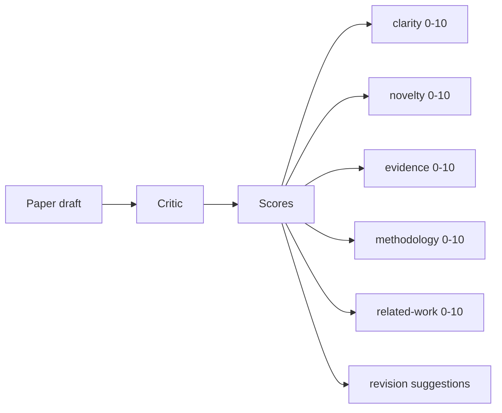
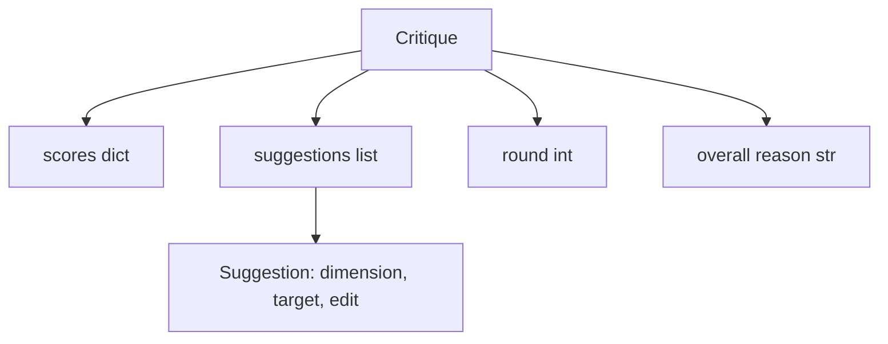
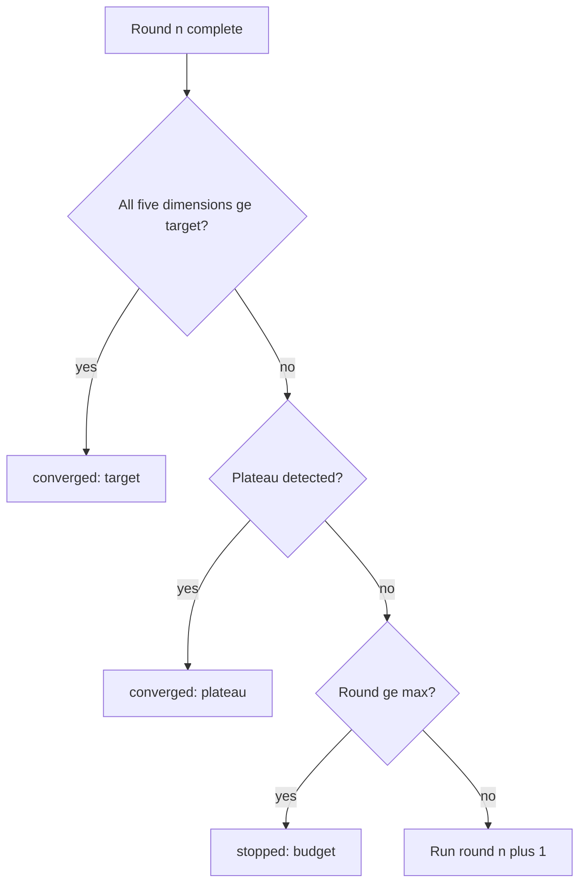
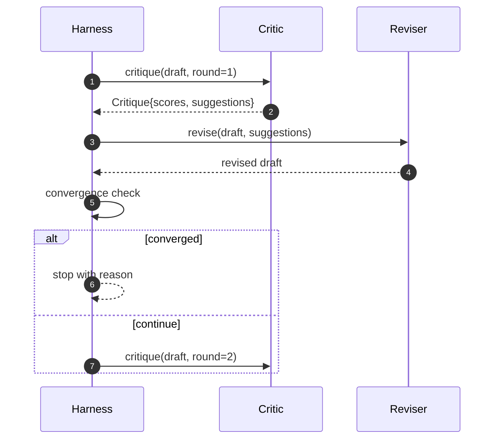

# Pętla Krytyka

> Krytyk, który za pierwszym razem zwraca "wygląda dobrze", jest zepsuty. Krytyk, który zawsze zwraca "wymaga poprawek", jest zepsuty. Interesujący krytyk to ten, który zbiega, a musisz zaprojektować zbieżność.

**Typ:** Build
**Języki:** Python
**Wymagania wstępne:** Faza 19, lekcje 50-53
**Czas:** ~90 minut

## Cele dydaktyczne

- Ocenić szkic artykułu w pięciu ustalonych wymiarach: jasność, nowość, dowody, metodologia, powiązane prace.
- Zastosować krytykę każdej rundy jako ustrukturyzowaną różnicę rewizji, a nie swobodne przepisanie.
- Wykryć zbieżność przez porównanie wyników między rundami; zatrzymać się na plateau, osiągnięciu celu lub wyczerpaniu budżetu.
- Ograniczyć rundy budżetem maksymalnej liczby iteracji, aby niezbiegający krytyk nie działał wiecznie.
- Wyemitować ślad na rundę, aby pulpit lub następny etap mógł wyświetlić trajektorię wyników.

## Dlaczego pięć ustalonych wymiarów

Swobodny krytyk to model, który zwraca akapit sugestii. Następna runda rewizji traktuje akapit jako kontekst otoczenia. To, czy przepisanie uwzględnia krytykę, jest niemożliwe do zweryfikowania, ponieważ krytyka nigdy nie miała struktury.

Pięć wymiarów daje środowisku kontrakt.



Wynik to wektor. Środowisko obserwuje każdy wymiar w rundach. Rewizja, która podnosi jasność, ale obniża dowody, jest regresją w dowodach, a sprawdzenie zbieżności to widzi. Krytyk tylko-modelowy nie może zaoferować takiej gwarancji.

## Kształt krytyki



Każda sugestia przenosi wymiar, który poprawia, sekcję, którą celuje, i instrukcję `edit`, którą rewizor może zastosować. Rewizor jest również wywoływalny. Lekcja dostarcza deterministyczny rewizor, który interpretuje instrukcję edycji jako operację dołączania do sekcji. Rewizor sterowany modelem interpretowałby to samo pole jako prompt. Kontrakt się nie zmienia.

## Reguły zbieżności, w kolejności

Pętla krytyka kończy się, gdy którykolwiek z trzech warunków zostanie spełniony.



Cel jest najostrzejszym przypadkiem: każdy z pięciu wymiarów (jasność, nowość, dowody, metodologia, powiązane prace) musi osiągnąć `>= target_score` (domyślnie `8.0`), zanim pętla zwróci sukces. Wysoka średnia z jednym słabym wymiarem nie wystarcza. Wykrywanie plateau porównuje średnią bieżącej rundy do średniej poprzedniej rundy. Jeśli poprawa jest poniżej `plateau_epsilon` (domyślnie `0.1`) dla dwóch kolejnych rund, pętla kończy się z `plateau`. Budżet to twardy limit rund (domyślnie `5`) i kończy się z `budget`.

Kolejność ma znaczenie. Cel wygrywa z plateau, które wygrywa z budżetem. Jeśli runda trzecia osiąga cel w tej samej iteracji, która wywołałaby również plateau, wynikiem jest `target`, a nie `plateau`.

## Dlaczego wykrywanie plateau działa przez dwie rundy

Plateau z jednej rundy to szum. Prawdziwy krytyk zwraca nieco inny wynik w każdej iteracji nawet na ustalonym szkicu, ponieważ deterministyczne punktowanie nadal zależy od tego, które sugestie zostały zastosowane i w jakiej kolejności. Wymaganie dwóch kolejnych rund plateau odfiltrowuje ten szum. Jeśli środowisko zgłasza plateau, szkic naprawdę przestał się poprawiać.

## Deterministyczny krytyk w tej lekcji

Lekcja nie wywołuje modelu. Dostarczony krytyk to wywoływalny, który ocenia szkic na podstawie trzech sygnałów: średniej długości treści sekcji (jasność), liczby figur i liczby cytowań (dowody) oraz pola `originality_tag` w metadanych artykułu (nowość). Rewizor wie, jak popchnąć każdy wynik w górę.

```text
clarity      grows when the average section body length increases
novelty      grows when originality_tag is set to "high"
evidence     grows when a section's figure_refs is non-empty
methodology  grows when a section titled "Method" exists with body
related-work grows when a section titled "Related Work" exists with body
```

Rewizor interpretuje każdą sugestię jako ukierunkowane dołączenie. Po rundzie pierwszej środowisko może zaobserwować wzrost wyniku. Testy używają tej właściwości, aby potwierdzić, że pętla zmniejsza lukę.

## Pełny kontrakt pętli



Środowisko posiada licznik rund, ślad i sprawdzenie zbieżności. Krytyk posiada wynik. Rewizor posiada różnicę. Żaden z trzech nie dotyka stanu pozostałych.

## Wynik śladu

Każda runda emituje jedno zdarzenie śladu z numerem rundy, wektorem wyników, liczbą sugestii i werdyktem zbieżności. Pełny ślad jest zwracany obok ostatecznego szkicu. Późniejszy pulpit może wyrenderować wykres wyniku na rundę. Następna lekcja, scheduler iteracji, czyta ślad, aby zdecydować, czy gałąź jest warta utrzymania.

## Budżety chroniące przed złymi krytykami

Krytyk, który produkuje sugestie, które nigdy nie poprawiają wyniku, zablokuje pętlę na suficie maksymalnej iteracji. Ślad to uwidacznia: pięć rund, płaskie wyniki, werdykt `budget`. Użytkownik czyta to jako błąd krytyka, a nie błąd szkicu. Alternatywa, pokazywanie tylko końcowego szkicu, ukrywa diagnozę. Projektowanie śladu-pierwszego ją ujawnia.

## Jak czytać kod

`code/main.py` definiuje `Critique`, `Suggestion`, protokół `Critic`, protokół `Reviser`, `CriticLoop` i fabrykę `make_deterministic_critic_pair`, która zwraca deterministycznego krytyka i pasującego rewizora. Minimalny kształt `Paper` jest dołączony, aby lekcja stała samodzielnie.

`code/tests/test_critic_loop.py` obejmuje: monotoniczną poprawę po rundzie pierwszej, zbieżność celu na dostrojonym szkicu, wykrywanie plateau po dwóch płaskich rundach, wyczerpanie budżetu, gdy żadna sugestia nie poprawia, zastosowanie sugestii przez rewizora i kształt śladu.

## Idąc dalej

Dwa rozszerzenia, które będzie chciała prawdziwa implementacja. Po pierwsze, wagi wymiarów: artykuł na warsztaty waży nowość wyżej niż metodologię; czasopismo waży odwrotnie. Sprawdzenie zbieżności staje się ważoną średnią. Po drugie, sparowani krytycy: jeden krytyk ocenia, drugi krytyk rozstrzyga sugestie, zanim rewizor je zobaczy. Oba dodają wartość, oba komponują się na tym samym kształcie `Critique`.

Zakładem jest wektor wyników. Gdy krytyka jest ustrukturyzowana, każda inna poprawa, reguła zbieżności, pulpit, sparowany krytyk, wchodzi bez zmiany pętli.