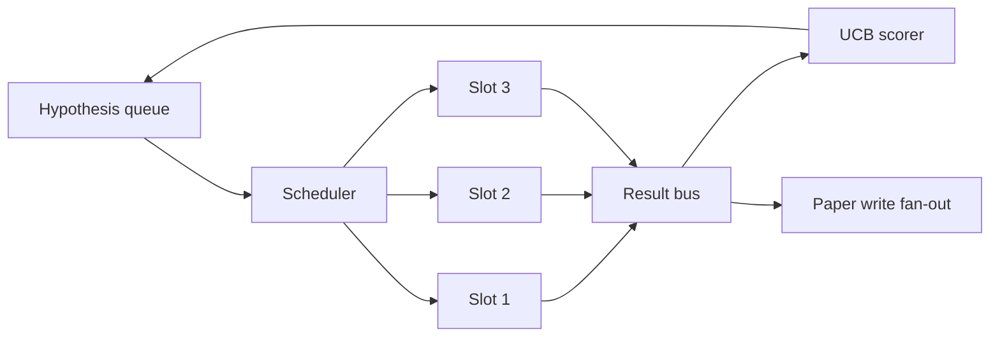
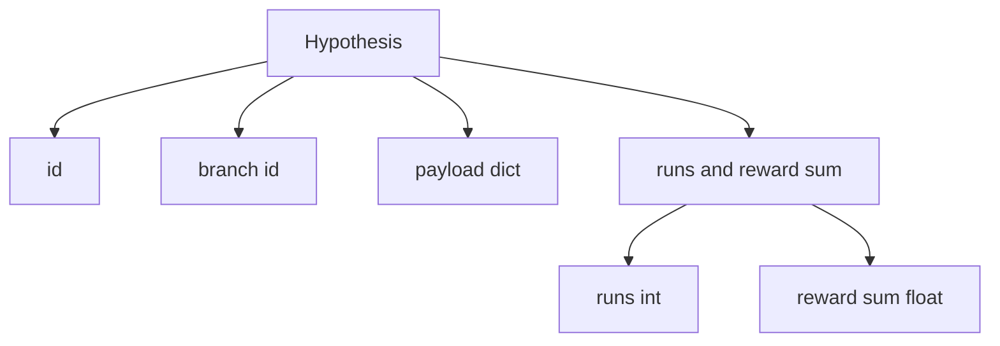
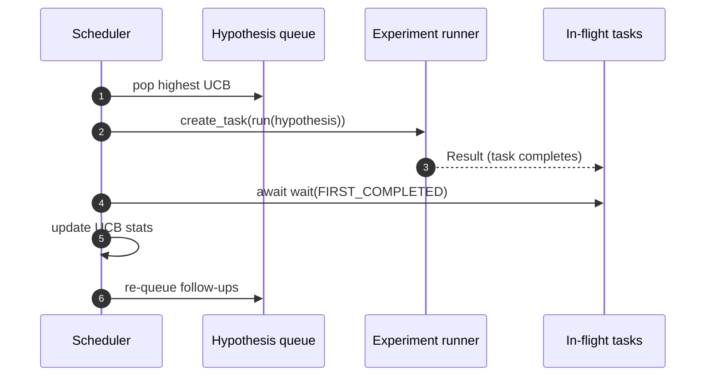

# Scheduler Iteracji

> Pętla badawcza bez schedulera to kolejka z urojeniami. Scheduler to miejsce, w którym pętla decyduje, co przestać badać, i ta decyzja to cała gra.

**Typ:** Build
**Języki:** Python
**Wymagania wstępne:** Faza 19, lekcje 50-53
**Czas:** ~90 minut

## Cele dydaktyczne

- Zamodelować przepływ pracy badawczej jako kolejkę hipotez zasilającą równoległe sloty eksperymentów, których wyniki wracają.
- Uruchomić wiele eksperymentów współbieżnie z asyncio, aby scheduler mógł utrzymać wszystkie sloty zajęte.
- Ocenić każdą gałąź hipotezy za pomocą UCB, aby scheduler mógł przyciąć nisko wydajne gałęzie bez porzucania eksploracji.
- Rozesłać zakończone wyniki do etapu pisania artykułu i etapu ponownego kolejkowania, aby wysoko wydajna gałąź tworzyła hipotezy następcze.
- Udostępnić ślad na iterację z wynikami gałęzi, zajętością slotów i decyzjami o przycięciu.

## Dlaczego scheduler, a nie lista zadań

Płaska lista zadań uruchamia zadania w kolejności zgłoszenia. To jest w porządku, gdy każde zadanie jest niezależne. Badania nie są niezależne: odkrycie z eksperymentu trzeciego zmienia priorytet eksperymentów czwartego i piątego. Scheduler, który czyta napływ wyników i zmienia kolejność kolejki, wykonuje więcej użytecznej pracy na jednostkę obliczeniową.

Interesującym wyborem projektowym jest reguła punktacji. Chciwy punktator zawsze wybiera obecnego lidera i nigdy nie eksploruje. Jednolity punktator nigdy nie eksploatuje. UCB (górna granica ufności) to środkowa ścieżka: eksploatuj lidera, rezerwując pojemność dla gałęzi, które były mniej wypróbowane.

## Kształt systemu



Kolejka przechowuje hipotezy. Scheduler wybiera hipotezę z najwyższym UCB, gdy zwalnia się slot. Każdy slot uruchamia eksperyment asynchronicznie. Zakończone eksperymenty rozsyłają swój wynik na magistralę. Magistrala aktualizuje statystyki UCB na oryginalnej gałęzi i rozsyła do etapu pisania artykułu, gdy wydajność gałęzi przekroczy próg.

## Kształt hipotezy



`branch` to klucz dla statystyk UCB. Wiele hipotez może dzielić gałąź (gałąź to kierunek badań; hipoteza to jedna próba w jej obrębie). `runs` to liczba ukończonych eksperymentów dla tej gałęzi, `reward_sum` to skumulowana nagroda. UCB czyta oba.

## Punktacja UCB

Wzór UCB używany w tej lekcji to klasyczny UCB1.

```text
ucb(branch) = mean_reward(branch) + c * sqrt( ln(total_runs) / runs(branch) )
```

`total_runs` to liczba wszystkich eksperymentów ukończonych we wszystkich gałęziach. `c` to waga eksploracji; lekcja domyślnie ustawia `sqrt(2)`. Gałąź z zerową liczbą uruchomień dostaje `+inf`, więc niewypróbowane gałęzie są zawsze planowane jako pierwsze. Gałąź z wysoką średnią nagrodą utrzymuje wysoki wynik, dopóki inne gałęzie nie dogonią; gałąź, która uruchamia się wiele razy bez dużej nagrody, zostaje przyćmiona przez mniej uruchamiane alternatywy.

Bramka przycinania jest oddzielona od wybieraka. Przycinanie usuwa gałąź z przyszłego planowania, gdy jej średnia nagroda spada poniżej bezwzględnego progu (domyślnie `0.2`) po co najmniej `prune_after_runs` próbach (domyślnie `3`). To utrzymuje kolejkę ograniczoną.

## Równoległe sloty z asyncio

Scheduler napędza eksperymenty za pomocą `asyncio.create_task`. Każde zadanie uruchamia uruchamiacz eksperymentu (`async def`) zwracający `Result`. Główna pętla czeka na zestaw bieżących zadań za pomocą `asyncio.wait(..., return_when=asyncio.FIRST_COMPLETED)` i uruchamia aktualizację punktacji po każdym zakończeniu.



Trzy sloty działają współbieżnie. Główna pętla nigdy nie blokuje się na pojedynczym eksperymencie. Scheduler kontynuuje uruchamianie nowych zadań, gdy tylko zwolni się slot, aż do wyczerpania kolejki i braku zadań w locie.

## Rozsyłanie: wyzwalacze artykułów

Gdy średnia nagroda gałęzi przekracza `paper_threshold` (domyślnie `0.7`) i ta gałąź nie wyprodukowała jeszcze artykułu, scheduler rozsyła zdarzenie `paper.trigger` na listę wyjściową. Dalej pisarz artykułu z lekcji pięćdziesiąt cztery by to podchwycił. W tej lekcji wyzwalacz jest przechwytywany jako lista, aby testy mogły go potwierdzić.

## Rozsyłanie: hipotezy następcze

Gdy wysoko wydajny wynik ląduje, scheduler może wywołać dostarczony przez użytkownika `expander`, aby wyprodukować jedną lub więcej hipotez następczych na tej samej gałęzi. Ekspander to czysta funkcja z `Result` na `list[Hypothesis]`. Lekcja dostarcza deterministyczny ekspander, który produkuje dwie hipotezy następcze dla każdego wyniku, którego nagroda przekracza próg artykułu.

## Budżety

Dwa budżety chronią scheduler przed niekontrolowanymi pętlami.

```text
max_experiments    : total count of experiments run across all branches
max_seconds        : wall-clock cap (asyncio time)
```

Gdy któryś z nich zostanie osiągnięty, scheduler przestaje planować nowe zadania, czeka na bieżące i zwraca końcowy ślad. Ślad zawiera `stop_reason`.

## Ślad i raport końcowy

Każda decyzja planowania (wybór, wysłanie, wynik, przycięcie, rozesłanie) emituje jedno zdarzenie. Raport końcowy podsumowuje statystyki na gałąź, całkowitą liczbę uruchomień, całkowity czas ścienny i wyzwolone wyzwalacze artykułów. Następna lekcja, demo end-to-end, czyta ten raport, aby napędzać pisarza artykułu.

## Jak czytać kod

`code/main.py` definiuje `Hypothesis`, `Result`, `BranchStats`, `IterationScheduler` i fabrykę `make_deterministic_runner`, która zwraca asynchroniczny uruchamiacz eksperymentów z przewidywalnymi nagrodami. Uruchamiacz śpi przez ustalony `delay_ms` (domyślnie `5ms`), aby współbieżność była obserwowalna.

`code/tests/test_scheduler.py` obejmuje: UCB wybiera niewypróbowane gałęzie najpierw, równoległe zajęcie slotów, wyzwalacze artykułów po przekroczeniu progu, przycinanie gałęzi po próbach o niskiej wydajności, rozsyłanie hipotez następczych i wyjście budżetowe (zarówno liczba eksperymentów, jak i czas ścienny).

## Idąc dalej

Trzy rozszerzenia, które będzie chciała prawdziwa implementacja. Po pierwsze, trwałe statystyki UCB między sesjami: bieżące statystyki żyją w pamięci; prawdziwy scheduler robiłby ich punkty kontrolne, aby restart zachował już wydany budżet eksploracji. Po drugie, punktacja wieloobiektywowa: zamiast skalamej nagrody, każdy wynik emituje wektor, a UCB staje się wybierakiem w stylu Pareto. Po trzecie, bandyty kontekstowe: wybierak warunkuje na cechach hipotezy (długość, złożoność), aby podobne hipotezy dzieliły eksplorację.

Scheduler to miejsce, w którym badania stają się czymś więcej niż listą zadań. Gdy UCB jest podłączone, a sloty działają równolegle, każda inna poprawa komponuje się na wierzchu.