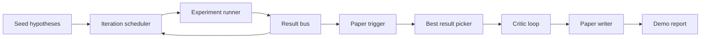
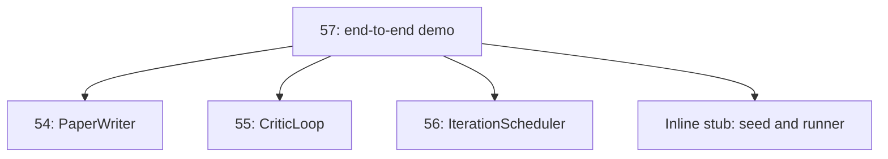
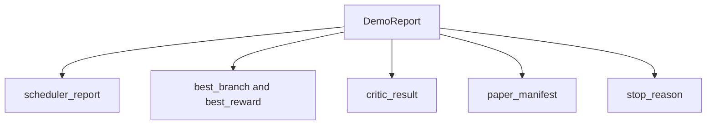

# Demo Badawcze End-to-End

> Demo to miejsce, w którym każdy napisany wcześniej kontrakt musi się skomponować. Jeśli którykolwiek z nich przecieka, demo jest lekcją, która to łapie.

**Typ:** Build
**Języki:** Python
**Wymagania wstępne:** Faza 19, lekcje 50-53
**Czas:** ~90 minut

## Cele dydaktyczne

- Połączyć automatyczną pętlę badawczą end-to-end: seed hipotez, uruchamiacz eksperymentów, scheduler, pętla krytyka, pisarz artykułów.
- Skomponować prymitywy z czterech wcześniejszych lekcji Toru D przez zwykłe importy Pythona, a nie framework.
- Uruchomić pętlę do samokończącego się końca i wyemitować pojedynczy raport demo, który wymienia wyniki każdego etapu.
- Utrzymać demo deterministycznym, aby zestaw testów mógł potwierdzić końcowy kształt.
- Udostępnić wyraźny tryb awarii, gdy kontrakt któregokolwiek etapu zostanie złamany, aby następny etap nie działał z uszkodzonym wejściem.

## Co się tutaj komponuje



Pięć etapów. Seed to lista trzech hipotez. Scheduler uruchamia sześć eksperymentów na nich z trzema równoległymi slotami. Magistrala zgłasza jeden lub więcej wyzwalaczy artykułów. Wybierak wybiera pojedynczy najlepszy wynik. Pętla krytyka iteruje na szkicu zbudowanym z tego wyniku. Pisarz artykułu emituje końcowy LaTeX, BibTeX i manifest.

## Dlaczego import, a nie kopiowanie

Każda wcześniejsza lekcja dostarcza `main.py` z publicznymi dataclassami i funkcjami. Demo importuje je, dostosowując `sys.path` do katalogu nadrzędnego każdej lekcji. To nie jest podłączanie frameworka; to ten sam import, którego pliki testowe we wcześniejszych lekcjach już używają.



Wbudowany zastępnik reprezentuje lekcje pięćdziesiąt do pięćdziesiątej trzeciej: mały generator seedów hipotez i synchroniczna funkcja nagrody. Użytkownik może wymienić wbudowany zastępnik na prawdziwe prymitywy z tych lekcji, dostosowując dwa importy.

## Gwarancje determinizmu

Demo jest deterministyczne z konstrukcji. Uruchamiacz eksperymentów to seedowany numpy. Pętla krytyka rewizora przechodzi przez ustalone wymiary w ustalonej kolejności. Generator prozy pisarza artykułów to ten zamockowany z lekcji pięćdziesiąt cztery. Wybierak UCB schedulera rozstrzyga remisy na podstawie kolejności iteracji, a nie losowego wyboru.

Przy tym samym seedzie demo emituje ten sam raport. Test potwierdza tę właściwość, uruchamiając demo dwa razy i porównując manifest.

## Kształt raportu demo



Każde pole pochodzi dosłownie z poprzedzającego etapu. Demo nie przekształca żadnego wyniku; je komponuje. To jest test, którym jest demo.

## Obsługa trybów awarii

Każdy etap albo kończy się sukcesem, albo podnosi typowany błąd.

```text
Scheduler ........ returns SchedulerReport with stop_reason
                   in {queue_empty, max_experiments, deadline}
Best-result pick . raises NoTriggerError if no paper trigger fired
Critic loop ...... returns LoopResult with status converged or stopped
Paper writer ..... raises PaperValidationError on contract break
```

Awaria w dowolnym etapie powoduje skrócenie demo z typowanym wyjątkiem. Testy przypinają ten kontrakt: `test_no_triggers_raises_typed_error` i `test_best_picker_raises_when_no_triggers` potwierdzają, że wybierak podnosi `NoTriggerError` / `BestResultError`, gdy żadna gałąź nie uruchomiła wyzwalacza, a pisarz nigdy nie jest wywoływany.

## Wybierak najlepszego wyniku

Scheduler emituje wyzwalacze artykułów na gałąź. Wybierak wybiera gałąź z najwyższą średnią nagrodą we wszystkich wyzwalaczach. Remisy są rozstrzygane alfabetycznie po identyfikatorze gałęzi, aby demo było deterministyczne. Wybierak to mała czysta funkcja; test przypina ją na ustalonym raporcie schedulera.

## Podłączanie pętli krytyka

Pętla krytyka w lekcji pięćdziesiąt pięć działa na `MiniPaper`. Demo buduje `MiniPaper` z wybranej gałęzi, wypełniając abstrakt identyfikatorem gałęzi, zasiewając dwie sekcje (Wstęp i Wyniki) i ustawiając `originality_tag` ze średniej nagrody gałęzi (wysoki jeśli `>= 0.8`, średni jeśli `>= 0.6`, niski w przeciwnym razie).

Rewizor następnie iteruje szkic do zbieżności. Wynik trafia do pisarza artykułów.

## Podłączanie pisarza artykułów

Pisarz artykułów w lekcji pięćdziesiąt cztery działa na pełnym kształcie `Paper` z figurami i bibliografią. Demo uaktualnia zbiegły `MiniPaper` przez `mini_to_full_paper`, które dołącza jedną figurę dla wybranej gałęzi i małą syntetyczną bibliografię zbudowaną z unii kluczy cytowań sugerowanych przez krytyka. Każde cytowanie dodane przez demo jest również dodawane do listy bibliografii, więc walidacja przechodzi.

## Jak czytać kod

`code/main.py` definiuje `BestResultError`, `NoTriggerError`, `DemoReport`, `pick_best_branch`, `build_mini_paper`, `mini_to_full_paper` i `run_demo`. Importy na górze dostosowują `sys.path` raz i ściągają `PaperWriter`, `CriticLoop` i `IterationScheduler` z ich lekcji.

`code/tests/test_e2e.py` obejmuje: demo uruchamia się end-to-end i emituje raport ze wszystkimi pięcioma polami wypełnionymi, determinizm w dwóch uruchomieniach, NoTriggerError, gdy żadna gałąź nie przekracza progu, PaperValidationError, gdy kontrakt pisarza jest złamany, manifest artykułu zawiera figurę wybranej gałęzi, a powód zatrzymania schedulera jest jednym z oczekiwanych wartości.

## Idąc dalej

Trzy rozszerzenia warte podłączenia, gdy demo jest zielone. Po pierwsze, stan trwały: wynik każdego etapu zapisuje do małego sklepu JSON, aby restart mógł wznowić bez ponownego uruchamiania tanich etapów. Po drugie, pulpit: zdarzenia śladu z schedulera i pętli krytyka renderują jako pojedyncza oś czasu. Po trzecie, prawdziwe wywołania modelu: wymień zamockowany generator prozy i deterministyczny krytyk na sterowane modelem; podłączenie się nie zmienia.

Zadaniem demo jest udowodnić, że kompozycja jest architekturą. Pięć lekcji, cztery importy, jeden raport. Następnym razem, gdy dodasz etap, podłączenie rośnie o dokładnie jedną linię.