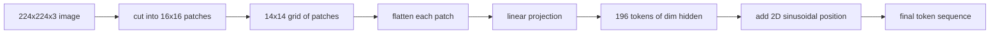

# Kodowanie Obrazu w Łaty

> Model widzenia, który czyta piksele, potrzebuje tokenizatora dla pikseli. Osadzanie łat to ten tokenizator. Potnij obraz na siatkę kwadratów, spłaszcz każdy kwadrat, rzutuj przez jedną warstwę liniową, a następnie dodaj dwuwymiarowy sygnał pozycji, aby transformer wiedział, gdzie każdy kwadrat znajdował się w oryginalnym obrazie.

**Typ:** Build
**Języki:** Python
**Wymagania wstępne:** Faza 19, lekcje 30-37 (Track B foundations)
**Czas:** ~90 minut

## Cele dydaktyczne

- Tokenizować obraz w sekwencję o ustalonej długości osadzeń łat.
- Zaimplementować projekcję łat opartą na `Conv2d`, która odpowiada matematyce unfold-then-linear.
- Zbudować deterministyczne dwuwymiarowe sinusoidalne osadzenie pozycji, aby kolejność tokenów kodowała pozycję przestrzenną.
- Zweryfikować liczbę łat, kształt osadzenia i równoważność `Conv2d`/unfold na syntetycznym zestawie testowym.

## Problem

Transformer przetwarza sekwencję wektorów. Obraz to siatka 3-kanałowa. Czytanie każdego piksela jako tokena rozsadza długość sekwencji: obraz RGB 224x224 to 150,528 tokenów, na co 12-warstwowy transformer nie może sobie pozwolić w mechanizmie uwagi. Czytanie obrazu jako jednego gigantycznego płaskiego wektora wyrzuca lokalność, której warstwa uwagi nie może odzyskać. Zadaniem interfejsu kodera jest skompresowanie siatki pikseli do kilkuset tokenów, z których każdy podsumowuje kwadratowy obszar.

Osadzanie łat rozwiązuje to za pomocą jednej projekcji liniowej. Obraz 224x224 pocięty na łaty 16x16 tworzy siatkę 14x14 z 196 łat. Każda łata jest spłaszczona z `(3, 16, 16) = 768` wartości pikseli w jeden wektor, a następnie warstwa liniowa mapuje go do ukrytego wymiaru modelu. Transformer widzi 196 tokenów o wymiarze `hidden` (zwykle 768) plus token CLS. To jest sekwencja, którą reszta sieci może przetrawić.

## Koncepcja



### Dlaczego łaty, a nie piksele

Uwaga jest kwadratowa względem długości sekwencji. Sekwencja 196 tokenów kosztuje `196 * 196 = 38,416` wyników uwagi na głowę na warstwę; sekwencja 150,528 tokenów kosztuje `150,528 * 150,528 = 22.6 miliarda`. Łaty zapewniają 590,000x redukcję obliczeń uwagi, a pojedynczy region 16x16 przenosi wystarczająco dużo sygnału dla zadań widzenia wysokiego poziomu. Kosztem jest utrata drobnoziarnistych szczegółów przestrzennych wewnątrz jednej łaty, dlatego późniejsze stosy multimodalne często uruchamiają drugą gałąź o wysokiej rozdzielczości, gdy precyzyjna lokalizacja ma znaczenie.

### Dlaczego projekcja liniowa wystarcza

Każda łata jest traktowana jako niezależny wektor. Projekcja uczy się bazy: detektorów krawędzi, filtrów kolorów, prostych tekstur. Pojedyncza warstwa liniowa jest mała (`768 * 768 = 589,824` parametrów dla ViT-Base) i trenuje szybko. Głębsze pnie konwolucyjne istnieją ("hybrydowy" ViT), ale płaska projekcja liniowa jest standardem, a większość nowoczesnych koderów open-weight ma dokładnie ten kształt.

### Sztuczka `Conv2d`

`Conv2d(in_channels=3, out_channels=hidden, kernel_size=patch_size, stride=patch_size)` bez dopełnienia daje ten sam numeryczny wynik co unfold-then-linear, ponieważ każda pozycja wyjściowa oblicza iloczyn skalarny pikseli łaty z jednym filtrem. Konwolucja to projekcja łat, a większość produkcyjnych baz kodu dostarcza ją w ten sposób, ponieważ jest szybsza na GPU i używa o jeden reshape mniej.

### Osadzenia pozycji

Tokeny nie przenoszą żadnej kolejności z projekcji. Dwuwymiarowe sinusoidalne osadzenie daje każdemu tokenowi stały sygnał, który koduje jego pozycję `(wiersz, kolumna)`. Połowa wymiaru osadzenia koduje pozycję wiersza za pomocą sin/cos na wielu częstotliwościach; druga połowa koduje pozycję kolumny. Kodowanie jest deterministyczne, więc możesz zamieniać rozdzielczości bez ponownego trenowania, i interpoluje czysto do siatek, których model nigdy nie widział podczas trenowania.

| Komponent | Kształt | Parametry |
|-----------|--------|-----------|
| Projekcja łat (`Conv2d`) | `(hidden, 3, patch, patch)` | `3 * P * P * hidden + hidden` |
| Osadzenie pozycji (stałe) | `(num_patches, hidden)` | 0 (obliczone, nie uczone) |
| Token CLS (uczony) | `(1, hidden)` | `hidden` |

Dla ViT-Base/16 w rozdzielczości 224: 590,592 parametrów w projekcji, 768 w tokenie CLS i zero dla sinusoidalnej pozycji. Następna lekcja (59) nakłada 12-warstwowy transformer na ten interfejs.

### Równoważność jako kontrola poprawności

Krok łat ma dwa zapisy: projekcję `Conv2d` i jawny unfold-then-linear. Muszą dawać to samo wyjście dla tych samych wag. Jeśli nie, matematyka unfold jest błędna, a reszta kodera jest zbudowana na piasku. Testy w tej lekcji ćwiczą tę równoważność.

## Zbuduj to

`code/main.py` implementuje:

- `PatchEmbed`, `nn.Module` opakowujący `Conv2d` dla projekcji łat.
- `sinusoidal_2d(grid_h, grid_w, dim)`, funkcję bezstanową budującą dwuwymiarową tabelę pozycji.
- `VisionFrontEnd`, który łączy osadzanie łat, dodanie CLS i dodanie pozycji w jeden forward.
- Pomocnik `synthesize_image(seed)`, który buduje deterministyczny zestaw testowy 224x224x3 z `numpy.random`.
- Demo uruchamiające jeden obraz testowy przez interfejs i wypisujące kształt wyjścia, normę tokena CLS i jeden wiersz osadzenia pozycji.

Uruchom:

```bash
python3 code/main.py
```

Wynik: zestaw testowy 224x224 jest tokenizowany do sekwencji o kształcie `(1, 197, 768)`. Pierwszy token to CLS; następne 196 to tokeny łat. Normy osadzenia pozycji są jednolite w obrębie wiersza, co jest sygnaturą sinusoidalną.

## Użyj tego

Ten sam interfejs łat pojawia się w każdym nowoczesnym modelu język-widzenie: CLIP ViT-L/14, SigLIP, DINOv2, rodzina Qwen-VL i stos InternVL wszystkie zaczynają od projekcji łat `Conv2d` plus sygnału pozycji. Różnice między rodzinami żyją dalej (CLS vs bez-CLS pooling, tokeny rejestrowe, różne rozmiary łat 14 vs 16, dynamiczna rozdzielczość przez interpolowane pozycje). Interfejs w tej lekcji jest podłożem, na którym stoi każdy z tych modeli.

## Testy

`code/test_main.py` obejmuje:

- liczba łat odpowiada `(image_size / patch_size) ** 2`
- kształt wyjścia odpowiada `(batch, num_patches + 1, hidden)`
- projekcja `Conv2d` równa się ręcznemu unfold-then-linear na małym zestawie testowym
- sinusoidalna tabela pozycji jest deterministyczna między wywołaniami
- token CLS rozchodzi się po wymiarze batcha bez wycieku

Uruchom:

```bash
python3 -m unittest code/test_main.py
```

## Ćwiczenia

1. Zastąp sinusoidalną pozycję uczonym `nn.Parameter` i porównaj stratę po pierwszej epoce na małym syntetycznym zadaniu klasyfikacji. Uczone pozycje wygrywają przy stałej rozdzielczości; sinusoidalna wygrywa, gdy zmieniasz rozdzielczość po trenowaniu.
2. Zamień `Conv2d` na jawny `nn.Unfold` plus `nn.Linear` i potwierdź, że wyniki zgadzają się w granicach tolerancji zmiennoprzecinkowej. Ta sama matematyka, dwa sposoby zapisu.
3. Dodaj obsługę niekwadratowych rozmiarów łat (np. 32x16 dla wejść o szerokim formacie) i zweryfikuj, że tabela pozycji obsługuje niekwadratowe siatki.
4. Profiluj krok łat przy rozmiarach batcha 1, 8, 64. Projekcja łat rzadko jest wąskim gardłem; warstwy uwagi dalej dominują.
5. Trenuj interfejs jako zamrożony ekstraktor cech na 4-klasowym syntetycznym zbiorze kształtów (kółka, kwadraty, trójkąty, gwiazdy). Wynik tokena CLS powinien być liniowo separowalny.

## Kluczowe terminy

| Termin | Co to znaczy |
|--------|--------------|
| Łata | Kwadratowy podobszar obrazu, zazwyczaj 14x14 lub 16x16 |
| Osadzanie łat | Liniowa projekcja jednej spłaszczonej łaty do ukrytego wymiaru |
| Długość sekwencji | Liczba tokenów po tokenizacji łat, zazwyczaj plus CLS |
| Sinusoidalna pozycja | Stały sygnał sin/cos kodujący współrzędne siatki 2D |
| Token CLS | Uczony wektor dodany na początku sekwencji jako głowa pulująca |

## Dalsza lektura

- An Image is Worth 16x16 Words (ViT, 2021) dla oryginalnego ujęcia osadzania łat.
- Attention Is All You Need (2017) dla wzoru sinusoidalnej pozycji zaadaptowanego tutaj do 2D.
- Artykuł DINOv2 dla tokenów rejestrowych, rozszerzenia, które możesz dodać jako ćwiczenie 6.